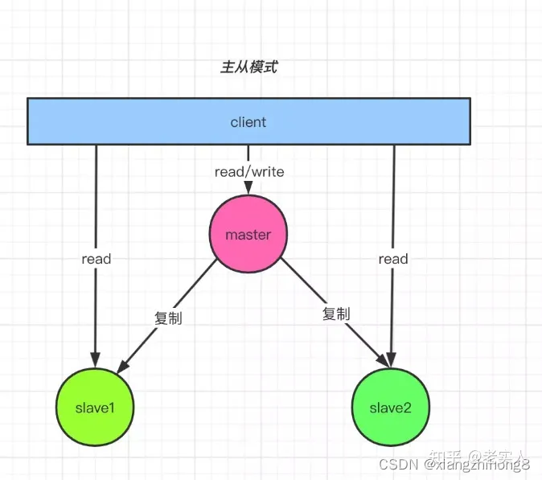
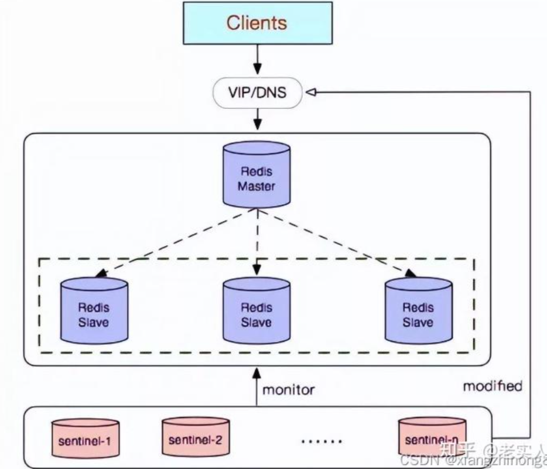

## redis各个模式

|  集群模式   |  特性   | 缺点  |  代表产品   |
| --------- | :----: | :----: | --------:|
|  主从模式   |   通过主从模式可以提升读性能  | 故障时需要手工切换，内存瓶颈  | 主从   |
|  哨兵模式   |  仍然采用主从模式，增加了从自动转主功能   | 故障主从可自动切换，但是写性能仍有限，内存瓶颈   | 哨兵   |
|  集群模式   |  数据分布式存储、节点水平扩容、故障自动转移  | 需要轻量级客户端计算路由   |最新集群   |  

集群： 相比Redis哨兵，Redis 集群方案不需要额外部署Sentinel集群，而是通过集群*内部通信实现集群监控，故障时主从切换*；

### 单机
```shell
安装：

// nproc 打印可用的处理器单元数量  20
make -j \$(nproc)      // 编译：make -j  20（20表示使用20核编译，默认是1核，请根据实际情况修改参数）
make PREFIX=${installPath} install    // 安装到 installPath路径


配置：

单体：
redisConfig('logfile', 'redis.log'),
redisConfig('pidfile', 'redis.pid'),
redisConfig('daemonize', 'yes'),
redisConfig('protected-mode', 'no'),
redisConfig('bind', '0.0.0.0'),
redisConfig('dir', installPath('bin')),
redisConfig('port', getDeployConfig(env_redis_port).toString()),
redisConfig('requirepass', getDeployConfig(env_redis_password).toString(), true)

启动：
{{absolute_install_dir}}/bin/redis-server {{absolute_install_dir}}/bin/redis.conf   // 指定 某个redis.conf 配置启动
```

### 主从
```shell
主
//                 redisConfig('logfile', 'redis.log'),
//                 redisConfig('pidfile', 'redis.pid'),
//                 redisConfig('daemonize', 'yes'),
//                 redisConfig('protected-mode', 'no'),
//                 redisConfig('bind', '0.0.0.0'),
//                 redisConfig('dir', installPath('bin')),
//                 redisConfig('port', getDeployConfig(env_redis_port).toString()),
//                 redisConfig('requirepass', getDeployConfig(env_redis_password).toString(), true),
//                 redisConfig('masterauth', getDeployConfig(env_redis_password).toString(), true),
//                 redisConfig('slave-read-only', 'no'),
//                 redisConfig('appendonly', 'yes'),

从

//                 redisConfig('logfile', 'redis.log'),
//                 redisConfig('pidfile', 'redis.pid'),
//                 redisConfig('daemonize', 'yes'),
//                 redisConfig('protected-mode', 'no'),
//                 redisConfig('bind', '0.0.0.0'),
//                 redisConfig('dir', installPath('bin')),
//                 redisConfig('port', getDeployConfig(env_redis_port).toString()),
//                 redisConfig('slaveof', getSlaveofConfig(), true),    获取主节点 ip 与 端口
//                 redisConfig('requirepass', getDeployConfig(env_redis_password).toString(), true),
//                 redisConfig('masterauth', getDeployConfig(env_redis_password).toString(), true),
//                 redisConfig('slave-read-only', 'no'),
//                 redisConfig('appendonly', 'yes'),

```
主从模式介绍：  
在主从复制中，Redis 数据库分为两种角色：主数据库(master)和从数据库(slave) 从可以是多个  
1. 主数据库可以进行读写操作，当读写操作导致数据变化时会自动将数据同步给从数据库
2. 复制的数据流是单向的，只能由主节点复制到从节点
3. 从数据库一般都是只读的，并且接收主数据库同步过来的数据
4. 一个 master 可以拥有多个 slave，但是一个 slave 只能对应一个 master
5. slave 挂了不影响其他 slave 的读和 master 的读和写，重新启动后会将数据从 master 同步过来
6. master 挂了以后，不影响 slave 的读，但 redis 不再提供写服务，master 恢复后 redis 将重新对外提供写服务
7. master 挂了以后，不会在 slave 节点中重新选一个 master


工作机制： - 当slave启动后，主动向master发送SYNC命令。master接收到SYNC命令后在后台保存快照（RDB持久化）和缓存保存快照这段时间的命令，
然后将保存的快照文件和缓存的命令发送给slave。slave接收到快照文件和命令后加载快照文件和缓存的执行命令。 
- 复制初始化后，master每次接收到的写命令都会同步发送给slave，保证主从数据一致性  

[哨兵模式](https://zhuanlan.zhihu.com/p/584884583)
### Sentinel（哨兵）模式
主从模式的弊端就是不具备高可用性，当master挂掉以后，Redis将不能再对外提供写入操作，因此sentinel模式应运而生。  
sentinel中文含义为哨兵，顾名思义，它的作用就是监控redis集群的运行状况，此模式具有如下一些特点：  
* sentinel模式是建立在主从模式的基础上，如果只有一个Redis节点，sentinel就没有任何意义； 
* 当master挂了以后，sentinel会在slave中选择一个做为master，并修改它们的配置文件，其他slave的配置文件也会被修改，比如slaveof属性会指向新的master；
* 当master重新启动后，它将不再是master，而是做为slave接收新的master的同步数据；
* sentinel因为也是一个进程，所以有挂掉的可能，所以sentinel也会启动多个形成一个sentinel集群；
* 多sentinel配置的时候，sentinel之间也会自动监控；
* 当主从模式配置密码时，sentinel也会同步将配置信息修改到配置文件中；
* 一个sentinel或sentinel集群可以管理多个主从Redis，多个sentinel也可以监控同一个redis；
* sentinel最好不要和Redis部署在同一台机器，不然Redis的服务器挂了以后，sentinel也可能会挂掉。


其工作的流程如下所示： - 每个sentinel以每秒钟一次的频率向它所知的master，slave以及其他sentinel实例发送一个 PING 命令； 
- 如果一个实例距离最后一次有效回复 PING 命令的时间超过 down-after-milliseconds 选项所指定的值， 则这个实例会被sentinel标记为主观下线；
- 如果一个master被标记为主观下线，则正在监视这个master的所有sentinel要以每秒一次的频率确认master的确进入了主观下线状态； 
- 当有足够数量的sentinel（大于等于配置文件指定的值）在指定的时间范围内确认master的确进入了主观下线状态， 则master会被标记为客观下线；
- 在一般情况下， 每个sentinel会以每 10 秒一次的频率向它已知的所有master，slave发送 INFO 命令； 
- 当master被sentinel标记为客观下线时，sentinel向下线的master的所有slave发送 INFO 命令的频率会从 10 秒一次改为 1 秒一次； 
- 若没有足够数量的sentinel同意master已经下线，master的客观下线状态就会被移除；若master重新向sentinel的 PING 命令返回有效回复，master的主观下线状态就会被移除。

配置sentinel  
因为哨兵模式是基于主从模式的，所以redis的相关配置就不多说明。我们只需要在主从模式的基础上直接修改sentinel配置文件，配置3个哨兵即可，哨兵的配置可以参考如下内容  
```shell
# 三个节点创建存储目录
mkdir /opt/software/redis-7.0.3/sentinel
mkdir /opt/software/redis-7.0.3/sentinel ; chown -R redis:redis /opt/software/redis-7.0.3/
cat >/usr/local/redis/sentinel.conf<<EOF
daemonize yes
logfile "/usr/local/redis/sentinel.log"
# sentinel工作目录
dir "/opt/software/redis-7.0.3/sentinel"
# 判断master失效至少需要2个sentinel同意，建议设置为n/2+1，n为sentinel个数
# sentinel monitor <master-name> <ip> <port> <count>
sentinel monitor mymaster 192.168.182.110 6379 2
sentinel auth-pass mymaster 123456
# 判断master主观下线时间，默认30s
sentinel down-after-milliseconds mymaster 30000
EOF
```
### Cluster（集群） 模式
Redis 的哨兵模式基本已经可以实现高可用，读写分离 ，但是在这种模式下每台 Redis 服务器都存储相同的数据，很浪费内存，  
所以在 redis3.0上加入了 Cluster 集群模式，实现了 Redis 的分布式存储，  
也就是说每台 Redis 节点上存储不同的内容。下面是Cluster 集群模式的一些特点：  
* sentinel模式基本可以满足一般生产的需求，具备高可用性。但是当数据量过大到一台服务器存放不下的情况时，主从模式或sentinel模式就不能满足需求了，这个时候需要对存储的数据进行分片，将数据存储到多个Redis实例中。
  cluster模式的出现就是为了解决单机Redis容量有限的问题，将Redis的数据根据一定的规则分配到多台机器。
* cluster可以说是sentinel+主从模式的结合体，通过cluster可以实现主从和master重选功能，所以如果配置两个副本三个分片的话，就需要六个Redis实例。
  因为Redis的数据是根据一定规则分配到cluster的不同机器的，当数据量过大时，可以新增机器进行扩容。
* 使用集群，只需要将redis配置文件中的cluster-enable配置打开即可，每个集群中至少需要三个主数据库才能正常运行，新增节点非常方便。


[Redis集群原理篇之图文并茂](https://blog.51cto.com/u_14035463/5584244)
可以看到，Cluster 集群模式有如下一些特点： 
- 多个redis节点网络互联，数据共享； 
- 所有的节点都是一主一从（也可以是一主多从），其中从不提供服务，仅作为备用； 
- 不支持同时处理多个key（如MSET/MGET），因为redis需要把key均匀分布在各个节点上，并发量很高的情况下同时创建key-value会降低性能并导致不可预测的行为； 
- 支持在线增加、删除节点； 
- 客户端可以连接任何一个主节点进行读写

## redis 使用
[Redis三种常用的缓存读写策略](https://juejin.cn/post/7093452218535247886#heading-7)  
redis 可以自己将数据更新到数据库表里  
可以异步的方式，数据刷入redis后，过段时间异步的方式更新到mysql里  


