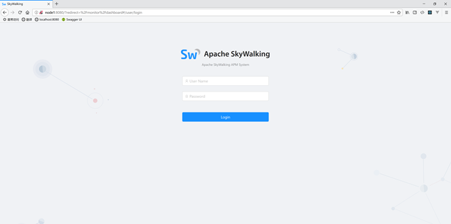
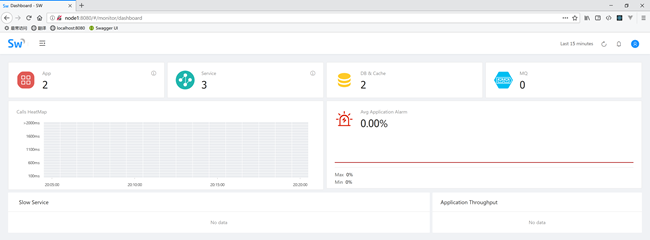
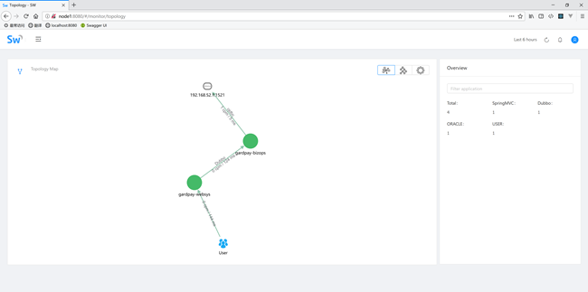
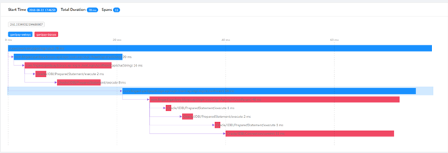

# Skywalking部署文档


# 1.   安装Elasticsearch 6

skywalking使用Elasticsearch做持久化的。

## 1.1.   安装配置

进入目录，改配置：
```bash
vi config/elasticsearch.yml
```
修改以下配置（主要是标注skywalking需要用到的两个配置）：
```yaml
cluster.name: skywalking    （es集群名，配置skywalking需要用到）
network.host: 0.0.0.0
http.port: 9200             （默认http端口，skywalking用不到）
transport.tcp.port: 9300    （默认tcp端口，skywalking需要用到）
node.name: node-1           （es节点名）
thread_pool.bulk.queue_size: 1000 
```

## 1.3.   检验

用浏览器访问：<http://[ip]:9250>，其中[ip]是安装Elasticsearch的主机ip。显示像下面的json说明安装运行成功：

# 2.   安装Skywalking

解压安装包：

```bash
tar -xvf apache-skywalking-apm-incubating-5.0.0-beta2.tar.gz
cd apache-skywalking-apm-incubating
```

## 2.1.   收集器配置

修改配置：

```bash
vi config/application.yml
```

修改以下标注部分：

```yaml
naming:
  jetty:
    #OS real network IP(binding required), for agent to find collector cluster
    host: localhost   （几个localhost换成真实ip）
    port: 10800
    contextPath: /
cache:
#  guava:
  caffeine:
remote:
  gRPC:
    # OS real network IP(binding required), for collector nodes communicate with each other in cluster. collectorN --(gRPC) --> collectorM
    host: localhost
    port: 11800
agent_gRPC:
  gRPC:
    #OS real network IP(binding required), for agent to uplink data(trace/metrics) to collector. agent--(gRPC)--> collector
    host: localhost
    port: 11800
    # Set these two setting to open ssl
    #sslCertChainFile: $path
    #sslPrivateKeyFile: $path

    # Set your own token to active auth
    #authentication: xxxxxx
agent_jetty:
  jetty:
    # OS real network IP(binding required), for agent to uplink data(trace/metrics) to collector through HTTP. agent--(HTTP)--> collector
    # SkyWalking native Java/.Net/node.js agents don't use this.
    # Open this for other implementor.
    host: localhost
    port: 12800
    contextPath: /
storage:
  elasticsearch:
    clusterName: CollectorDBCluster  （CollectorDBCluster改成skywalking）
    clusterTransportSniffer: true
    clusterNodes: localhost:9300  （9300改成9350）
    indexShardsNumber: 2
    indexReplicasNumber: 0
    highPerformanceMode: true
    # Batch process setting, refer to https://www.elastic.co/guide/en/elasticsearch/client/java-api/5.5/java-docs-bulk-processor.html
    bulkActions: 2000 # Execute the bulk every 2000 requests
    bulkSize: 20 # flush the bulk every 20mb
    flushInterval: 10 # flush the bulk every 10 seconds whatever the number of requests
    concurrentRequests: 2 # the number of concurrent requests
    # Set a timeout on metric data. After the timeout has expired, the metric data will automatically be deleted.
    traceDataTTL: 90 # Unit is minute
    minuteMetricDataTTL: 90 # Unit is minute
    hourMetricDataTTL: 36 # Unit is hour
    dayMetricDataTTL: 45 # Unit is day
    monthMetricDataTTL: 18 # Unit is month

```


## 2.3.   改界面配置

改配置命令

```bash
vi webapp/webapp.yml
```

修改标注部分：

```yaml
server:
  port: 8080  （这个端口就是浏览器要访问skywalking的端口，改下避免冲突）

collector:
  path: /graphql
  ribbon:
    ReadTimeout: 10000
    listOfServers: 192.168.52.11:10800   （ip改成本机ip）

security:
  user:
    admin:
      password: admin
```


## 2.4.   启动

上面配置全部改好后，可以启动skywalking

```bash
bin/startup.sh
```

## 2.5.   验证

运行上述命令后，程序还没彻底启动。可以在安装目录/logs文件夹下看日志。

过一会儿后，可通过浏览器访问部署主机的web界面端口（上面标绿的那个），可看到界面：


- 用户名：admin
- 密码：admin


登录进去之后看到像这样的界面，说明部署成功。



# 3.   为应用部署探针

上面算是把skywalking的核心程序：收集器、界面、es持久化装好了。

接下来需要在每个应用部署探针，以实时监控应用的信息。

## 3.1.   条件

前提条件：一个探针对应一个tomcat，即一个tomcat只能用来起一个应用、不能装多个；只用java命令启动的话，只需要添加启动参数即可。

## 3.2.   tomcat部署

比如：要部署应用`gardpay-websys`

复制一份tomcat，文件夹命名为`gardpay-websys`

```bash
cd gardpay-websys/
```

进入webapps目录

```bash
cd webapps/
```

若无tomcat其他管理功能需求的话，可以把这个文件夹清了

```bash
rm -rf ./*
```

把war包重命名成web.war，放在这个目录下（也可以是其他动态方式）。

## 3.3.   探针配置

### 3.3.1.   解压

把skywalking压缩包解压后的目录下的agent文件夹复制出来，

```bash
mkdir agent
cd apache-skywalking-apm-incubating
cp -r agent ../agent/agent-default
```

### 3.3.2.   自定义插件

在agent/agent-default/plugins/文件夹下

由于redis的访问量非常大，所以一般删掉redis插件：

```bash
fingard-redisson-3.x-plugin-5.0.0-GA-FG-SNAPSHOT.jar
apm-jedis-2.x-plugin-5.0.0-GA-FG-SNAPSHOT.jar
```

### 3.3.3.   针对不同的应用改配置

然后把agent-default文件夹多复制几份，按照应用名：

```bash
cd ../agent
cp -r agent-default/agent-websys/
cp -r agent-default/agent-bizops/
```

然后改探针的配置：

比如：agent-websys

```bash
vi agent-websys/config/agent.config
```

内容（忽略了一部分），改下高亮部分的配置即可：

```properties
# The agent namespace
agent.namespace=default-namespace （不同的环境需要不同的命名空间，比如gardpay-dev、gardpay-test）

# The application name in UI
agent.application_code=gardpay-dev-websys  （把这个改成应用名，比如gardpay-websys、gardpay-bizops，不同命令空间的应用名也需要不一样，但同一个环境中的相同应用的多个实例需要名字相同）


# Server addresses.
# Primary address setting.
#
# Mapping to `naming/jetty/ip:port` in `config/application.yml` of Collector.
# Examples：
# Single collector：SERVERS="127.0.0.1:8080"
# Collector cluster：SERVERS="10.2.45.126:8080,10.2.45.127:7600"
collector.servers=192.168.52.11:10800  （把ip改成skywalking部署的主机的ip）

# Collector agent_gRPC/grpc service addresses.
# Secondary address setting, only effect when "collector.servers" is empty.
# By using this, no discovery mechanism provided. The agent only uses these addresses to uplink data.
# Recommend to use this only when collector cluster IPs are unreachable from agent side. Such as:
#   1. Agent and collector cluster are in different VPC in Cloud.
#   2. Agent uplinks data to collector cluster through Internet.
# collector.direct_servers=www.skywalking.service.io

# 这个是单个segment的span个数的限制，设大点，避免丢traceid，默认值是300
agent.span_limit_per_segment=30000
# Logging level 日志级别改成INFO，默认是DEBUG
logging.level=INFO
```

### 3.3.4.   简单方式，不用拷贝一堆文件

如果不想拷贝文件的话，里面的参数可以用-D参数覆盖配置，比如：

```bash
java -cp /app/resources:/app/classes:/app/libs/* 
-javaagent:C:\java\svn\skywalking\skywalking-agent\skywalking-agent.jar 
-Dskywalking.agent.application_code=front 
com.alibaba.dubbo.container.Main
```

> 注意：实际命令中间没换行！！

可以覆盖配置文件里面的值，可以由此简化配置。（建议使用这种方式）

覆盖配置文件的参数只需在yml的参数名称加：“skywalking.”的前缀，这样配置文件配一些通用的参数即可，一台服务器不必复制多份探针。

示例（java启动参数）：

```bash
java -cp /app/resources:/app/classes:/app/libs/* 
-javaagent:C:\java\svn\skywalking\skywalking-agent\skywalking-agent.jar
-Dskywalking.agent.namespace=luna_dev
-Dskywalking.agent.application_code=luna_dev_usercore
-Dskywalking.agent.span_limit_per_segment=30000
-Dskywalking.collector.servers=127.0.0.1:10800
-Dskywalking.logging.level=INFO
com.alibaba.dubbo.container.Main
```

## 3.4.   探针关联tomcat

改tomcat的启动参数：

```bash
#!/bin/sh

export CATALINA_OPTS="$CATALINA_OPTS -javaagent:/tomcat/gardpay-websys/agent-websys/skywalking-agent.jar -javaagent:/java/svn/skywalking/skywalking-agent/skywalking-agent.jar -Dskywalking.agent.namespace=luna_dev -Dskywalking.agent.application_code=luna_dev_usercore -Dskywalking.agent.span_limit_per_segment=30000 -Dskywalking.collector.servers=127.0.0.1:10800 -Dskywalking.logging.level=INFO"

# Licensed to the Apache Software Foundation (ASF) under one or more
# contributor license agreements.  See the NOTICE file distributed with
# this work for additional information regarding copyright ownership.
# The ASF licenses this file to You under the Apache License, Version 2.0
```

改动：在文件最开头#!/bin/sh的下面，添加`CATALINA_OPTS`环境变量的设置。

## 3.5.   启动

改好后，在确认skywalking主程序已经启动的情况下，启动这个tomcat即可，通过skywalking对应用的运行状态进行监控。

启动后，第一次访问会比较慢，之后正常。多进行几次访问，可获取一系列trace，skywalking可计算出以下界面。

### 3.5.1.   skywalking拓扑图：



 

### 3.5.2.   服务链调用时序图

   
