# 截图及功能说明
这里是skywalking 5公司改造版本的功能示例截图

## Skywalking 5界面简介

### 登录界面

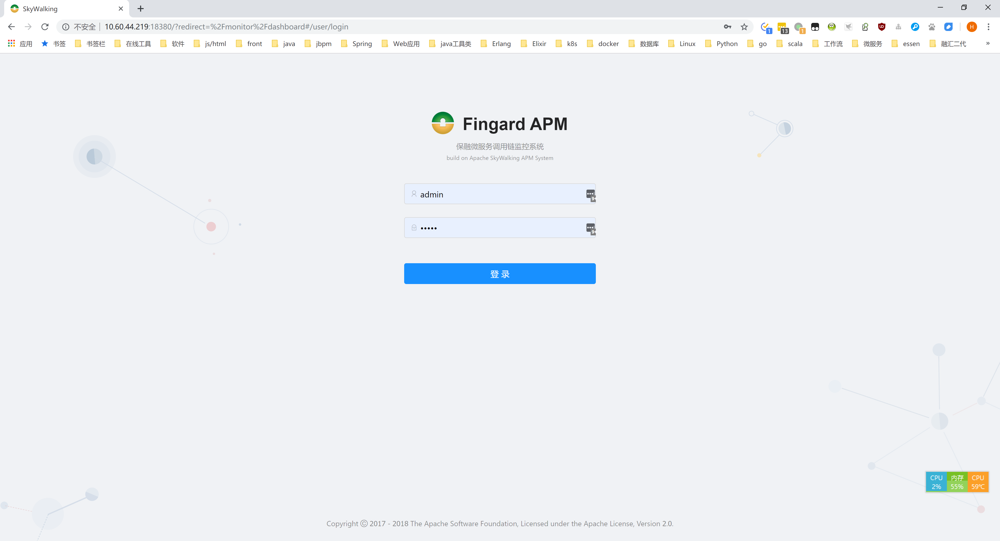

### 主界面

里面有应用、服务、数据库、消息队列个数，网站点击图，请求错误率等。

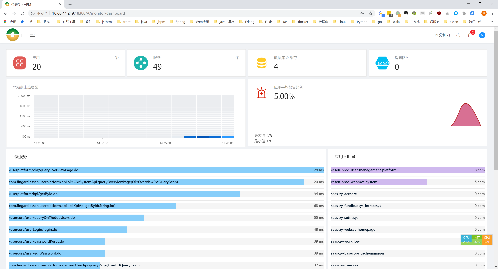

### 菜单界面

点击左上角出现菜单界面

### 拓扑图

saas项目的拓扑图示例

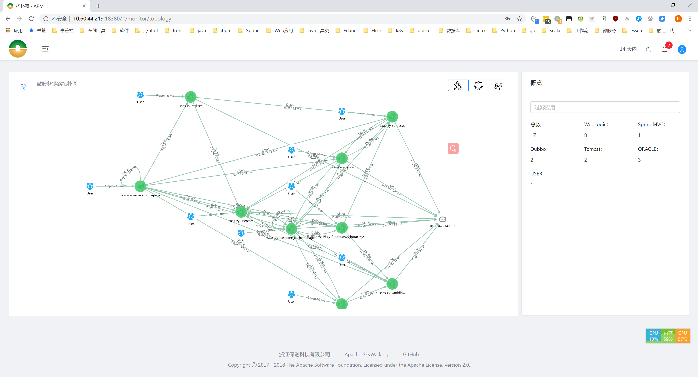

### 应用界面

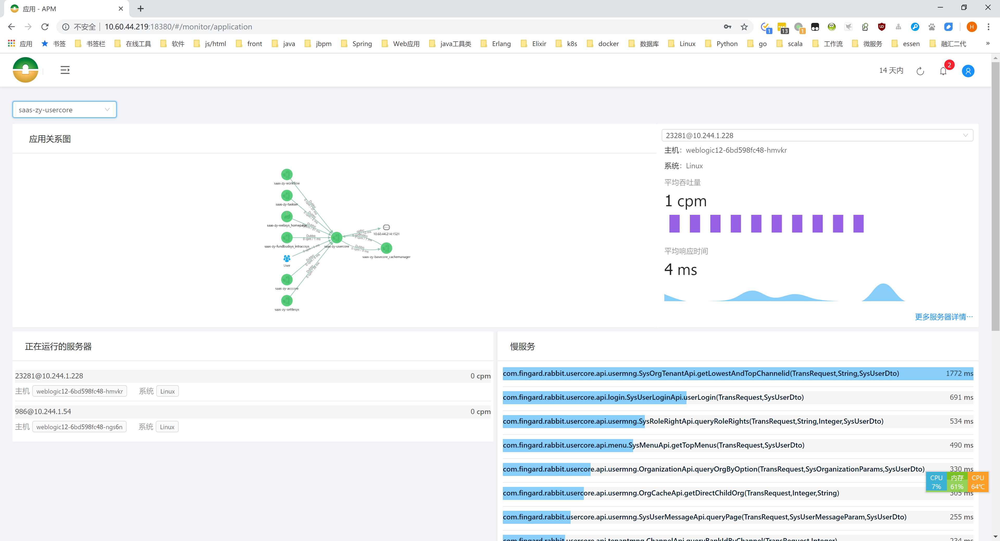

### 服务界面

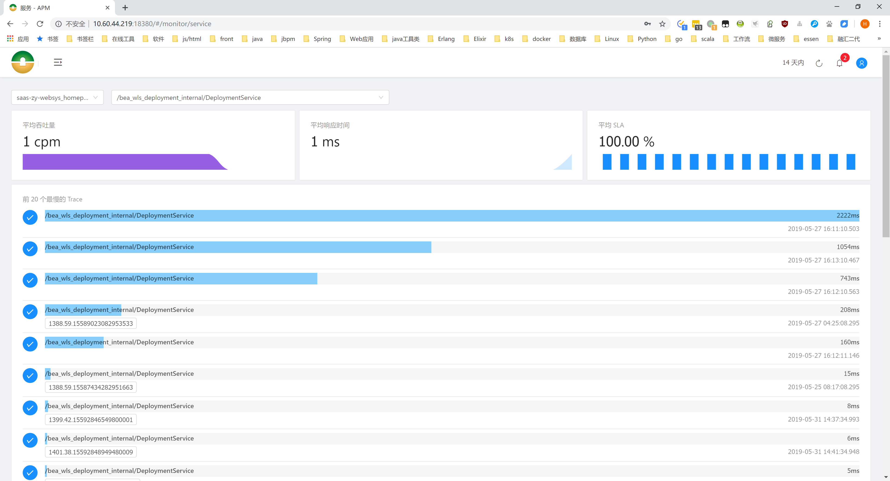

### 告警界面

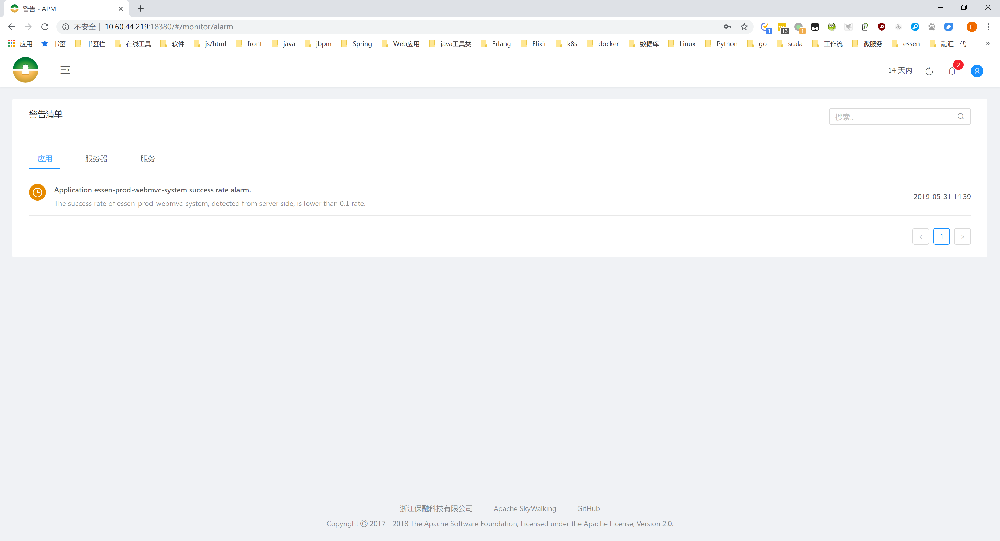

### Trace搜索界面

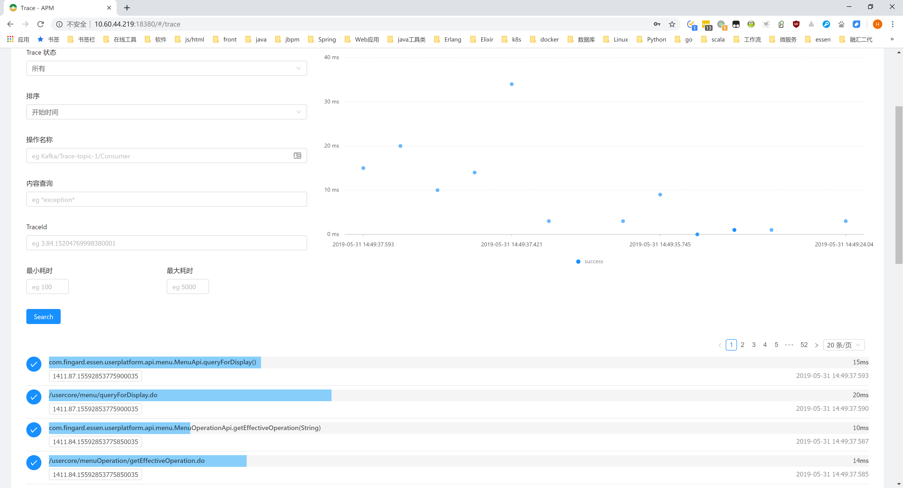

### 单个trace界面

界面说明，

- 从上到下是一级级的服务调用
- 从左到右是时间轴
- 条形的长度代表这个方法的执行时长
- 一个长条包含一个短条说明这个方法调用了另一个方法
- 一个短条在另一个短条后面，说明这个方法走完了，再调用下一个方法
- 相同的颜色表示相同的应用，应用的名字在上面写着
- 上面的那一串数字就是traceid，可用这个在elk里面查日志

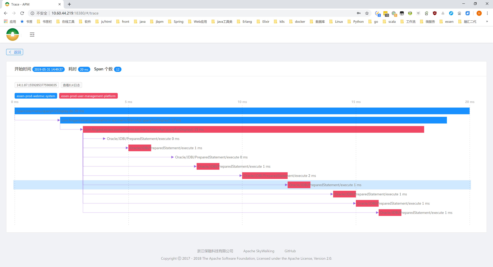

#### 单个span的详情界面

这个是oracle的span，不同的span里面的内容字段不同

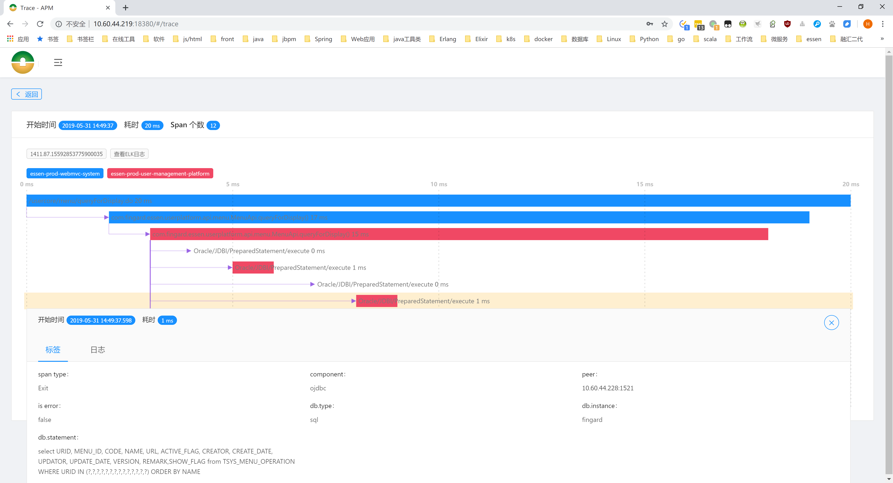

### 慢sql界面

这里是右上角指定的时间段内，sql执行次数、及单次sql执行时长的统计

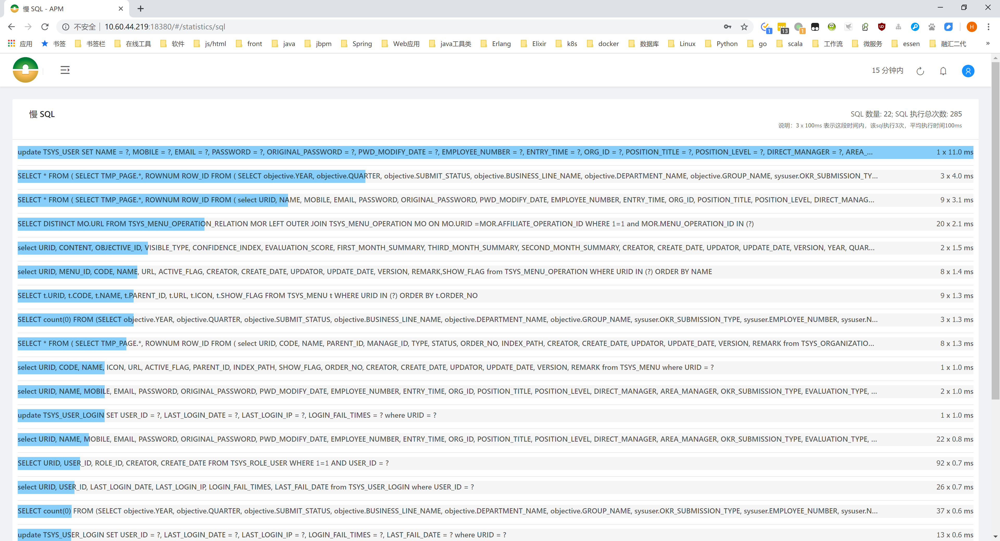

### 频繁远程调用的服务排行

及一个服务进行了非常多次的远程调用

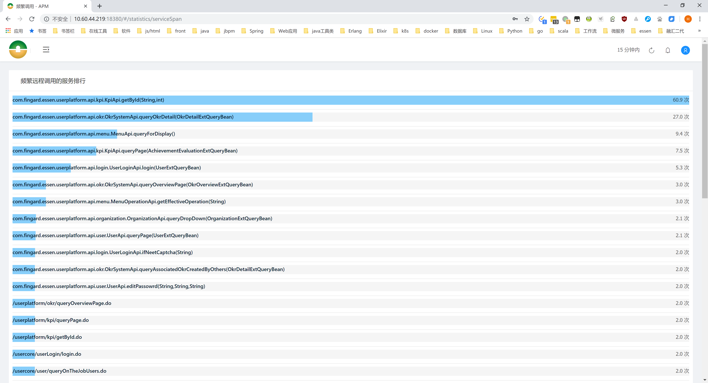
