# 截图及功能说明

官方提供的一个演示地址：

- [http://106.75.237.45:8080](http://106.75.237.45:8080/)
- admin/admin

## Skywalking 6界面简介

### 登录界面

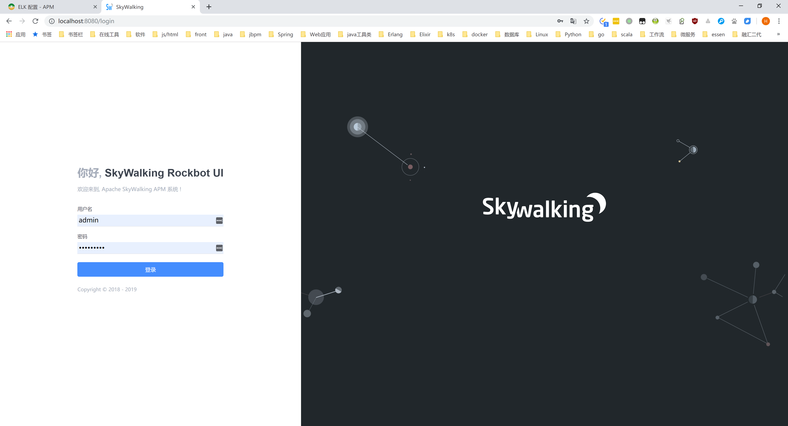

### 仪表盘

#### 主界面

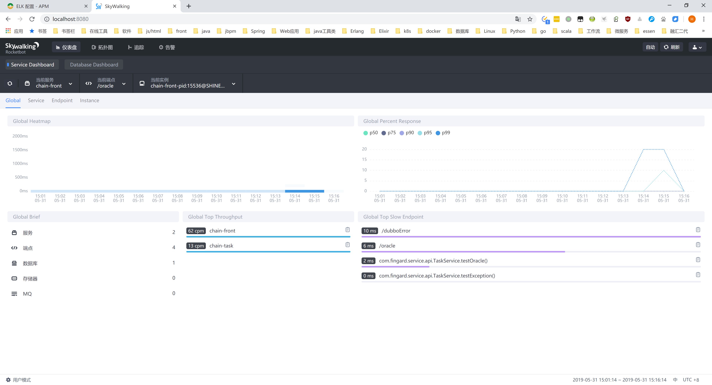

#### 服务界面

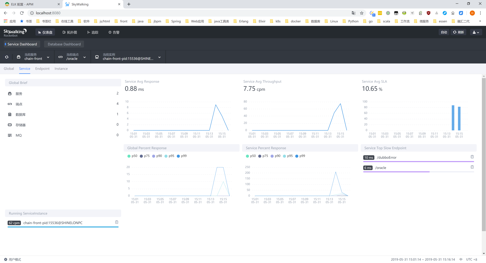

#### 端点界面

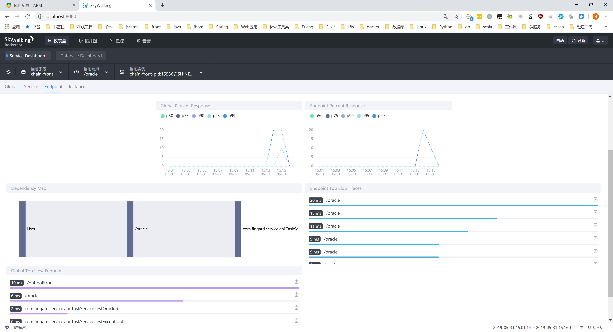

#### 应用（服务）实例界面

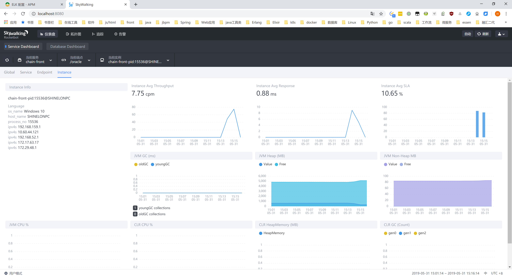

#### 数据库界面

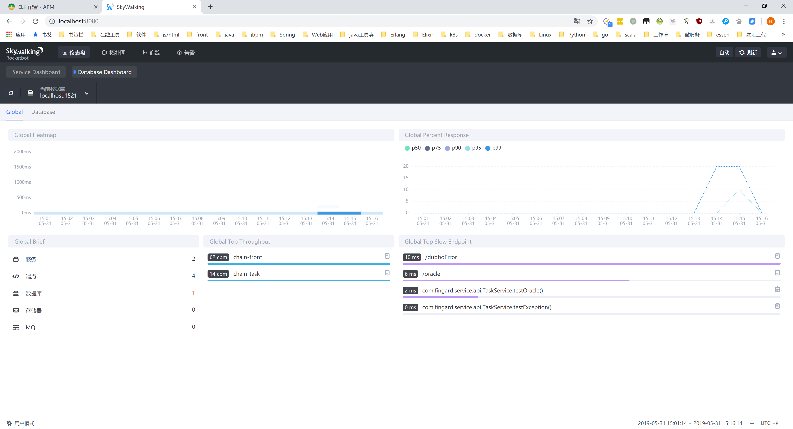

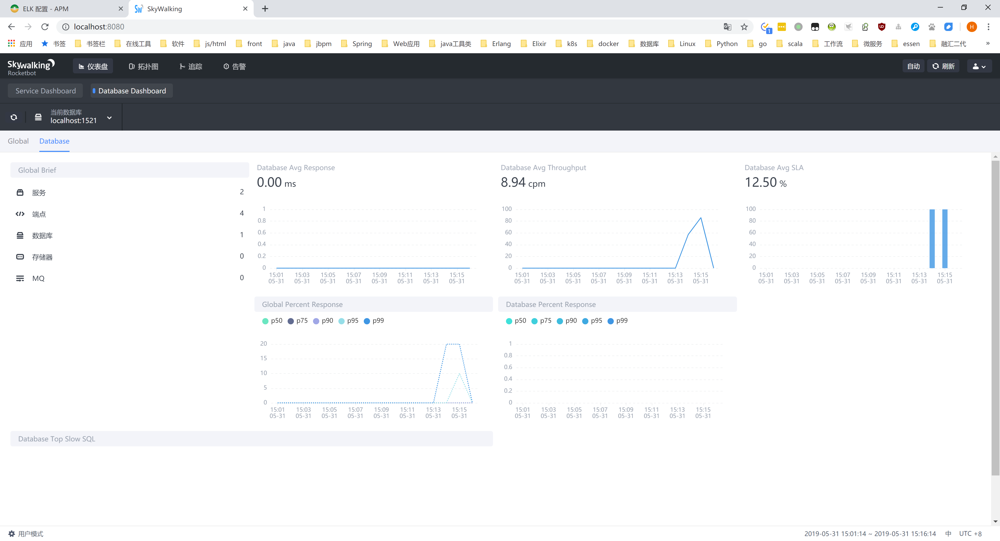

### 拓扑图

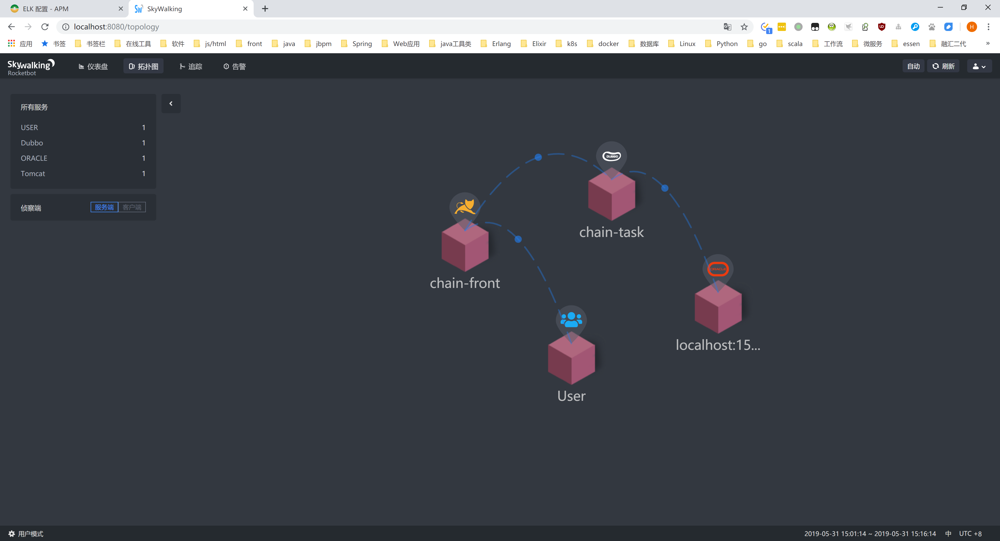

### Trace - 服务调用链路界面

#### 普通的类似Skywalking 5的列表界面

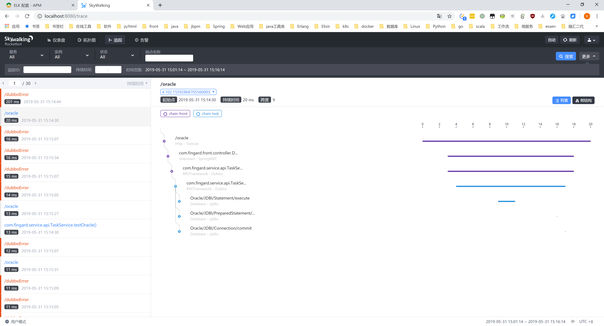

#### Skywalking 6 新增的链路调用树形界面

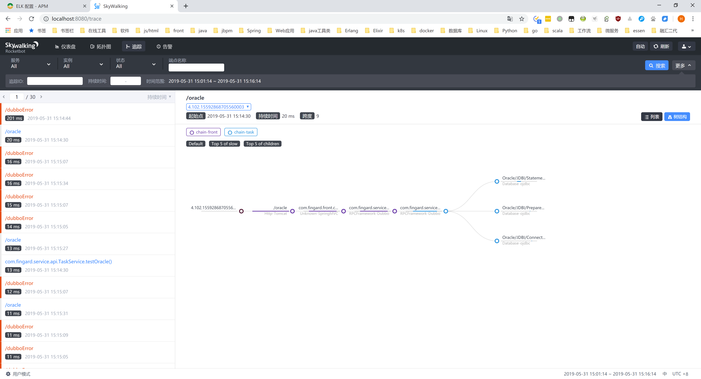

#### 一个span的详情界面

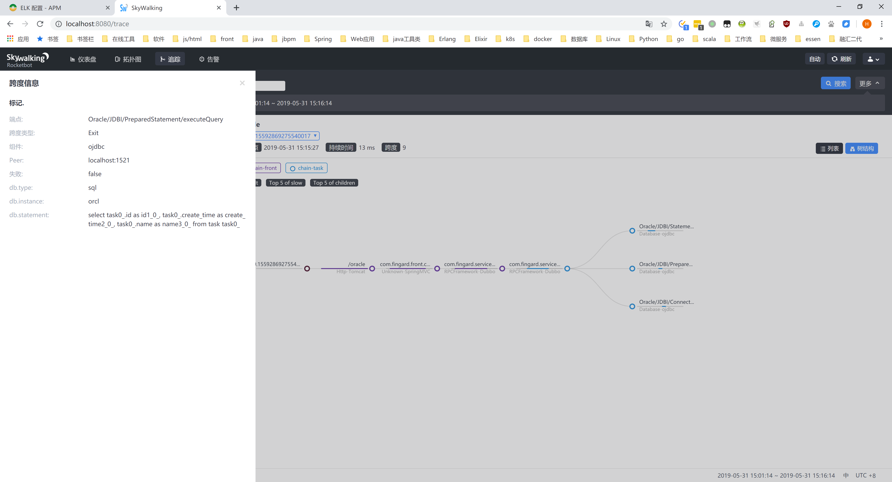

#### 异常span的stacktrace

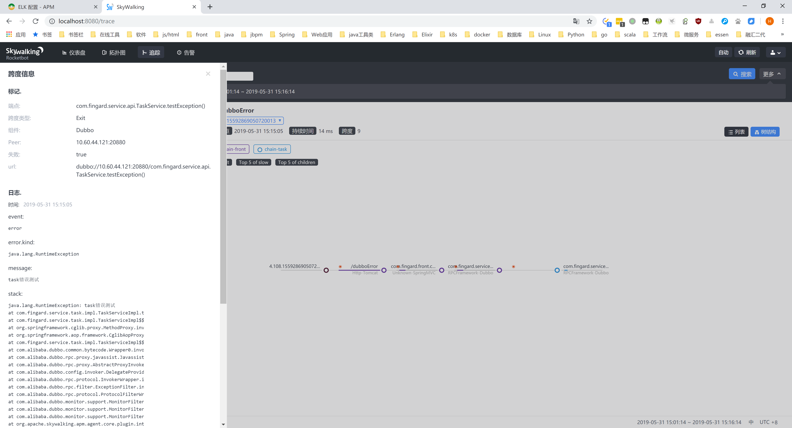

### 告警信息

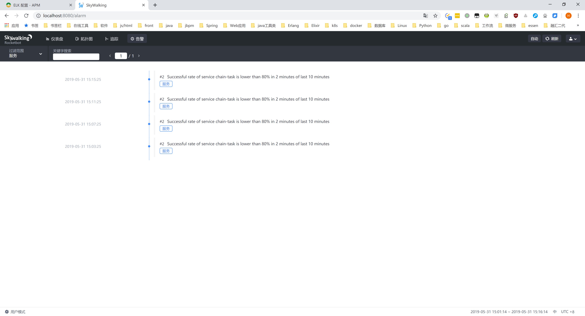
