[## 01.Spring框架的前世今生以及源码构建
https://blog.csdn.net/weixin_38024782/article/details/109007161
### spring 各个模块

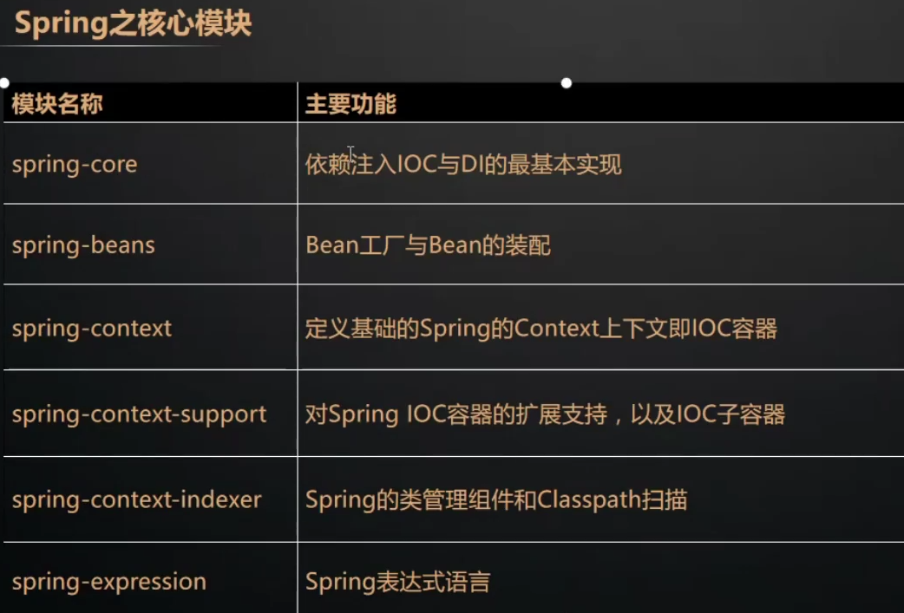
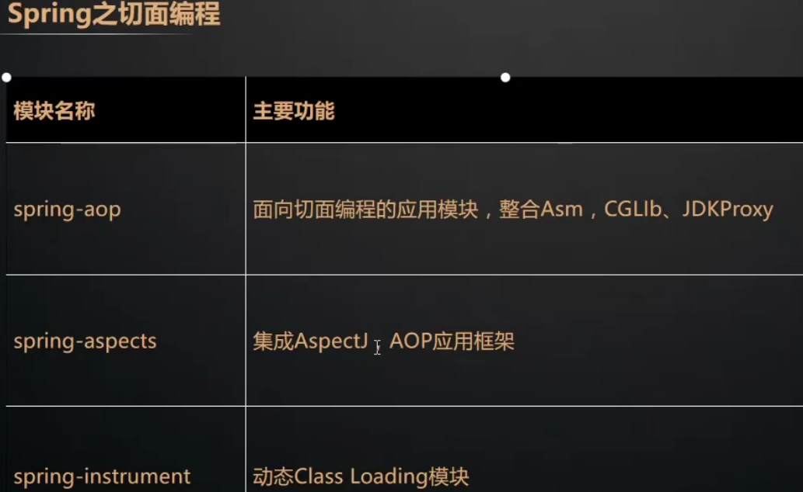
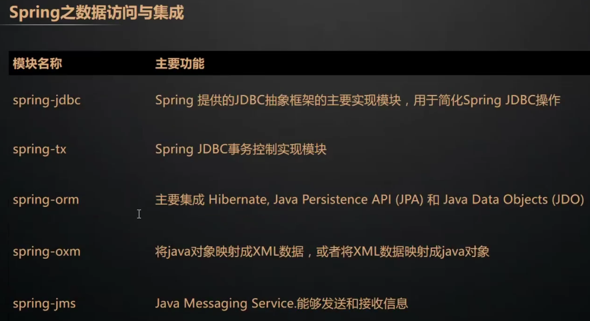

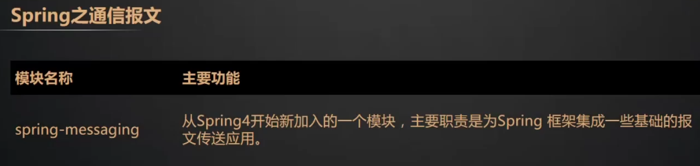
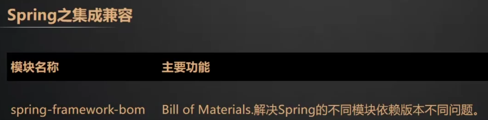

### spring各模块之间依赖关系

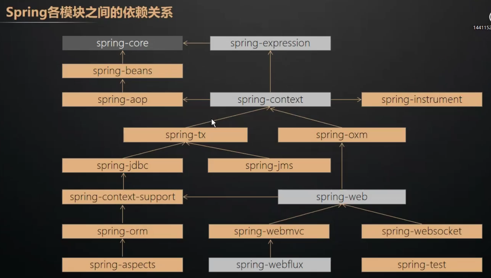

### 版本命名规则

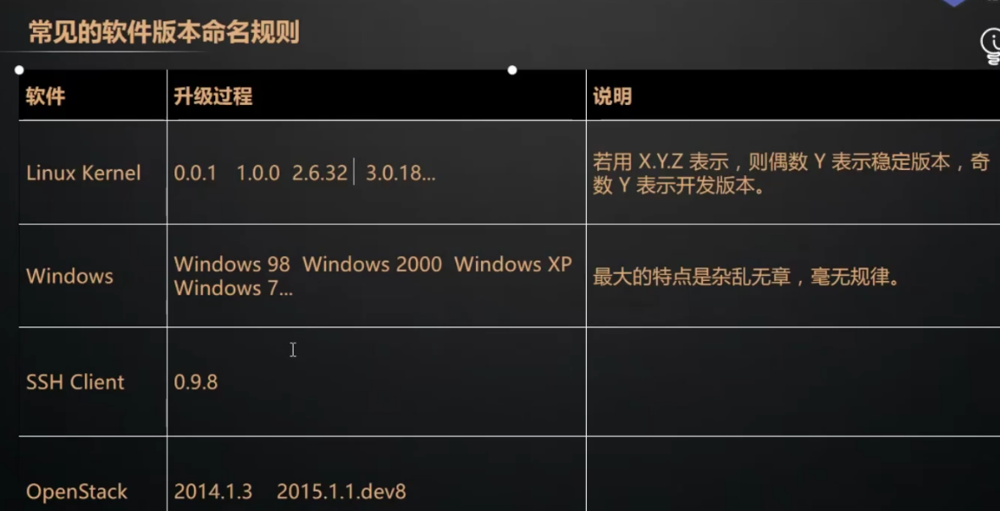
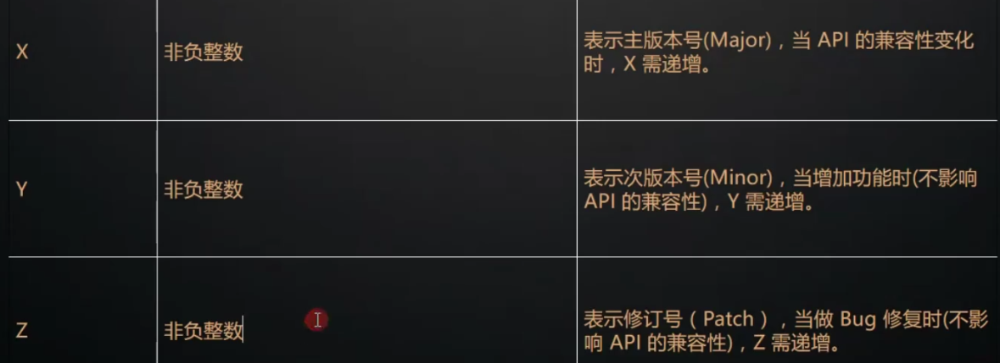
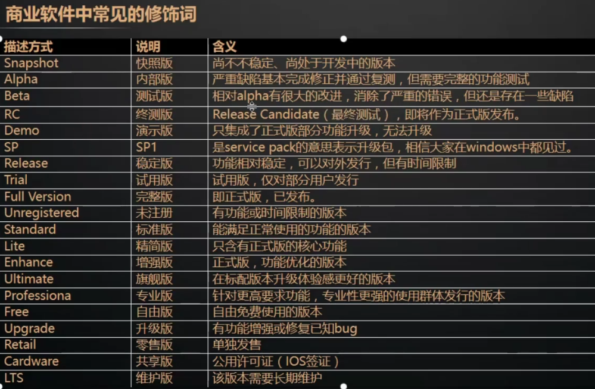
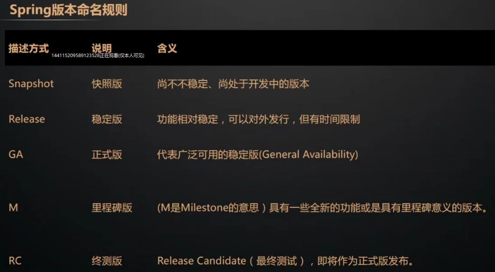

## 02.用300行代码手写提炼Spring的核心原理

### mini版Spring实现的基本思路

1. 获取 scanPackage下 扫描的所有类calss文件路径，加载到列表中
2. DI：循环各个类文件，查找含有 @Controller和@Service 注解的类,
   ioc容器： map<首字母小写类的名 或 首字母小写类的接口名 或自定义注解value值,类反射生成的对象>
3. 循环 ioc容器map,通过class文件查找含为Autowired注解的字段
   确定好字段，通过字段类型【一般是接口】 查找到 对应的对象 通过反射强制动态给字段赋值。
4. 先获取类上面的 MyRequestMapping注解的路径 /demo, 获取方法对应的 MyRequestMapping注解的路径 query 拼接 url：/demo/qurey
   Map<String, Method> handlerMappings 存储 /demo/qurey 方法
5. 通过url 确定好方法 ，参数确定好类型 与数据 过反射的形式传入参数执行此方法

## 03 spring ioc容器的初始化 
定位: 定位配置文件和扫描相关的注解  
加载: 将配置信息载入到内存中  
注册: 根据载入的信息，将对象初始化到10C容中  
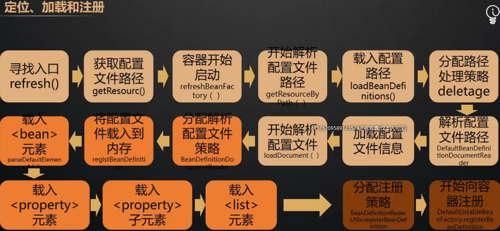  
1. 寻找IOC容器  
2. 定位配置文件的setConfigLocations()方法  
3. AbstractApplicationContext的refresh()方法  
4. AbstractApplicationContext的obtainFreshBeanFactory()方法  
5. AbstractRefreshableApplicationContext子类的loadBeanDefinitions方法  
6. AbstractBeanDefinitionReader读取Bean配置资源  
7. 资源加载器获取要读入的资源  
8. XmlBeanDefinitionReader加载Bean配置资源  
9. DocumentLoader将Bean配置资源转换为Document对象  
10. XmlBeanDefinitionReader 解析载入的 Bean 配置资源文件  
11. DefaultBeanDefinitionDocumentReader对Bean定义的Document对象解析  
12. BeanDefinitionParserDelegate解析Bean配置资源文件中的<bean>元素  
13. BeanDefinitionParserDelegate解析<property>元素  
14. 解析<property>元素的子元素  
15. 解析<list>子元素   
16. 解析过后的BeanDefinition在IOC容器中的注册   
17. DefaultListableBeanFactory向IOC容器注册解析后的 BeanDefinition  
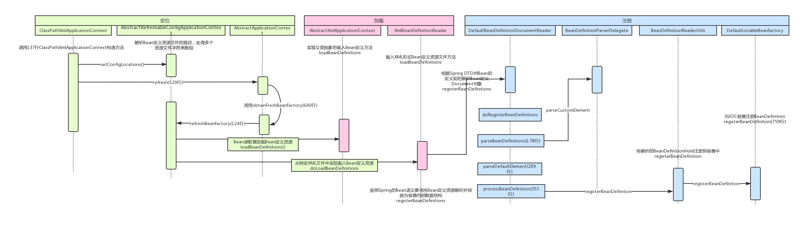

## 04. 依赖注入  
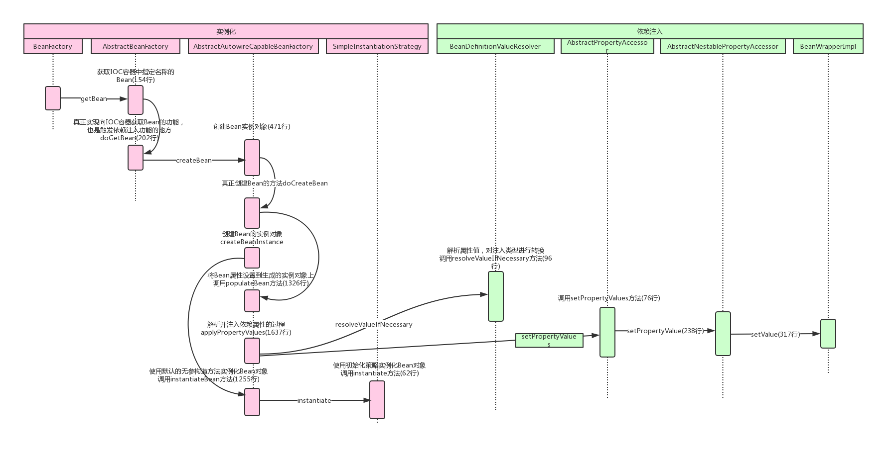

## 05 aop 
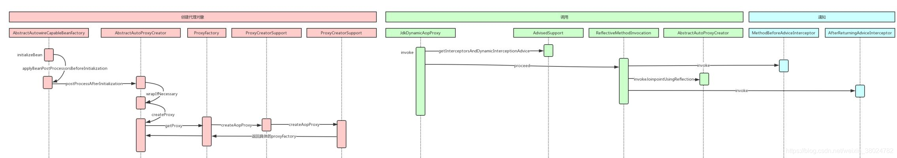

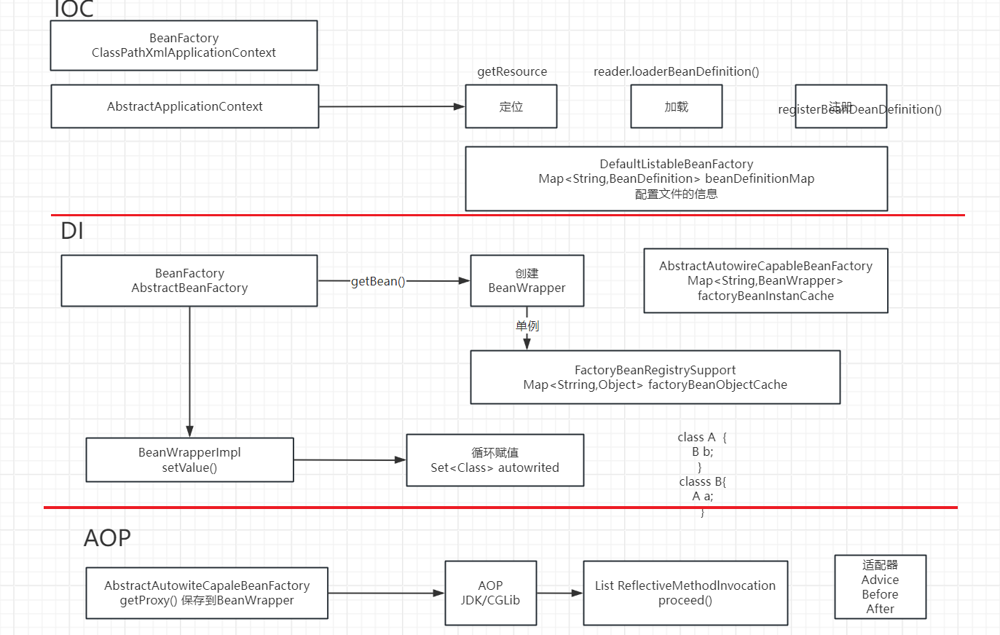

