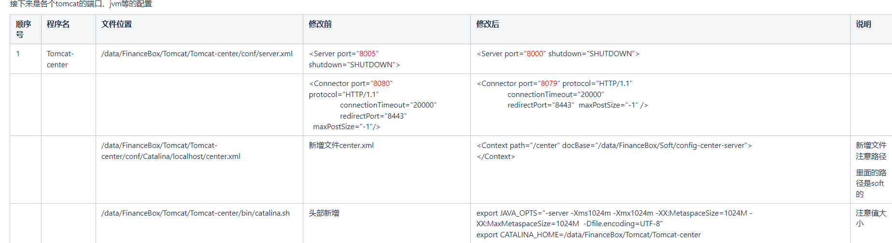

## tomcat  
```shell
## 关闭端口
<Server port="${getDeployConfig(app_tomcat_shutdown_port)}" shutdown="SHUTDOWN">
## http访问端口
<Connector port="${getDeployConfig(app_tomcat_http_port)}" protocol="HTTP/1.1"
```

[Tomcat快速入门](https://blog.csdn.net/qq_37510195/article/details/130592945)


## tomcat 使用
  
[tomcat如何配置context的docBase](https://blog.csdn.net/weixin_33901641/article/details/94700754)  

