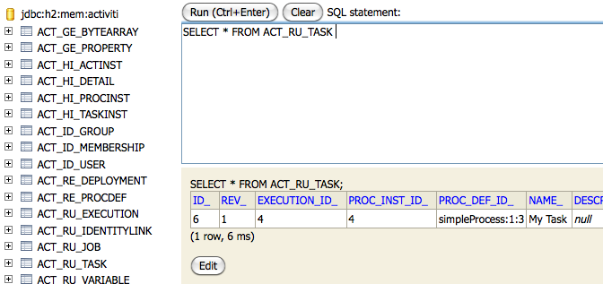

# Chapter 4. Activiti API


## 流程引擎的API和服务

引擎API是与Activiti打交道的最常用方式。 我们从`ProcessEngine`开始， 创建它的很多种方法都已经在 [配置章节](http://www.mossle.com/docs/activiti/index.html#configuration)中有所涉及。 从ProcessEngine中，你可以获得很多囊括工作流/BPM方法的服务。 ProcessEngine和服务类都是线程安全的。 你可以在整个服务器中仅保持它们的一个引用就可以了。


```
ProcessEngine processEngine = ProcessEngines.getDefaultProcessEngine();

RuntimeService runtimeService = processEngine.getRuntimeService();
RepositoryService repositoryService = processEngine.getRepositoryService();
TaskService taskService = processEngine.getTaskService();
ManagementService managementService = processEngine.getManagementService();
IdentityService identityService = processEngine.getIdentityService();
HistoryService historyService = processEngine.getHistoryService();
FormService formService = processEngine.getFormService();
```

`ProcessEngines.getDefaultProcessEngine()`会在第一次调用时 初始化并创建一个流程引擎，以后再调用就会返回相同的流程引擎。 使用对应的方法可以创建和关闭所有流程引擎：`ProcessEngines.init()` 和 `ProcessEngines.destroy()`。

ProcessEngines会扫描所有`activiti.cfg.xml` 和 `activiti-context.xml` 文件。 对于`activiti.cfg.xml`文件，流程引擎会使用Activiti的经典方式构建：`ProcessEngineConfiguration.createProcessEngineConfigurationFromInputStream(inputStream).buildProcessEngine()`. 对于`activiti-context.xml`文件，流程引擎会使用Spring方法构建：先创建一个Spring的环境， 然后通过环境获得流程引擎。

所有服务都是无状态的。这意味着可以在多节点集群环境下运行Activiti，每个节点都指向同一个数据库， 不用担心哪个机器实际执行前端的调用。 无论在哪里执行服务都没有问题。

**RepositoryService**可能是使用Activiti引擎时最先接触的服务。 它提供了管理和控制`发布包`和`流程定义`的操作。 这里不涉及太多细节，流程定义是BPMN 2.0流程的java实现。 它包含了一个流程每个环节的结构和行为。 `发布包`是Activiti引擎的打包单位。一个发布包可以包含多个BPMN 2.0 xml文件和其他资源。 开发者可以自由选择把任意资源包含到发布包中。 既可以把一个单独的BPMN 2.0 xml文件放到发布包里，也可以把整个流程和相关资源都放在一起。 （比如，'hr-processes'实例可以包含hr流程相关的任何资源）。 可以通过`RepositoryService`来`部署`这种发布包。 发布一个发布包，意味着把它上传到引擎中，所有流程都会在保存进数据库之前分析解析好。 从这点来说，系统知道这个发布包的存在，发布包中包含的流程就已经可以启动了。

除此之外，服务可以

- 查询引擎中的发布包和流程定义。
- 暂停或激活发布包，对应全部和特定流程定义。 暂停意味着它们不能再执行任何操作了，激活是对应的反向操作。
- 获得多种资源，像是包含在发布包里的文件， 或引擎自动生成的流程图。
- 获得流程定义的pojo版本， 可以用来通过java解析流程，而不必通过xml。


正如`RepositoryService`负责静态信息（比如，不会改变的数据，至少是不怎么改变的）， **RuntimeService**正好是完全相反的。它负责启动一个流程定义的新实例。 如上所述，`流程定义`定义了流程各个节点的结构和行为。 流程实例就是这样一个流程定义的实例。对每个流程定义来说，同一时间会有很多实例在执行。 `RuntimeService`也可以用来获取和保存`流程变量`。 这些数据是特定于某个流程实例的，并会被很多流程中的节点使用 （比如，一个排他网关常常使用流程变量来决定选择哪条路径继续流程）。 `Runtimeservice`也能查询流程实例和执行。 执行对应BPMN 2.0中的`'token'`。基本上执行指向流程实例当前在哪里。 最后，`RuntimeService`可以在流程实例等待外部触发时使用，这时可以用来继续流程实例。 流程实例可以有很多`暂停状态`，而服务提供了多种方法来'触发'实例， 接受外部触发后，流程实例就会继续向下执行。

任务是由系统中真实人员执行的，它是Activiti这类BPMN引擎的核心功能之一。 所有与任务有关的功能都包含在**TaskService**中：

- 查询分配给用户或组的任务
- 创建*独立运行*任务。这些任务与流程实例无关。
- 手工设置任务的执行者，或者这些用户通过何种方式与任务关联。
- 认领并完成一个任务。认领意味着一个人期望成为任务的执行者， 即这个用户会完成这个任务。完成意味着“做这个任务要求的事情”。 通常来说会有很多种处理形式。


**IdentityService**非常简单。它可以管理（创建，更新，删除，查询...）群组和用户。 请注意， Activiti执行时并没有对用户进行检查。 例如，任务可以分配给任何人，但是引擎不会校验系统中是否存在这个用户。 这是Activiti引擎也可以使用外部服务，比如ldap，活动目录，等等。

**FormService**是一个可选服务。即使不使用它，Activiti也可以完美运行， 不会损失任何功能。这个服务提供了*启动表单*和*任务表单*两个概念。 *启动表单*会在流程实例启动之前展示给用户， *任务表单*会在用户完成任务时展示。Activiti支持在BPMN 2.0流程定义中设置这些表单。 这个服务以一种简单的方式将数据暴露出来。再次重申，它时可选的， 表单也不一定要嵌入到流程定义中。

**HistoryService**提供了Activiti引擎手机的所有历史数据。 在执行流程时，引擎会保存很多数据（根据配置），比如流程实例启动时间，任务的参与者， 完成任务的时间，每个流程实例的执行路径，等等。 这个服务主要通过查询功能来获得这些数据。

**ManagementService**在使用Activiti的定制环境中基本上不会用到。 它可以查询数据库的表和表的元数据。另外，它提供了查询和管理异步操作的功能。 Activiti的异步操作用途很多，比如定时器，异步操作， 延迟暂停、激活，等等。后续，会讨论这些功能的更多细节。

可以从[javadocs](http://www.mossle.com/docs/javadocs/index.html)中获得这些服务和引擎API的更多信息。

## 异常策略

Activiti中的基础异常为`org.activiti.engine.ActivitiException`，一个非检查异常。 这个异常可以在任何时候被API抛出，不过特定方法抛出的“特定”的异常都记录在 [javadocs](http://www.mossle.com/docs/javadocs/index.html)中。 例如，下面的`TaskService`：

```
/**
 * Called when the task is successfully executed.
 * @param taskId the id of the task to complete, cannot be null.
 * @throws ActivitiObjectNotFoundException when no task exists with the given id.
 */
 void complete(String taskId);
    
```

在上面的例子中，当传入一个不存在的任务的id时，就会抛出异常。 同时，javadoc**明确指出taskId不能为null，如果传入null， 就会抛出ActivitiIllegalArgumentException**。

我们希望避免过多的异常继承，下面的子类用于特定的场合。 流程引擎和API调用的其他场合不会使用下面的异常， 它们会抛出一个普通的`ActivitiExceptions`。

- `ActivitiWrongDbException`：当Activiti引擎发现数据库版本号和引擎版本号不一致时抛出。
- `ActivitiOptimisticLockingException`：对同一数据进行并发方法并出现乐观锁时抛出。
- `ActivitiClassLoadingException`：当无法找到需要加载的类或在加载类时出现了错误（比如，JavaDelegate，TaskListener等。
- `ActivitiObjectNotFoundException`：当请求或操作的对应不存在时抛出。
- `ActivitiIllegalArgumentException`：这个异常表示调用Activiti API时传入了一个非法的参数，可能是引擎配置中的非法值，或提供了一个非法制，或流程定义中使用的非法值。
- `ActivitiTaskAlreadyClaimedException`：当任务已经被认领了，再调用`taskService.claim(...)`就会抛出。


## 使用Activiti的服务

像上面介绍的那样，要想操作Activiti引擎，需要通过 `org.activiti.engine.ProcessEngine`实例暴露的服务。 下面的代码假设你已经拥有了一个可以运行的Activiti环境。 你就可以操作一个`org.activiti.engine.ProcessEngine`。 如果只想简单尝试一下代码， 可以下载或者clone[Activiti单元测试模板](https://github.com/Activiti/activiti-unit-test-template)， 导入到IDE中，把`testUserguideCode()`方法添加到 `org.activiti.MyUnitTest`中。

这个小例子的最终目标是做一个工作业务流程， 演示公司中简单的请假申请：


### 发布流程

任何与“静态”资源有关的数据（比如流程定义）都可以通过 **RepositoryService**访问。 从概念上讲，所以静态数据都是Activiti的资源内容。

在`src/test/resources/org/activiti/test`目录下创建一个新的xml文件 `VacationRequest.bpmn20.xml`（如果不使用单元测试模板，你也可以在任何地方创建）， 内容如下。注意这一章不会解释例子中使用的xml结构。 如果有需要可以先阅读[bpmn 2.0章](http://www.mossle.com/docs/activiti/index.html#bpmn20)来了解这些。

```
<?xml version="1.0" encoding="UTF-8" ?>
<definitions id="definitions"
             targetNamespace="http://activiti.org/bpmn20"
             xmlns="http://www.omg.org/spec/BPMN/20100524/MODEL"
             xmlns:xsi="http://www.w3.org/2001/XMLSchema-instance"
             xmlns:activiti="http://activiti.org/bpmn">

  <process id="vacationRequest" name="Vacation request">

    <startEvent id="request" activiti:initiator="employeeName">
      <extensionElements>
        <activiti:formProperty id="numberOfDays" name="Number of days" type="long" value="1" required="true"/>
        <activiti:formProperty id="startDate" name="First day of holiday (dd-MM-yyy)" datePattern="dd-MM-yyyy hh:mm" type="date" required="true" />
        <activiti:formProperty id="vacationMotivation" name="Motivation" type="string" />
      </extensionElements>
    </startEvent>
    <sequenceFlow id="flow1" sourceRef="request" targetRef="handleRequest" />

    <userTask id="handleRequest" name="Handle vacation request" >
      <documentation>
        ${employeeName} would like to take ${numberOfDays} day(s) of vacation (Motivation: ${vacationMotivation}).
      </documentation>
      <extensionElements>
         <activiti:formProperty id="vacationApproved" name="Do you approve this vacation" type="enum" required="true">
          <activiti:value id="true" name="Approve" />
          <activiti:value id="false" name="Reject" />
        </activiti:formProperty>
        <activiti:formProperty id="managerMotivation" name="Motivation" type="string" />
      </extensionElements>
      <potentialOwner>
        <resourceAssignmentExpression>
          <formalExpression>management</formalExpression>
        </resourceAssignmentExpression>
      </potentialOwner>
    </userTask>
    <sequenceFlow id="flow2" sourceRef="handleRequest" targetRef="requestApprovedDecision" />

    <exclusiveGateway id="requestApprovedDecision" name="Request approved?" />
    <sequenceFlow id="flow3" sourceRef="requestApprovedDecision" targetRef="sendApprovalMail">
      <conditionExpression xsi:type="tFormalExpression">${vacationApproved == 'true'}</conditionExpression>
    </sequenceFlow>

    <task id="sendApprovalMail" name="Send confirmation e-mail" />
    <sequenceFlow id="flow4" sourceRef="sendApprovalMail" targetRef="theEnd1" />
    <endEvent id="theEnd1" />

    <sequenceFlow id="flow5" sourceRef="requestApprovedDecision" targetRef="adjustVacationRequestTask">
      <conditionExpression xsi:type="tFormalExpression">${vacationApproved == 'false'}</conditionExpression>
    </sequenceFlow>

    <userTask id="adjustVacationRequestTask" name="Adjust vacation request">
      <documentation>
        Your manager has disapproved your vacation request for ${numberOfDays} days.
        Reason: ${managerMotivation}
      </documentation>
      <extensionElements>
        <activiti:formProperty id="numberOfDays" name="Number of days" value="${numberOfDays}" type="long" required="true"/>
        <activiti:formProperty id="startDate" name="First day of holiday (dd-MM-yyy)" value="${startDate}" datePattern="dd-MM-yyyy hh:mm" type="date" required="true" />
        <activiti:formProperty id="vacationMotivation" name="Motivation" value="${vacationMotivation}" type="string" />
        <activiti:formProperty id="resendRequest" name="Resend vacation request to manager?" type="enum" required="true">
          <activiti:value id="true" name="Yes" />
          <activiti:value id="false" name="No" />
        </activiti:formProperty>
      </extensionElements>
      <humanPerformer>
        <resourceAssignmentExpression>
          <formalExpression>${employeeName}</formalExpression>
        </resourceAssignmentExpression>
      </humanPerformer>
    </userTask>
    <sequenceFlow id="flow6" sourceRef="adjustVacationRequestTask" targetRef="resendRequestDecision" />

    <exclusiveGateway id="resendRequestDecision" name="Resend request?" />
    <sequenceFlow id="flow7" sourceRef="resendRequestDecision" targetRef="handleRequest">
      <conditionExpression xsi:type="tFormalExpression">${resendRequest == 'true'}</conditionExpression>
    </sequenceFlow>

     <sequenceFlow id="flow8" sourceRef="resendRequestDecision" targetRef="theEnd2">
      <conditionExpression xsi:type="tFormalExpression">${resendRequest == 'false'}</conditionExpression>
    </sequenceFlow>
    <endEvent id="theEnd2" />

  </process>

</definitions>
            
```


为了让Activiti引擎知道这个流程，我们必须先进行“发布”。 发布意味着引擎会把BPMN 2.0 xml解析成可以执行的东西， “发布包”中的所有流程定义都会添加到数据库中。 这样，当引擎重启时，它依然可以获得“已发布”的流程：

```
ProcessEngine processEngine = ProcessEngines.getDefaultProcessEngine();
RepositoryService repositoryService = processEngine.getRepositoryService();
repositoryService.createDeployment()
  .addClasspathResource("org/activiti/test/VacationRequest.bpmn20.xml")
  .deploy();

Log.info("Number of process definitions: " + repositoryService.createProcessDefinitionQuery().count());
            
```


可以阅读[发布章](http://www.mossle.com/docs/activiti/index.html#chDeployment)来了解更多关于发布的信息。

### 启动一个流程实例

把流程定义发布到Activiti引擎后，我们可以基于它发起新流程实例。 对每个流程定义，都可以有很多流程实例。 流程定义是“蓝图”，流程实例是它的一个运行的执行。

所有与流程运行状态相关的东西都可以通过**RuntimeService**获得。 有很多方法可以启动一个新流程实例。在下面的代码中，我们使用定义在流程定义xml 中的key来启动流程实例。 我们也可以在流程实例启动时添加一些流程变量，因为第一个用户任务的表达式需要这些变量。 流程变量经常会被用到，因为它们赋予来自同一个流程定义的不同流程实例的特别含义。 简单来说，流程变量是区分流程实例的关键。

```
Map<String, Object> variables = new HashMap<String, Object>();
variables.put("employeeName", "Kermit");
variables.put("numberOfDays", new Integer(4));
variables.put("vacationMotivation", "I'm really tired!");

RuntimeService runtimeService = processEngine.getRuntimeService();
ProcessInstance processInstance = runtimeService.startProcessInstanceByKey("vacationRequest", variables);

// Verify that we started a new process instance
Log.info("Number of process instances: " + runtimeService.createProcessInstanceQuery().count());
            
```


### 完成任务

流程启动后，第一步就是用户任务。这是必须由系统用户处理的一个环节。 通常，用户会有一个“任务列表”，展示了所有必须由整个用户处理的任务。 下面的代码展示了对应的查询可能是怎样的：

```
// Fetch all tasks for the management group
TaskService taskService = processEngine.getTaskService();
List<Task> tasks = taskService.createTaskQuery().taskCandidateGroup("management").list();
for (Task task : tasks) {
  Log.info("Task available: " + task.getName());
}
            
```


为了让流程实例继续运行，我们需要完成整个任务。对Activiti来说，就是需要`complete`任务。 下面的代码展示了如何做这件事：

```
Task task = tasks.get(0);

Map<String, Object> taskVariables = new HashMap<String, Object>();
taskVariables.put("vacationApproved", "false");
taskVariables.put("managerMotivation", "We have a tight deadline!");
taskService.complete(task.getId(), taskVariables);
            
```

流程实例会进入到下一个环节。在这里例子中， 下一环节允许员工通过表单调整原始的请假申请。员工可以重新提交请假申请， 这会使流程重新进入到第一个任务。

### 挂起，激活一个流程

我们可以挂起一个流程定义。当挂起流程定时时， 就不能创建新流程了（会抛出一个异常）。 可以通过`RepositoryService`挂起一个流程：

```
repositoryService.suspendProcessDefinitionByKey("vacationRequest");
try {
  runtimeService.startProcessInstanceByKey("vacationRequest");
} catch (ActivitiException e) {
  e.printStackTrace();
}
            
```

要想重新激活一个流程定义，可以调用`repositoryService.activateProcessDefinitionXXX`方法。

也可以挂起一个流程实例。挂起时，流程不能继续执行（比如，完成任务会抛出异常）， 异步操作（比如定时器）也不会执行。 骨气流程实例可以调用 `runtimeService.suspendProcessInstance`方法。 激活流程实例可以调用`runtimeService.activateProcessInstanceXXX`方法。

### 更多知识

上面章节中我们仅仅覆盖了Activiti功能的表层。 未来我们会继续扩展这些章节，以覆盖更多Activiti API。 当然，像其他开源项目一样，学习的最好方式 是研究代码，阅读javadoc。

## 查询API

有两种方法可以从引擎中查询数据：查询API和原生查询。查询API提供了完全类型安全的API。 你可以为自己的查询条件添加很多条件 （所以条件都以AND组合）和精确的排序条件。下面的代码展示了一个例子：

```
      List<Task> tasks = taskService.createTaskQuery()
         .taskAssignee("kermit")
         .processVariableValueEquals("orderId", "0815")
         .orderByDueDate().asc()
         .list();
      
```

有时，你需要更强大的查询，比如使用OR条件或不能使用查询API实现的条件。 这时，我们推荐原生查询，它让你可以编写自己的SQL查询。 返回类型由你使用的查询对象决定，数据会映射到正确的对象上。比如，任务，流程实例，，执行，等等。 因为查询会作用在数据库上，你必须使用数据库中定义的表名和列名；这要求了解内部数据结构， 因此使用原生查询时一定要注意。表名可以通过API获得，可以尽量减少对数据库的依赖。

```
      List<Task> tasks = taskService.createNativeTaskQuery()
        .sql("SELECT count(*) FROM " + managementService.getTableName(Task.class) + " T WHERE T.NAME_ = #{taskName}")
        .parameter("taskName", "gonzoTask")
        .list();

      long count = taskService.createNativeTaskQuery()
        .sql("SELECT count(*) FROM " + managementService.getTableName(Task.class) + " T1, "
               + managementService.getTableName(VariableInstanceEntity.class) + " V1 WHERE V1.TASK_ID_ = T1.ID_")
        .count();
      
```


## 表达式

Activiti使用UEL处理表达式。UEL即*统一表达式语言*，它时EE6规范的一部分（参考 [EE6规范](http://docs.oracle.com/javaee/6/tutorial/doc/gjddd.html)）。为了在所有运行环境都支持最新UEL的所有功能，我们使用了一个JUEL的修改版本。

表达式可以用在很多场景下，比如[Java服务任务](http://www.mossle.com/docs/activiti/index.html#bpmnJavaServiceTaskXML)，[执行监听器](http://www.mossle.com/docs/activiti/index.html#executionListeners)，[任务监听器](http://www.mossle.com/docs/activiti/index.html#taskListeners)和[条件流](http://www.mossle.com/docs/activiti/index.html#conditionalSequenceFlowXml)。 虽然有两重表达式，值表达式和方法表达式，Activiti进行了抽象，所以两者可以同样使用在需要`表达式`的场景中。

- **Value expression**：解析为值。默认，所有流程变量都可以使用。所有spring bean（spring环境中）也可以使用在表达式中。 一些实例：

  ```
  ${myVar}
  ${myBean.myProperty}
  ```

  

- **Method expression**：调用一个方法，使用或不使用参数。**当调用一个无参数的方法时，记得在方法名后添加空的括号（以区分值表达式）。** 传递的参数可以是字符串也可以是表达式，它们会被自动解析。例子：

  ```
  ${printer.print()}
  ${myBean.addNewOrder('orderName')}
  ${myBean.doSomething(myVar, execution)}
  ```

  

注意这些表达式支持解析原始类型（包括比较），bean，list，数组和map。

在所有流程实例中，表达式中还可以使用一些默认对象：

- `execution`：`DelegateExecution`提供外出执行的额外信息。
- `task`：`DelegateTask`提供当前任务的额外信息。**注意，只对任务监听器的表达式有效。**
- `authenticatedUserId`：当前登录的用户id。如果没有用户登录，这个变量就不可用。


想要更多具体的使用方式和例子，参考[spring中的表达式](http://www.mossle.com/docs/activiti/index.html#springExpressions)，[Java服务任务](http://www.mossle.com/docs/activiti/index.html#bpmnJavaServiceTaskXML)，[执行监听器](http://www.mossle.com/docs/activiti/index.html#executionListeners)，[任务监听器](http://www.mossle.com/docs/activiti/index.html#taskListeners)或[条件流](http://www.mossle.com/docs/activiti/index.html#conditionalSequenceFlowXml)。

## 单元测试

业务流程是软件项目的一部分，它也应该和普通的业务流程一样进行测试： 使用单元测试。 因为Activiti是一个嵌入式的java引擎， 为业务流程编写单元测试和写普通单元测试完全一样。

Activiti支持JUnit 3和4进行单元测试。使用JUnit 3时， 必须集成`org.activiti.engine.test.ActivitiTestCase`。 它通过保护的成员变量提供ProcessEngine和服务， 在测试的`setup()`中， 默认会使用classpath下的`activiti.cfg.xml`初始化流程引擎。 想使用不同的配置文件，可以重写*getConfigurationResource()*方法。 如果配置文件相同的话，对应的流程引擎会被静态缓存， 就可以用于多个单元测试。

继承了`ActivitiTestCase`你，可以在测试方法上使用 `org.activiti.engine.test.Deployment`注解。 测试执行前，与测试类在同一个包下的， 格式为`testClassName.testMethod.bpmn20.xml`的资源文件，会被部署。 测试结束后，发布包也会被删除，包括所有相关的流程实例，任务，等等。 `Deployment`注解也可以直接设置资源的位置。 参考[Javadocs](http://www.mossle.com/docs/javadocs/org/activiti/engine/test/Deployment.html)获得更多信息。

把这些放在一起，JUnit 3测试看起来像这样。

```
public class MyBusinessProcessTest extends ActivitiTestCase {

  @Deployment
  public void testSimpleProcess() {
    runtimeService.startProcessInstanceByKey("simpleProcess");

    Task task = taskService.createTaskQuery().singleResult();
    assertEquals("My Task", task.getName());

    taskService.complete(task.getId());
    assertEquals(0, runtimeService.createProcessInstanceQuery().count());
  }
}
      
```


要想在使用JUnit 4编写单元测试时获得同样的功能， 可以使用`org.activiti.engine.test.ActivitiRule`。 通过它，可以通过getter方法获得流程引擎和各种服务。 和 `ActivitiTestCase`一样（参考上面章节），使用这个`Rule` 也会启用`org.activiti.engine.test.Deployment`注解（参考上面章节使用和配置的介绍）， 它会在classpath下查找默认的配置文件。 如果配置文件相同的话，对应的流程引擎会被静态缓存， 就可以用于多个单元测试。

下面的代码演示了JUnit 4单元测试并使用了`ActivitiRule`的例子。

```
public class MyBusinessProcessTest {

  @Rule
  public ActivitiRule activitiRule = new ActivitiRule();

  @Test
  @Deployment
  public void ruleUsageExample() {
    RuntimeService runtimeService = activitiRule.getRuntimeService();
    runtimeService.startProcessInstanceByKey("ruleUsage");

    TaskService taskService = activitiRule.getTaskService();
    Task task = taskService.createTaskQuery().singleResult();
    assertEquals("My Task", task.getName());

    taskService.complete(task.getId());
    assertEquals(0, runtimeService.createProcessInstanceQuery().count());
  }
}
      
```


## 调试单元测试

当使用内存数据库H2进行单元测试时，下面的教程会告诉我们 如何在调试环境下更容易的监视Activiti的数据库。 这里的截图都是基于eclipse，这种机制很容易复用到其他IDE下。 IDEs.

假设我们已经在单元测试里设置了一个*断点*。 Ecilpse里，在代码左侧双击：


现在用*调试*模式运行单元测试（右击单元测试， 选择“运行为”和“单元测试”），测试会停在我们的断点上， 然后我们就可以监视测试的变量，它们显示在右侧面板里。


要监视Activiti的数据，打开*“显示”*窗口 （如果找不到，打开“窗口”->“显示视图”->“其他”，选择*显示*。） 并点击（代码已完成）`org.h2.tools.Server.createWebServer("-web").start()`


选择你点击的行，右击。然后选择“显示”（或者直接快捷方式就不用右击了）


现在打开一个浏览器，打开[http://localhost:8082](http://localhost:8082/)， 输入内存数据库的JDBC URL（默认为`jdbc:h2:mem:activiti`）， 点击连接按钮。


你仙子阿可以看到Activiti的数据，通过它们可以了解单元测试时如何以及为什么这样运行的。




## web应用中的流程引擎

`ProcessEngine`是线程安全的， 可以在多线程下共享。在web应用中， 意味着可以在容器启动时创建流程引擎， 在容器关闭时关闭流程引擎。

下面代码演示了如何编写一个`ServletContextListener` 在普通的Servlet环境下初始化和销毁流程引擎：

```
public class ProcessEnginesServletContextListener implements ServletContextListener {

  public void contextInitialized(ServletContextEvent servletContextEvent) {
    ProcessEngines.init();
  }

  public void contextDestroyed(ServletContextEvent servletContextEvent) {
    ProcessEngines.destroy();
  }

}
```

`contextInitialized`方法会执行`ProcessEngines.init()`。 这会查找classpath下的`activiti.cfg.xml`文件， 根据配置文件创建一个`ProcessEngine`（比如，多个jar中都包含配置文件）。 如果classpath中包含多个配置文件，确认它们有不同的名字。 当需要使用流程引擎时，可以通过

```
ProcessEngines.getDefaultProcessEngine()
```

或

```
ProcessEngines.getProcessEngine("myName");
```

。 当然，也可以使用其他方式创建流程引擎， 可以参考[配置章节](http://www.mossle.com/docs/activiti/index.html#configuration)中的描述。

ContextListener中的`contextDestroyed`方法会执行`ProcessEngines.destroy()`. 这会关闭所有初始化的流程引擎。
