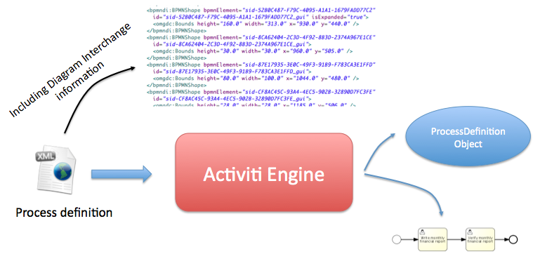

# Chapter 6. 部署


## 业务文档

为了部署流程，它们不得不包装在一个业务文档中。一个业务文档是Activiti引擎部署的单元。一个业务文档相当与一个压缩文件，它包含BPMN2.0流程，任务表单，规则和其他任意类型的文件。 大体上，业务文档是包含命名资源的容器。

当一个业务文档被部署，它将会自动扫描以 `.bpmn20.xml` 或者`.bpmn`作为扩展名的BPMN文件。每个那样的文件都将会被解析并且可能会包含多个流程定义。

### Note

业务归档中的Java类**将不能够添加到类路径下**。为了能够让流程运行，必须把存在于业务归档程中的流程定义使用的所有自定义的类（例如：Java服务任务或者实现事件的监听器）放在activiti引擎的类路径下：

### 编程式部署

通过一个压缩文件（支持Zip和Bar）部署业务归档，它看起来像这样：

```
String barFileName = "path/to/process-one.bar";
ZipInputStream inputStream = new ZipInputStream(new FileInputStream(barFileName));

repositoryService.createDeployment()
    .name("process-one.bar")
    .addZipInputStream(inputStream)
    .deploy();
        
```

它也可以通过一个独立资源（例如bpmn，xml等）构建部署。 详细信息请查看javadocs。

### 通过Activiti Explorer控制台部署

Activiti web控制台允许你通过web界面的用户接口上传一个bar格式的压缩文件（或者一个`bpmn20.xml`格式的文件）。 选择*Management 标签* 和 点击 *Deployment*:


现在将会有一个弹出窗口允许你从电脑上面选择一个文件，或者你可以简单的拖拽到指定的区域（如果你的浏览器支持）。


## 外部资源

流程定义保存在Activiti所支持的数据库中。当使用服务任务、执行监听器或者从Activiti配置文件中配置的Spring beans时，流程定义能够引用这些委托类。 这些类或者Spring配置文件对于所有流程引擎中可能执行的流程定义必须是可用的。

### Java类

当流程实例被启动的时候，在流程中被使用的所有自定义类（例如：服务任务中使用的JavaDelegates、事件监听器、任务监听器,...）应该存在与流程引擎的类路径下。

然后，在部署业务文档时，这些类不必都存在于类路径下。当使用Ant部署一个新的业务文档时，这意味着你的委托类不必存在与类路径下。

当你使用示例设置并添加你自定义的类，你应该添加包含自定义类的jar包到activiti-explorer控制台或者activiti-rest 的webapp lib文件夹中。以及不要忽略包含你自定义类的依赖关系（如果有）。 另外，你还可以包含你自己的依赖添加到你的Tomcat容器的安装目录中的`${tomcat.home}/lib`。

### 在流程中使用Spring beans

当表达式或者脚本使用Spring beans时，这些beans对于引擎执行流程定义时必须是可用的。如果你将要构建你自己的web应用并且按照[Spring集成这一章](http://www.mossle.com/docs/activiti/index.html#springintegration)中描述那样在你的应用上下文配置流程引擎，这个看上去非常的简单。但是要记住，如果你也在使用 Activiti rest web应用，那么也应该更新 Activiti rest web应用的上下文。 你可以把在`activiti-rest/lib/activiti-cfg.jar` 文件中的`activiti.cfg.xml`替换成你的Spring上下文配置的`activiti-context.xml`文件。

### 创建独立应用

你可以考虑把Activiti rest web 应用加入到你的web应用之中，因此，就仅仅只需要配置一个 `ProcessEngine`，从而不用确保所有的流程引擎的所有委托类在类路径下面并且是否使用正确的spring配置。

## 流程定义的版本

BPMN中并没有版本的概念，没有版本也是不错的，因为可执行的BPMN流程作为你开发项目的一部分存在版本控制系统的知识库中（例如 SVN,Git 或者Mercurial）。 而在Activiti中，流程定义的版本是在部署时创建的。在部署的时候，流程定义被存储到Activiti使用的数据库之前，Activiti讲会自动给 `流程定义` 分配一个版本号。

对于业务文档中每一个的流程定义，都会通过下列部署执行初始化属性`key`, `version`, `name` 和 `id`:

- XML文件中流程定义（流程模型）的 `id`属性被当做是流程定义的 `key`属性。
- XML文件中的流程模型的`name` 属性被当做是流程定义的 `name` 属性。如果该name属性并没有指定，那么id属性被当做是name。
- 带有特定key的流程定义在第一次部署的时候，将会自动分配版本号为1，对于之后部署相同key的流程定义时候，这次部署的版本号将会设置为比当前最大的版本号大1的值。该key属性被用来区别不同的流程定义。
- 流程定义中的id属性被设置为 {processDefinitionKey}:{processDefinitionVersion}:{generated-id}, 这里的`generated-id`是一个唯一的数字被添加，用于确保在集群环境中缓存的流程定义的唯一性。

举个流程的例子

```
<definitions id="myDefinitions" >
  <process id="myProcess" name="My important process" >
    ...
```

当部署了这个流程定义之后，在数据库中的流程定义看起来像这样：


**Table 6.1.** 

| id              | key       | name                 | version |
| --------------- | --------- | -------------------- | ------- |
| myProcess:1:676 | myProcess | My important process | 1       |


假设我们现在部署用一个流程的最新版本号（例如 改变用户任务），但是流程定义的`id`保持不变。 流程定义表将包含以下列表信息：


**Table 6.2.** 

| id              | key       | name                 | version |
| --------------- | --------- | -------------------- | ------- |
| myProcess:1:676 | myProcess | My important process | 1       |
| myProcess:2:870 | myProcess | My important process | 2       |


当 `runtimeService.startProcessInstanceByKey("myProcess")`方法被调用时，它将会使用流程定义版本号为2的，因为这是最新版本的流程定义。可以说每次流程定义创建流程实例时，都会默认使用最新版本的流程定义。

我们应该创建第二个流程，在Activiti中，如下,定义并且部署它，该流程定义会添加到流程定义表中。

```
<definitions id="myNewDefinitions" >
  <process id="myNewProcess" name="My important process" >
    ...
```

这个表结构看起来像这样:


**Table 6.3.** 

| id                  | key          | name                 | version |
| ------------------- | ------------ | -------------------- | ------- |
| myProcess:1:676     | myProcess    | My important process | 1       |
| myProcess:2:870     | myProcess    | My important process | 2       |
| myNewProcess:1:1033 | myNewProcess | My important process | 1       |

注意：为何新流程的key与我们的第一个流程是不同的？尽管流程定义的名称是相同的（当然，我们应该也是可以改变这一点的），Activiti仅仅只考虑`id`属性判断流程。因此，新的流程定义部署的版本号为1。

## 提供流程图片

流程定义的流程图可以被添加到部署中，该流程图将会持久化到Activiti所使用的数据库中并且可以通过Activiti的API进行访问。该流程图也可以被用来在Activiti Explorer控制台中的流程中进行显示。

如果在我们的类路径下面有一个流程，`org/activiti/expenseProcess.bpmn20.xml` ，该流程定义有一个流程key 'expense'。 以下遵循流程定义图片的命名规范（按照这个特地顺序）：

- 如果在部署时一个图片资源已经存在，它是BPMN2.0的XML文件名后面是流程定义的key并且是一个图片的后缀。那么该图片将被使用。在我们的例子中， 这应该是 `org/activiti/expenseProcess.expense.png`（或者 jpg/gif）。如果你在一个BPMN2.0 XML文件中定义多个流程定义图片，这种方式更有意义。每个流程定义图片的文件名中都将会有一个流程定义key。
- 如果并没有这样的图片存在，部署的时候寻找与匹配BPMN2.0 XML 文件的名称的图片资源。在我们的例子中，这应该是`org/activiti/expenseProcess.png`. 注意：这意味着在同一个BPMN2.0 XML文件夹中的**每个流程定义**都会有相同的流程定义图片。因此，在每一个BPMN 2.0 XML文件夹中仅仅只有一个流程定义，这绝对是不会有问题的。


当使用编程式的部署方式：

```
repositoryService.createDeployment()
  .name("expense-process.bar")
  .addClasspathResource("org/activiti/expenseProcess.bpmn20.xml")
  .addClasspathResource("org/activiti/expenseProcess.png")
  .deploy();
```

接下来，可以通过API来获取流程定义图片资源：

```
  ProcessDefinition processDefinition = repositoryService.createProcessDefinitionQuery()
                                                         .processDefinitionKey("expense")
                                                         .singleResult();

  String diagramResourceName = processDefinition.getDiagramResourceName();
  InputStream imageStream = repositoryService.getResourceAsStream(processDefinition.getDeploymentId(), diagramResourceName);
       
```


## 自动生成流程图片

在部署的情况下没有提供图片，在 [上一节](http://www.mossle.com/docs/activiti/index.html#providingProcessDiagram)中描述,如果流程定义中包含必要的'图像交换'信息时，Activiti流程引擎竟会自动生成一个图像。

该资源可以按照部署时[ 提供流程图片](http://www.mossle.com/docs/activiti/index.html#providingProcessDiagram)完全相同的方式获取。




如果，因为某种原因，在部署的时候，并不需要或者不必要生成流程定义图片，那么就需要在流程引擎配置的属性中使用`isCreateDiagramOnDeploy`：

```
<property name="createDiagramOnDeploy" value="false" />
```

现在就不会生成流程定义图片。

## 类别

部署和流程定义都是用户定义的类别。流程定义类别在BPMN文件中属性的初始化的值`<definitions ... targetNamespace="yourCategory" ...`

部署类别是可以直接使用API进行指定的看起来想这样：

```
repositoryService
    .createDeployment()
    .category("yourCategory")
    ...
    .deploy();
```
