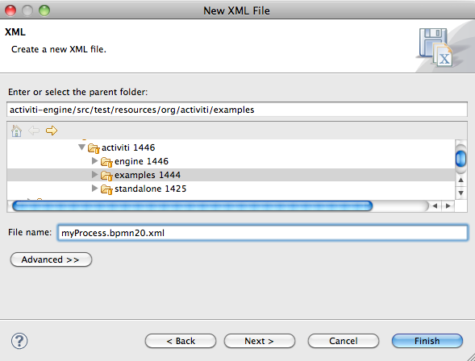
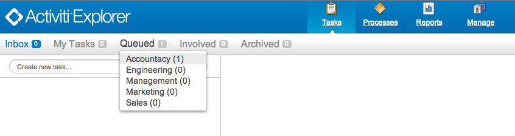

# Chapter 7. BPMN 2.0介绍


## 啥是BPMN？

参考我们的[FAQ中的BPMN 2.0部分](http://activiti.org/faq.html#WhatIsBpmn20)。

## 定义一个流程

### Note

文章假设你在使用[Eclipse IDE](http://eclipse.org/)来创建和编辑文件。 不过，其中只用到了Eclipse很少的特性。你可以使用喜欢的任何工具来创建包含BPMN 2.0的xml文件。

创建一个新的XML文件（*右击任何项目选择“新建”->“其他”->“XML-XML文件”*）并命名。 确认文件后缀为**ends with .bpmn20.xml 或 .bpmn**， 否则引擎无法发布。




BPMN 2.0根节点是`definitions`节点。 这个元素中，可以定义多个流程定义（不过我们建议每个文件只包含一个流程定义， 可以简化开发过程中的维护难度）。 一个空的流程定义看起来像下面这样。注意，`definitions`元素 最少也要包含`xmlns` 和 `targetNamespace`的声明。 `targetNamespace`可以是任意值，它用来对流程实例进行分类。

```
<definitions
  xmlns="http://www.omg.org/spec/BPMN/20100524/MODEL"
  xmlns:activiti="http://activiti.org/bpmn"
  targetNamespace="Examples">

  <process id="myProcess" name="My First Process">
    ..
  </process>

</definitions>
```


你也可以选择添加线上的BPMN 2.0格式位置， 下面是ecilpse中的xml配置。

```
xmlns:xsi="http://www.w3.org/2001/XMLSchema-instance"
xsi:schemaLocation="http://www.omg.org/spec/BPMN/20100524/MODEL
                    http://www.omg.org/spec/BPMN/2.0/20100501/BPMN20.xsd
```


`process`元素有两个属性：

- **id**：这个属性是**必须的**， 它对应着Activiti` ProcessDefinition`对象的**key**属性。 ‘`id`可以用来启动流程定义的流程实例， 通过`RuntimeService`的`startProcessInstanceByKey`方法。 这个方法会一直使用**最新发布版本**的流程定义(译者注：实际中一般都使用这种方式启动流程)。

  ```
  ProcessInstance processInstance = runtimeService.startProcessInstanceByKey("myProcess");
  ```

  注意，它和`startProcessInstanceById`方法不同。 这个方法期望使用Activiti引擎在发布时自动生成的id。， 可以通过调用`processDefinition.getId()`方法获得这个值。 生成的id的格式为**'key:version'**， 最大长度限制为**64个字符**， 如果你在启动时抛出了一个`ActivitiException`，说明生成的id太长了， 需要限制流程的*key*的长度。

- **name**：这个属性是**可选的**， 对应`ProcessDefinition`的*name*属性。 引擎自己不会使用这个属性，它可以用来在用户接口显示便于阅读的名称。


## 快速起步：10分钟教程

这张我们会演示一个（非常简单）的业务流程，我们会通过它介绍 一些基本的Activiti概念和API。

### 前提

教程假设你已经[能安装并运行Activiti demo](http://www.mossle.com/docs/activiti/index.html#demo.setup.one.minute.version)， 并且你使用了独立运行的H2服务器。修改`db.properties`，设置其中的 `jdbc.url=jdbc:h2:tcp://localhost/activiti`，然后根据[H2的文档](http://www.h2database.com/html/tutorial.html#using_server)启动独立服务器。

### 目标

教程的目标是学习Activiti和一些基本的BPMN 2.0概念。 最终结果是一个简单的Java SE程序可以发布流程定义， 通过Activiti引擎API操作流程。 我们也会使用一些Activiti相关的工具。当然，我们在教程中所学的 也可以用于你构建自己的业务流程web应用。

### 用例

用例很直接：我们有一个公司，就叫BPMCorp。 在BPMCopr中，每个月都要给公司领导一个金融报表。 由会计部门负责。 当报表完成时，一个上级领导需要审批文档， 然后才能发给所有领导。

### 流程图

上面描述的业务流程可以用[Activiti Designer](http://www.mossle.com/docs/activiti/index.html#activitiDesigner) 进行可视化设计。 然后，为了这个教程，我们会手工编写XML，这样可以学到更多知识细节。 我们流程的图形化BPMN 2.0标记看起来像这样：


我们看到有[空开始事件](http://www.mossle.com/docs/activiti/index.html#bpmnNoneStartEvent)（左侧圆圈）, 后面是两个[用户任务](http://www.mossle.com/docs/activiti/index.html#bpmnUserTask)： *“制作月度财报”*和 *“验证月度财报”*，最后是 [空结束事件](http://www.mossle.com/docs/activiti/index.html#bpmnNoneEndEvent)（右侧粗线圆圈）。

### XML内容

业务流程的XML内容（*FinancialReportProcess.bpmn20.xml*）如下所示： 很容易找到流程的主要元素（点击链接可以了解BPMN 2.0结构的详细信息）：

- [（空）开始事件](http://www.mossle.com/docs/activiti/index.html#bpmnNoneStartEvent) 是我们流程的*入口*。
- [用户任务](http://www.mossle.com/docs/activiti/index.html#bpmnUserTask)是流程中与操作者相关的任务声明。 注意第一个任务分配给*accountancy*组， 第二个任务分配给*management*组。 参考[用户任务分配章节](http://www.mossle.com/docs/activiti/index.html#bpmnUserTaskAssignment) 了解更多关于用户任务分配人员和群组的问题。
- 当流程达到[空结束事件](http://www.mossle.com/docs/activiti/index.html#bpmnNoneEndEvent)就会结束。
- 这些元素都使用[连线](http://www.mossle.com/docs/activiti/index.html#bpmnSequenceFlow)连接。 这些连线拥有`source` 和 `target`属性， 定义了连线的*方向*。


```
<definitions id="definitions"
  targetNamespace="http://activiti.org/bpmn20"
  xmlns:activiti="http://activiti.org/bpmn"
  xmlns="http://www.omg.org/spec/BPMN/20100524/MODEL">

        <process id="financialReport" name="Monthly financial report reminder process">

          <startEvent id="theStart" />

          <sequenceFlow id='flow1' sourceRef='theStart' targetRef='writeReportTask' />

          <userTask id="writeReportTask" name="Write monthly financial report" >
            <documentation>
              Write monthly financial report for publication to shareholders.
            </documentation>
            <potentialOwner>
              <resourceAssignmentExpression>
                <formalExpression>accountancy</formalExpression>
              </resourceAssignmentExpression>
            </potentialOwner>
          </userTask>

          <sequenceFlow id='flow2' sourceRef='writeReportTask' targetRef='verifyReportTask' />

          <userTask id="verifyReportTask" name="Verify monthly financial report" >
            <documentation>
              Verify monthly financial report composed by the accountancy department.
              This financial report is going to be sent to all the company shareholders.
            </documentation>
            <potentialOwner>
              <resourceAssignmentExpression>
                <formalExpression>management</formalExpression>
              </resourceAssignmentExpression>
            </potentialOwner>
          </userTask>

          <sequenceFlow id='flow3' sourceRef='verifyReportTask' targetRef='theEnd' />

          <endEvent id="theEnd" />

        </process>

</definitions>
```


### 启动一个流程实例

现在我们创建好了业务流程的**流程定义**。 有了这个流程定义，我们可以创建**流程实例**了。 这时，一个流程实例对应了特定月度财报的创建和审批。 所有流程实例都共享同一个流程定义。

为了使用流程定义创建流程实例， 首先要**发布**业务流程， 这意味着两方面：

- 流程定义会保存到持久化的数据存储里， 是为你的Activiti引擎特别配置。所以部署好你的业务流程， 我们就能确认引擎重启后还能找到流程定义。
- BPMN 2.0流程文件会解析成内存对象模型， 可以通过Activiti API操作。

可以通过[发布章节](http://www.mossle.com/docs/activiti/index.html#chDeployment)获得关于发布的更多信息。

就像章节里描述的一样，有很多种方式可以进行发布。 一种方式是通过下面的API。注意所有与Activiti引擎的交互都是通过*services*。

```
Deployment deployment = repositoryService.createDeployment()
  .addClasspathResource("FinancialReportProcess.bpmn20.xml")
  .deploy();
```


现在我们可以启动一个新流程实例， 使用我们定义在流程定义里的`id`（对应XML文件中的process元素）。 注意这里的`id`对于Activiti来说， 应该叫做**key**（译者注：一般在流程模型中使用的ID，在Activiti中都是Key，比如任务ID等...）。

```
ProcessInstance processInstance = runtimeService.startProcessInstanceByKey("financialReport");
```

这会创建一个流程实例，首先进入开始事件。 开始事件之后，它会沿着所有的外出连线（这里只有一条）执行， 到达第一个任务（“制作月度财报”）。 Activiti会把一个任务保存到数据库里。 这时，分配到这个任务的用户或群组会被解析，也会保存到数据库里。 需要注意，Activiti引擎会继续执行流程的环节，除非遇到一个 *等待状态*，比如用户任务。 在等待状态下，当前的流程实例的状态会保存到数据库中。 直到用户决定完成任务才能改变这个状态。这时，引擎会继续执行， 直到遇到下一个等待状态，或流程结束。 如果中间引擎重启或崩溃， 流程状态也会安全的保存在数据库里。

任务创建之后，`startProcessInstanceByKey`会在到达用户任务 这个*等待状态*之后才会返回。这时，任务分配给了一个组， 这意味着这个组是执行这个任务的**候选**组。

我们现在把所有东西都放在一起，来创建一个简单的java程序。 创建一个eclipse项目，把Activiti的jar和依赖放到classpath下。 （这些都可以在Activiti发布包的*libs*目录下找到）。 在调用Activiti服务之前，我们必须构造一个`ProcessEngine`， 它可以让我们访问服务。这里我们使用*'单独运行'*的配置， 这会使用demo安装时的数据库来构建`ProcessEngine`。

你可以在[这里](http://www.mossle.com/docs/activiti/images/FinancialReportProcess.bpmn20.xml)下载流程定义XML。 这个文件包含了上面介绍的XML，也包含了必须的BPMN[图像信息](http://www.mossle.com/docs/activiti/index.html#generatingProcessDiagram) 以便在Activiti工具中能编辑流程。


```
public static void main(String[] args) {

  // Create Activiti process engine
  ProcessEngine processEngine = ProcessEngineConfiguration
    .createStandaloneProcessEngineConfiguration()
    .buildProcessEngine();

  // Get Activiti services
  RepositoryService repositoryService = processEngine.getRepositoryService();
  RuntimeService runtimeService = processEngine.getRuntimeService();

  // Deploy the process definition
  repositoryService.createDeployment()
    .addClasspathResource("FinancialReportProcess.bpmn20.xml")
    .deploy();

  // Start a process instance
  runtimeService.startProcessInstanceByKey("financialReport");
}
```


### 任务列表

我们现在可以通过`TaskService`来获得任务了，添加以下逻辑：

```
List<Task> tasks = taskService.createTaskQuery().taskCandidateUser("kermit").list();
```

注意我们传入的用户必须是*accountancy*组的一个成员， 要和流程定义中向对应：

```
<potentialOwner>
  <resourceAssignmentExpression>
    <formalExpression>accountancy</formalExpression>
  </resourceAssignmentExpression>
</potentialOwner>
```

我们也可以使用群组名称，通过任务查询API来获得相关的结果。 现在可以在代码中添加如下逻辑：

```
TaskService taskService = processEngine.getTaskService();
List<Task> tasks = taskService.createTaskQuery().taskCandidateGroup("accountancy").list();
```


因为我们配置的`ProcessEngine`使用了与demo相同的数据， 我们可以登录到[Activiti Explorer](http://localhost:8080/activiti-explorer/)。 默认，*accountancy（会计）*组里没有任何人。使用kermit/kermit登录，点击组，并创建一个新组。 然后点击用户，把组分配给fozzie。现在使用fozzie/fozzie登录，现在我们就可以启动我们的业务流程了， 选择*Processes*页，在*'月度财报'*的*'操作'*列 点击*'启动流程'*。


和上面介绍的那样，流程会执行到第一个用户任务。因为我们以kermit登录， 在启动流程实例之后，就可以看到有了一个新的待领任务。 选择*任务*页来查看这条新任务。 注意即使流程被其他人启动，任务还是会被会计组里的所有人作为一个候选任务看到。




### 领取任务

现在一个会计要**认领这个任务**。 认领以后，这个用户就会成为任务的**执行人** ， 任务会从会计组的其他成员的任务列表中消失。 认领任务的代码如下所示：

```
taskService.claim(task.getId(), "fozzie");
```

任务会进入**认领任务人的个人任务列表**中。

```
List<Task> tasks = taskService.createTaskQuery().taskAssignee("fozzie").list();
```


在Activiti Explorer UI中，点击*认领*按钮，会执行相同的操作。 任务会移动到登录用户的个人任务列表。 你也会看到任务的执行人已经变成当前登陆的用户。


### 完成任务

现在会计可以开始进行财报的工作了。报告完成后， 他可以**完成任务**， 意味着任务所需的所有工作都完成了。

```
taskService.complete(task.getId());
```


对于Activiti引擎，需要一个外部信息来让流程实例继续执行。 任务会把自己从运行库中删除。 流程会沿着单独一个外出连线执行，移动到第二个任务 （*'审批报告'*）。 与第一个任务相同的机制会使用到第二个任务上， 不同的是任务是分配给 *management*组。

在demo中，完成任务是通过点击任务列表中的*完成*按钮。 因为Fozzie不是会计，我们先从Activiti Explorer注销 然后使用*kermit*登陆（他是经理）。 第二个任务会进入未分配任务列表。

### 结束流程

审批任务可以像之前介绍的一样查询和领取。 完成第二个任务会让流程执行到结束事件，就会结束流程实例。 流程实例和所有相关的运行数据都会从数据库中删除。

登录Activiti Explorer就可以进行验证， 可以看到保存流程运行数据的表中已经没有数据了。


通过程序，你也可以使用`historyService`判断流程已经结束了。

```
HistoryService historyService = processEngine.getHistoryService();
HistoricProcessInstance historicProcessInstance =
historyService.createHistoricProcessInstanceQuery().processInstanceId(procId).singleResult();
System.out.println("Process instance end time: " + historicProcessInstance.getEndTime());
```


### 代码总结

把上述代码组合在一起，获得的代码如下所示 （这些代码考虑到你可能会在Activiti Explorer UI中启动一些流程实例。 这样，它会获得多个任务，而不是一个， 所以代码可以一直正常运行）：

```
public class TenMinuteTutorial {

  public static void main(String[] args) {

    // Create Activiti process engine
    ProcessEngine processEngine = ProcessEngineConfiguration
      .createStandaloneProcessEngineConfiguration()
      .buildProcessEngine();

    // Get Activiti services
    RepositoryService repositoryService = processEngine.getRepositoryService();
    RuntimeService runtimeService = processEngine.getRuntimeService();

    // Deploy the process definition
    repositoryService.createDeployment()
      .addClasspathResource("FinancialReportProcess.bpmn20.xml")
      .deploy();

    // Start a process instance
    String procId = runtimeService.startProcessInstanceByKey("financialReport").getId();

    // Get the first task
    TaskService taskService = processEngine.getTaskService();
    List<Task> tasks = taskService.createTaskQuery().taskCandidateGroup("accountancy").list();
    for (Task task : tasks) {
      System.out.println("Following task is available for accountancy group: " + task.getName());

      // claim it
      taskService.claim(task.getId(), "fozzie");
    }

    // Verify Fozzie can now retrieve the task
    tasks = taskService.createTaskQuery().taskAssignee("fozzie").list();
    for (Task task : tasks) {
      System.out.println("Task for fozzie: " + task.getName());

      // Complete the task
      taskService.complete(task.getId());
    }

    System.out.println("Number of tasks for fozzie: "
            + taskService.createTaskQuery().taskAssignee("fozzie").count());

    // Retrieve and claim the second task
    tasks = taskService.createTaskQuery().taskCandidateGroup("management").list();
    for (Task task : tasks) {
      System.out.println("Following task is available for accountancy group: " + task.getName());
      taskService.claim(task.getId(), "kermit");
    }

    // Completing the second task ends the process
    for (Task task : tasks) {
      taskService.complete(task.getId());
    }

    // verify that the process is actually finished
    HistoryService historyService = processEngine.getHistoryService();
    HistoricProcessInstance historicProcessInstance =
      historyService.createHistoricProcessInstanceQuery().processInstanceId(procId).singleResult();
    System.out.println("Process instance end time: " + historicProcessInstance.getEndTime());
  }

}
```


这段代码包含在实例中的一个单元测试中（似的，你可以运行单元测试来测试你的流程。 参考[单元测试章节](http://www.mossle.com/docs/activiti/index.html#apiUnitTesting)来了解更多信息）。

### 更多思考

可以看到业务流程相对于现实来说太简单了。 然而，你可以了解Activiti中的BPMN 2.0结构， 你可以考虑对业务流程进行以下方面的加强：

- 定义**网关**来实现决策环节。 这样，经理可以驳回财报， 重新给会计创建一个任务。
- 考虑使用**变量**， 这样我们可以保存或引用报告， 把它显示到表单中。
- 在流程最后加入**服务任务**， 把报告发给每个领导。
- 其他


