# Chapter 8. BPMN 2.0结构


本章介绍Activiti支持的BPMN 2.0结构， 以及对BPMN标准的扩展。

## 自定义扩展

BPMN 2.0标准对于各方都是一个好东西。最终用户不用担心会绑死在 供应商提供的专有解决方案上。 框架，特别是activiti这样的开源框架，可以提供相同功能 （甚至是更好的实现），足以和大的供应商媲美。 按照BPMN 2.0标准，从大供应商的解决方案迁移到activiti 只会经过一个简单而平滑的过程。

标准不好的一点是，它常常是不同公司之间大量讨论和妥协的结果。 （而且通常是愿景）。 作为开发者去阅读流程定义的BPMN 2.0 xml时，有时会感觉 用这种结构和方法去做事太麻烦了。 因此activiti把简化开发作为最优先的事情，我们会使用一些被称为 **'Activiti BPMN扩展'**的功能。 这些扩展是新的结构或方法来简化对应的结构， 它们并不属于BPMN 2.0规范。

虽然BPMN 2.0规范清楚的指明了如何开发自定义扩展， 但是我们还要确认一下几点：

- 自定义扩展的前提是 **总**有简单的方法 转换成**标准方法**。 所以当你决定使用自定义扩展时，不用担心没办法回头。
- 当使用自定义扩展时，总会清楚的指明使用了 新的XML元素，属性，等等。 比如会使用**activiti:**命名空间前缀。
- 这些扩展的目标是最终把它们加入到下一版本的BPMN规范中， 或者至少可以引起对特定BPMN结构的讨论。


因此无论是是否想要使用自定义扩展，这都取决于你。 很多因素会影响决定这个决定（图形编辑器，公司策略，等等）。 只是因为我们相信标准里的一些功能可以更简单或更高校， 所以才决定提供自定义扩展。请对扩展给予我们（正面或负面）的评价， 或者是对自定义扩展的心想法。 说不定有一天你的想法就会加入到规范中。

## 事件（Event）

事件用来表明流程的生命周期中发生了什么事。 事件总是画成一个圆圈。 在BPMN 2.0中， 事件有两大分类：*捕获（catching）* 或 *触发（throwing）* 事件。

- **捕获（Catching）：**当流程执行到事件， 它会等待被触发。触发的类型是由内部图表或XML中的类型声明来决定的。 捕获事件与触发事件在显示方面是根据内部图表是否被填充来区分的（白色的）。
- **触发（Throwing）：**当流程执行到事件， 会触发一个事件。触发的类型是由内部图表或XML中的类型声明来决定的。 触发事件与捕获事件在显示方面是根据内部图表是否被填充来区分的（被填充为黑色）。


### 事件定义

事件定义决定了事件的语义。如果没有事件定义，这个事件就不做什么特别的事情。 没有设置事件定义的开始事件不会在启动流程时做任何事情。如果给开始事件添加了一个事件定义 （比如定时器事件定义）我们就声明了开始流程的事件 "类型 " （这时定时器事件监听器会在某个时间被触发）。

### 定时器事件定义

定时器事件是根据指定的时间触发的事件。可以用于 [开始事件](http://www.mossle.com/docs/activiti/index.html#bpmnTimerStartEvent)， [中间事件](http://www.mossle.com/docs/activiti/index.html#bpmnIntermediateCatchingEvent) 或 [边界事件](http://www.mossle.com/docs/activiti/index.html#bpmnTimerBoundaryEvent)

定时器定义必须下面介绍的一个元素：

- **timeDate**。使用 [ISO 8601](http://en.wikipedia.org/wiki/ISO_8601#Dates) 格式指定一个确定的时间，触发事件的时间。示例：

  ```
  <timerEventDefinition>
      <timeDate>2011-03-11T12:13:14</timeDate>
  </timerEventDefinition>
  ```

  

- **timeDuration**。指定定时器之前要等待多长时间， *timeDuration*可以设置为*timerEventDefinition*的子元素。 使用[ISO 8601](http://en.wikipedia.org/wiki/ISO_8601#Durations)规定的格式 （由BPMN 2.0规定）。示例（等待10天）。

  ```
  <timerEventDefinition>
      <timeDuration>P10D</timeDuration>
  </timerEventDefinition>
  ```

  

- **timeCycle**。指定重复执行的间隔， 可以用来定期启动流程实例，或为超时时间发送多个提醒。 timeCycle元素可以使用两种格式。第一种是 [ISO 8601](http://en.wikipedia.org/wiki/ISO_8601#Repeating_intervals) 标准的格式。示例（重复3次，每次间隔10小时）：

  ```
  <timerEventDefinition>
      <timeCycle>R3/PT10H</timeCycle>
  </timerEventDefinition>
  ```

  

  另外，你可以使用cron表达式指定timeCycle，下面的例子是从整点开始，每5分钟执行一次：

  ```
  0 0/5 * * * ?
  ```

  请参考[教程](http://www.quartz-scheduler.org/docs/tutorials/crontrigger.html) 来了解如何使用cron表达式。

  **注意：** 第一个数字表示秒，而不是像通常Unix cron中那样表示分钟。

  重复的时间周期能更好的处理相对时间，它可以计算一些特定的时间点 （比如，用户任务的开始时间），而cron表达式可以处理绝对时间 - 这对[定时启动事件](http://www.mossle.com/docs/activiti/index.html#timerStartEventDescription)特别有用。


你可以在定时器事件定义中使用表达式，这样你就可以通过流程变量来影响那个定时器定义。 流程定义必须包含ISO 8601（或cron）格式的字符串，以匹配对应的时间类型。

```
  <boundaryEvent id="escalationTimer" cancelActivity="true" attachedToRef="firstLineSupport">
     <timerEventDefinition>
      <timeDuration>${duration}</timeDuration>
    </timerEventDefinition>
  </boundaryEvent>
  
```


**注意：** 只有启用job执行器之后，定时器才会被触发。 （`activiti.cfg.xml`中的*jobExecutorActivate*需要设置为`true`， 不过，默认job执行器是关闭的）。

### 错误事件定义

错误事件是由指定错误触发的。

**重要提醒：**BPMN错误与Java异常完全不一样。 实际上，他俩一点儿共同点都没有。BPMN错误事件是为了对 *业务异常*建模。Java异常是要 [用特定方式](http://www.mossle.com/docs/activiti/index.html#serviceTaskExceptionHandling)处理。

错误事件定义会引用一个error元素。下面是一个error元素的例子，引用了一个错误声明：

```
<endEvent id="myErrorEndEvent">
  <errorEventDefinition errorRef="myError" />
</endEvent>
         
```

引用相同error元素的错误事件处理器会捕获这个错误。

### 信号事件定义

信号事件会引用一个已命名的信号。信号全局范围的事件（广播语义）。 会发送给所有激活的处理器。

信号事件定义使用`signalEventDefinition`元素。 `signalRef`属性会引用`definitions`根节点里定义的`signal`子元素。 下面是一个流程的实例，其中会抛出一个信号，并被中间事件捕获。

```
<definitions... >
        <!-- declaration of the signal -->
        <signal id="alertSignal" name="alert" />

        <process id="catchSignal">
                <intermediateThrowEvent id="throwSignalEvent" name="Alert">
                        <!-- signal event definition -->
                        <signalEventDefinition signalRef="alertSignal" />
                </intermediateThrowEvent>
                ...
                <intermediateCatchEvent id="catchSignalEvent" name="On Alert">
                        <!-- signal event definition -->
                        <signalEventDefinition signalRef="alertSignal" />
                </intermediateCatchEvent>
                ...
        </process>
</definitions>
```

`signalEventDefinition`引用相同的`signal`元素。

#### 触发信号事件

既可以通过bpmn节点由流程实例触发一个信号，也可以通过API触发。 下面的`org.activiti.engine.RuntimeService`中的方法 可以用来手工触发一个信号。

```
RuntimeService.signalEventReceived(String signalName);
RuntimeService.signalEventReceived(String signalName, String executionId);
                                
```

`signalEventReceived(String signalName);`和 `signalEventReceived(String signalName, String executionId);`之间的区别是 第一个方法会把信号发送给全局所有订阅的处理器（广播语义）， 第二个方法只把信息发送给指定的执行。

#### 捕获信号事件

信号事件可以被中间捕获信号事件或边界信息事件捕获。

#### 查询信号事件的订阅

可以查询所有订阅了特定信号事件的执行：

```
 List<Execution> executions = runtimeService.createExecutionQuery()
      .signalEventSubscriptionName("alert")
      .list();
                
```

我们可以使用`signalEventReceived(String signalName, String executionId)`方法 吧信号发送给这些执行。

#### 信号事件范围

默认，信号会在*流程引擎范围内进行广播*。就是说， 你可以在一个流程实例中抛出一个信号事件，其他不同流程定义的流程实例 都可以监听到这个事件。

然而，有时只希望在*同一个流程实例*中响应这个信号事件。 比如一个场景是，流程实例中的同步机制，如果两个或更多活动是互斥的。

如果想要限制信号事件的*范围*，可以使用信号事件定义的*scope 属性* （不是BPMN2.0的标准属性）：

```
<signal id="alertSignal" name="alert" activiti:scope"processInstance"/>
```

The default value for this is attribute is *"global"*.

#### 信号事件实例

下面是两个不同流程使用信号交互的例子。第一个流程在保险规则更新或改变时启动。 在修改被参与者处理时，会触发一个信息，通知规则改变：

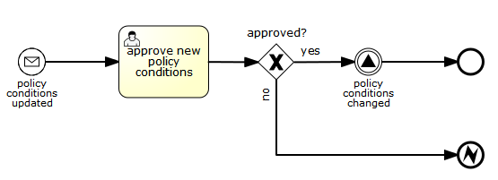

这个时间会被所有感兴趣的流程实例捕获。下面是一个订阅这个事件的流程实例。


**注意：**要了解信号事件是广播给**所有** 激活的处理器的。 这意味着在上面的例子中，所有流程实例都会接收到这个事件。 这就是我们想要的。然而，有的情况下并不想要这种广播行为。 考虑下面的流程：

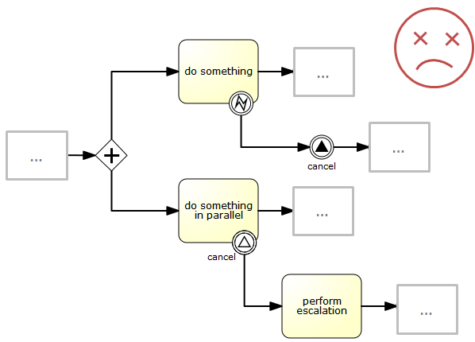

上述流程描述的模式activiti并不支持。这种想法是执行“do something”任务时出现的错误，会被边界错误事件捕获， 然后使用信号传播给并发路径上的分支，进而中断"do something inparallel"任务。 目前，activiti实际运行的结果与期望一致。信号会传播给边界事件并中断任务。 **但是，根据信号的广播含义，它也会传播给所有其他订阅了信号事件的流程实例。** 所以，这就不是我们想要的结果。

**注意：** 信号事件不会执行任何与特定流程实例的联系。 如果你只想把一个信息发给指定的流程实例，需要手工关联，再使用 `signalEventReceived(String signalName, String executionId)`和对应的 [查询机制](http://www.mossle.com/docs/activiti/index.html#bpmnSignalEventDefinitionQuery)。

### 消息事件定义

消息事件会引用一个命名的消息。每个消息都有名称和内容。和信号不同， 消息事件总会直接发送个一个接受者。

消息事件定义使用`messageEventDefinition`元素。 `messageRef`属性引用了`definitions`根节点下的 一个`message`子元素。下面是一个使用两个消息事件的流程例子， 开始事件和中间捕获事件分别声明和引用了两个消息事件。

```
<definitions id="definitions"
  xmlns="http://www.omg.org/spec/BPMN/20100524/MODEL"
  xmlns:activiti="http://activiti.org/bpmn"
  targetNamespace="Examples"
  xmlns:tns="Examples">

  <message id="newInvoice" name="newInvoiceMessage" />
  <message id="payment" name="paymentMessage" />

  <process id="invoiceProcess">

    <startEvent id="messageStart" >
        <messageEventDefinition messageRef="newInvoice" />
    </startEvent>
    ...
    <intermediateCatchEvent id="paymentEvt" >
        <messageEventDefinition messageRef="payment" />
    </intermediateCatchEvent>
    ...
  </process>

</definitions>
```


#### 触发消息事件

作为一个嵌入式的流程引擎，activiti不能真正接收一个消息。这些环境相关，与平台相关的活动 比如连接到JMS（Java消息服务）队列或主题或执行WebService或REST请求。 这个消息的接收是你要在应用或架构的一层实现的，流程引擎则内嵌其中。

在你的应用接收一个消息之后，你必须决定如何处理它。 如果消息应该触发启动一个新流程实例， 在下面的RuntimeService的两个方法中选择一个执行：

```
ProcessInstance startProcessInstanceByMessage(String messageName);
ProcessInstance startProcessInstanceByMessage(String messageName, Map<String, Object> processVariables);
ProcessInstance startProcessInstanceByMessage(String messageName, String businessKey, Map<String, Object> processVariables);            
```

这些方法允许使用对应的消息系统流程实例。

如果消息需要被运行中的流程实例处理，首先要根据消息找到对应的流程实例 （参考下一节）然后触发这个等待中的流程。 RuntimeService提供了如下方法可以基于消息事件的订阅来触发流程继续执行：

```
void messageEventReceived(String messageName, String executionId);
void messageEventReceived(String messageName, String executionId, HashMap<String, Object> processVariables);    
```


#### 查询消息事件的订阅

Activiti支持消息开始事件和中间消息事件。

- 消息开始事件的情况，消息事件订阅分配给一个特定的 *process definition*。这个消息订阅可以使用`ProcessDefinitionQuery`查询到：

  ```
  ProcessDefinition processDefinition = repositoryService.createProcessDefinitionQuery()
        .messageEventSubscription("newCallCenterBooking")
        .singleResult();
                  
  ```

  因为同时只能有一个流程定义关联到消息的订阅点，查询总是返回0或一个结果。 如果流程定义更新了， 那么只有最新版本的流程定义会订阅到消息事件上。

- 中间捕获消息事件的情况，消息事件订阅会分配给特定的*执行*。 这个消息事件订阅可以使用`ExecutionQuery`查询到：

  ```
  Execution execution = runtimeService.createExecutionQuery()
        .messageEventSubscriptionName("paymentReceived")
        .variableValueEquals("orderId", message.getOrderId())
        .singleResult();
  ```

  这个查询可以调用对应的查询，通常是流程相关的信息 （这里，最多只能有一个流程实例对应着orderId）。

#### 消息事件实例

下面是一个使用两个不同消息启动的流程实例：

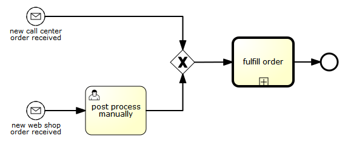

可以用在，流程需要不同的方式来区分开始事件，而后最终会进入同样的路径。

### 开始事件

开始事件用来指明流程在哪里开始。开始事件的类型（流程在接收事件时启动， 还是在指定时间启动，等等），定义了流程*如何*启动， 这通过事件中不同的小图表来展示。 在XML中，这些类型是通过声明不同的子元素来区分的。

开始事件**都是捕获事件**： 最终这些事件都是（一直）等待着，直到对应的触发时机出现。

在开始事件中，可以设置下面的activiti特定属性：

- **initiator**：当流程启动时，把当前登录的用户保存到哪个变量名中。 示例如下：

  ```
  <startEvent id="request" activiti:initiator="initiator" />
  ```

  登录的用户必须使用`IdentityService.setAuthenticatedUserId(String)`方法设置， 并像这样包含在try-finally代码中：

  ```
  try {
    identityService.setAuthenticatedUserId("bono");
    runtimeService.startProcessInstanceByKey("someProcessKey");
  } finally {
    identityService.setAuthenticatedUserId(null);
  }
  ```

  这段代码来自Activiti Explorer，所以它可以和 [Chapter 9, *表单*](http://www.mossle.com/docs/activiti/index.html#forms)一起结合使用。

### 空开始事件

#### 描述

空开始事件技术上意味着没有指定启动流程实例的触发条件。 这就是说引擎不能预计什么时候流程实例会启动。 空开始事件用于，当流程实例要通过API启动的场景， 通过调用*startProcessInstanceByXXX*方法。

```
ProcessInstance processInstance = runtimeService.startProcessInstanceByXXX();
```


*注意：* 子流程都有一个空开始事件。

#### 图形标记

空开始事件显示成一个圆圈，没有内部图表（没有触发类型）


#### XML结构

空开始事件的XML结构是普通的开始事件定义，没有任何子元素 （其他开始事件类型都有一个子元素来声明自己的类型）

```
<startEvent id="start" name="my start event" />
```


#### 空开始事件的自定义扩展

**formKey**：引用用户在启动新流程实例时需要填写的表单模板， 更多信息可以参考[表单章节](http://www.mossle.com/docs/activiti/index.html#forms)。 实例：

```
<startEvent id="request" activiti:formKey="org/activiti/examples/taskforms/request.form" />
```


### 定时开始事件

#### 描述

定时开始事件用来在指定的时间创建流程实例。 它可以同时用于只启动一次的流程 和应该在特定时间间隔启动多次的流程。

*注意：*子流程不能使用定时开始事件。

*注意：*定时开始事件在流程发布后就会开始计算时间。 不需要调用startProcessInstanceByXXX，虽然也而已调用启动流程的方法， 但是那会导致调用startProcessInstanceByXXX时启动过多的流程。

*注意：*当包含定时开始事件的新版本流程部署时， 对应的上一个定时器就会被删除。这是因为通常不希望自动启动旧版本流程的流程实例。

#### 图形标记

定时开始事件显示为了一个圆圈，内部是一个表。


#### XML内容

定时开始事件的XML内容是普通开始事件的声明，包含一个定时定义子元素。 请参考[定时定义](http://www.mossle.com/docs/activiti/index.html#timerEventDefinitions) 查看配合细节。

示例：流程会启动4次，每次间隔5分钟，从2011年3月11日，12:13开始计时。

```
        <startEvent id="theStart">
            <timerEventDefinition>
                <timeCycle>R4/2011-03-11T12:13/PT5M</timeCycle>
            </timerEventDefinition>
        </startEvent>
           
```


示例：流程会根据选中的时间启动一次。

```
        <startEvent id="theStart">
            <timerEventDefinition>
                <timeDate>2011-03-11T12:13:14</timeDate>
            </timerEventDefinition>
        </startEvent>
           
```


### 消息开始事件

#### 描述

[消息](http://www.mossle.com/docs/activiti/index.html#bpmnMessageEventDefinition)开始事件可以用其使用一个命名的消息来启动流程实例。 这样可以帮助我们使用消息名称来*选择*正确的开始事件。

在**发布**包含一个或多个消息开始事件的流程定义时，需要考虑下面的条件：

- 消息开始事件的名称在给定流程定义中不能重复。流程定义不能包含多个名称相同的消息开始事件。 如果两个或以上消息开始事件应用了相同的事件，或两个或以上消息事件引用的消息名称相同，activiti会在发布流程定义时抛出异常。
- 消息开始事件的名称在所有已发布的流程定义中不能重复。 如果一个或多个消息开始事件引用了相同名称的消息，而这个消息开始事件已经部署到不同的流程定义中， activiti就会在发布时抛出一个异常。
- 流程版本：在发布新版本的流程定义时，之前订阅的消息订阅会被取消。 如果新版本中没有消息事件也会这样处理。


**启动**流程实例，消息开始事件可以使用 下列`RuntimeService`中的方法来触发：

```
ProcessInstance startProcessInstanceByMessage(String messageName);
ProcessInstance startProcessInstanceByMessage(String messageName, Map<String, Object> processVariables);
ProcessInstance startProcessInstanceByMessage(String messageName, String businessKey, Map<String, Object< processVariables);
                                
```

这里的`messageName`是`messageEventDefinition`的`messageRef`属性引用的`message`元素的`name`属性。 **启动**流程实例时，要考虑一下因素：

- 消息开始事件只支持顶级流程。消息开始事件不支持内嵌子流程。

- 如果流程定义有多个消息开始事件，`runtimeService.startProcessInstanceByMessage(...)` 会选择对应的开始事件。

- 如果流程定义有多个消息开始事件和一个空开始事件。 `runtimeService.startProcessInstanceByKey(...)`和 `runtimeService.startProcessInstanceById(...)`会使用空开始事件启动流程实例。

- 如果流程定义有多个消息开始事件，而且没有空开始事件， `runtimeService.startProcessInstanceByKey(...)`和 `runtimeService.startProcessInstanceById(...)`会抛出异常。

- 如果流程定义只有一个消息开始事件， `runtimeService.startProcessInstanceByKey(...)`和 `runtimeService.startProcessInstanceById(...)`会使用这个消息开始事件启动流程实例。

- 如果流程被调用环节（callActivity）启动，消息开始事件只支持如下情况：

  - 在消息开始事件以外，还有一个单独的空开始事件
  - 流程只有一个消息开始事件，没有空开始事件。

  


#### 图形标记

消息开始事件是一个圆圈，中间是一个消息事件图标。图标是白色未填充的，来表示捕获（接收）行为。


#### XML内容

消息开始事件的XML内容时在普通开始事件申请中包含一个 messageEventDefinition子元素：

```
<definitions id="definitions"
  xmlns="http://www.omg.org/spec/BPMN/20100524/MODEL"
  xmlns:activiti="http://activiti.org/bpmn"
  targetNamespace="Examples"
  xmlns:tns="Examples">

  <message id="newInvoice" name="newInvoiceMessage" />

  <process id="invoiceProcess">

    <startEvent id="messageStart" >
        <messageEventDefinition messageRef="tns:newInvoice" />
    </startEvent>
    ...
  </process>

</definitions>
```


### 信号开始事件

#### 描述

[signal](http://www.mossle.com/docs/activiti/index.html#bpmnSignalEventDefinition)开始事件，可以用来通过一个已命名的信号（signal）来启动一个流程实例。 信号可以在流程实例内部使用“中间信号抛出事务”触发， 也可以通过API(*runtimService.signalEventReceivedXXX* 方法)触发。两种情况下， 所有流程实例中拥有相同名称的signalStartEvent都会启动。

注意，在两种情况下，都可以选择同步或异步的方式启动流程实例。

必须向API传入`signalName`， 这是`signal`元素的`name`属性值， 它会被`signalEventDefinition`的`signalRef`属性引用。

#### 图形标记

信号开始事件显示为一个中间包含信号事件图标的圆圈。标记是无填充的，表示捕获（接收）行为。


#### XML格式

signalStartEvent的XML格式是标准的startEvent声明，其中包含一个signalEventDefinition子元素：

```
    <signal id="theSignal" name="The Signal" />

    <process id="processWithSignalStart1">
        <startEvent id="theStart">
          <signalEventDefinition id="theSignalEventDefinition" signalRef="theSignal"  />
        </startEvent>
        <sequenceFlow id="flow1" sourceRef="theStart" targetRef="theTask" />
        <userTask id="theTask" name="Task in process A" />
        <sequenceFlow id="flow2" sourceRef="theTask" targetRef="theEnd" />
        <endEvent id="theEnd" />
    </process>
```


### 错误开始事件

#### 描述

[错误](http://www.mossle.com/docs/activiti/index.html#bpmnErrorEventDefinition)开始事件可以用来触发一个事件子流程。 **错误开始事件不能用来启动流程实例**。

错误开始事件都是中断事件。

#### 图形标记

错误开始事件是一个圆圈，包含一个错误事件标记。标记是白色未填充的，来表示捕获（接收）行为。


#### XML内容

错误开始事件的XML内容是普通开始事件定义中，包含一个 errorEventDefinition子元素。

```
<startEvent id="messageStart" >
        <errorEventDefinition errorRef="someError" />
</startEvent>
```


### 结束事件

结束事件表示（子）流程（分支）的结束。 结束事件**都是触发**事件。 这是说当流程达到结束事件，会触发一个*结果*。 结果的类型是通过事件的内部黑色图标表示的。 在XML内容中，是通过包含的子元素声明的。

### 空结束事件

#### 描述

空结束事件意味着到达事件时不会指定抛出的*结果*。 这样，引擎会直接结束当前执行的分支，不会做其他事情。

#### 图形标记

空结束事件是一个粗边圆圈，内部没有小图表（无结果类型）


#### XML内容

空结束事件的XML内容是普通结束事件定义，不包含子元素 （其他结束事件类型都会包含声明类型的子元素）。

```
<endEvent id="end" name="my end event" />
```


### 错误结束事件

#### 描述

当流程执行到**错误结束事件**， 流程的当前分支就会结束，并抛出一个错误。 这个错误可以[被对应的中间边界错误事件捕获](http://www.mossle.com/docs/activiti/index.html#bpmnBoundaryErrorEvent)。 如果找不到匹配的边界错误事件，就会抛出一个异常。

#### 图形标记

错误结束事件是一个标准的结束事件（粗边圆圈），内部有错误图标。 错误图表是全黑的，表示触发语法。


#### XML内容

错误结束事件的内容是一个错误事件， 子元素为*errorEventDefinition*。

```
<endEvent id="myErrorEndEvent">
  <errorEventDefinition errorRef="myError" />
</endEvent>
          
```

*errorRef*属性引用定义在流程外部的*error*元素：

```
<error id="myError" errorCode="123" />
...
<process id="myProcess">
...
          
```

*error*的**errorCode**用来查找 匹配的捕获边界错误事件。 如果*errorRef*与任何*error*都不匹配， 就会使用*errorRef*来作为*errorCode*的缩写。 这是activiti特定的缩写。 更具体的说，见如下代码：

```
<error id="myError" errorCode="error123" />
...
<process id="myProcess">
...
  <endEvent id="myErrorEndEvent">
    <errorEventDefinition errorRef="myError" />
  </endEvent>
          
```

等同于

```
<endEvent id="myErrorEndEvent">
  <errorEventDefinition errorRef="error123" />
</endEvent>
          
```


注意

```
errorRef
```

必须与BPMN 2.0格式相符， 必须是一个合法的QName。

### 取消结束事件

**[EXPERIMENTAL]**

#### 描述

取消结束事件只能与BPMN事务子流程结合使用。 当到达取消结束事件时，会抛出取消事件，它必须被取消边界事件捕获。 取消边界事件会取消事务，并触发补偿机制。

#### 图形标记

取消结束事件显示为标准的结束事件（粗边圆圈），包含一个取消图标。 取消图标是全黑的，表示触发语法。


#### XML内容

取消结束事件内容是一个结束事件， 包含*cancelEventDefinition*子元素。

```
<endEvent id="myCancelEndEvent">
  <cancelEventDefinition />
</endEvent>
          
```


### 边界事件

边界事件都是*捕获*事件，它会附在一个环节上。 （边界事件不可能触发事件）。这意味着，当节点运行时， 事件会*监听*对应的触发类型。 当事件被*捕获*，节点就会中断， 同时执行事件的后续连线。

所以边界事件的定义方式都一样：

```
<boundaryEvent id="myBoundaryEvent" attachedToRef="theActivity">
      <XXXEventDefinition/>
</boundaryEvent>
```


边界事件使用如下方式进行定义：

- 唯一标识（流程范围）
- 使用*caught*属性 引用事件衣服的节点。 注意边界事件和它们附加的节点在同一级别上。 （比如，边界事件不是包含在节点内的）。
- 格式为*XXXEventDefinition*的XML子元素 （比如，*TimerEventDefinition*，*ErrorEventDefinition*，等等） 定义了边界事件的类型。参考对应的边界事件类型， 获得更多细节。


### 定时边界事件

#### 描述

定时边界事件就是一个暂停等待警告的时钟。当流程执行到绑定了边界事件的环节， 会启动一个定时器。 当定时器触发时（比如，一定时间之后），环节就会中断， 并沿着定时边界事件的外出连线继续执行。

#### 图形标记

定时边界事件是一个标准的边界事件（边界上的一个圆圈）， 内部是一个定时器小图标。

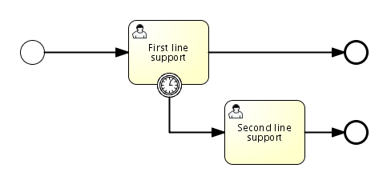


#### XML内容

定时器边界任务定义是一个[正规的边界事件](http://www.mossle.com/docs/activiti/index.html#bpmnBoundaryEvent)。 指定类型的子元素是**timerEventDefinition**元素。

```
<boundaryEvent id="escalationTimer" cancelActivity="true" attachedToRef="firstLineSupport">
   <timerEventDefinition>
    <timeDuration>PT4H</timeDuration>
  </timerEventDefinition>
</boundaryEvent>
```

请参考[定时事件定义](http://www.mossle.com/docs/activiti/index.html#timerEventDefinitions)获得更多定时其配置的细节。

在流程图中，可以看到上述例子中的圆圈边线是虚线：


经典场景是发送一个升级邮件，但是不打断正常流程的执行。

因为BPMN 2.0中，中断和非中断的事件还是有区别的。默认是中断事件。 非中断事件的情况，**不会**中断原始环节，那个环节还停留在原地。 对应的，会创建一个新分支，并沿着事件的流向继续执行。 在XML内容中，要把*cancelActivity*属性设置为false：

```
<boundaryEvent id="escalationTimer" cancelActivity="false" attachedToRef="firstLineSupport"/>
```


**注意：**边界定时事件只能在job执行器启用时使用。 （比如，把`activiti.cfg.xml`中的*jobExecutorActivate* 设置为`true`，因为默认job执行器默认是禁用的）。

#### 边界事件的已知问题

使用边界事件有一个已知的同步问题。 目前，不能边界事件后面不能有多条外出连线 （参考[ACT-47](http://jira.codehaus.org/browse/ACT-47)）。 解决这个问题的方法是在一个连线后使用并发网关。


### 错误边界事件

#### 描述

节点边界上的中间*捕获*错误事件， 或简写成**边界错误事件**， 它会捕获节点范围内抛出的错误。

定义一个边界错误事件，大多用于[内嵌子流程](http://www.mossle.com/docs/activiti/index.html#bpmnSubProcess)， 或[调用节点](http://www.mossle.com/docs/activiti/index.html#bpmnCallActivity)，对于子流程的情况，它会为所有内部的节点创建一个作用范围。 错误是由[错误结束事件](http://www.mossle.com/docs/activiti/index.html#bpmnErrorEndEvent)抛出的。 这个错误会传递给上层作用域，直到找到一个错误事件定义向匹配的边界错误事件。

当捕获了错误事件时，边界任务绑定的节点就会销毁， 也会销毁内部所有的执行分支 （比如，同步节点，内嵌子流程，等等）。 流程执行会继续沿着边界事件的外出连线继续执行。

#### 图形标记

边界错误事件显示成一个普通的中间事件（圆圈内部有一个小圆圈） 放在节点的标记上，内部有一个错误小图标。错误小图标是白色的， 表示它是一个*捕获*事件。


#### Xml内容

边界错误事件定义为普通的[边界事件](http://www.mossle.com/docs/activiti/index.html#bpmnBoundaryEvent)：

```
<boundaryEvent id="catchError" attachedToRef="mySubProcess">
  <errorEventDefinition errorRef="myError"/>
</boundaryEvent>
          
```

和[错误结束事件](http://www.mossle.com/docs/activiti/index.html#bpmnErrorEndEvent)一样， *errorRef*引用了process元素外部的一个错误定义：

```
<error id="myError" errorCode="123" />
...
<process id="myProcess">
...
          
```


**errorCode**用来匹配捕获的错误：

- 如果没有设置*errorRef*，边界错误事件会捕获 **所有错误事件**，无论*错误*的errorCode是什么。
- 如果设置了*errorRef*，并引用了一个已存的*错误*， 边界事件就**只捕获错误代码与之相同的错误**。
- 如果设置了*errorRef*，但是BPMN 2.0中没有定义*错误*， **errorRef就会当做errorCode使用** （和错误结束事件的用法类似）。


#### 实例

下面的流程实例演示了如何使用错误结束事件。 当完成*'审核盈利'*这个用户任务是，如果没有提供足够的信息， 就会抛出错误，错误会被子流程的边界任务捕获， 所有*'回顾销售'*子流程中的所有节点都会销毁。 （即使*'审核客户比率'*还没有完成）， 并创建一个*'提供更多信息'*的用户任务。


这个流程也放在demo中了。流程XML和单元测试可以在 *org.activiti.examples.bpmn.event.error*包下找到。

### 信号边界事件

#### 描述

节点边界的中间*捕获*[信号](http://www.mossle.com/docs/activiti/index.html#bpmnSignalEventDefinition)， 或简称为**边界信号事件**， 它会捕获信号定义引用的相同信号名的信号。

**注意：**与其他事件（比如边界错误事件）不同，边界信号事件不只捕获 它绑定方位的信号。信号事件是一个全局的范围（广播语义），就是说信号可以在任何地方触发， 即便是不同的流程实例。

**注意：**和其他事件（比如边界错误事件）不同，捕获信号后，不会停止信号的传播。 如果你有两个信号边界事件，它们捕获相同的信号事件，两个边界事件都会被触发， 即使它们在不同的流程实例中。

#### 图形标记

边界信号事件显示为普通的中间事件（圆圈里有个小圆圈），位置在节点的边缘， 内部有一个信号小图标。信号图标是白色的（未填充）， 来表示*捕获*的意思。


#### XML内容

边界信号事件定义为普通的[边界事件](http://www.mossle.com/docs/activiti/index.html#bpmnBoundaryEvent)：

```
<boundaryEvent id="boundary" attachedToRef="task" cancelActivity="true">
          <signalEventDefinition signalRef="alertSignal"/>
</boundaryEvent>
                        
```


#### 实例

参考[信号事件定义](http://www.mossle.com/docs/activiti/index.html#bpmnSignalEventDefinition)章节。

### 消息边界事件

#### 描述

节点边界上的中间*捕获*[消息](http://www.mossle.com/docs/activiti/index.html#bpmnMessageEventDefinition)， 或简称**边界消息事件**，根据引用的消息定义捕获相同消息名称的消息。

#### 图形标记

边界消息事件显示成一个普通的中间事件（圆圈里有个小圆圈），位于节点边缘， 内部是一个消息小图标。消息图标是白色（无填充）， 表示*捕获*语义。


注意，边界消息事件可能是中断（右侧）或非中断（左侧）的。

#### XML内容

边界消息事件定义为标准的[边界事件](http://www.mossle.com/docs/activiti/index.html#bpmnBoundaryEvent)：

```
<boundaryEvent id="boundary" attachedToRef="task" cancelActivity="true">
          <messageEventDefinition messageRef="newCustomerMessage"/>
</boundaryEvent>
                        
```


#### 实例

参考[消息事件定义](http://www.mossle.com/docs/activiti/index.html#bpmnMessageEventDefinition)章节。

### 取消边界事件

**[EXPERIMENTAL]**

#### 描述

在事务性子流程的边界上的中间*捕获*取消， 或简称为**边界取消事件 cancel event**， 当事务取消时触发。当取消边界事件触发时，首先中断当前作用域的所有执行。 然后开始补偿事务内的所有激活的补偿边界事件。 补偿是同步执行的。例如，离开事务钱，边界事务会等待补偿执行完毕。 当补偿完成后，事务子流程会沿着取消边界事务的外出连线继续执行。

**注意：**每个事务子流程只能有一个取消边界事件。

**注意：**如果事务子流程包含内嵌子流程，补偿只会触发已经成功完成的子流程。

**注意：**如果取消边界子流程对应的事务子流程配置为多实例， 如果一个实例触发了取消，就会取消所有实例。 instances.

#### 图形标记

取消边界事件显示为了一个普通的中间事件（圆圈里套小圆圈），在节点的边缘， 内部是一个取消小图标。取消图标是白色（无填充）， 表明是*捕获*语义。


#### XML内容

取消边界事件定义为普通[边界事件](http://www.mossle.com/docs/activiti/index.html#bpmnBoundaryEvent)：

```
<boundaryEvent id="boundary" attachedToRef="transaction" >
          <cancelEventDefinition />
</boundaryEvent>
                        
```

因为取消边界事件都是中断的，所以不需要使用`cancelActivity`属性。

### 补偿边界事件

**[EXPERIMENTAL]**

#### 描述

节点边界的中间*捕获*补偿， 或简称为**补偿边界事件**， 可以用来设置一个节点的补偿处理器。

补偿边界事件必须使用直接引用设置唯一的补偿处理器。

补偿边界事件与其他边界事件的策略不同。 其他边界事件（比如信号边界事件）当到达关联的节点就会被激活。 离开节点时，就会挂起，对应的事件订阅也会取消。 补偿边界事件则不同。补偿边界事件在关联的节点**成功完成**时激活。 当补偿事件触发或对应流程实例结束时，事件订阅才会删除。 它遵循如下规则：

- 补偿触发时，补偿边界事件对应的补偿处理器会调用相同次数，根据它对应的节点的成功次数。
- 如果补偿边界事件关联到多实例节点， 补偿事件会订阅每个实例。
- 如果补偿边界事件关联的节点中包含循环， 补偿事件会在每次节点执行时进行订阅。
- 如果流程实例结束，订阅的补偿事件都会结束。


**注意：**补偿边界事件不支持内嵌子流程。

#### 图形标记

补偿边界事件显示为标准中间事件（圆圈里套圆圈），位于节点边缘， 内部有一个补偿小图标。补偿图标是白色的（无填充）， 表示*捕获*语义。另外，下面的图形演示了使用无方向的关联， 为边界事件设置补偿处理器。


#### XML内容

补偿边界事件定义为标准[边界事件](http://www.mossle.com/docs/activiti/index.html#bpmnBoundaryEvent)：

```
<boundaryEvent id="compensateBookHotelEvt" attachedToRef="bookHotel" >
          <compensateEventDefinition />
</boundaryEvent>

<association associationDirection="One" id="a1"  sourceRef="compensateBookHotelEvt" targetRef="undoBookHotel" />

<serviceTask id="undoBookHotel" isForCompensation="true" activiti:class="..." />
```

因为补偿边界事件在节点成功完成后激活， 所以不支持`cancelActivity`属性。

### 中间捕获事件

所有中间捕获事件都使用同样的方式定义：

```
<intermediateCatchEvent id="myIntermediateCatchEvent" >
      <XXXEventDefinition/>
</intermediateCatchEvent>
```


中间捕获事件的定义包括

- 唯一标识（流程范围内）
- 一个结构为*XXXEventDefinition*的XML子元素 （比如*TimerEventDefinition*等） 定义了中间捕获事件的类型。参考特定的捕获事件类型， 获得更多详情。


### 定时中间捕获事件

#### 描述

定时中间事件作为一个监听器。当执行到达捕获事件节点， 就会启动一个定时器。 当定时器触发（比如，一段时间之后），流程就会沿着定时中间事件的外出节点继续执行。

#### 图形标记

定时器中间事件显示成标准中间捕获事件，内部是一个定时器小图标。


#### XML内容

定时器中间事件定义为标准[中间捕获事件](http://www.mossle.com/docs/activiti/index.html#bpmnIntermediateCatchingEvent)。 指定类型的子元素为**timerEventDefinition**元素。

```
        <intermediateCatchEvent id="timer">
            <timerEventDefinition>
                <timeDuration>PT5M</timeDuration>
            </timerEventDefinition>
        </intermediateCatchEvent>
                 
```

参考[定时器事件定义](http://www.mossle.com/docs/activiti/index.html#timerEventDefinitions)了解配置信息。

### 信号中间捕获事件

#### 描述

中间*捕获*[信号](http://www.mossle.com/docs/activiti/index.html#bpmnSignalEventDefinition)事件 通过引用信号定义来捕获相同信号名称的信号。

**注意：**与其他事件（比如错误事件）不同，信号不会在捕获之后被消费。 如果你有两个激活的信号边界事件捕获相同的信号事件，两个边界事件都会被触发， 即便它们在不同的流程实例中。

#### 图形标记

中间信号捕获事件显示为一个普通的中间事件（圆圈套圆圈）， 内部有一个信号小图标。信号小图标是白色的（无填充）， 表示*捕获*语义。


#### XML内容

信号中间事件定义为普通的[中间捕获事件](http://www.mossle.com/docs/activiti/index.html#bpmnIntermediateCatchingEvent)。 对应类型的子元素是**signalEventDefinition**元素。

```
<intermediateCatchEvent id="signal">
        <signalEventDefinition signalRef="newCustomerSignal" />
</intermediateCatchEvent>
                 
```


#### 实例

参考[信号事件定义](http://www.mossle.com/docs/activiti/index.html#bpmnSignalEventDefinition)章节。

### 消息中间捕获事件

#### 描述

一个中间*捕获*[消息](http://www.mossle.com/docs/activiti/index.html#bpmnMessageEventDefinition)事件，捕获特定名称的消息。

#### 图形标记

中间捕获消息事件显示为普通中间事件（圆圈套圆圈）， 内部是一个消息小图标。消息图标是白色的（无填充）， 表示*捕获*语义。

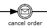


#### XML内容

消息中间事件定义为标准[中间捕获事件](http://www.mossle.com/docs/activiti/index.html#bpmnIntermediateCatchingEvent)。 指定类型的子元素是**messageEventDefinition**元素。

```
<intermediateCatchEvent id="message">
        <messageEventDefinition signalRef="newCustomerMessage" />
</intermediateCatchEvent>
                 
```


#### 实例

参考[消息事件定义](http://www.mossle.com/docs/activiti/index.html#bpmnMessageEventDefinition)章节。

### 内部触发事件

所有内部触发事件的定义都是同样的：

```
<intermediateThrowEvent id="myIntermediateThrowEvent" >
      <XXXEventDefinition/>
</intermediateThrowEvent>
```


内部触发事件定义包含

- 唯一标识（流程范围）
- 使用格式为*XXXEventDefinition*的XML子元素 （比如*signalEventDefinition*等） 定义中间触发事件的类型。 参考对应触发事件的类型，了解更多信息。


### 中间触发空事件

下面的流程图演示了一个空中间触发事件的例子， 它通常用于表示流程中的某个状态。

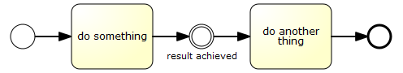

通过添加[执行监听器](http://www.mossle.com/docs/activiti/index.html#)，就可以很好地监控一些KPI。

```
<intermediateThrowEvent id="noneEvent">
  <extensionElements>
    <activiti:executionListener class="org.activiti.engine.test.bpmn.event.IntermediateNoneEventTest$MyExecutionListener" event="start" />
  </extensionElements>
</intermediateThrowEvent>
```

这里你可以添加自己的代码，把事件发送给BAM工具或DWH。引擎不会为这个事件做任何事情， 它直接径直通过。

### 信号中间触发事件

#### 描述

中间*触发*[信号](http://www.mossle.com/docs/activiti/index.html#bpmnSignalEventDefinition)事件为定义的信号抛出一个信号事件。

在activiti中，信号会广播到所有激活的处理器中（比如，所以捕获信号事件）。 信号可以通过同步和异步方式发布。

- 默认配置下，信号是**同步**发送的。就是说， 抛出事件的流程实例会等到信号发送给所有捕获流程实例才继续执行。 捕获流程实例也会在触发流程实例的同一个事务中执行， 意味着如果某个监听流程出现了技术问题（抛出异常），所有相关的实例都会失败。
- 信号也可以**异步**发送。这时它会在到达抛出信号事件后决定哪些处理器是激活的。 对这些激活的处理器，会保存一个异步提醒消息（任务），并发送给jobExecutor。


#### 图形标记

中间信号触发事件显示为普通中间事件（圆圈套圆圈）， 内部又一个信号小图标。信号图标是黑色的（有填充）， 表示*触发*语义。

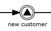


#### XML内容

消息中间事件定义为标准[中间触发事件](http://www.mossle.com/docs/activiti/index.html#)。 指定类型的子元素是**signalEventDefinition**元素。

```
<intermediateThrowEvent id="signal">
        <signalEventDefinition signalRef="newCustomerSignal" />
</intermediateThrowEvent>
                 
```


异步信号事件如下所示：

```
<intermediateThrowEvent id="signal">
        <signalEventDefinition signalRef="newCustomerSignal" activiti:async="true" />
</intermediateThrowEvent>
                 
```


#### 实例

参考[信号事件定义](http://www.mossle.com/docs/activiti/index.html#bpmnSignalEventDefinition)章节。

### 补偿中间触发事件

**[EXPERIMENTAL]**

#### 描述

中间*触发*[补偿](http://www.mossle.com/docs/activiti/index.html#)事件 可以用来触发补偿。

**触发补偿：** 补偿可以由特定节点或包含补偿事件的作用域触发。 补偿是通过分配给节点的补偿处理器来完成的。

- 当补偿由节点触发，对应的补偿处理器会根据节点成功完成的次数执行相同次数。
- 如果补偿由当前作用域触发，当前作用域的所有节点都会执行补偿， 也包含并发分支。
- 补偿的触发是继承式的：如果执行补偿的节点是子流程，补偿会作用到子流程中包含的所有节点。 如果子流程是内嵌节点，补偿会递归触发。 然而，补偿不会传播到流程的上层： 如果补偿在子流程中触发，不会传播到子流程范围外。 bpmn规范定义，由节点触发的流程只会作用到“子流程同一级别”。
- activiti的补偿执行次序与流程执行顺序相反。 以为着最后完成的节点会最先执行补偿，诸如此类。
- 中间触发补偿事件可以用来补偿成功完成的事务性子流程。


**注意：** 如果补偿被一个包含子流程的作用域触发，子流程还包含了关联补偿处理器的节点， 补偿只会传播到子流程，如果它已经成功完成了。 如果子流程中的节点也完成了，并关联了补偿处理器， 如果子流程包含的这些节点还没有完成，就不会执行补偿处理器。 参考下面实例：


这个流程中，我们有两个并发分支，一些分支时内嵌子流程，一个是“使用信用卡”节点。 假设两个分支都启动了，第一个分支等待用户完成“审核预定”任务。第二个分支执行“使用信用卡”节点， 并发生了一个错误，这导致“取消预定”事件，并触发补偿。 这时，并发子流程还没有结束，意味着补偿事件不会传播给子流程， 所以“取消旅店预定”这个补偿处理器不会执行。 如果用户任务（就是内嵌子流程）在“取消预定”之前完成了， 补偿就会传播给内嵌子流程。

**流程变量：** 当补偿内嵌子流程时，用来执行补偿处理器的分支可以访问子流程的本地流程实例， 因为这时它是子流程完成的分支。 为了实现这个功能，流程变量的快照会分配给分支（为执行子流程而创建的分支）。 为此，有以下限制条件：

- 补偿处理器无法访问子流程内部创建的，添加到同步分支的变量。
- 分配给分支的流程变量在继承关系上层的（分配给流程实例的流程变量没有包含在快照中）： 补偿触发时，补偿处理器通过它们所在的地方访问这些流程变量。
- 变量快照只用于内嵌子流程，不适用其他节点。


**已知限制：**

- `waitForCompletion="false"`还不支持。当补偿使用中间触发补偿事件触发时， 事件没有等待，在补偿成功结束后。
- 补偿自己由并发分支执行。并发分支的执行顺序与被补偿的节点完成次序相反。 未来activiti可能支持选项来顺序执行补偿。
- 补偿不会传播给callActivity调用的子流程实例。


#### 图形标记

中间补偿触发事件显示为标准中间事件（圆圈套圆圈）， 内部是一个补偿小图标。补偿图标是黑色的（有填充）， 表示*触发*语义。


#### Xml内容

补偿中间事件定义为普通的[中间触发事件](http://www.mossle.com/docs/activiti/index.html#)。 对应类型的子元素是**compensateEventDefinition**元素。

```
<intermediateThrowEvent id="throwCompensation">
        <compensateEventDefinition />
</intermediateThrowEvent>
```

另外，可选参数`activityRef`可以用来触发特定作用域/节点的补偿：

```
<intermediateThrowEvent id="throwCompensation">
        <compensateEventDefinition activityRef="bookHotel" />
</intermediateThrowEvent>
```


## 顺序流

### 描述

顺序流是连接两个流程节点的连线。 流程执行完一个节点后，会沿着节点的所有外出顺序流继续执行。 就是说，BPMN 2.0默认的行为就是并发的： 两个外出顺序流会创造两个单独的，并发流程分支。

### 图形标记

顺序流显示为从起点到终点的箭头。 箭头总是指向终点。


### XML内容

顺序流需要流程范围内唯一的**id**， 以及对**起点**与 **终点**元素的引用。

```
<sequenceFlow id="flow1" sourceRef="theStart" targetRef="theTask" />
```


### 条件顺序流

#### 描述

可以为顺序流定义一个条件。离开一个BPMN 2.0节点时， 默认会计算外出顺序流的条件。 如果条件结果为*true*, 就会选择外出顺序流继续执行。当多条顺序流被选中时， 就会创建多条*分支*， 流程会继续以并行方式继续执行。

**注意：**上面的讨论仅涉及BPMN 2.0节点（和事件）， 不包括网关。网关会用特定的方式处理顺序流中的条件， 这与网关类型相关。

#### 图形标记

条件顺序流显示为一个正常的顺序流，不过在起点有一个菱形。 条件表达式也会显示在顺序流上。

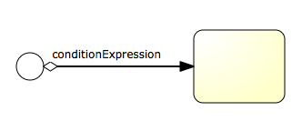


#### XML内容

条件顺序流定义为一个正常的顺序流， 包含**conditionExpression**子元素。 注意目前只支持*tFormalExpressions*， 如果没有设置*xsi:type=""*, 就会默认值支持目前支持的表达式类型。

```
<sequenceFlow id="flow" sourceRef="theStart" targetRef="theTask">
  <conditionExpression xsi:type="tFormalExpression">
    <![CDATA[${order.price > 100 && order.price < 250}]]>
  </conditionExpression>
</sequenceFlow>
```


当前条件表达式**只能使用UEL**， 可以参考[表达式章节](http://www.mossle.com/docs/activiti/index.html#apiExpressions)获取更多信息。 使用的表达式需要返回boolean值，否则会在解析表达式时抛出异常。

- 下面的例子引用了流程变量的数据， 通过getter调用JavaBean。

  

  ```
  <conditionExpression xsi:type="tFormalExpression">
    <![CDATA[${order.price > 100 && order.price < 250}]]>
  </conditionExpression>
  ```

  

- 这个例子通过调用方法返回一个boolean值。

  ```
  <conditionExpression xsi:type="tFormalExpression">
    <![CDATA[${order.isStandardOrder()}]]>
  </conditionExpression>
  ```

  


在activiti发布包中，包含以下流程实例，使用了值和方法表达式 （参考*org.activiti.examples.bpmn.expression)*包）：


### 默认顺序流

#### 描述

所有的BPMN 2.0任务和网关都可以设置一个**默认顺序流**。 只有在节点的其他外出顺序流不能被选中是，才会使用它作为外出顺序流继续执行。 默认顺序流的条件设置不会生效。

#### 图形标记

默认顺序流显示为了普通顺序流，起点有一个“斜线”标记。

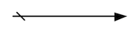


#### XML内容

默认顺序流通过对应节点的**default属性**定义。 下面的XML代码演示了排他网关设置了默认顺序流*flow 2*。 只有当*conditionA*和*conditionB*都返回false时， 才会选择它作为外出连线继续执行。

```
<exclusiveGateway id="exclusiveGw" name="Exclusive Gateway" default="flow2" />
<sequenceFlow id="flow1" sourceRef="exclusiveGw" targetRef="task1">
  <conditionExpression xsi:type="tFormalExpression">${conditionA}</conditionExpression>
</sequenceFlow>
<sequenceFlow id="flow2" sourceRef="exclusiveGw" targetRef="task2"/>
<sequenceFlow id="flow3" sourceRef="exclusiveGw" targetRef="task3">
  <conditionExpression xsi:type="tFormalExpression">${conditionB}</conditionExpression>
</sequenceFlow>
          
```

对应下面的图形显示：


## 网关

网关用来控制流程的流向（或像BPMN 2.0里描述的那样，流程的*tokens*。） 网关可以*消费*也可以*生成*token。

网关显示成菱形图形，内部有有一个小图标。 图标表示网关的类型。


### 排他网关

#### 描述

排他网关（也叫*异或（XOR）网关*，或更技术性的叫法 *基于数据的排他网关*）， 用来在流程中实现**决策**。 当流程执行到这个网关，所有外出顺序流都会被处理一遍。 其中条件解析为true的顺序流（或者没有设置条件，概念上在顺序流上定义了一个*'true'*） 会被选中，让流程继续运行。

**注意这里的外出顺序流 与BPMN 2.0通常的概念是不同的。通常情况下，所有条件结果为true的顺序流 都会被选中，以并行方式执行，但排他网关只会选择一条顺序流执行。 就是说，虽然多个顺序流的条件结果为true， 那么XML中的第一个顺序流（也只有这一条）会被选中，并用来继续运行流程。 如果没有选中任何顺序流，会抛出一个异常。**

#### 图形标记

排他网关显示成一个普通网关（比如，菱形图形）， 内部是一个“X”图标，表示*异或（XOR）*语义。 注意，没有内部图标的网关，默认为排他网关。 BPMN 2.0规范不允许在同一个流程定义中同时使用没有X和有X的菱形图形。


#### XML内容

排他网关的XML内容是很直接的：用一行定义了网关， 条件表达式定义在外出顺序流中。 参考[条件顺序流](http://www.mossle.com/docs/activiti/index.html#bpmnConditionalSequenceFlow) 获得这些表达式的可用配置。

参考下面模型实例：


它对应的XML内容如下：

```
<exclusiveGateway id="exclusiveGw" name="Exclusive Gateway" />

<sequenceFlow id="flow2" sourceRef="exclusiveGw" targetRef="theTask1">
  <conditionExpression xsi:type="tFormalExpression">${input == 1}</conditionExpression>
</sequenceFlow>

<sequenceFlow id="flow3" sourceRef="exclusiveGw" targetRef="theTask2">
  <conditionExpression xsi:type="tFormalExpression">${input == 2}</conditionExpression>
</sequenceFlow>

<sequenceFlow id="flow4" sourceRef="exclusiveGw" targetRef="theTask3">
  <conditionExpression xsi:type="tFormalExpression">${input == 3}</conditionExpression>
</sequenceFlow>
```


### 并行网关

#### 描述

网关也可以表示流程中的并行情况。最简单的并行网关是 **并行网关**，它允许将流程 *分*成多条分支，也可以把多条分支 *汇聚*到一起。 of execution.

并行网关的功能是基于进入和外出的顺序流的：

- **分支：** 并行后的所有外出顺序流，为每个顺序流都创建一个并发分支。
- **汇聚：** 所有到达并行网关，在此等待的进入分支， 直到所有进入顺序流的分支都到达以后， 流程就会通过汇聚网关。

注意，如果同一个并行网关有多个进入和多个外出顺序流， 它就同时具有**分支和汇聚功能**。 这时，网关会先汇聚所有进入的顺序流，然后再切分成多个并行分支。

**与其他网关的主要区别是，并行网关不会解析条件。 即使顺序流中定义了条件，也会被忽略。**

#### 图形标记

并行网关显示成一个普通网关（菱形）内部是一个“加号”图标， 表示“与（AND）”语义。


#### XML内容

定义并行网关只需要一行XML：

```
<parallelGateway id="myParallelGateway" />
```

实际发生的行为（分支，聚合，同时分支聚合）， 要根据并行网关的顺序流来决定。

参考如下代码：

```
    <startEvent id="theStart" />
    <sequenceFlow id="flow1" sourceRef="theStart" targetRef="fork" />

    <parallelGateway id="fork" />
    <sequenceFlow sourceRef="fork" targetRef="receivePayment" />
    <sequenceFlow sourceRef="fork" targetRef="shipOrder" />

    <userTask id="receivePayment" name="Receive Payment" />
    <sequenceFlow sourceRef="receivePayment" targetRef="join" />

    <userTask id="shipOrder" name="Ship Order" />
    <sequenceFlow sourceRef="shipOrder" targetRef="join" />

    <parallelGateway id="join" />
    <sequenceFlow sourceRef="join" targetRef="archiveOrder" />

    <userTask id="archiveOrder" name="Archive Order" />
    <sequenceFlow sourceRef="archiveOrder" targetRef="theEnd" />

    <endEvent id="theEnd" />
```


上面例子中，流程启动之后，会创建两个任务：

```
ProcessInstance pi = runtimeService.startProcessInstanceByKey("forkJoin");
TaskQuery query = taskService.createTaskQuery()
                         .processInstanceId(pi.getId())
                         .orderByTaskName()
                         .asc();

List<Task> tasks = query.list();
assertEquals(2, tasks.size());

Task task1 = tasks.get(0);
assertEquals("Receive Payment", task1.getName());
Task task2 = tasks.get(1);
assertEquals("Ship Order", task2.getName());
```

当两个任务都完成时，第二个并行网关会汇聚两个分支，因为它只有一条外出连线， 不会创建并行分支， 只会创建*归档订单*任务。

注意并行网关不需要是“平衡的”（比如， 对应并行网关的进入和外出节点数目相等）。 并行网关只是等待所有进入顺序流，并为每个外出顺序流创建并发分支， 不会受到其他流程节点的影响。 所以下面的流程在BPMN 2.0中是合法的：

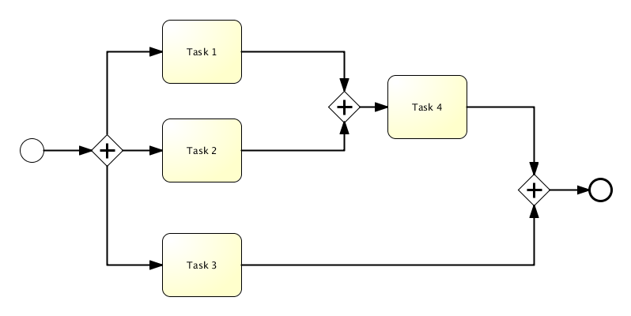


### 包含网关

#### 描述

**包含网关**可以看做是排他网关和并行网关的结合体。 和排他网关一样，你可以在外出顺序流上定义条件，包含网关会解析它们。 但是主要的区别是包含网关可以选择多于一条顺序流，这和并行网关一样。

包含网关的功能是基于进入和外出顺序流的：

- **分支：** 所有外出顺序流的条件都会被解析，结果为true的顺序流会以并行方式继续执行， 会为每个顺序流创建一个分支。
- **汇聚：** 所有并行分支到达包含网关，会进入等待章台， 直到每个包含流程token的进入顺序流的分支都到达。 这是与并行网关的最大不同。换句话说，包含网关只会等待被选中执行了的进入顺序流。 在汇聚之后，流程会穿过包含网关继续执行。

注意，如果同一个包含节点拥有多个进入和外出顺序流， 它就会同时**含有分支和汇聚功能**。 这时，网关会先汇聚所有拥有流程token的进入顺序流， 再根据条件判断结果为true的外出顺序流，为它们生成多条并行分支。

#### 图形标记

并行网关显示为一个普通网关（菱形），内部包含一个圆圈图标。


#### XML内容

定义一个包含网关需要一行XML：

```
<inclusiveGateway id="myInclusiveGateway" />
```

实际的行为（分支，汇聚或同时分支汇聚）， 是由连接在包含网关的顺序流决定的。

参考如下代码：

```
    <startEvent id="theStart" />
    <sequenceFlow id="flow1" sourceRef="theStart" targetRef="fork" />

    <inclusiveGateway id="fork" />
    <sequenceFlow sourceRef="fork" targetRef="receivePayment" >
    <conditionExpression xsi:type="tFormalExpression">${paymentReceived == false}</conditionExpression>
    </sequenceFlow>
    <sequenceFlow sourceRef="fork" targetRef="shipOrder" >
    <conditionExpression xsi:type="tFormalExpression">${shipOrder == true}</conditionExpression>
    </sequenceFlow>

    <userTask id="receivePayment" name="Receive Payment" />
    <sequenceFlow sourceRef="receivePayment" targetRef="join" />

    <userTask id="shipOrder" name="Ship Order" />
    <sequenceFlow sourceRef="shipOrder" targetRef="join" />

    <inclusiveGateway id="join" />
    <sequenceFlow sourceRef="join" targetRef="archiveOrder" />

    <userTask id="archiveOrder" name="Archive Order" />
    <sequenceFlow sourceRef="archiveOrder" targetRef="theEnd" />

    <endEvent id="theEnd" />
```


在上面的例子中，流程开始之后，如果流程变量为paymentReceived == false和shipOrder == true， 就会创建两个任务。如果，只有一个流程变量为true，就会只创建一个任务。 如果没有条件为true，就会抛出一个异常。 如果想避免异常，可以定义一个默认顺序流。下面的例子中，会创建一个任务，发货任务：

```
HashMap<String, Object> variableMap = new HashMap<String, Object>();
          variableMap.put("receivedPayment", true);
          variableMap.put("shipOrder", true);
          ProcessInstance pi = runtimeService.startProcessInstanceByKey("forkJoin");
TaskQuery query = taskService.createTaskQuery()
                         .processInstanceId(pi.getId())
                         .orderByTaskName()
                         .asc();

List<Task> tasks = query.list();
assertEquals(1, tasks.size());

Task task = tasks.get(0);
assertEquals("Ship Order", task.getName());
```

当任务完成后，第二个包含网关会汇聚两个分支， 因为只有一个外出顺序流，所以不会创建并行分支， 只有*归档订单*任务会被激活。

注意，包含网关不需要“平衡”（比如， 对应包含网关的进入和外出数目需要相等）。 包含网关会等待所有进入顺序流完成， 并为每个外出顺序流创建并行分支， 不会受到流程中其他元素的影响。

### 基于事件网关

#### 描述

基于事件网关允许根据事件判断流向。网关的每个外出顺序流都要连接到一个中间捕获事件。 当流程到达一个基于事件网关，网关会进入等待状态：会暂停执行。 与此同时，会为每个外出顺序流创建相对的事件订阅。

注意基于事件网关的外出顺序流和普通顺序流不同。这些顺序流不会真的"执行"。 相反，它们让流程引擎去决定执行到基于事件网关的流程需要订阅哪些事件。 要考虑以下条件：

- 基于事件网关必须有两条或以上外出顺序流。
- 基于事件网关后，只能使用`intermediateCatchEvent`类型。 （activiti不支持基于事件网关后连接ReceiveTask。）
- 连接到基于事件网关的`intermediateCatchEvent`只能有一条进入顺序流。


#### 图形标记

基于事件网关和其他BPMN网关一样显示成一个菱形， 内部包含指定图标。


#### XML内容

用来定义基于事件网关的XML元素是`eventBasedGateway`。

#### 实例

下面的流程是一个使用基于事件网关的例子。当流程执行到基于事件网关时， 流程会暂停执行。与此同时，流程实例会订阅警告信号事件，并创建一个10分钟后触发的定时器。 这会产生流程引擎为一个信号事件等待10分钟的效果。如果10分钟内发出信号，定时器就会取消，流程会沿着信号执行。 如果信号没有出现，流程会沿着定时器的方向前进，信号订阅会被取消。


```
<definitions id="definitions"
        xmlns="http://www.omg.org/spec/BPMN/20100524/MODEL"
        xmlns:activiti="http://activiti.org/bpmn"
        targetNamespace="Examples">

        <signal id="alertSignal" name="alert" />

        <process id="catchSignal">

                <startEvent id="start" />

                <sequenceFlow sourceRef="start" targetRef="gw1" />

                <eventBasedGateway id="gw1" />

                <sequenceFlow sourceRef="gw1" targetRef="signalEvent" />
                <sequenceFlow sourceRef="gw1" targetRef="timerEvent" />

                <intermediateCatchEvent id="signalEvent" name="Alert">
                        <signalEventDefinition signalRef="alertSignal" />
                </intermediateCatchEvent>

                <intermediateCatchEvent id="timerEvent" name="Alert">
                        <timerEventDefinition>
                                <timeDuration>PT10M</timeDuration>
                        </timerEventDefinition>
                </intermediateCatchEvent>

                <sequenceFlow sourceRef="timerEvent" targetRef="exGw1" />
                <sequenceFlow sourceRef="signalEvent" targetRef="task" />

                <userTask id="task" name="Handle alert"/>

                <exclusiveGateway id="exGw1" />

                <sequenceFlow sourceRef="task" targetRef="exGw1" />
                <sequenceFlow sourceRef="exGw1" targetRef="end" />

                <endEvent id="end" />
</process>
</definitions>
```


## 任务

### 用户任务

#### 描述

用户任务用来设置必须由人员完成的工作。 当流程执行到用户任务，会创建一个新任务， 并把这个新任务加入到分配人或群组的任务列表中。

#### 图形标记

用户任务显示成一个普通任务（圆角矩形），左上角有一个小用户图标。


#### XML内容

XML中的用户任务定义如下。*id*属性是必须的。 *name*属性是可选的。

```
<userTask id="theTask" name="Important task" />
                                  
```


用户任务也可以设置描述。实际上所有BPMN 2.0元素都可以设置描述。 添加**documentation**元素可以定义描述。

```
<userTask id="theTask" name="Schedule meeting" >
  <documentation>
          Schedule an engineering meeting for next week with the new hire.
  </documentation>
```

描述文本可以通过标准的java方法来获得：

```
task.getDescription()
```


#### 持续时间

任务可以用一个字段来描述任务的持续时间。可以使用查询API来对持续时间进行搜索， 根据在时间之前或之后进行搜索。

我们提供了一个节点扩展，在任务定义中设置一个表达式， 这样在任务创建时就可以为它设置初始持续时间。表达式**应该是java.util.Date， java.util.String (ISO8601格式)，ISO8601 持续时间 (比如PT50M)或null**。 例如：你可以在流程中使用上述格式输入日期，或在前一个服务任务中计算一个时间。 这里使用了持续时间，持续时间会基于当前时间进行计算，再通过给定的时间段累加。 比如，使用"PT30M"作为持续时间，任务就会从现在开始持续30分钟。

```
<userTask id="theTask" name="Important task" activiti:dueDate="${dateVariable}"/>
```

任务的持续时间也可以通过`TaskService`修改， 或在`TaskListener`中通过传入的`DelegateTask`参数修改。

#### 用户分配

用户任务可以直接分配给一个用户。 这可以通过**humanPerformer**元素定义。 *humanPerformer*定义需要一个 **resourceAssignmentExpression**来实际定义用户。 当前，只支持**formalExpressions**。

```
<process ... >

  ...

  <userTask id='theTask' name='important task' >
    <humanPerformer>
      <resourceAssignmentExpression>
        <formalExpression>kermit</formalExpression>
      </resourceAssignmentExpression>
    </humanPerformer>
  </userTask>
```


**只有一个**用户可以坐拥任务的执行者分配给用户。 在activiti中，用户叫做**执行者**。 拥有执行者的用户不会出现在其他人的任务列表中， 只能出现执行者的**个人任务列表**中。

直接分配给用户的任务可以通过TaskService像下面这样获取：

```
List<Task> tasks = taskService.createTaskQuery().taskAssignee("kermit").list();
```


任务也可以加入到人员的**候选任务列表**中。 这时，需要使用**potentialOwner**元素。 用法和*humanPerformer*元素类似。注意它需要指定表达式中的每个项目是人员还是群组 （引擎猜不出来）。

```
<process ... >

  ...

  <userTask id='theTask' name='important task' >
    <potentialOwner>
      <resourceAssignmentExpression>
        <formalExpression>user(kermit), group(management)</formalExpression>
      </resourceAssignmentExpression>
    </potentialOwner>
  </userTask>
```


使用*potentialOwner*元素定义的任务，可以像下面这样获取 （使用*TaskQuery*的发那个发与查询设置了执行者的任务类似）：

```
 List<Task> tasks = taskService.createTaskQuery().taskCandidateUser("kermit");
```

这会获取所有kermit为**候选人**的任务， 例如：表达式中包含*user(kermit)*。 这也会获得所有**分配包含kermit这个成员的群组** （比如，*group(management)*，前提是kermit是这个组的成员， 并且使用了activiti的账号组件）。 用户所在的群组是在运行阶段获取的，它们可以通过 [IdentityService](http://www.mossle.com/docs/activiti/index.html#apiEngine)进行管理。

如果没有显示指定设置的是用户还是群组， 引擎会默认当做群组处理。所以下面的设置与*使用group(accountancy)*效果一样。

```
<formalExpression>accountancy</formalExpression>
```


#### Activiti对任务分配的扩展

当分配不复杂时，用户和组的设置非常麻烦。 为避免复杂性，可以使用用户任务的[自定义扩展](http://www.mossle.com/docs/activiti/index.html#bpmnCustomExtensions)。


- **assignee属性**：这个自定义扩展可以直接把用户任务分配给指定用户。

  ```
  <userTask id="theTask" name="my task" activiti:assignee="kermit" />
  ```

  它和使用[上面](http://www.mossle.com/docs/activiti/index.html#bpmnUserTaskAssignment)定义的**humanPerformer** 效果完全一样。

- **candidateUsers属性**：这个自定义扩展可以为任务设置候选人。

  ```
  <userTask id="theTask" name="my task" activiti:candidateUsers="kermit, gonzo" />
  ```

  它和使用[上面](http://www.mossle.com/docs/activiti/index.html#bpmnUserTaskAssignment)定义的**potentialOwner** 效果完全一样。 注意它不需要像使用*potentialOwner*通过*user(kermit)*声明， 因为这个属性只能用于人员。

- **candidateGroups属性**：这个自定义扩展可以为任务设置候选组。

  ```
  <userTask id="theTask" name="my task" activiti:candidateGroups="management, accountancy" />
  ```

  它和使用[上面](http://www.mossle.com/docs/activiti/index.html#bpmnUserTaskAssignment)定义的**potentialOwner** 效果完全一样。 注意它不需要像使用*potentialOwner*通过*group(management)*声明， 因为这个属性只能用于群组。

- *candidateUsers* 和 *candidateGroups* 可以同时设置在同一个用户任务中。


注意：虽然activiti提供了一个账号管理组件， 也提供了[IdentityService](http://www.mossle.com/docs/activiti/index.html#apiEngine)， 但是账号组件不会检测设置的用户是否村爱。 它嵌入到应用中，也允许activiti与其他已存的账户管理方案集成。

如果上面的方式还不满足需求，还可以使用创建事件的[任务监听器](http://www.mossle.com/docs/activiti/index.html#taskListeners) 来实现自定义的分配逻辑：

```
<userTask id="task1" name="My task" >
  <extensionElements>
    <activiti:taskListener event="create" class="org.activiti.MyAssignmentHandler" />
  </extensionElements>
</userTask>
```

`DelegateTask`会传递给`TaskListener`的实现， 通过它可以设置执行人，候选人和候选组：

```
public class MyAssignmentHandler implements TaskListener {

  public void notify(DelegateTask delegateTask) {
    // Execute custom identity lookups here

    // and then for example call following methods:
    delegateTask.setAssignee("kermit");
    delegateTask.addCandidateUser("fozzie");
    delegateTask.addCandidateGroup("management");
    ...
  }

}
```


使用spring时，可以使用向上面章节中介绍的自定义分配属性， 使用[表达式](http://www.mossle.com/docs/activiti/index.html#springExpressions) 把[任务监听器](http://www.mossle.com/docs/activiti/index.html#taskListeners)设置为spring代理的bean， 让这个监听器监听任务的*创建*事件。 下面的例子中，执行者会通过调用`ldapService`这个spring bean的`findManagerOfEmployee`方法获得。 流程变量*emp*会作为参数传递给bean。

```
<userTask id="task" name="My Task" activiti:assignee="${ldapService.findManagerForEmployee(emp)}"/>
```

也可以用来设置候选人和候选组：

```
<userTask id="task" name="My Task" activiti:candidateUsers="${ldapService.findAllSales()}"/>
```

注意方法返回类型只能为`String`或`Collection<String>` （对应候选人和候选组）：

```
public class FakeLdapService {

  public String findManagerForEmployee(String employee) {
    return "Kermit The Frog";
  }

  public List<String> findAllSales() {
    return Arrays.asList("kermit", "gonzo", "fozzie");
  }

}
```


### 脚本任务

#### 描述

脚本任务时一个自动节点。当流程到达脚本任务， 会执行对应的脚本。

#### 图形标记

脚本任务显示为标准BPMN 2.0任务（圆角矩形）， 左上角有一个脚本小图标。

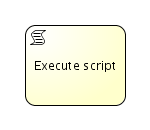


#### XML内容

脚本任务定义需要指定**script** 和**scriptFormat**。

```
<scriptTask id="theScriptTask" name="Execute script" scriptFormat="groovy">
  <script>
    sum = 0
    for ( i in inputArray ) {
      sum += i
    }
  </script>
</scriptTask>
```


**scriptFormat**的值必须兼容 [JSR-223](http://jcp.org/en/jsr/detail?id=223)。 （java平台的脚本语言）。默认Javascript会包含在JDK中，不需要额外的依赖。 如果你想使用其他（JSR-223兼容）的脚本引擎， 需要把对应的jar添加到classpath下，并使用合适的名称。 比如，activiti单元测试经常使用groovy， 因为语法比java简单太多。

注意，groovy脚本引擎放在groovy-all.jar中。在2.0版本之前， 脚本引擎是groovy jar的一部分。这样，需要添加如下依赖：

```
<dependency>
      <groupId>org.codehaus.groovy</groupId>
      <artifactId>groovy-all</artifactId>
      <version>2.x.x<version>
</dependency>
```


#### 脚本中的变量

到达脚本任务的流程可以访问的所有流程变量，都可以在脚本中使用。 实例中，脚本变量*'inputArray'*其实是流程变量 （整数数组）。

```
<script>
    sum = 0
    for ( i in inputArray ) {
      sum += i
    }
</script>
```


也可以在脚本中设置流程变量，直接调用 *execution.setVariable("variableName", variableValue)*。 默认，不会自动保存变量（**注意：activiti 5.12之前存在这个问题**）。 可以在脚本中自动保存任何变量。 （比如上例中的*sum*），只要把`scriptTask` 的`autoStoreVariables`属性设置为`true`。 然而，**最佳实践是不要用它，而是显示调用execution.setVariable()**， 因为一些当前版本的JDK对于一些脚本语言，无法实现自动保存变量。 参考[这里](http://www.jorambarrez.be/blog/2013/03/25/bug-on-jdk-1-7-0_17-when-using-scripttask-in-activiti/)获得更多信息。


```
<scriptTask id="script" scriptFormat="JavaScript" activiti:autoStoreVariables="false">
```

参数默认为`false`，意思是如果没有为脚本任务定义设置参数， 所有声明的变量将只存在于脚本执行的阶段。

如何在脚本中设置变量的例子：

```
<script>
    def scriptVar = "test123"
    execution.setVariable("myVar", scriptVar)
</script>
```


注意：下面这些命名已被占用，**不能用作变量名**： **out, out:print, lang:import, context, elcontext**。

#### 脚本结果

脚本任务的返回值可以通过制定流程变量的名称，分配给已存或一个新流程变量， 使用脚本任务定义的*'activiti:resultVariable'*属性。 任何已存的流程变量都会被脚本执行的结果覆盖。 如果没有指定返回变量名，脚本的返回值会被忽略。

```
<scriptTask id="theScriptTask" name="Execute script" scriptFormat="juel" activiti:resultVariable="myVar">
  <script>#{echo}</script>
</scriptTask>
```

上例中，脚本的结果（表达式*'#{echo}'*的值） 在脚本完成后，会设置到*'myVar'*变量中。

### Java服务任务

#### 描述

java服务任务用来调用外部java类。

#### 图形标记

服务任务显示为圆角矩形，左上角有一个齿轮小图标。


#### XML内容

有4钟方法来声明java调用逻辑：

- 实现JavaDelegate或ActivityBehavior
- 执行解析代理对象的表达式
- 调用一个方法表达式
- 调用一直值表达式

执行一个在流程执行中调用的类， 需要在**'activiti:class'**属性中设置全类名。

```
<serviceTask id="javaService"
             name="My Java Service Task"
             activiti:class="org.activiti.MyJavaDelegate" />
```

参考[*实现*章节](http://www.mossle.com/docs/activiti/index.html#bpmnJavaServiceTaskImplementation) 了解更多使用类的信息。

也可以使用表达式调用一个对象。对象必须遵循一些规则， 并使用`activiti:class`属性进行创建。 （了解[更多](http://www.mossle.com/docs/activiti/index.html#bpmnJavaServiceTaskImplementation)）。

```
 <serviceTask id="serviceTask" activiti:delegateExpression="${delegateExpressionBean}" />
```

这里，`delegateExpressionBean`是一个实现了`JavaDelegate`接口的bean， 它定义在实例的spring容器中。

要指定执行的UEL方法表达式， 需要使用**activiti:expression**。

```
<serviceTask id="javaService"
             name="My Java Service Task"
             activiti:expression="#{printer.printMessage()}" />
```

方法`printMessage`（无参数）会调用 名为`printer`对象的方法。

也可以为表达式中的方法传递参数。

```
<serviceTask id="javaService"
             name="My Java Service Task"
             activiti:expression="#{printer.printMessage(execution, myVar)}" />
```

这会调用名为`printer`对象上的方法`printMessage`。 第一个参数是`DelegateExecution`，在表达式环境中默认名称为`execution`。 第二个参数传递的是当前流程的名为`myVar`的变量。

要指定执行的UEL值表达式， 需要使用**activiti:expression**属性。

```
<serviceTask id="javaService"
             name="My Java Service Task"
             activiti:expression="#{split.ready}" />
```

`ready`属性的getter方法，`getReady`（无参数）， 会作用于名为`split`的bean上。 这个对象会被解析为流程对象和 （如果合适）spring环境中的对象。

#### 实现

要在流程执行中实现一个调用的类，这个类需要实现*org.activiti.engine.delegate.JavaDelegate*接口， 并在*execute*方法中提供对应的业务逻辑。 当流程执行到特定阶段，它会指定方法中定义好的业务逻辑， 并按照默认BPMN 2.0中的方式离开节点。

让我们创建一个java类的例子，它可以流程变量中字符串转换为大写。 这个类需要实现*org.activiti.engine.delegate.JavaDelegate*接口， 这要求我们实现*execute(DelegateExecution)*方法。 它包含的业务逻辑会被引擎调用。流程实例信息，如流程变量和其他信息， 可以通过 [DelegateExecution](http://activiti.org/javadocs/org/activiti/engine/delegate/DelegateExecution.html) 接口访问和操作（点击对应操作的javadoc的链接，获得更多信息）。

```
public class ToUppercase implements JavaDelegate {

  public void execute(DelegateExecution execution) throws Exception {
    String var = (String) execution.getVariable("input");
    var = var.toUpperCase();
    execution.setVariable("input", var);
  }

}
```


注意：**serviceTask定义的class只会创建一个java类的实例**。 所有流程实例都会共享相同的类实例，并调用*execute(DelegateExecution)*。 这意味着，类不能使用任何成员变量，必须是线程安全的，它必须能模拟在不同线程中执行。 这也影响着[属性注入](http://www.mossle.com/docs/activiti/index.html#serviceTaskFieldInjection)的处理方式。

流程定义中引用的类（比如，使用`activiti:class`）**不会 在部署时实例化**。只有当流程第一次执行到使用类的时候， 类的实例才会被创建。如果找不到类，会抛出一个`ActivitiException`。 这个原因是部署环境（更确切是的*classpath*）和真实环境往往是不同的。 比如当使用*ant*或业务归档上传到Activiti Explorer来发布流程 classpath没有包含引用的类。

[**[内部：非公共实现类\]**](http://www.mossle.com/docs/activiti/index.html#internal) 也可以提供实现 *org.activiti.engine.impl.pvm.delegate.ActivityBehavior*接口的类。 实现可以访问更强大的*ActivityExecution*, 它可以影响流程的流向。注意，这不是一个很好的实践， 应该尽量避免。所以，建议只有在高级情况下并且你确切知道你要做什么的情况下， 再使用*ActivityBehavior*接口。

#### 属性注入

可以为代理类的属性注入数据。支持如下类型的注入：

- 固定的字符串
- 表达式


如果有效的话，数值会通过代理类的setter方法注入，遵循java bean的命名规范（比如`fistName`属性对应`setFirstName(...)`方法）。 如果属性没有对应的setter方法，数值会直接注入到私有属性中。 一些环境的SecurityManager不允许修改私有属性，所以最好还是把你想注入的属性暴露出对应的setter方法来。 **无论流程定义中的数据是什么类型，注入目标的属性类型都应该是 org.activiti.engine.delegate.Expression。**

下面代码演示了如何把一个常量注入到属性中。 属性注入可以使用*'class'*属性。 注意我们需要**定义一个'extensionElements' XML元素， 在声明实际的属性注入之前**，这是BPMN 2.0 XML格式要求的。

```
<serviceTask id="javaService"
    name="Java service invocation"
    activiti:class="org.activiti.examples.bpmn.servicetask.ToUpperCaseFieldInjected">
    <extensionElements>
      <activiti:field name="text" stringValue="Hello World" />
  </extensionElements>
</serviceTask>
          
```

`ToUpperCaseFieldInjected`类有一个`text`属性， 类型是`org.activiti.engine.delegate.Expression`。 调用`text.getValue(execution)`时，会返回定义的字符串`Hello World`。

也可以使用长文字（比如，内嵌的email），可以使用*'activiti:string'*子元素：

```
<serviceTask id="javaService"
    name="Java service invocation"
    activiti:class="org.activiti.examples.bpmn.servicetask.ToUpperCaseFieldInjected">
  <extensionElements>
    <activiti:field name="text">
        <activiti:string>
          Hello World
      </activiti:string>
    </activiti:field>
  </extensionElements>
</serviceTask>
          
```


可以使用表达式，实现在运行期动态解析注入的值。这些表达式可以使用流程变量或spring定义的bean（如果使用了spring）。 像[服务任务实现](http://www.mossle.com/docs/activiti/index.html#bpmnJavaServiceTaskImplementation)里说的那样，服务任务中的java类实例会在所有流程实例中共享。 为了动态注入属性的值，我们可以在`org.activiti.engine.delegate.Expression`中使用值和方法表达式， 它会使用传递给`execute`方法的`DelegateExecution`参数进行解析。

```
<serviceTask id="javaService" name="Java service invocation"
  activiti:class="org.activiti.examples.bpmn.servicetask.ReverseStringsFieldInjected">

  <extensionElements>
    <activiti:field name="text1">
      <activiti:expression>${genderBean.getGenderString(gender)}</activiti:expression>
    </activiti:field>
    <activiti:field name="text2">
       <activiti:expression>Hello ${gender == 'male' ? 'Mr.' : 'Mrs.'} ${name}</activiti:expression>
    </activiti:field>
  </ extensionElements>
</ serviceTask>
```


下面的例子中，注入了表达式，并使用在传入的当前`DelegateExecution`解析它们。 完整代码可以参考`org.activiti.examples.bpmn.servicetask.JavaServiceTaskTest.testExpressionFieldInjection`。

```
public class ReverseStringsFieldInjected implements JavaDelegate {

  private Expression text1;
  private Expression text2;

  public void execute(DelegateExecution execution) {
    String value1 = (String) text1.getValue(execution);
    execution.setVariable("var1", new StringBuffer(value1).reverse().toString());

    String value2 = (String) text2.getValue(execution);
    execution.setVariable("var2", new StringBuffer(value2).reverse().toString());
  }
}
```


另外，你也可以把表达式设置成一个属性，而不是字元素，让XML更简单一些。

```
<activiti:field name="text1" expression="${genderBean.getGenderString(gender)}" />
<activiti:field name="text1" expression="Hello ${gender == 'male' ? 'Mr.' : 'Mrs.'} ${name}" />
```


**因为java类实例会被重用，注入只会发生一次，当服务任务调用第一次的时候。 当你的代码中的属性改变了，值也不会重新注入， 所以你应该把它们看做是不变的，不用修改它们。**

#### 服务任务结果

服务流程返回的结果（使用表达式的服务任务）可以分配给已经存在的或新的流程变量， 可以通过指定服务任务定义的*'activiti:resultVariable'*属性来实现。 指定的路程比那两的值会被服务流程的返回结果覆盖。 如果没有指定返回变量名，就会忽略返回结果。

```
<serviceTask id="aMethodExpressionServiceTask"
    activiti:expression="#{myService.doSomething()}"
    activiti:resultVariable="myVar" />
```

在上面的例子中，服务流程的返回值（在*'myService'*上调用*'doSomething()'*方法的返回值， myService可能是流程变量，也可能是spring的bean），会设置到名为*'myVar'*的流程变量里， 在服务执行完成之后。

#### 处理异常

执行自定义逻辑时，常常需要捕获对应的业务异常，在流程内部进行处理。 activiti提供了不同的方式来处理这个问题。

##### 抛出BPMN Errors

可以在服务任务或脚本任务的代码里抛出BPMN error。 为了实现这个，要从JavaDelegate，脚本，表达式和代理表达式中抛出名为 *BpmnError*的特殊ActivitiExeption。 引擎会捕获这个异常，把它转发到对应的错误处理中。 比如，边界错误事件或错误事件子流程。

```
public class ThrowBpmnErrorDelegate implements JavaDelegate {

  public void execute(DelegateExecution execution) throws Exception {
    try {
      executeBusinessLogic();
    } catch (BusinessException e) {
      throw new BpmnError("BusinessExceptionOccured");
    }
  }

}
```

构造参数是错误代码，会被用来决定 哪个错误处理器会来响应这个错误。 参考[边界错误事件](http://www.mossle.com/docs/activiti/index.html#bpmnBoundaryErrorEvent) 获得更多捕获BPMN error的信息。

这个机制应该**只用于业务失败**， 它应该被流程定义中设置的边界错误事件或错误事件子流程处理。 技术上的错误应该使用其他异常类型，通常不会在流程里处理。

##### 异常顺序流

[**[内部，公开实现类\]** ](http://www.mossle.com/docs/activiti/index.html#internal)另一种选择是在一些异常发生时，让路程进入其他路径。 下面的代码演示了如何实现。

```
<serviceTask id="javaService"
  name="Java service invocation"
  activiti:class="org.activiti.ThrowsExceptionBehavior">
</serviceTask>

<sequenceFlow id="no-exception" sourceRef="javaService" targetRef="theEnd" />
<sequenceFlow id="exception" sourceRef="javaService" targetRef="fixException" />
```

这里的服务任务有两个外出顺序流，分别叫`exception`和 `no-exception`。异常出现时会使用顺序流的id来决定流向：

```
public class ThrowsExceptionBehavior implements ActivityBehavior {

  public void execute(ActivityExecution execution) throws Exception {
    String var = (String) execution.getVariable("var");

    PvmTransition transition = null;
    try {
      executeLogic(var);
      transition = execution.getActivity().findOutgoingTransition("no-exception");
    } catch (Exception e) {
      transition = execution.getActivity().findOutgoingTransition("exception");
    }
    execution.take(transition);
  }

}
```


#### 在JavaDelegate里使用activiti服务

一些场景下，需要在java服务任务中使用activiti服务 （比如，通过RuntimeService启动流程实例，而callActivity不满足你的需求）。 *org.activiti.engine.delegate.DelegateExecution*允许通过*org.activiti.engine.EngineServices*接口直接获得这些服务：

```
public class StartProcessInstanceTestDelegate implements JavaDelegate {

  public void execute(DelegateExecution execution) throws Exception {
    RuntimeService runtimeService = execution.getEngineServices().getRuntimeService();
    runtimeService.startProcessInstanceByKey("myProcess");
  }

}
            
```

所有activiti服务的API都可以通过这个接口获得。

使用这些API调用出现的所有数据改变，都是在当前事务中的。 在像spring和CDI这样的依赖注入环境也会起作用，无论是否启用了JTA数据源。 比如，下面的代码功能与上面的代码一致， 这是RuntimeService是通过依赖注入获得的，而不是通过*org.activiti.engine.EngineServices*接口。

```
@Component("startProcessInstanceDelegate")
public class StartProcessInstanceTestDelegateWithInjection {

    @Autowired
    private RuntimeService runtimeService;

    public void startProcess() {
      runtimeService.startProcessInstanceByKey("oneTaskProcess");
    }

}
            
```


**重要技术提示：**因为服务调用是在当前事务里， 数据的产生或改变，在服务任务执行完*之前*，还没有提交到数据库。 所有API对于数据库数据的操作，意味着未提交的操作在服务任务的API调用中都是不可见的。

### Web Service任务

**[EXPERIMENTAL]**

#### 描述

Web Service任务可以用来同步调用一个外部的Web service。

#### 图形标记

Web Service任务与Java服务任务显示效果一样。


#### XML内容

要使用Web Service我们需要导入它的操作和类型。 可以自动使用import标签来指定Web Service的WSDL：

```
<import importType="http://schemas.xmlsoap.org/wsdl/"
        location="http://localhost:63081/counter?wsdl"
        namespace="http://webservice.activiti.org/" />
```

上面的声明告诉activiti导入WSDL定义，但没有创建item定义和消息。 假设我们想调用一个名为'prettyPrint'的方法， 我们必须创建为请求和响应信息对应的消息和item定义：

```
<message id="prettyPrintCountRequestMessage" itemRef="tns:prettyPrintCountRequestItem" />
<message id="prettyPrintCountResponseMessage" itemRef="tns:prettyPrintCountResponseItem" />

<itemDefinition id="prettyPrintCountRequestItem" structureRef="counter:prettyPrintCount" />
<itemDefinition id="prettyPrintCountResponseItem" structureRef="counter:prettyPrintCountResponse" />
```

在申请服务任务之前，我们必须定义实际引用Web Service的BPMN接口和操作。 基本上，我们定义接口和必要的操作。对每个奥做我们都会重用上面定义的信息作为输入和输出。 比如，下面定义了'counter'接口和'prettyPrintCountOperation'操作：

```
<interface name="Counter Interface" implementationRef="counter:Counter">
        <operation id="prettyPrintCountOperation" name="prettyPrintCount Operation"
                        implementationRef="counter:prettyPrintCount">
                <inMessageRef>tns:prettyPrintCountRequestMessage</inMessageRef>
                <outMessageRef>tns:prettyPrintCountResponseMessage</outMessageRef>
        </operation>
</interface>
```

然后我们可以定义Web Service任务使用##WebService实现， 并引用Web Service操作。

```
<serviceTask id="webService"
        name="Web service invocation"
        implementation="##WebService"
        operationRef="tns:prettyPrintCountOperation">
```

#### Web Service任务IO规范

除非我们使用简化方式处理数据输入和输出关联（如下所示），每个Web Service任务可以定义任务的输入输出IO规范。 配置方式与BPMN 2.0完全兼容，下面格式化后的例子，我们根据之前定义item定义，定义了输入和输出。

```
<ioSpecification>
        <dataInput itemSubjectRef="tns:prettyPrintCountRequestItem" id="dataInputOfServiceTask" />
        <dataOutput itemSubjectRef="tns:prettyPrintCountResponseItem" id="dataOutputOfServiceTask" />
        <inputSet>
                <dataInputRefs>dataInputOfServiceTask</dataInputRefs>
        </inputSet>
        <outputSet>
                <dataOutputRefs>dataOutputOfServiceTask</dataOutputRefs>
        </outputSet>
</ioSpecification>
```

#### Web Service任务数据输入关联

有两种方式指定数据输入关联：

- 使用表达式
- 使用简化方式

要使用表达式指定数据输入关联，我们需要定义来源和目的item，并指定每个item属性之间的对应关系。 下面的例子中我们分配了这些item的前缀和后缀：

```
<dataInputAssociation>
        <sourceRef>dataInputOfProcess</sourceRef>
        <targetRef>dataInputOfServiceTask</targetRef>
        <assignment>
                <from>${dataInputOfProcess.prefix}</from>
                <to>${dataInputOfServiceTask.prefix}</to>
        </assignment>
        <assignment>
                <from>${dataInputOfProcess.suffix}</from>
                <to>${dataInputOfServiceTask.suffix}</to>
        </assignment>
</dataInputAssociation>
```

另外，我们可以使用更简单的简化方式。'sourceRef'元素是activiti的变量名， 'targetRef'元素是item定义的一个属性。在下面的例子中，我们把'PrefixVariable'变量的值分配给'field'属性， 把'SuffixVariable'变量的值分配给'suffix'属性。

```
<dataInputAssociation>
        <sourceRef>PrefixVariable</sourceRef>
        <targetRef>prefix</targetRef>
</dataInputAssociation>
<dataInputAssociation>
        <sourceRef>SuffixVariable</sourceRef>
        <targetRef>suffix</targetRef>
</dataInputAssociation>
```

#### Web Service任务数据输出关联

有两种方式指定数据输出关联：

- 使用表达式
- 使用简化方式

要使用表达式指定数据输出关联，我们需要定义目的变量和来源表达式。 方法和数据输入关联完全一样：

```
<dataOutputAssociation>
        <targetRef>dataOutputOfProcess</targetRef>
        <transformation>${dataOutputOfServiceTask.prettyPrint}</transformation>
</dataOutputAssociation>
```

另外，我们可以使用更简单的简化方式。'sourceRef'元素是item定义的一个属性， 'targetRef'元素是activiti的变量名。 方法和数据输入关联完全一样：

```
<dataOutputAssociation>
        <sourceRef>prettyPrint</sourceRef>
        <targetRef>OutputVariable</targetRef>
</dataOutputAssociation>
```

### 业务规则任务

**[EXPERIMENTAL]**

#### 描述

业务规则用户用来同步执行一个或多个规则。activiti使用drools规则引擎执行业务规则。 目前，包含业务规则的.drl文件必须和流程定义一起发布，流程定义里包含了执行这些规则的业务规则任务。 意味着流程使用的所有.drl文件都必须打包在流程BAR文件里，比如任务表单。 更多使用Drools Expert创建业务规则的信息，请参考[JBoss Drools](http://www.jboss.org/drools/documentation)的文档。

如果想要使用你的规则任务的实现，比如，因为你想用不同方式使用drools，或你想使用完全不同的规则引擎， 你可以使用BusinessRuleTask上的class或表达式属性，它用起来就和 [ServiceTask](http://www.mossle.com/docs/activiti/index.html#bpmnJavaServiceTask)一样。

#### 图形标记

业务规则任务使用一个表格小图标进行显示。


#### XML内容

要执行部署流程定义的BAR文件中的一个或多个业务规则，我们需要定义输入和输出变量。 对于输入变量定义，可以使用逗号分隔的一些流程变量。 输出变量定义智能包含一个变量名，，它会把执行业务规则后返回的对象保存到对应的流程变量中。 注意，结果变量会包含一个对象列表。如果没有指定输出变量名称，默认会使用 org.activiti.engine.rules.OUTPUT。

下面的业务规则任务会执行和流程定义一起部署的素有业务规则：

```
<process id="simpleBusinessRuleProcess">

  <startEvent id="theStart" />
  <sequenceFlow sourceRef="theStart" targetRef="businessRuleTask" />

  <businessRuleTask id="businessRuleTask" activiti:ruleVariablesInput="${order}"
      activiti:resultVariable="rulesOutput" />

  <sequenceFlow sourceRef="businessRuleTask" targetRef="theEnd" />

  <endEvent id="theEnd" />

</process>
                          
```


业务规则任务也可以配置成只执行部署的.drl文件中的一些规则。 这时要设置逗号分隔的规则名。

```
<businessRuleTask id="businessRuleTask" activiti:ruleVariablesInput="${order}"
      activiti:rules="rule1, rule2" />
                          
```

这时，只会执行rule1和rule2。

你也可以定义哪些规则不用执行。

```
<businessRuleTask id="businessRuleTask" activiti:ruleVariablesInput="${order}"
      activiti:rules="rule1, rule2" exclude="true" />
                          
```

这时除了rule1和rule2以外，所有部署到流程定义同一个BAR文件中的规则都会执行。

像之前提到的，可以用一个选项修改BusinessRuleTask的实现：

```
<businessRuleTask id="businessRuleTask" activiti:class="${MyRuleServiceDelegate}" />
                          
```

注意BusinessRuleTask的功能和ServiceTask一样，但是我们使用BusinessRuleTask的图标来表示 我们在这里要执行业务规则。

### 邮件任务

activiti强化了业务流程，支持了自动邮件任务，它可以发送邮件给一个或多个参与者， 包括支持cc, bcc, HTML内容等等。 注意邮件任务**不是**BPMN 2.0规范定义的官方任务。 （它也没有对应的图标）。 因此，activiti中邮件任务是用专门的服务任务实现的。

#### 邮件服务器配置

activiti引擎要通过支持SMTP功能的外部邮件服务器发送邮件。 为了实际发送邮件，引擎穾知道如何访问邮件服务器。 下面的配置可以设置到*activiti.cfg.xml*配置文件中：


**Table 8.1. 邮件服务器配置**

| 属性                  | 是否必须                 | 描述                                                         |
| --------------------- | ------------------------ | ------------------------------------------------------------ |
| mailServerHost        | 否                       | 邮件服务器的主机名（比如：mail.mycorp.com）。默认为`localhost` |
| mailServerPort        | 是，如果没有使用默认端口 | 邮件服务器上的SMTP传输端口。默认为*25*                       |
| mailServerDefaultFrom | 否                       | 如果用户没有指定发送邮件的邮件地址，默认设置的发送者的邮件地址。默认为*activiti@activiti.org* |
| mailServerUsername    | 如果服务器需要           | 一些邮件服务器需要认证才能发送邮件。默认不设置。             |
| mailServerPassword    | 如果服务器需要           | 一些邮件服务器需要认证才能发送邮件。默认不设置。             |
| mailServerUseSSL      | 如果服务器需要           | 一些邮件服务器需要ssl交互。默认为false。                     |
| mailServerUseTLS      | 如果服务器需要           | 一些邮件服务器（比如gmail）需要支持TLS。默认为false。        |


#### 定义一个邮件任务

邮件任务是一个专用的[服务任务](http://www.mossle.com/docs/activiti/index.html#bpmnJavaServiceTask)， 这个服务任务的*type*设置为*'mail'*。

```
<serviceTask id="sendMail" activiti:type="mail">
                      
```


邮件任务是通过[属性注入](http://www.mossle.com/docs/activiti/index.html#serviceTaskFieldInjection)进行配置的。 所有这些属性都可以使用EL表达式，可以在流程执行中解析。 下面的属性都可以设置：


**Table 8.2. 邮件服务器配置**

| 属性                  | 是否必须 | 描述                                                         |
| --------------------- | -------- | ------------------------------------------------------------ |
| to                    | 是       | 邮件的接受者。可以使用逗号分隔多个接受者                     |
| from                  | 否       | 邮件发送者的地址。如果不提供，会使用[默认配置](http://www.mossle.com/docs/activiti/index.html#bpmnEmailTaskServerConfiguration)的地址。 |
| subject               | 否       | 邮件的主题                                                   |
| cc                    | 否       | 邮件抄送人。可以使用逗号分隔多个接收者                       |
| bcc                   | 否       | 邮件暗送人。可以使用逗号分隔多个接收者                       |
| charset               | 否       | 可以修改邮件的字符集，对很多非英语语言是必须设置的。         |
| html                  | 否       | 作为邮件内容的HTML。                                         |
| text                  | 否       | 邮件的内容，在需要使用原始文字（非富文本）的邮件时使用。 可以与*html*一起使用，对于不支持富客户端的邮件客户端。 客户端会降级到仅显示文本的方式。 |
| htmlVar               | 否       | 使用对应的流程变量作为e-mail的内容。它和html的不同之处是它内容中包含的表达式会在mail任务发送之前被替换掉。 |
| textVar               | 否       | 使用对应的流程变量作为e-mail的纯文本内容。它和html的不同之处是它内容中包含的表达式会在mail任务发送之前被替换掉。 |
| ignoreException       | 否       | 处理邮件失败时，是否忽略异常，不抛出ActivitiException，默认为false。 |
| exceptionVariableName | 否       | 当设置了*ignoreException = true*处理email时不抛出异常，可以指定一个变量名来存储失败信息。 |


#### 使用实例

下面的XML演示了使用邮件任务的例子。

```
<serviceTask id="sendMail" activiti:type="mail">
  <extensionElements>
    <activiti:field name="from" stringValue="order-shipping@thecompany.com" />
    <activiti:field name="to" expression="${recipient}" />
    <activiti:field name="subject" expression="Your order ${orderId} has been shipped" />
    <activiti:field name="html">
      <activiti:expression>
        <![CDATA[
          <html>
            <body>
              Hello ${male ? 'Mr.' : 'Mrs.' } ${recipientName},<br/><br/>

              As of ${now}, your order has been <b>processed and shipped</b>.<br/><br/>

              Kind regards,<br/>

              TheCompany.
            </body>
          </html>
        ]]>
      </activiti:expression>
    </activiti:field>
  </extensionElements>
</serviceTask>
                      
```

结果如下：


### Mule任务

mule任务可以向mule发送消息，以强化activiti的集成能力。 注意mule任务**不是**BPMN 2.0规范定义的官方任务。 （它也没有对应的图标）。 因此，activiti中mule任务是用专门的服务任务实现的。

#### 定义一个mule任务

mule任务是一个专用的[服务任务](http://www.mossle.com/docs/activiti/index.html#bpmnJavaServiceTask)， 这个服务任务的*type*设置为*'mule'*。

```
<serviceTask id="sendMule" activiti:type="mule">
                      
```


mule任务是通过[属性注入](http://www.mossle.com/docs/activiti/index.html#serviceTaskFieldInjection)进行配置的。 所有这些属性都可以使用EL表达式，可以在流程执行中解析。 下面的属性都可以设置：


**Table 8.3. Mule服务器配置**

| 属性              | 是否必须 | 描述                                                    |
| ----------------- | -------- | ------------------------------------------------------- |
| endpointUrl       | 是       | 希望调用的Mule终端                                      |
| language          | 是       | 你要使用解析荷载表达式（payloadExpression）属性的语言。 |
| payloadExpression | 是       | 作为消息荷载的表达式。                                  |
| resultVariable    | 否       | 将要保存调用结果的变量名称。                            |


#### 应用实例

下面是一个使用mule任务的例子。

```
  <extensionElements>
    <activiti:field name="endpointUrl">
      <activiti:string>vm://in</activiti:string>
    </activiti:field>
    <activiti:field name="language">
      <activiti:string>juel</activiti:string>
    </activiti:field>
    <activiti:field name="payloadExpression">
      <activiti:string>"hi"</activiti:string>
    </activiti:field>
    <activiti:field name="resultVariable">
      <activiti:string>theVariable</activiti:string>
    </activiti:field>
  </extensionElements>
                      
```


### Camel任务

Camel任务可以从Camel发送和介绍消息，由此强化了activiti的集成功能。 注意camel任务**不是**BPMN 2.0规范定义的官方任务。 （它也没有对应的图标）。 在activiti中，camel任务时由专用的服务任务实现的。 要使用camel任务功能时，也要记得吧activiti camel包含到项目里。

#### 定义camel任务

camel任务是一个专用的[服务任务](http://www.mossle.com/docs/activiti/index.html#bpmnJavaServiceTask)， 这个服务任务的*type*设置为*'camel'*。

```
<serviceTask id="sendCamel" activiti:type="camel">
          
```


流程定义只需要在服务任务中定义camel类型。 集成逻辑都会代理给camel容器。默认activiti引擎会在spring容器中查找camelContext bean。 camelContext定义了camel容器加载的路由规则。下面的例子中路由规则是从指定的java包下加载的。 但是你也可以通过spring配置直接定义路由规则。

```
<camelContext id="camelContext" xmlns="http://camel.apache.org/schema/spring">
  <packageScan>
    <package>org.activiti.camel.route</package>
  </packageScan>
</camelContext>
```


如果想了解更多关于camel路由的信息，可以访问[Camel的网站](http://camel.apache.org/)。 在这里只通过很小的例子演示了基础的概念。 在第一个例子中，我们会通过activiti工作流实现最简单的Camel调用。我们称其为SimpleCamelCall。

如果想定义多个Camel环境bean，并且（或者）想使用不同的bean名称，可以重载CamelTask的定义，如下所示：

```
<serviceTask id="serviceTask1" activiti:type="camel">
        <extensionElements>
                <activiti:field name="camelContext" stringValue="customCamelContext" />
        </extensionElements>
</serviceTask>
                
```


#### 简单Camel调用

这个例子对应的文件都可以在activiti camel模块的org.activiti.camel.examples.simpleCamelCall包下找到。我们的目标是简单激活一个特定的camel路由。 首先，我们需要一个Spring环境，它要包含之前介绍的路由。这些文件的目的如下：

```
<camelContext id="camelContext" xmlns="http://camel.apache.org/schema/spring">
        <packageScan>
                <package>org.activiti.camel.examples.simpleCamelCall</package>
        </packageScan>
</camelContext>
         
```

包含名为SimpleCamelCallRoute的路由的类文件，放在PackageScan标签的扫描目录下。 下面就是路由的定义：

```
public class SimpleCamelCallRoute extends RouteBuilder {

  @Override
  public void configure() throws Exception {

          from("activiti:SimpleCamelCallProcess:simpleCall").to("log: org.activiti.camel.examples.SimpleCamelCall");
  }
}
```

这个规则仅仅打印消息体，不会做其他事情。注意终端的格式。它包含三部分：


**Table 8.4. 终端URL：**

| 部分                   | 说明              |
| ---------------------- | ----------------- |
| 终端URL                | 引用activiti终端  |
| SimpleCamelCallProcess | 流程名            |
| simpleCall             | 流程中的Camel服务 |

OK，我们的规则已经配置好，也可以让Camel使用了。 现在看工作流部分。工作流看起来像这样：

```
<process id="SimpleCamelCallProcess">
        <startEvent id="start"/>
        <sequenceFlow id="flow1" sourceRef="start" targetRef="simpleCall"/>
                
        <serviceTask id="simpleCall" activiti:type="camel"/>
                
        <sequenceFlow id="flow2" sourceRef="simpleCall" targetRef="end"/>
        <endEvent id="end"/>
</process>
          
```

在serviceTask部分，它只注明服务的类型是Camel，目标规则名为simpleCall。这与上面的activiti终端相匹配。初始化流程后，我们会看到一个空的日志。 好，我们已经完成了这个最简单的例子了。

#### 乒乓实例

我们的例子成功执行了，但是Camel和Activiti之间没有任何交互，而且这样做也没有任何优势。在这个例子里，我们尝试向Camel发送和接收数据。 我们发送一个字符串，camel进行一些处理，然后返回结果。 发送部分很简单，我们把变量里的消息发送给camel。这里是我们的调用代码：

```
@Deployment
public void testPingPong() {
  Map<String, Object> variables = new HashMap<String, Object>();

  variables.put("input", "Hello");
  Map<String, String> outputMap = new HashMap<String, String>();
  variables.put("outputMap", outputMap);

  runtimeService.startProcessInstanceByKey("PingPongProcess", variables);
  assertEquals(1, outputMap.size());
  assertNotNull(outputMap.get("outputValue"));
  assertEquals("Hello World", outputMap.get("outputValue"));
}
        
```

变量"input"是Camel规则的实际输入，outputMap会记录camel返回的结果。流程应该像是这样：

```
<process id="PingPongProcess">
  <startEvent id="start"/>
  <sequenceFlow id="flow1" sourceRef="start" targetRef="ping"/>
  <serviceTask id="ping" activiti:type="camel"/>
  <sequenceFlow id="flow2" sourceRef="ping" targetRef="saveOutput"/>
  <serviceTask id="saveOutput"  activiti:class="org.activiti.camel.examples.pingPong.SaveOutput" />
  <sequenceFlow id="flow3" sourceRef="saveOutput" targetRef="end"/>
  <endEvent id="end"/>
</process>
    
```

注意，SaveOuput这个serviceTask，会把"Output"变量的值从上下文保存到上面提到的OutputMap中。 现在，我们必须了解变量是如何发送给Camel，再返回的。这里就要涉及到camel实际执行的行为了。 变量提交给camel的方法是由CamelBehavior控制的。这里我们使用默认的配置，其他的会在后面提及。 使用这些代码，我们就可以配置一个期望的camel行为：

```
<serviceTask id="serviceTask1" activiti:type="camel">
  <extensionElements>
    <activiti:field name="camelBehaviorClass" stringValue="org.activiti.camel.impl.CamelBehaviorCamelBodyImpl" />
  </extensionElements>
</serviceTask>
        
```

如果你没有特别指定一个行为，就会使用org.activiti.camel.impl.CamelBehaviorDefaultImpl。 这个行为会把变量复制成名称相同的Camel属性。 在返回时，无论选择什么行为，如果camel消息体是一个map，每个元素都会复制成一个变量， 否则整个对象会复制到指定名称为"camelBody"的变量中。 了解这些后，就可以看看我们第二个例子的camel规则了：

```
@Override
public void configure() throws Exception {
  from("activiti:PingPongProcess:ping").transform().simple("${property.input} World");
}
        
```

在这个规则中，字符串"world"会被添加到"input"属性的后面，结果会写入消息体。 这时可以检查javaServiceTask中的"camelBody"变量，复制到"outputMap"中，并在testcase进行判断。 现在这个例子是在默认的行为下运行的，然后我们看一起其他的方案。 在启动的所有camel规则中，流程实例id会复制到camel的名为"PROCESS_ID_PROPERTY"的属性中。 后续可以用它关联流程实例和camel规则。他也可以在camel规则中直接使用。

Activiti中可以使用三种不同的行为。这些行为可以通过在规则URL中指定对应的环节来实现覆盖。 这里有一个在URL中覆盖现存行为的例子：

```
from("activiti:asyncCamelProcess:serviceTaskAsync2?copyVariablesToProperties=true").
                
```

下面的表格提供了三种camel行为的概述：


**Table 8.5. 已有的camel行为：**

| 行为                       | URL                       | 描述                                                   |
| -------------------------- | ------------------------- | ------------------------------------------------------ |
| CamelBehaviorDefaultImpl   | copyVariablesToProperties | 把Activiti变量复制为Camel属性                          |
| CamelBehaviorCamelBodyImpl | copyCamelBodyToBody       | 只把名为"camelBody"Activiti变量复制成camel的消息体     |
| CamelBehaviorBodyAsMapImpl | copyVariablesToBodyAsMap  | 把activiti的所有变量复制到一个map里，作为Camel的消息体 |


上面的表格解释和activiti变量如何传递给camel。下面的表格解释和camel的变量如何返回给activiti。 它只能配置在规则URL中。


**Table 8.6. 已有的camel行为：**

| Url                         | 描述                                                         |      |
| --------------------------- | ------------------------------------------------------------ | ---- |
| 默认                        | 如果Camel消息体是一个map，把每个元素复制成activiti的变量，否则把整个camel消息体作为activiti的"camelBody"变量。 |      |
| copyVariablesFromProperties | 将Camel属性以相同名称复制为Activiti变量                      |      |
| copyCamelBodyToBodyAsString | 和默认一样，但是如果camel消息体不是map时，先把它转换成字符串，再设置为"camelBody"。 |      |
| copyVariablesFromHeader     | 额外把camel头部以相同名称复制成Activiti变量                  |      |


例子的源码放在activiti-camel模块的org.activiti.camel.examples.pingPong包下。

#### 异步乒乓实例

之前的例子都是同步的。流程会等到camel规则返回之后才会停止。 一些情况下，我们需要activiti工作流继续运行。这时camelServiceTask的异步功能就特别有用。 你可以通过设置camelServiceTask的async属性来启用这个功能。

```
<serviceTask id="serviceAsyncPing" activiti:type="camel" activiti:async="true"/>
                
```

通过设置这个功能，camel规则会被activiti的jobExecutor异步执行。 当你在camel规则中定义了一个队列，activiti流程会在camelServiceTask执行时继续运行。 camel规则会以完全异步的方式执行。 如果你想在什么地方等待camelServiceTask的返回值，你可以使用一个receiveTask。

```
<receiveTask id="receiveAsyncPing" name="Wait State" />
                
```


流程实例会等到接收一个signal，比如来自camel。在camel中你可以发送一个signal给流程实例，通过对应的activiti终端发送消息。

```
 from("activiti:asyncPingProcess:serviceAsyncPing").to("activiti:asyncPingProcess:receiveAsyncPing");
                
```

对于一个常用的终端，会使用冒号分隔的三个部分：

- 常量字符串"activiti"
- 流程名称
- 接收任务名

#### 从camel规则中实例化工作流

之前的所有例子中，activiti工作流会先启动，然后在流程中启动camel规则。 也可以使用另外一种方法。在已经启动的camel规则中启动一个工作流。 这会触发一个receiveTask十分类似，除了最后的部分。这是一个实例规则：

```
from("direct:start").to("activiti:camelProcess");
        
```

我们看到url有两个部分，第一个部分是常量字符串"activiti"，第二部分是流程的名称。 很明显，流程应该已经部署完成，并且是可以启动的。

### 手工任务

#### 描述

*手工任务*定义了BPM引擎外部的任务。 用来表示工作需要某人完成，而引擎不需要知道，也没有对应的系统和UI接口。 对于引擎，手工任务是**直接通过的活动**， 流程到达它之后会自动向下执行。

#### 图形标记

手工任务显示为一个圆角矩形，左上角是一个手型小图标。


#### XML内容


```
<manualTask id="myManualTask" name="Call client for more information" />
```


### Java接收任务

#### 描述

接收任务是一个简单任务，它会等待对应消息的到达。 当前，我们只实现了这个任务的java语义。 当流程达到接收任务，流程状态会保存到存储里。 意味着流程会等待在这个等待状态， 直到引擎接收了一个特定的消息， 这会触发流程穿过接收任务继续执行。

#### 图形标记

接收任务显示为一个任务（圆角矩形），右上角有一个消息小标记。 消息是白色的（黑色图标表示发送语义）

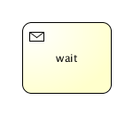


#### XML内容


```
<receiveTask id="waitState" name="wait" />    
```


要在接收任务等待的流程实例继续执行， 可以调用*runtimeService.signal(executionId)*，传递接收任务上流程的id。 下面的代码演示了实际是如何工作的：

```
ProcessInstance pi = runtimeService.startProcessInstanceByKey("receiveTask");
Execution execution = runtimeService.createExecutionQuery()
  .processInstanceId(pi.getId())
  .activityId("waitState")
  .singleResult();
assertNotNull(execution);

runtimeService.signal(execution.getId());
          
```


### Shell任务

#### 描述

shell任务可以执行shell脚本和命令。 注意shell任务**不是**BPMN 2.0规范定义的官方任务。 （它也没有对应的图标）。

#### 定义shell任务

shell任务是一个专用的[服务任务](http://www.mossle.com/docs/activiti/index.html#bpmnJavaServiceTask)， 这个服务任务的*type*设置为*'shell'*。

```
<serviceTask id="shellEcho" activiti:type="shell">
                      
```


shell任务使用[属性注入](http://www.mossle.com/docs/activiti/index.html#serviceTaskFieldInjection)进行配置。 所有属性都可以包含EL表达式，会在流程执行过程中解析。 可以配置以下属性：


**Table 8.7. Shell任务参数配置**

| 属性              | 是否必须 | 类型       | 描述                        | 默认值           |
| ----------------- | -------- | ---------- | --------------------------- | ---------------- |
| command           | 是       | String     | 执行的shell命令             |                  |
| arg0-5            | 否       | String     | 参数0至5                    |                  |
| wait              | 否       | true/false | 是否需要等待到shell进程结束 | true             |
| redirectError     | 否       | true/false | 把标准错误打印到标准流中    | false            |
| cleanEnv          | 否       | true/false | shell进行不继承当前环境     | false            |
| outputVariable    | 否       | String     | 保存输出的变量名            | 不会记录输出结果 |
| errorCodeVariable | 否       | String     | 包含结果错误代码的变量名    | 不会注册错误级别 |
| directory         | 否       | String     | shell进程的默认目录         | 当前目录         |


#### 应用实例

下面的代码演示了使用shell任务的实例。它会执行shell脚本"cmd /c echo EchoTest"，等到它结束，再把输出结果保存到resultVar中。

```
<serviceTask id="shellEcho" activiti:type="shell" >
  <extensionElements>
    <activiti:field name="command" stringValue="cmd" />
    <activiti:field name="arg1" stringValue="/c" />
    <activiti:field name="arg2" stringValue="echo" />
    <activiti:field name="arg3" stringValue="EchoTest" />
    <activiti:field name="wait" stringValue="true" />
    <activiti:field name="outputVariable" stringValue="resultVar" />
  </extensionElements>
</serviceTask>
                      
```


### 执行监听器

**兼容性提醒**：在发布5.3后，我们发现执行监听器， 任务监听器，表达式还是非公开API。这些类在`org.activiti.engine.impl...`的子包， 包名中有一个`impl`。`org.activiti.engine.impl.pvm.delegate.ExecutionListener`, `org.activiti.engine.impl.pvm.delegate.TaskListener` and `org.activiti.engine.impl.pvm.el.Expression`已经废弃了。 从现在开始，应该使用`org.activiti.engine.delegate.ExecutionListener`, `org.activiti.engine.delegate.TaskListener` 和 `org.activiti.engine.delegate.Expression`。 在新的公开API中，删除了`ExecutionListenerExecution.getEventSource()`。 因为已经设置了废弃编译警告，所以已存的代码应该可以正常运行。但是要考虑切换到新的公共API接口 （包名中没有.impl.）。

执行监听器可以执行外部java代码或执行表达式，当流程定义中发生了某个事件。 可以捕获的事件有：

- 流程实例的启动和结束。
- 选中一条连线。
- 节点的开始和结束。
- 网关的开始和结束。
- 中间事件的开始和结束。
- 开始时间结束或结束事件开始。


下面的流程定义包含了3个流程监听器：

```
  <process id="executionListenersProcess">

    <extensionElements>
      <activiti:executionListener class="org.activiti.examples.bpmn.executionlistener.ExampleExecutionListenerOne" event="start" />
    </extensionElements>

    <startEvent id="theStart" />
    <sequenceFlow sourceRef="theStart" targetRef="firstTask" />

    <userTask id="firstTask" />
    <sequenceFlow sourceRef="firstTask" targetRef="secondTask">
    <extensionElements>
      <activiti:executionListener class="org.activiti.examples.bpmn.executionListener.ExampleExecutionListenerTwo" />
    </extensionElements>
    </sequenceFlow>

    <userTask id="secondTask" >
    <extensionElements>
      <activiti:executionListener expression="${myPojo.myMethod(execution.event)}" event="end" />
    </extensionElements>
    </userTask>
    <sequenceFlow sourceRef="secondTask" targetRef="thirdTask" />

    <userTask id="thirdTask" />
    <sequenceFlow sourceRef="thirdTask" targetRef="theEnd" />

    <endEvent id="theEnd" />

  </process>
```


第一个流程监听器监听流程开始。监听器是一个外部java类（像是`ExampleExecutionListenerOne`）， 需要实现`org.activiti.engine.delegate.ExecutionListener`接口。 当事件发生时（这里是`end`事件）， 会调用`notify(ExecutionListenerExecution execution)`方法。

```
public class ExampleExecutionListenerOne implements ExecutionListener {

  public void notify(ExecutionListenerExecution execution) throws Exception {
    execution.setVariable("variableSetInExecutionListener", "firstValue");
    execution.setVariable("eventReceived", execution.getEventName());
  }
}
```

也可以使用实现`org.activiti.engine.delegate.JavaDelegate`接口的代理类。 代理类可以在结构中重用，比如serviceTask的代理。

第二个流程监听器在连线执行时调用。注意这个`listener`元素不能定义`event`， 因为连线只能触发`take`事件。 **为连线定义的监听器的event属性会被忽略。**

最后一个流程监听器在节点`secondTask`结束时调用。这里使用`expression` 代替`class`来在事件触发时执行/调用。

```
<activiti:executionListener expression="${myPojo.myMethod(execution.eventName)}" event="end" />
```

和其他表达式一样，流程变量可以处理和使用。因为流程实现对象有一个保存事件名称的属性， 可以在方法中使用`execution.eventName`获的事件名称。

流程监听器也支持使用`delegateExpression`, [和服务任务相同](http://www.mossle.com/docs/activiti/index.html#bpmnJavaServiceTaskXML)。

```
<activiti:executionListener event="start" delegateExpression="${myExecutionListenerBean}" />
```


在activiti 5.12中，我们也介绍了新的流程监听器，org.activiti.engine.impl.bpmn.listener.ScriptExecutionListener。 这个脚本流程监听器可以为某个流程监听事件执行一段脚本。

```
<activiti:executionListener event="start" class="org.activiti.engine.impl.bpmn.listener.ScriptExecutionListener" >
  <activiti:field name="script">
    <activiti:string>
      def bar = "BAR";  // local variable
      foo = "FOO"; // pushes variable to execution context
      execution.setVariable("var1", "test"); // test access to execution instance
      bar // implicit return value
    </activiti:string>
  </activiti:field>
  <activiti:field name="language" stringValue="groovy" />
  <activiti:field name="resultVariable" stringValue="myVar" />
<activiti:executionListener>
```


#### 流程监听器的属性注入

使用流程监听器时，可以配置`class`属性，可以使用属性注入。 这和使用[服务任务属性注入](http://www.mossle.com/docs/activiti/index.html#serviceTaskFieldInjection)相同， 参考它可以获得属性注入的很多信息。

下面的代码演示了使用了属性注入的流程监听器的流程的简单例子。

```
 <process id="executionListenersProcess">
    <extensionElements>
      <activiti:executionListener class="org.activiti.examples.bpmn.executionListener.ExampleFieldInjectedExecutionListener" event="start">
        <activiti:field name="fixedValue" stringValue="Yes, I am " />
        <activiti:field name="dynamicValue" expression="${myVar}" />
      </activiti:executionListener>
    </extensionElements>

    <startEvent id="theStart" />
    <sequenceFlow sourceRef="theStart" targetRef="firstTask" />

    <userTask id="firstTask" />
    <sequenceFlow sourceRef="firstTask" targetRef="theEnd" />

    <endEvent id="theEnd" />
  </process>
        
```


```
public class ExampleFieldInjectedExecutionListener implements ExecutionListener {

  private Expression fixedValue;

  private Expression dynamicValue;

  public void notify(ExecutionListenerExecution execution) throws Exception {
    execution.setVariable("var", fixedValue.getValue(execution).toString() + dynamicValue.getValue(execution).toString());
  }
}
          
```

`ExampleFieldInjectedExecutionListener`类串联了两个注入的属性。 （一个是固定的，一个是动态的），把他们保存到流程变量'`var`'中。


```
@Deployment(resources = {"org/activiti/examples/bpmn/executionListener/ExecutionListenersFieldInjectionProcess.bpmn20.xml"})
public void testExecutionListenerFieldInjection() {
  Map<String, Object> variables = new HashMap<String, Object>();
  variables.put("myVar", "listening!");

  ProcessInstance processInstance = runtimeService.startProcessInstanceByKey("executionListenersProcess", variables);

  Object varSetByListener = runtimeService.getVariable(processInstance.getId(), "var");
  assertNotNull(varSetByListener);
  assertTrue(varSetByListener instanceof String);

  // Result is a concatenation of fixed injected field and injected expression
  assertEquals("Yes, I am listening!", varSetByListener);
}
        
```


### 任务监听器

*任务监听器*可以在发生对应的任务相关事件时执行自定义java逻辑 或表达式。

任务监听器只能添加到流程定义中的[用户任务](http://www.mossle.com/docs/activiti/index.html#bpmnUserTask)中。 注意它必须定义在*BPMN 2.0 extensionElements*的子元素中， 并使用*activiti*命名空间，因为任务监听器是activiti独有的结构。

```
<userTask id="myTask" name="My Task" >
  <extensionElements>
    <activiti:taskListener event="create" class="org.activiti.MyTaskCreateListener" />
  </extensionElements>
</userTask>
```

*任务监听器*支持以下属性：

- **event**（必选）：任务监听器会被调用的任务类型。 可能的类型为：

  - **create**：任务创建并**设置所有属性后**触发。
  - **assignment**：任务分配给一些人时触发。 当流程到达userTask， *assignment*事件 会在*create*事件**之前**发生。 这样的顺序似乎不自然，但是原因很简单：当获得*create*时间时， 我们想获得任务的所有属性，包括执行人。
  - **complete**：当任务完成，并尚未从运行数据中删除时触发。
  - **delete**：只在任务删除之前发生。 注意在通过completeTask正常完成时，也会执行。

  

- **class**：必须调用的代理类。 这个类必须实现`org.activiti.engine.delegate.TaskListener`接口。

  ```
  public class MyTaskCreateListener implements TaskListener {
  
    public void notify(DelegateTask delegateTask) {
      // Custom logic goes here
    }
  
  }
  ```

  可以使用[属性注入](http://www.mossle.com/docs/activiti/index.html#serviceTaskFieldInjection)把流程变量或执行传递给代理类。 注意代理类的实例是在部署时创建的 （和activiti中其他类代理的情况一样），这意味着所有流程实例都会共享同一个实例。

- **expression**：（无法同时与*class*属性一起使用）： 指定事件发生时执行的表达式。 可以把`DelegateTask`对象和事件名称（使用`task.eventName`） 作为参数传递给调用的对象。

  ```
  <activiti:taskListener event="create" expression="${myObject.callMethod(task, task.eventName)}" />
  ```

  

- **delegateExpression**可以指定一个表达式，解析一个实现了`TaskListener`接口的对象， [这与服务任务一致](http://www.mossle.com/docs/activiti/index.html#bpmnJavaServiceTaskXML)。

  ```
  <activiti:taskListener event="create" delegateExpression="${myTaskListenerBean}" />
  ```

  

- 在activiti 5.12中，我们也介绍了新的任务监听器，org.activiti.engine.impl.bpmn.listener.ScriptTaskListener。 脚本任务监听器可以为任务监听器事件执行脚本。

  ```
  <activiti:taskListener event="complete" class="org.activiti.engine.impl.bpmn.listener.ScriptTaskListener" >
    <activiti:field name="script">
      <activiti:string>
        def bar = "BAR";  // local variable
        foo = "FOO"; // pushes variable to execution context
        task.setOwner("kermit"); // test access to task instance
        bar // implicit return value
      </activiti:string>
    </activiti:field>
    <activiti:field name="language" stringValue="groovy" />
    <activiti:field name="resultVariable" stringValue="myVar" />
  <activiti:taskListener>
  ```

  


### 多实例（循环）

#### 描述

*多实例节点*是在业务流程中定义重复环节的一个方法。 从开发角度讲，多实例和**循环**是一样的： 它可以根据给定的集合，为每个元素执行一个环节甚至一个完整的子流程， **既可以顺序依次执行也可以并发同步执行**。

*多实例*是在一个普通的节点上添加了额外的属性定义 （所以叫做*'多实例*特性'），这样运行时节点就会执行多次。 下面的节点都可以成为一个*多实例节点：*

- [User Task](http://www.mossle.com/docs/activiti/index.html#bpmnUserTask)
- [Script Task](http://www.mossle.com/docs/activiti/index.html#bpmnScriptTask)
- [Java Service Task](http://www.mossle.com/docs/activiti/index.html#bpmnJavaServiceTask)
- [Web Service Task](http://www.mossle.com/docs/activiti/index.html#bpmnWebserviceTask)
- [Business Rule Task](http://www.mossle.com/docs/activiti/index.html#bpmnBusinessRuleTask)
- [Email Task](http://www.mossle.com/docs/activiti/index.html#bpmnEmailTask)
- [Manual Task](http://www.mossle.com/docs/activiti/index.html#bpmnManualTask)
- [Receive Task](http://www.mossle.com/docs/activiti/index.html#bpmnReceiveTask)
- [(Embedded) Sub-Process](http://www.mossle.com/docs/activiti/index.html#bpmnSubProcess)
- [Call Activity](http://www.mossle.com/docs/activiti/index.html#bpmnCallActivity)

[网关](http://www.mossle.com/docs/activiti/index.html#bpmnGateways)和[事件](http://www.mossle.com/docs/activiti/index.html#bpmnEvents) **不能**设置多实例。

根据规范的要求，每个上级流程为每个实例创建分支时都要提供如下变量：

- **nrOfInstances**：实例总数
- **nrOfActiveInstances**：当前活动的，比如，还没完成的，实例数量。 对于顺序执行的多实例，值一直为1。
- **nrOfCompletedInstances**：已经完成实例的数目。

可以通过`execution.getVariable(x)`方法获得这些变量。

另外，每个创建的分支都会有分支级别的本地变量（比如，其他实例不可见， 不会保存到流程实例级别）：

- **loopCounter**：表示特定实例的*在循环的索引值*。可以使用activiti的**elementIndexVariable**属性修改loopCounter的变量名。


#### 图形标记

如果节点是多实例的，会在节点底部显示三条短线。 三条*竖*线表示实例会并行执行。 三条*横*线表示顺序执行。


#### Xml内容

要把一个节点设置为多实例，节点xml元素必须设置一个`multiInstanceLoopCharacteristics`子元素。

```
<multiInstanceLoopCharacteristics isSequential="false|true">
 ...
</multiInstanceLoopCharacteristics>
```

**isSequential**属性表示节点是进行 顺序执行还是并行执行。

实例的数量会**在进入节点时计算一次**。 有一些方法配置它。一种方法是使用**loopCardinality**子元素直接指定一个数字。

```
<multiInstanceLoopCharacteristics isSequential="false|true">
  <loopCardinality>5</loopCardinality>
</multiInstanceLoopCharacteristics>
```

也可以使用结果为整数的表达式：

```
<multiInstanceLoopCharacteristics isSequential="false|true">
  <loopCardinality>${nrOfOrders-nrOfCancellations}</loopCardinality>
</multiInstanceLoopCharacteristics>
```


另一个定义实例数目的方法是，通过`loopDataInputRef`子元素，设置一个类型为集合的流程变量名。 对于集合中的每个元素，都会创建一个实例。 也可以通过`inputDataItem`子元素指定集合。 下面的代码演示了这些配置：

```
<userTask id="miTasks" name="My Task ${loopCounter}" activiti:assignee="${assignee}">
  <multiInstanceLoopCharacteristics isSequential="false">
    <loopDataInputRef>assigneeList</loopDataInputRef>
    <inputDataItem name="assignee" />
  </multiInstanceLoopCharacteristics>
</userTask>
```

假设`assigneeList`变量包含这些值`[kermit, gonzo, foziee]`。 在上面代码中，三个用户任务会同时创建。每个分支都会拥有一个用名为`assignee`的流程变量， 这个变量会包含集合中的对应元素，在例子中会用来设置用户任务的分配者。

`loopDataInputRef`和`inputDataItem`的缺点是1）名字不好记， 2）根据BPMN 2.0格式定义，它们不能包含表达式。activiti通过在 `multiInstanceCharacteristics`中设置 **collection**和 **elementVariable**属性解决了这个问题：

```
<userTask id="miTasks" name="My Task" activiti:assignee="${assignee}">
  <multiInstanceLoopCharacteristics isSequential="true"
     activiti:collection="${myService.resolveUsersForTask()}" activiti:elementVariable="assignee" >
  </multiInstanceLoopCharacteristics>
</userTask>
```


多实例节点在所有实例都完成时才会结束。也可以指定一个表达式在每个实例结束时执行。 如果表达式返回true，所有其他的实例都会销毁，多实例节点也会结束，流程会继续执行。 这个表达式必须定义在**completionCondition**子元素中。

```
<userTask id="miTasks" name="My Task" activiti:assignee="${assignee}">
  <multiInstanceLoopCharacteristics isSequential="false"
     activiti:collection="assigneeList" activiti:elementVariable="assignee" >
    <completionCondition>${nrOfCompletedInstances/nrOfInstances >= 0.6 }</completionCondition>
  </multiInstanceLoopCharacteristics>
</userTask>
```

在这里例子中，会为`assigneeList`集合的每个元素创建一个并行的实例。 当60%的任务完成时，其他任务就会删除，流程继续执行。

#### 边界事件和多实例

因为多实例是一个普通节点，它也可以在边缘使用[边界事件](http://www.mossle.com/docs/activiti/index.html#bpmnBoundaryEvent)。 对于中断型边界事件，当捕获事件时，**所有激活的实例**都会销毁。 参考以下多实例子流程：

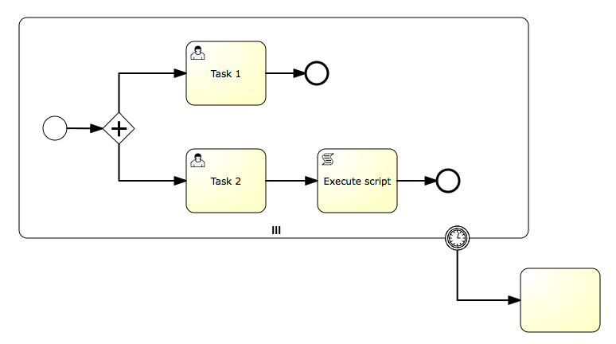

这里，子流程的所有实例都会在定时器触发时销毁，无论有多少实例， 也不管内部哪个节点没有完成。

### 补偿处理器

#### 描述

**[EXPERIMENTAL]**

如果一个节点用来补偿另一个节点的业务，它可以声明为一个补偿处理器。 补偿处理器不包含普通的流，只在补偿事件触发时执行。

补偿处理器不能包含进入和外出顺序流。

补偿处理器必须使用直接关联分配给一个补偿边界事件。

#### 图形标志

如果节点是补偿处理器，补偿事件图标会显示在中间底部区域。下面的流程图显示了一个服务任务，附加了一个补偿边界事件， 并分配了一个补偿处理器。 注意"cancel hotel reservation"服务任务中间底部区域显示的补偿处理器图标。


#### XML内容

为了声明作为补偿处理器的节点，我们需要把

```
isForCompensation
```

设置为

```
true
```

：

```
<serviceTask id="undoBookHotel" isForCompensation="true" activiti:class="...">
</serviceTask>
```

## 子流程和调用节点

### 子流程

#### 描述

*子流程（Sub-process）*是一个包含其他节点，网关，事件等等的节点。 它自己就是一个流程，同时是更大流程的一部分。 *子流程*是完全定义在父流程里的 （这就是为什么叫做*内嵌*子流程）。

子流程有两种主要场景：

- 子流程可以使用**继承式建模**。 很多建模工具的子流程可以*折叠*， 把子流程的内部细节隐藏，显示一个高级别的端对端的业务流程总览。
- 子流程会创建一个新的**事件作用域**。 子流程运行过程中抛出的事件，可以被子流程边缘定义的 [边界事件](http://www.mossle.com/docs/activiti/index.html#bpmnBoundaryEvent)捕获， 这样就可以创建一个仅限于这个子流程的事件作用范围。


使用子流程要考虑如下限制：

- 子流程只能包含**一个空开始事件**， 不能使用其他类型的开始事件。子路程必须 **至少有一个结束节点**。注意，BPMN 2.0规范允许忽略子流程的 开始和结束节点，但是当前activiti的实现并不支持。
- **顺序流不能跨越子流程的边界。**


#### 图形标记

子流程显示为标准的节点，圆角矩形。 这时子流程是*折叠的*，只显示名称和一个加号标记， 展示了高级别的流程总览：

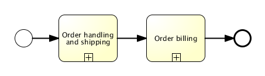


这时子流程是*展开的*，子流程的步骤都显示在子流程边界内：


使用子流程的主要原因，是定义对应事件的作用域。 下面流程模型演示了这个功能：*调查软件/调查引荐*任务需要同步执行， 两个任务需要在同时完成，在*二线支持*解决之前。 这里，定时器的作用域（比如，节点需要及时完成）是由子流程限制的。

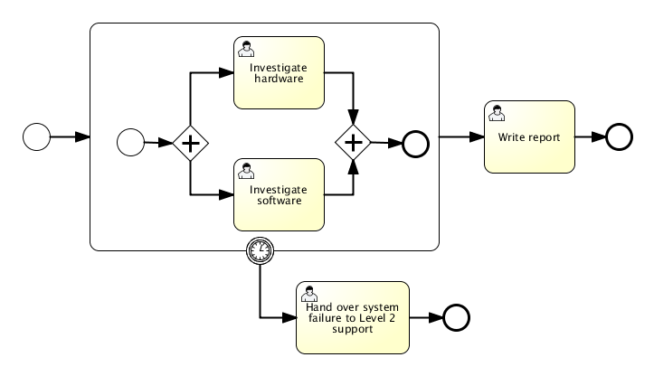


#### XML内容

子流程定义为*subprocess*元素。 所有节点，网关，事件，等等。它是子流程的一部分，需要放在这个元素里。

```
<subProcess id="subProcess">

  <startEvent id="subProcessStart" />

  ... other Sub-Process elements ...

  <endEvent id="subProcessEnd" />

 </subProcess>
          
```


### 事件子流程

#### 描述

事件子流程是BPMN 2.0中的新元素。事件子流程是由事件触发的子流程。 事件子流程可以添加到流程级别或任意子流程级别。用于触发事件子流程的事件是使用开始事件配置的。 为此，事件子流程是不支持空开始事件的。 事件子流程可以被消息事件，错误事件，信号事件，定时器事件，或补偿事件触发。 开始事件的订阅在包含事件子流程的作用域（流程实例或子流程）创建时就会创建。 当作用域销毁也会删除订阅。

事件子流程可以是中断的或非中断的。一个中断的子流程会取消当前作用域内的所有流程。 非中断事件子流程会创建那一个新的同步分支。中断事件子流程只会被每个激活状态的宿主触发一次， 非中断事件子流程可以触发多次。子流程是否是终端的，配置使用事件子流程的开始事件配置。

事件子流程不能有任何进入和外出流程。当事件触发一个事件子流程时，输入顺序流是没有意义的。 当事件子流程结束时，无论当前作用域已经结束了（中断事件子流程的情况）， 或为非中断子流程生成同步分支会结束。

**当前的限制：**

- activiti只支持中断事件子流程。
- activiti只支持使用错误开始事件或消息开始事件的事件子流程。


#### 图像标记

事件子流程可以显示为边框为虚线的[内嵌子流程](http://www.mossle.com/docs/activiti/index.html#bpmnSubProcessGraphicalNotation)。


#### XML内容

事件子流程的XML内容与[内嵌子流程](http://www.mossle.com/docs/activiti/index.html#)是一样的。 另外，要把`triggeredByEvent`属性设置为`true`：

```
<subProcess id="eventSubProcess" triggeredByEvent="true">
        ...
</subProcess>
```


#### 实例

下面是一个使用错误开始事件触发的事件子流程的实例。事件子流程是放在“流程级别”的， 意思是，作用于流程实例：

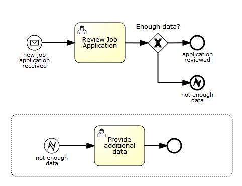

事件子流程的XML如下所示：

```
<subProcess id="eventSubProcess" triggeredByEvent="true">
        <startEvent id="catchError">
                <errorEventDefinition errorRef="error" />
        </startEvent>
        <sequenceFlow id="flow2" sourceRef="catchError" targetRef="taskAfterErrorCatch" />
        <userTask id="taskAfterErrorCatch" name="Provide additional data" />
</subProcess>
```


如上面所述，事件子流程也可以添加成内嵌子流程。如果添加为内嵌子流程，它其实是边界事件的一种替代方案。 考虑下面两个流程图。两种情况内嵌子流程会抛出一个错误事件。两种情况错误都会被捕获并使用一个用户任务处理。


相对于：


两种场景都会执行相同的任务。然而，两种建模的方式是不同的：

- 内嵌子流程是使用与执行作用域宿主相同的流程执行的。意思是内嵌子流程可以访问它作用域内的内部变量。 当使用边界事件时，执行内嵌子流程的流程会删除，并生成一个流程根据边界事件的顺序流继续执行。 这意味着内嵌子流程创建的变量不再起作用了。
- 当使用事件子流程时，事件是完全由它添加的子流程处理的。 当使用边界事件时，事件由父流程处理。

这两个不同点可以帮助我们决定是使用边界事件还是内嵌事件子流程来解决特定的流程建模/实现问题。

### 事务子流程

**[EXPERIMENTAL]**

#### 描述

事务子流程是内嵌子流程，可以用来把多个流程放到一个事务里。 事务是一个逻辑单元，可以把一些单独的节点放在一起，这样它们就可以一起成功或一起失败。

**事务可能的结果：** 事务可以有三种可能的结果：

- 事务*成功*，如果没有取消也没有因为问题终结。如果事务子流程是成功的， 就会使用外出顺序流继续执行。 如果流程后来抛出了一个补偿事件，成功的事务可能被补偿。

  注意：和普通内嵌子流程一样，事务可能在成功后， 使用中间补偿事件进行补偿。

  

- 事务*取消*，如果流程到达取消结束事件。这时， 所有流程都会终结和删除。触发补偿的一个单独的流程，会通过取消边界事件继续执行。 在补偿完成之后，事务子流程会使用取消边界事务的外出顺序流向下执行。

- 事务被*问题*结束，如果跑出了一个错误事件， 而且没有在事务子流程中捕获。（如果错误被事务子流程的边界事件处理了，也会这样应用。） 这时，不会执行补偿。

下面的图形演示了三种不同的结果：


**与ACID事务的关系：**一定不要吧bpmn事务子流程与技术（ACID）事务相混淆。 bpmn事务子流程不是技术事务领域的东西。要理解activiti中的事务管理，请参考 [并发与事务](http://www.mossle.com/docs/activiti/index.html#bpmnConcurrencyAndTransactions)。 bpmn事务和技术事务有以下不同点：

- ACID事务一般是短期的，bpmn事务可能持续几小时，几天，甚至几个月才能完成。 （考虑事务中包含的节点可能有用户任务，一般人员响应的时间比应用时间要长。或者， 或者，在其他情况下，bpmn事务可能要等待发生一些事务事件，就像要根据某种次序执行。） 这种操作通常要相比更新数据库的一条数据，或把一条信息保存到事务性队列中，消耗更长的时间来完成。
- 因为不能在整个业务节点的过程中保持一个技术性的事务，所以bpmn事务一般要跨越多个ACID事务。
- 因为bpmn事务会跨越多个ACID事务，所以会丧失ACID的特性。比如，考虑上述例子。 假设“约定旅店”和“刷信用卡”操作在单独的ACID事务中执行。 也假设“预定旅店”节点已经成功了。现在我们处于一个中间不稳定状态，因为我们预定了酒店，但是还没有刷信用卡。 现在，在一个ACID事务中，我们要依次执行不同的操作，也会有一个中间不稳定状态。 不同的是，这个中间状态对事务的外部是可见的。 比如，如果通过外部预定服务进行了预定，其他使用相同预定服务的部分就可以看到旅店被预定了。 这意味着实现业务事务时，我们完全失去了隔离属性 （注：我们也经常放弃隔离性，来为ACID事务获得更高的并发，但是我们可以完全控制，中间不稳定状态也只持续很短的时间）。
- bpmn业务事务也不能使用通常的方式回滚。因为它跨越了多个事务，bpmn事务取消时一些ACID事务可能已经提交了。 这时，它们不能被回滚了。


因为bpmn事务实际上运行时间很长，缺乏隔离性和回滚机制都需要被区别对待。 实际上，这里也没有更好的办法在特定领域处理这些问题：

- 使用补偿执行回滚。如果事务范围抛出了取消事件，会影响已经执行成功的节点， 并使用补偿处理器执行补偿。
- 隔离性的缺乏通常使用特定领域的解决方法来解决。比如，上面的例子中， 一个旅店房间可能会展示给第二个客户，在我们确认第一个客户付费之前。 虽然这可能与业务预期不符，预定服务可能选择允许一些过度的预约。
- 另外，因为事务会因为风险而中断，预定服务必须处理这种情况，已经预定了旅店，但是一直没有付款的情况。 （因为事务被中断了）。这时预定服务需要选择一个策略，在旅店房间预定超过最大允许时间后， 如果还没有付款，预定就会取消。

综上所述：ACID处理的是通常问题（回滚，隔离级别和启发式结果）， 在实现业务事务时，我们需要找到特定领域的解决方案来处理这些问题。

**目前的限制：**

- bpmn规范要求流程引擎能根据底层事务的协议处理事件，比如如果底层协议触发了取消事件，事务就会取消。 作为内嵌引擎，activiti目前不支持这项功能。（对此造成的后果，可以参考下面的一致性讨论）。


**ACID事务顶层的一致性和优化并发：** bpmn事务保证一致性，要么所有节点都成功，或者一些节点成功，对其他成功的节点进行补偿。 无论哪种方式，都会有一致性的结果。不过要讨论一些activiti内部的情况，bpmn事务的一致性模型是叠加在流程的一致性模型之上的。 activiti执行流程是事务性的。并发使用了乐观锁。在activiti中，bpmn错误，取消和补偿事件都建立在同样的acid事务与乐观锁之上。 比如，取消结束事件只能触发它实际到达的补偿。如果之前服务任务抛出了未声明的异常。或者， 补偿处理器的效果无法提交，如果底层的acid事务的参与者把事务设置成必须回滚。 或者当两个并发流程到达了取消结束事件，可能会触发两次补偿，并因为乐观锁异常失败。 所有这些都说明activiti中实现bpmn事务时，相同的规则也作用域普通的流程和子流程。 所以为了保证一致性，重要的是使用一种方式考虑实现乐观事务性的执行模型。

#### 图形标记

事务子流程显示为[内嵌子流程](http://www.mossle.com/docs/activiti/index.html#bpmnSubProcessGraphicalNotation)，使用双线边框。


#### XML内容

事务子流程使用`transaction`标签：

```
<transaction id="myTransaction" >
        ...
</transaction>
```


#### 实例

下面是事务子流程的实例：


### 调用活动（子流程）

#### 描述

bpmn 2.0区分了普通*子流程*， 也叫做*内嵌子流程*，和调用节点，看起来很相似。 上概念上讲，当流程抵达及诶单时，两者都会调用子流程。

不同点是调用节点引用流程定义外部的一个流程，*子流程* 会内嵌到原始的流程定义中。使用调用节点的主要场景是需要重用流程定义， 这个流程定义需要被很多其他流程定义调用的时候。

当流程执行到*调用节点*，会创建一个新分支，它是到达调用节点的流程的分支。 这个分支会用来执行子流程，默认创建并行子流程，就像一个普通的流程。 上级流程会等待子流程完成，然后才会继续向下执行。

#### 图形标记

调用节点显示与[子流程](http://www.mossle.com/docs/activiti/index.html#bpmnSubProcessGraphicalNotation)相同， 不过是粗边框（无论是折叠和展开的）。 根据不同的建模工具，调用节点也可以展开，但是显示为折叠的子流程。


#### XML内容

A call activity is a regular activity, that requires a *calledElement* that references a process definition by its **key**. In practice, this means that the **id of the process** is used in the *calledElement*.

```
<callActivity id="callCheckCreditProcess" name="Check credit" calledElement="checkCreditProcess" />
```


注意，子流程的流程定义是**在执行阶段解析的**。 就是说子流程可以与调用的流程分开部署，如果需要的话。

#### 传递变量

可以把流程变量传递给子流程，反之亦然。数据会复制给子流程，当它启动的时候， 并在它结束的时候复制回主流程。

```
<callActivity id="callSubProcess" calledElement="checkCreditProcess" >
  <extensionElements>
          <activiti:in source="someVariableInMainProcess" target="nameOfVariableInSubProcess" />
          <activiti:out source="someVariableInSubProcss" target="nameOfVariableInMainProcess" />
  </extensionElements>
</callActivity>
```

我们使用activiti扩展来简化BPMN标准元素调用*dataInputAssociation*和 *dataOutputAssociation*，这只在你使用BPMN 2.0标准方式声明流程变量才管用。

这里也可以使用表达式：

```
<callActivity id="callSubProcess" calledElement="checkCreditProcess" >
        <extensionElements>
          <activiti:in sourceExpression="${x+5}"" target="y" />
          <activiti:out source="${y+5}" target="z" />
        </extensionElements>
</callActivity>
```

最后z = y + 5 = x + 5 + 5

#### 实例

下面的流程图演示了简单订单处理。先判断客户端信用，这可能与很多其他流程相同。 *检查信用阶段*这里设计成调用节点。


流程看起来像下面这样：

```
<startEvent id="theStart" />
<sequenceFlow id="flow1" sourceRef="theStart" targetRef="receiveOrder" />

<manualTask id="receiveOrder" name="Receive Order" />
<sequenceFlow id="flow2" sourceRef="receiveOrder" targetRef="callCheckCreditProcess" />

<callActivity id="callCheckCreditProcess" name="Check credit" calledElement="checkCreditProcess" />
<sequenceFlow id="flow3" sourceRef="callCheckCreditProcess" targetRef="prepareAndShipTask" />

<userTask id="prepareAndShipTask" name="Prepare and Ship" />
<sequenceFlow id="flow4" sourceRef="prepareAndShipTask" targetRef="end" />

<endEvent id="end" />
```

子流程看起来像下面这样：


子流程的流程定义没有什么特别的。 它也可以单独使用，不用其他流程调用。

## 事务和并发

### 异步操作

activiti通过事务方式执行流程，可以根据你的需求定制。现在开始看一下activiti通常是如何处理事务的。 如果触发了activiti的操作（比如，开始流程，完成任务，触发流程继续执行）， activiti会推进流程，直到每个分支都进入等待状态。更抽象的说，它会流程图执行深度优先搜索， 如果每个分支都遇到等待状态，就会返回。等待状态是"稍后"需要执行任务， 就是说activiti会把当前状态保存到数据库中，然后等待下一次触发。 触发可能来自外部，比如用户任务或接收到一个消息，也可能来自activiti本身，比如我们设置了定时器事件。 下面图片展示了这种操作：


我们可以看到包含用户任务，服务任务和定时器事件的流程。完成用户任务，和校验地址是在同一个工作单元中， 所以它们的成功和失败是原子性的。意味着如果服务任务抛出异常，我们要回滚当前事务， 这样流程会退回到用户任务，用户任务就依然在数据库里。 这就是activiti默认的行为。在（1）中应用或客户端线程完成任务。这会执行服务，流程推进，直到遇到一个等待状态， 这里就是定时器（2）。然后它会返回给调用者（3），并提交事务（如果事务是由activiti开启的）。

有的时候，这不是我们想要的。有时我们需要自己控制流程中事务的边界，这样就能把业务逻辑包裹在一起。 这就需要使用异步执行了。参考下面的流程（判断）：


这次我们完成了用户任务，生成一个发票，把发票发送给客户。 这次生成发票不在同一个工作单元内了，所以我们不想对用户任务进行回滚，如果生成发票出错了。 所以，我们想让activiti实现的是完成用户任务（1），提交事务，返回给调用者应用。然后在后台的线程中，异步执行生成发票。 后台线程就是activiti的job执行器（其实是一个线程池）周期对数据库的job进行扫描。 所以后面的场景，当我们到达"generate invoice"任务，我们为activiti创建一个稍后执行的job"消息"， 并把它保存到数据库。 job会被job执行器获取并执行。我们也会给本地job执行器一个提醒，告诉它有一个新job，来增加性能。

要想使用这个特性，我们要使用*activiti:async="true"*扩展。例子中，服务任务看起来就是这样：

```
<serviceTask id="service1" name="Generate Invoice" activiti:class="my.custom.Delegate" activiti:async="true" />
        
```

activiti:async可以使用到如下bpmn任务类型中： task, serviceTask, scriptTask, businessRuleTask, sendTask, receiveTask, userTask, subProcess, callActivity

对于userTask，receiveTask和其他等待装填，异步执行的作用是让开始流程监听器运行在一个单独的线程/事务中。

### 排他任务

从activiti 5.9开始，JobExecutor能保证同一个流程实例中的job不会并发执行。为啥呢？

#### 为什么要使用排他任务？

参考如下流程定义：


我们有一个并行网关，后面有三个服务任务，它们都设置为异步执行。这样会添加三个job到数据库里。 一旦job进入数据库，它就可以被jobExecutor执行了。JobExecutor会获取job，把它们代理到工作线程的线程池中，会在那里真正执行job。 就是说，使用异步执行，你可以吧任务分配给这个线程池（在集群环境，可能会使用多个线程池）。这通常是个好事情。 然而它也会产生问题：一致性。考虑一下服务任务后的汇聚。 当服务任务完成后，我们到达并发汇聚节点，需要决定是等待其他分支，还是继续向下执行。 就是说，对每个到达并行汇聚的分支，我们都需要判断是继续还是等待其他分支的一个或多个分支。

为什么这就是问题了呢？因为服务任务配置成使用异步执行，可能相关的job都在同一时间被获取，被JobExecutor分配给不同的工作线程执行。 结果是三个单独的服务执行使用的事务在到达并发汇聚时可能重叠。如果出现了这个问题，这些事务是互相不可见的， 其他事务同时到达了相同的并发汇聚，假设它们都在等待其他分支。然而，每个事务都假设它们在等待其他分支， 所以没有分支会越过并发汇聚继续执行，流程实例会一直在等待状态，无法继续执行。

activiti是如何解决这个问题的？activiti使用了乐观锁。当我们基于判断的数据看起来不是最新的时 （因为其他事务可能在我们提交之前进行了修改，我们会在每个事务里增加数据库同一行的版本）。这时，第一个提交的事务会成功， 其他会因为乐观锁异常导致失败。这就解决了我们上面讨论的流程的问题：如果多个分支同步到达并行汇聚， 它们会假设它们都在登录，并增加它们父流程的版本号（流程实例）然后尝试提交。 第一个分支会成功提交，其他分支会因为乐观锁导致失败。因为流程是被job触发的， activiti会尝试在等待一段时间后尝试执行同一个job，想这段时间可以同步网关的状态。

这是一个很好的解决方案吗？像我们看到的一样，乐观锁允许activiti避免非一致性。它确定我们不会“堵在汇聚网关”， 意思是：或者所有分支都通过网关，或者数据库中的job正在尝试通过。然而，虽然这是一个对于持久性和一致性的完美解决方案， 但对于上层来说不一定是期望的行为：

- activiti只会对同一个job重试估计次数（默认配置为3）。之后，job还会在数据库里，但是不会再重试了。 意味着这个操作必须手工执行job的触发。
- 如果job有非事务方面的效果，它不会因为失败的事务回滚。比如，如果“预定演唱会门票”服务没有与activiti共享事务， 重试job可能导致我们预定了过多门票。


在activiti中，我们推荐了新的概念，并已经在jbpm4中实现了，叫做“排他job”。

#### 什么是排他job？

对于一个流程实例，排他任务不能同时执行两个。考虑上面的流程： 如果我们把服务任务申请为排他任务，JobExecutor会保证对应的job不会并发执行。 相反，它会保证无论什么时候获取一个流程实例的排他任务，都会把同一个流程实例的其他任务都取出来，放在同一个工作线程中执行。 它保证job是顺序执行的。

如何启用这个特性？从activiti 5.9开始，排他任务已经是默认配置了。所以异步执行和定时器事件默认都是排他任务。 另外，如果你想把job设置为非塔牌，可以使用`activiti:exclusive="false"`进行配置。 比如，下面的服务任务就是异步但是非排他的。

```
<serviceTask id="service" activiti:expression="${myService.performBooking(hotel, dates)}" activiti:async="true" activiti:exclusive="false" />
                        
```


这是一个好方案吗？ 有一些人文我们这是否是一个好方案。他们的结论会帮你在并发和性能问题方面节省时间。 这个问题上需要考虑两件事情：

- 如果是你专家并且知道自己在做什么时（理解“为什么排他任务”这章的内容），也可以关闭这个功能， 否则，对于大多数使用异步执行和定时器的用户来说，这个功能是没问题的。
- 它也没有性能问题，在高负载的情况下性能是个问题。高负载意味着JobExecutor的所有工作线程都一直在忙碌着。 使用排他任务，activiti可以简单的分布不同的负载。排他任务意味着同一个流程实例的异步执行会由相同的线程顺序执行。 但是要考虑：如果你有多个流程实例时。 所有其他流程实例的job也会分配给其他线程同步执行。 意味着虽然activiti不会同时执行一个流程实例的排他job，但是还会同步执行多个流程实例的一步执行。 通过一个总体的预测，在大多数场景下，它都会让单独的实例运行的更迅速。 而且，对于同一流程实例中的job，需要用到的数据也会利用执行的集群节点的缓存。 如果任务没有在同一个节点执行，数据就必须每次从数据库重新读取了。


## 流程实例授权

默认所有人在部署的流程定义上启动一个新流程实例。通过流程初始化授权功能定义的用户和组，web客户端可以限制哪些用户可以启动一个新流程实例。

 

**注意**

：activiti引擎

**不会**

校验授权定义。 这个功能只是为减轻web客户端开发者实现校验规则的难度。 设置方法与用户任务用户分配类似。 用户或组可以使用<activiti:potentialStarter>标签分配为流程的默认启动者。下面是一个例子：

```
   <process id="potentialStarter">
     <extensionElements>
       <activiti:potentialStarter>
         <resourceAssignmentExpression>
           <formalExpression>group2, group(group3), user(user3)</formalExpression>
         </resourceAssignmentExpression>
       </activiti:potentialStarter>
     </extensionElements>
   <startEvent id="theStart"/>
   ...
 
```

上面的XML中，user(user3)是直接引用了用户user3，group(group3)是引用了组group3。如果没显示设置，默认认为是群组。 也可以使用`<process>`标签的属性，<activiti:candidateStarterUsers>和<activiti:candidateStarterGroups>。 下面是一个例子：

```
      <process id="potentialStarter" activiti:candidateStarterUsers="user1, user2"
                                        activiti:candidateStarterGroups="group1">
      ...
  
```

可以同时使用这两个属性。

定义流程初始化授权后，开发者可以使用如下方法获得授权定义。 这些代码可以获得给定的用户可以启动哪些流程定义：

```
      processDefinitions = repositoryService.createProcessDefinitionQuery().startableByUser("userxxx").list();
   
```


也可以获得指定流程定义设置的潜在启动者对应的IdentityLink。

```
      identityLinks = repositoryService.getIdentityLinksForProcessDefinition("processDefinitionId");
   
```


下面例子演示了如何获得可以启动给定流程的用户列表：

```
      List<User> authorizedUsers =  identityService().createUserQuery().potentialStarter("processDefinitionId").list();
   
```


相同的方式，获得可以启动给定流程配置的群组：

```
      List<Group> authorizedGroups =  identityService().createGroupQuery().potentialStarter("processDefinitionId").list();
   
```


## 数据对象

**[试验功能]**

BPMN提供了一种功能，可以在流程定义或子流程中定义数据对象。根据BPMN规范，流程定义可以包含复杂XML结构， 可以导入XSD定义。对于Activiti来说，作为Activiti首次支持的数据对象，可以支持如下的XSD类型：

```
        <dataObject id="dObj1" name="StringTest" itemSubjectRef="xsd:string"/>
      
        <dataObject id="dObj2" name="BooleanTest" itemSubjectRef="xsd:boolean"/>
      
        <dataObject id="dObj3" name="DateTest" itemSubjectRef="xsd:datetime"/>
      
        <dataObject id="dObj4" name="DoubleTest" itemSubjectRef="xsd:double"/>
      
        <dataObject id="dObj5" name="IntegerTest" itemSubjectRef="xsd:int"/>
      
        <dataObject id="dObj6" name="LongTest" itemSubjectRef="xsd:long"/>
      
```


数据对象定义会自动转换为流程变量，名称与'name'属性对应。 除了数据对象的定义之外，activiti也支持使用扩展元素来为这个变量赋予默认值。下面的BPMN片段就是对应的例子：

```
        <process id="dataObjectScope" name="Data Object Scope" isExecutable="true">
          <dataObject id="dObj123" name="StringTest123" itemSubjectRef="xsd:string">
            <extensionElements>
              <activiti:value>Testing123</activiti:value>
            </extensionElements>
          </dataObject>
      
```

1
