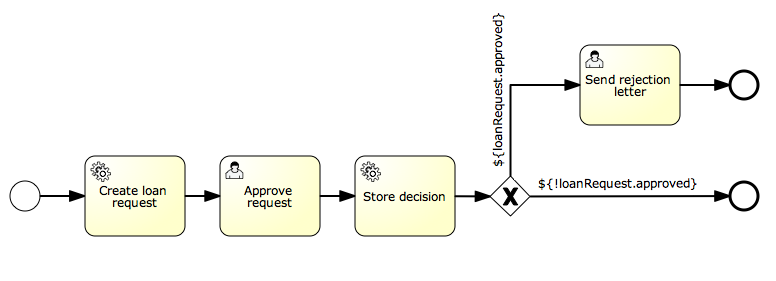

# Chapter 10. JPA


你可以使用JPA实体作为流程变量，并且可以这样做：

- 基于流程变量更新已有的JPA实体，它可以在用户任务的表单中填写或者由服务任务生成。
- 重用已有的领域模型不需要编写显示的服务获取实体或者更新实体的值。
- 根据已有实体的属性做出判断（网关即分支聚合）。
- ...


## 要求

只支持符合以下要求的实体：

- 实体应该使用JPA注解进行配置，我们支持字段和属性访问两种方式。@MappedSuperclass也能够被使用。
- 实体中应该有一个使用`@Id`注解的主键，不支持复合主键 (`@EmbeddedId` 和 `@IdClass`)。Id 字段/属性能够使用JPA规范支持的任意类型： 原生态数据类型和他们的包装类型（boolean除外），`String`, `BigInteger`, `BigDecimal`, `java.util.Date` 和 `java.sql.Date`.


## 配置

为了能够使用JPA的实体，引擎必须有一个对`EntityManagerFactory`的引用。 这可以通过配置引用或者提供一个持久化单元名称。作为变量的JPA实体将会被自动检测并进行相应的处理

下面例子中的配置是使用jpaPersistenceUnitName：

```
<bean id="processEngineConfiguration" class="org.activiti.engine.impl.cfg.StandaloneInMemProcessEngineConfiguration">

    <!-- 数据库的配置 -->
    <property name="databaseSchemaUpdate" value="true" />
    <property name="jdbcUrl" value="jdbc:h2:mem:JpaVariableTest;DB_CLOSE_DELAY=1000" />

    <property name="jpaPersistenceUnitName" value="activiti-jpa-pu" />
    <property name="jpaHandleTransaction" value="true" />
    <property name="jpaCloseEntityManager" value="true" />

    <!-- job executor configurations -->
    <property name="jobExecutorActivate" value="false" />

    <!-- mail server configurations -->
    <property name="mailServerPort" value="5025" />
</bean>
        
```

接下来例子中的配置提供了一个我们自定义的`EntityManagerFactory`(在这个例子中，使用了OpenJPA 实体管理器)。注意该代码片段仅仅包含与例子相关的beans，去掉了其他beans。OpenJPA实体管理的完整并可以使用的例子可以在activiti-spring-examples(`/activiti-spring/src/test/java/org/activiti/spring/test/jpa/JPASpringTest.java`)中找到。

```
<bean id="entityManagerFactory" class="org.springframework.orm.jpa.LocalContainerEntityManagerFactoryBean">
  <property name="persistenceUnitManager" ref="pum"/>
  <property name="jpaVendorAdapter">
    <bean class="org.springframework.orm.jpa.vendor.OpenJpaVendorAdapter">
      <property name="databasePlatform" value="org.apache.openjpa.jdbc.sql.H2Dictionary" />
    </bean>
  </property>
</bean>

<bean id="processEngineConfiguration" class="org.activiti.spring.SpringProcessEngineConfiguration">
  <property name="dataSource" ref="dataSource" />
  <property name="transactionManager" ref="transactionManager" />
  <property name="databaseSchemaUpdate" value="true" />
  <property name="jpaEntityManagerFactory" ref="entityManagerFactory" />
  <property name="jpaHandleTransaction" value="true" />
  <property name="jpaCloseEntityManager" value="true" />
  <property name="jobExecutorActivate" value="false" />
</bean>
        
```

同样的配置也可以在编程式创建一个引擎时完成，例如：

```
ProcessEngine processEngine = ProcessEngineConfiguration
  .createProcessEngineConfigurationFromResourceDefault()
  .setJpaPersistenceUnitName("activiti-pu")
  .buildProcessEngine();
        
```


配置属性：

- **jpaPersistenceUnitName:** 使用持久化单元的名称（要确保该持久化单元在类路径下是可用的）。根据该规范，默认的路径是`/META-INF/persistence.xml`)。要么使用 `jpaEntityManagerFactory` 或者`jpaPersistenceUnitName`。
- **jpaEntityManagerFactory:** 一个实现了`javax.persistence.EntityManagerFactory`的bean的引用。它将被用来加载实体并且刷新更新。要么使用`jpaEntityManagerFactory` 或者`jpaPersistenceUnitName`。
- **jpaHandleTransaction:** 在被使用的`EntityManager` 实例上，该标记表示流程引擎是否需要开始和提交/回滚事物。当使用`Java事物API（JTA）`时，设置为false。
- **jpaCloseEntityManager:** 该标记表示流程引擎是否应该关闭从 `EntityManagerFactory`获取的 `EntityManager`的实例。当`EntityManager` 是由容器管理的时候需要设置为false（例如 当使用并不是单一事物作用域的扩展持久化上下文的时候）。


## 用法

### 简单例子

使用JPA变量的例子可以在 `JPAVariableTest`中找到。我们将会一步一步的解释`JPAVariableTest.testUpdateJPAEntityValues`。

首先，我们需要创建一个基于`META-INF/persistence.xml`的`EntityManagerFactory`作为我们的持久化单元。它包含持久化单元中所有的类和一些供应商特定的配置。

我们将使用一个简单的实体作为测试，其中包含有一个id和`String` 类型的value属性，这也将会被持久化。在允许测试之前，我们创建一个实体并且保存它。

```
@Entity(name = "JPA_ENTITY_FIELD")
public class FieldAccessJPAEntity {

  @Id
  @Column(name = "ID_")
  private Long id;

  private String value;

  public FieldAccessJPAEntity() {
    // Empty constructor needed for JPA
  }

  public Long getId() {
    return id;
  }

  public void setId(Long id) {
    this.id = id;
  }

  public String getValue() {
    return value;
  }

  public void setValue(String value) {
    this.value = value;
  }
}
        
```


我们启动一个新的流程实例，添加一个实体作为变量。至于其他的变量，它们将会被存储在流程引擎的持久化数据库中。下一次获取该变量的时候，它将会根据该类和存储Id从`EntityManager`中加载。

```
Map<String, Object> variables = new HashMap<String, Object>();
variables.put("entityToUpdate", entityToUpdate);

ProcessInstance processInstance = runtimeService.startProcessInstanceByKey("UpdateJPAValuesProcess", variables);
        
```


在我们的流程定义中的第一个节点是一个`服务任务`，它将会调用`entityToUpdate`上的`setValue`方法，它其实就是我们之前在启动流程实例时候设置的JPA变量并且它将会从当前流程引擎的上下文关联的`EntityManager`中加载。

```
<serviceTask id='theTask' name='updateJPAEntityTask' activiti:expression="${entityToUpdate.setValue('updatedValue')}" />
        
```


当完成服务任务时，流程实例将会停留在流程定义中定义的用户任务环节上。这时我们就可以查看该流程实例。与此同时，`EntityManager`已经被刷新了并且改变的实体已经被保存进数据库中。当我们获取`entityToUpdate`的变量value时，该实体将会被再次加载并且我们获取该实体属性的`值` 将会是 `updatedValue`。

```
// Servicetask in process 'UpdateJPAValuesProcess' should have set value on entityToUpdate.
Object updatedEntity = runtimeService.getVariable(processInstance.getId(), "entityToUpdate");
assertTrue(updatedEntity instanceof FieldAccessJPAEntity);
assertEquals("updatedValue", ((FieldAccessJPAEntity)updatedEntity).getValue());
        
```


### 查询JPA流程变量

你可以查询某一JPA实体作为变量的`ProcessInstance`s 和 `Execution`s 。 **注意，在ProcessInstanceQuery 和 ExecutionQuery查询中仅仅variableValueEquals(name, entity) 支持JPA实体变量** 。 方法 `variableValueNotEquals`, `variableValueGreaterThan`, `variableValueGreaterThanOrEqual`, `variableValueLessThan` 和 `variableValueLessThanOrEqual`并不被支持并且传递JPA实体值的时候会抛出一个`ActivitiException`。

```
 ProcessInstance result = runtimeService.createProcessInstanceQuery().variableValueEquals("entityToQuery", entityToQuery).singleResult();
        
```


### 使用Spring beans和JPA结合的高级例子

一个更加高级的例子，`JPASpringTest`，可以在`activiti-spring-examples`中找到。它描述了如下简单的使用情况：

- 已经存在了一个使用JPA实体的Spring-bean，它用来存储贷款申请。

- 使用Activiti，我们可以通过已经存在的bean获取已经使用的实体，并使用它作为变量用于我们的流程中。

  按照下面的步骤定义流程：

  - 服务任务，创建一个新的贷款申请，使用已经存在的`LoanRequestBean` 接受启动流程时候的变量（例如 可以来自流程启动时候的表单）。 使用`activiti:resultVariable`（它作为一个变量对表达式返回的结果进行存储）将创建出来的实体作为变量进行存储。
  - 用户任务，允许经理查看贷款申请，并填入审批意见(同意/不同意)，审批意见将作为一个boolean变量`approvedByManager`进行存储
  - 服务任务，更新贷款申请实体因此该实体与流程保持同步
  - 根据贷款申请实体变量`approved`的值，将利用唯一网关（BPMN2规范）自动决定下一步该选择那一条路径：当申请批准，流程结束。否则，一个额外的任务将会使用 （发送拒绝信），所以这样就是可以让拒绝信手动通知客户。

  

请注意该流程并不包含任何表单，因为它仅仅被用于单元测试。




```
<?xml version="1.0" encoding="UTF-8"?>
<definitions id="taskAssigneeExample"
  xmlns="http://www.omg.org/spec/BPMN/20100524/MODEL"
  xmlns:xsi="http://www.w3.org/2001/XMLSchema-instance"
  xmlns:activiti="http://activiti.org/bpmn"
  targetNamespace="org.activiti.examples">

  <process id="LoanRequestProcess" name="Process creating and handling loan request">
    <startEvent id='theStart' />
    <sequenceFlow id='flow1' sourceRef='theStart' targetRef='createLoanRequest' />

    <serviceTask id='createLoanRequest' name='Create loan request'
      activiti:expression="${loanRequestBean.newLoanRequest(customerName, amount)}"
      activiti:resultVariable="loanRequest"/>
    <sequenceFlow id='flow2' sourceRef='createLoanRequest' targetRef='approveTask' />

    <userTask id="approveTask" name="Approve request" />
    <sequenceFlow id='flow3' sourceRef='approveTask' targetRef='approveOrDissaprove' />

    <serviceTask id='approveOrDissaprove' name='Store decision'
      activiti:expression="${loanRequest.setApproved(approvedByManager)}" />
    <sequenceFlow id='flow4' sourceRef='approveOrDissaprove' targetRef='exclusiveGw' />

    <exclusiveGateway id="exclusiveGw" name="Exclusive Gateway approval" />
    <sequenceFlow id="endFlow1" sourceRef="exclusiveGw" targetRef="theEnd">
      <conditionExpression xsi:type="tFormalExpression">${loanRequest.approved}</conditionExpression>
    </sequenceFlow>
    <sequenceFlow id="endFlow2" sourceRef="exclusiveGw" targetRef="sendRejectionLetter">
      <conditionExpression xsi:type="tFormalExpression">${!loanRequest.approved}</conditionExpression>
    </sequenceFlow>

    <userTask id="sendRejectionLetter" name="Send rejection letter" />
    <sequenceFlow id='flow5' sourceRef='sendRejectionLetter' targetRef='theOtherEnd' />

    <endEvent id='theEnd' />
    <endEvent id='theOtherEnd' />
  </process>

</definitions>

        
```


虽然上面的例子非常的简单，但是它却展示了JPA结合Spring和参数化方法表达式的强大优势。这样所有的流程就不需要自定义java代码（当然，除了Spring bean之外） 并且大幅度的加快了流程部署。
