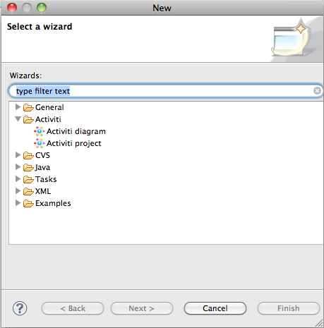
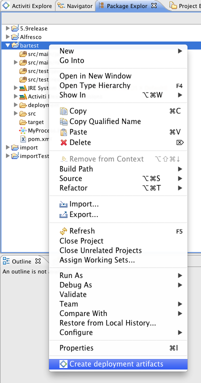
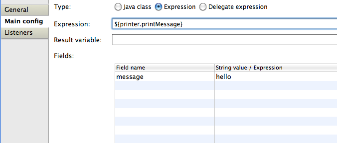
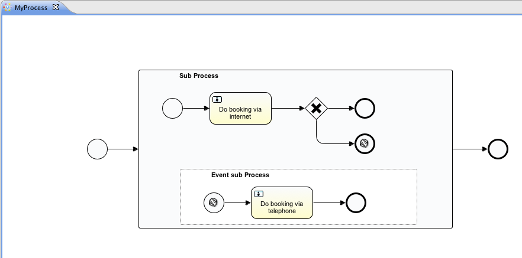
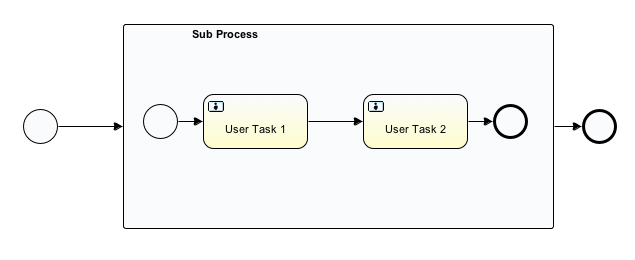
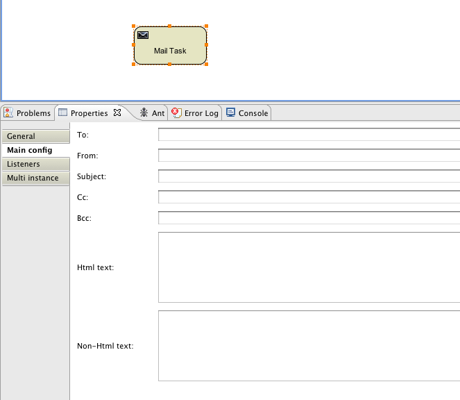
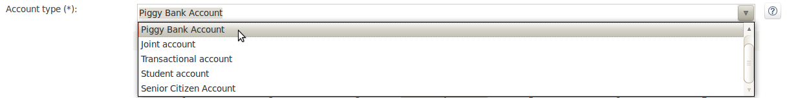

# Chapter 12. Eclipse Designer


Activiti 同时还有个Eclipse 插件，Activiti Eclipse Designer ，可用于图形化建模、测试、部署 BPMN 2.0的流程。

## Installation

以下安装指南在 [Eclipse Indigo](http://www.eclipse.org/downloads/). 须注意Eclipse 的Helio 是支持**NOT** 的.

打开 **Help -> Install New Software**. 在如下面板中 , 点击 *Add* 按钮, 然后填入下列字段:

- **Name:** Activiti BPMN 2.0 designer
- **Location:** http://activiti.org/designer/update/


务必选中 **"Contact all updates sites.."** , 因为它会检查所有当前安装所需要的插件并可以被Eclipse下载.

## Activiti Designer 编辑器的特性


- 创建Activiti 项目和图形.

  

  

- 当创建一个ACTIVITI表格的时候，Activiti Designer会建立一个BPMN的文档.打开Activiti Diagram 辑器时会出现一个图示的画布和调色板,同一文件在用XML编辑器打开后,会显示BPMN2.0程定义XML元素.因此,同一个文件能同时使用图形图以及BPMN 2.0XML. 注意Activiti的5.9 BPMN扩展尚未作为部署文件来支持程定义. 因此,Activiti Designer 的“创建部署文件”功能生成一个BAR文件,BAR里面有一个含.bpmn内容的.bpmn20.xml文件.您也可以做一个快速的文件重命名.另外,你也可直接用Activiti Designer 打开.bpmn20.xml文件.

  

  

- BPMN 2.0XML文件可以导入Activiti Designer,并创建一个图表, 只需复制BPMN 2.0 XML进你的项目,再用.Activiti Designer打开它. Activiti Designer用BPMN DI的文件创建图表信息.如你有一个BPMN2.0的XML文件而无BPMN DI信息，那也无图可创建.

  

  

- 对于部署 BAR 文件以及可选的 JAR 文件,可以通过右击 package explorer视图中的Activiti项目,然后选择弹出菜单底问的 *Create deployment artifacts* 选项 由Activiti Designer来创建.更多关于Designer的部署功能,见 [部署](http://www.mossle.com/docs/activiti/index.html#eclipseDesignerDeployment) 一节.

  

  

- 生成单元测试 (在package explorer 视图下右击BPMN2.0的XML文件,然后选择 *generate unit test*)生成的单元测试是配置为运行有H2数据 库上的Activiti配置.你现在就可以运行单元测试来测试你的流程定义了.

  

  

- Activiti 项目可以做为Maven 项目来生成.但是需要配置依赖关系 需要运行 *mvn eclipse:eclipse* 这样Maven的依赖会像预期的那样被配置. 注意对于流程设计来讲是不需要Maven的依赖.只是在运行单元测试时需要.

  

  


## Activiti Designer 的BPMN 特性


- 支持开始没有事件,启动错误事件、定时器启动事件,最后没有一个错误事件,事件,结束序列流, 并行网关,网关,网关,独家包容事件网关,嵌入式子流程、事件子流程、调用活动,游泳池,车道, 脚本任务、用户任务、服务任务,邮件任务,手动任务,业务规则任务,获得任务, 定时器边界事件、错误边界事件、信号边界事件、定时器捕获事件,信号捕捉事件、信号投掷项目, 和四个Alfresco特定的元素(用户、脚本、邮件任务和开始事件).

  

  

- 可以很快地改变一个任务的类型,只需鼠标悬停在该元素上,然后选择新的任务类型.

  

  

- 可以快速地添加一个新元素,只需鼠标悬停某个元素上,然后选择一个新的元素类型.

  

  

- 支持对Java 服务任务的Java 类、表达式以及代理表达式的配置.此外,也可以配置字段扩展.

  

  

- 支持pools 和 lanes, 因为Activiti能根据不同的程定义读取不同的存储池.它使仅用一个存储池看起来意义重大.如果您使用多个池，要注意储存池的图序列流动，它可能会在部署AD引擎的过程中发生问题.当然,只要你想,你可以添加尽可能多的POOL,LANES.

  

  

- 您可以通过填写名称属性添加标签序列流. 你可以自己定位标签的位置保存为BPMN 2 XML DI部分信息

  

  

- 支持子流程事件.

  

  

- 支持扩嵌入式子流程. 你还可以添加一个嵌入式子流程进另一个嵌入式子流程.

  

  

- 支持任务和嵌入子过程上的定时器边界事件.尽管,定时器边界事件最大的意义在于可以在Activiti Designer 中 的用户任务或嵌入子过程上使用.

  

  

- 支持附加的Activiti 的扩展,如邮件任务、用户任务候选者配置以及脚本任务的配置.

  

  

- 支持Activiti 执行监听和任务监听.可以给执行监听添加字段扩展.

  

  

- 支持顺序流上的条件.

  

  


## Activiti Designer 部署特性

将流程定义和任务表单部署到Activiti引擎并不难.要准备一个BAR 文件,其内含有流程定义的BPMN 2.0的XML 文件, 还可以有任务表单以及可以在Activiti Explorer中浏览的流程图片.在Activiti Designer中创建BAR文件是非常简单 的.完成流程实现后,在package explorer视图下右击你的Activiti项目,然后选择弹出菜单底部的 **Create deployment artifacts** 选项.


接下来,deployment目录会被创建,其内包含有BAR文件,你的Activiti项目中的Java类的JAR文件也可以在此.


现在就可以使用Activiti Explorer中的部署标签将这个文件部署到Activiti引擎上了,相信你已经准备好了.

当你的项目中含有Java 类时,部署要稍微麻烦一点.这种情况下,Activiti Designer 中的 **Create deployment artifacts** 同时会生成包含编译了的类的JAR 文件. 必须将这个JAR文件部署到你的Activiti Tomcat安装路径下的activiti-XXX/WEB -INF/lib路径下.以使得 这些类在Activiti引擎的类路径下是可用的.

## 扩展Activiti Designer

你可以对Activiti Designer提供的默认功能进行扩展.这一节介绍有哪些扩展可用,如何使用这些扩展, 并提供了一些使用的例子.当默认的功能不能满足要求,需要额外功能时,或者业务流程建模时有领域 所特有的需求时，扩展Activiti Designer就变得很有用了.Acitiviti Designer的扩展分为两种不同的 类型,扩展画板和扩展输出格式.每种形式都有其特有的方式和不同的专业技术.


### Note

扩展Activiti Designer 需要有技术知识以及专业的Java 编程的知识.根据你要创建的扩展类型, 你可能也要熟悉Maven、Eclipse 、OSGI、Eclipse扩展以及SWT.


### 定制画板

流程建模时,可以定制显示给用户的画板.画板是那些可在流程图形的画布上拖拽的形状的集合, 它显示在画布右边.正如你在默认画板所看到的.默认的形状被分组到了事件、分支等区隔(称为"抽屉") 中.Activiti Designer 中有两种内置的选择来定制画板中的抽屉和形状:

- 将你自己的形状/节点添加到现有的或新的抽屉内.
- 禁用Activiti Designer提供的任何或所有的默认BPMN 2.0的形状,除了连接工具和选择工具.

要想定制画板，需要创建一个JAR 文件，并将其添加到Activiti Designer 特定的安装目录下 (后面有更多关于 [如何操作](http://www.mossle.com/docs/activiti/index.html#eclipseDesignerApplyingExtension) ). 这样的 JAR 文件称为 *扩展*. 通过编写包含在扩展中的类, Activiti Designer就能知道你 想要的定制.为了使其运行, 类必须实现某些接口.你需要将一个集成了这些接口以及一些继承用的基础 类的类库添加到你项目的类路径下.

你可以在Activiti Designer管理的源码下找到下面列出的代码实例.查看Activiti源码 `projects/designer` 目录下的`examples/money-tasks` 目录.


### Note

可以使用你所偏爱的工具来设置你的项目,然后使用你选择的构建工具来构建JAR文件. 下面的说明,设置假设使用的是Eclipse Helios ，Maven（3.x）作为构建构建工具, 但任何其 它的设置也都能让你创建同样的结果.


#### 扩展的设置 (Eclipse/Maven)

下载并解压 [Eclipse](http://www.eclipse.org/downloads) (使用最新版本) 和最新版本(3.x)的[Apache Maven](http://maven.apache.org/download.html). 如果你使用2.x版本 的Maven, 在构建项目时会运行出错, 所以确保你的版本是最新的. 我们假设你能熟练使用基 本特性和Eclipse的Java编辑器. 由你决定是使用Eclipse 的Maven 特性还是在命令行上运行 Maven 命令.

在Eclipse里创建一个新项目.这是一个普通的项目类型.在项目的根路径下创建 `pom.xml`文件用来包含Maven 项目的设置. 同时创建 `src/main/java` 和`src/main/resources`文件, 这是Maven 对于Java 源文件和资源的约定. 打开`pom.xml` 文件并添加下列代码:


```
<project
  xmlns="http://maven.apache.org/POM/4.0.0"
  xmlns:xsi="http://www.w3.org/2001/XMLSchema-instance"
  xsi:schemaLocation="http://maven.apache.org/POM/4.0.0 http://maven.apache.org/maven-v4_0_0.xsd">

  <modelVersion>4.0.0</modelVersion>

  <groupId>org.acme</groupId>
  <artifactId>money-tasks</artifactId>
  <version>1.0.0</version>
  <packaging>jar</packaging>
  <name>Acme Corporation Money Tasks</name>
...
</project>
```


正如你所看到的, 这只是一个定义了项目`groupId`, `artifactId` 和 `version`的基本的pom.xml 文件. 我们将创建 一个定制,其中包含我们money业务中一个的自定义节点.

通过在`pom.xml` 文件内引入依赖,就可以将集成的类库添加到你项目的依赖中:


```
<dependencies>
  <dependency>
    <groupId>org.activiti.designer</groupId>
    <artifactId>org.activiti.designer.integration</artifactId>
    <version>5.12.0</version> <!-- Use the current Activiti Designer version -->
    <scope>compile</scope>
  </dependency>
</dependencies>
...
<repositories>
  <repository>
      <id>Activiti</id>
      <url>https://maven.alfresco.com/nexus/content/groups/public/</url>
   </repository>
</repositories>
```


最后,在` pom.xml`文件中添加对`maven-compiler-plugin` 的配置,Java 源代码级别最低是1.5 (看下面的代码片段). 这在使用注解时需要。也可以包含让Maven 生成JAR的`MANIFEST.MF` 文件的命令. 这不是必需的, 但这样你可以使用清单文 件的一个特定的属性作为扩展的名称 (这个名称可以显示在Designer的某处, 主要是为以后如果Designer 中有几个扩展的时候使用).如果你想这样做,将以下代码片段包含进 `pom.xml`文件:


```
<build>
  <plugins>
        <plugin>
      <artifactId>maven-compiler-plugin</artifactId>
      <configuration>
        <source>1.5</source>
        <target>1.5</target>
        <showDeprecation>true</showDeprecation>
        <showWarnings>true</showWarnings>
        <optimize>true</optimize>
      </configuration>
    </plugin>
    <plugin>
      <groupId>org.apache.maven.plugins</groupId>
      <artifactId>maven-jar-plugin</artifactId>
      <version>2.3.1</version>
      <configuration>
        <archive>
          <index>true</index>
          <manifest>
            <addClasspath>false</addClasspath>
            <addDefaultImplementationEntries>true</addDefaultImplementationEntries>
          </manifest>
          <manifestEntries>
            <ActivitiDesigner-Extension-Name>Acme Money</ActivitiDesigner-Extension-Name>
          </manifestEntries>
        </archive>
      </configuration>
    </plugin>
  </plugins>
</build>
```


扩展的名称是由`ActivitiDesigner-Extension-Name` 属性描述的. 现在剩下唯一要做的就是让 根据`pom.xml`件中的指令来设置项目了. 所以打开命令窗口,转到Eclipse 工作空间下你的项目的根文件夹.然后执行以下Maven命令:


```
mvn eclipse:eclipse
```


等待构建完成.刷新项目(使用项目上下文菜单(右击),选择`Refresh`). 此时,`src/main/java`和`src/main/resources` 文件夹应该 已经是Eclipse 项目下的资源文件夹了.

### Note

当然你也可以使用 [m2eclipse](http://www.eclipse.org/m2e) 插件，只要从项目的上下文菜单（右击）就能启用Maven 依赖管理。然后在项目上下文菜 单中选择`Maven` > `Update project configuration` 这也能设置源文件夹.

设置就这样.现在就可以开始创建Activiti Designer的定制了!

#### 将扩展应用到Activiti Designer

你可能想要知道怎样才能将扩展添加到Activiti Designer 以使定制被应用.这就是操作步骤:

- 一旦创建完扩展的JAR（例如,利用Maven执行项目内的mvn的安装程序进行构建）,需要 将其放在计算机中安装Activiti Designer 的地方;

- 将扩展存储到硬盘中一个可以的地方，记住这个地方. *注意:* 该位置必须是Activiti Designer外Eclipse workspace以外的路径, workspace中存储扩展将导致用户得到一个弹出错误消息,无法扩展;

- 启动Activiti Designer,选择菜单栏中的 `Window` > `Preferences`

- 在preferences窗口中, 输入 `user`关键字. 在`Java` 部分中你应该能看到访问Eclipse 中的`User Libraries`一项.

  

  

  

- 选择User Libraries,在右侧显示的树形视图中你可以添加类库.你会看到用来向 Activiti Designer添加扩展的默认分组(根据安装的Eclipse,可能也会看到另外其它的分组).

  

  

  

- 选择`Activiti Designer Extensions` 分组,点击`Add JARs...` 按钮. 导航到存储扩展的文件夹，选择你想要添加的扩展文件.完成后,这个扩展就作为 `Activiti Designer Extensions` 分组的一部分显示在preference 窗口内,如下显示.

  

  

  

- 点击`OK` 按钮并关闭preferences对话框.`Activiti Designer Extensions` 分组自动添加到了你新创建的Activiti项目.在Navigator 或Package Explorer 视图中你可以看 到此用户类库作为一项出现在项目树中。如果工作空间内已经存在Activiti 的项目了，你也会 看到新扩展显示在该分组内.例子如下所示.

  

  

  

此时在打开图形的画板中将有来自新扩展的形状（或禁掉的形状，取决于扩展内的定制）.如果 已经打开了图形,将其关闭后重新打开看看画板中有什么变化.

#### 向画板添加形状

根据你的项目的设置,现在你就能够很容易在画板中添加形状了.每个要添加的形状都是由JAR文件中 的类来描述的.注意这些类并不是Activiti 引擎在运行时使用的类.在扩展内描述的那些属性可以设 置给每个Activiti Designer 内的形状, you can also define the runtime characteristics that should be used by the engine when a process instance reaches the node in the process. The runtime characteristics can use any of the options that Activiti supports for regular `ServiceTask`s. See [这一节](http://www.mossle.com/docs/activiti/index.html#eclipseDesignerConfiguringRuntime) for more details.

一个形状的类就是添加了一些注解的普通Java 类.这个类必须实现 `CustomServiceTask` 接口,但你不必自己实现这个接口.只需继承 `AbstractCustomServiceTask` 这个基类 （目前,必须是直接继承这个类,中间不要有抽象类）.在这个类的Javadoc中你可以找到关于它所提供的 默认设置以及何时需要重写它所实现了的方法的说明.重写让你做一些诸如为画板和画布上的形状提供 图标（可以是不同的）、指定你想让节点（活动、事件、分支）拥有的基本形状的事情.


```
/**
 * @author John Doe
 * @version 1
 * @since 1.0.0
 */
public class AcmeMoneyTask extends AbstractCustomServiceTask {
...
}
```


需要实现 `getName()` 方法来决定画板中节点使用的名称.也可以将节点放进 一个属于它们自己的抽屉,并为其提供一个图标.重写 `AbstractCustomServiceTask`. 中恰当的方法.如果你想要提供一个图标,确保图标在JAR中`src/main/resources` 包 内,大小为16x16 像素,格式为JPEG 或PNG.提供的路径是相对于那个文件夹的.

给图形添加属性是通过向此类添加成员变量,并使用 `@Property` 注解对其 进行注解来完成的,如下:


```
@Property(type = PropertyType.TEXT, displayName = "Account Number")
@Help(displayHelpShort = "Provide an account number", displayHelpLong = HELP_ACCOUNT_NUMBER_LONG)
private String accountNumber;
```


有几个`PropertyType` 值你可以使用,在[这一节](http://www.mossle.com/docs/activiti/index.html#eclipseDesignerPropertyTypes). 做详细介绍.通过将required 属性设置为true可以使字段成为必填项.如果用户不填写该字段,就会 有消息和红色背景显示.

如果要确保类中这些属性是它们在property 窗口出现的顺序，需要指定 `@Property` 注解的order属性.

正如你所看到了,有个 `@Help` 注解用来在填写字段时给用户提供一些引导. 也可以将`@Help` 注解用于类本身——这个信息会显示在呈现给用户的属性表的上方.

下面列出了对`MoneyTask`. 的详细阐述。添加了一个comments 字段,你会看 到该节点包含了一个图标.


```
/**
 * @author John Doe
 * @version 1
 * @since 1.0.0
 */
@Runtime(javaDelegateClass = "org.acme.runtime.AcmeMoneyJavaDelegation")
@Help(displayHelpShort = "Creates a new account", displayHelpLong = "Creates a new account using the account number specified")
public class AcmeMoneyTask extends AbstractCustomServiceTask {

  private static final String HELP_ACCOUNT_NUMBER_LONG = "Provide a number that is suitable as an account number.";

  @Property(type = PropertyType.TEXT, displayName = "Account Number", required = true)
  @Help(displayHelpShort = "Provide an account number", displayHelpLong = HELP_ACCOUNT_NUMBER_LONG)
  private String accountNumber;

  @Property(type = PropertyType.MULTILINE_TEXT, displayName = "Comments")
  @Help(displayHelpShort = "Provide comments", displayHelpLong = "You can add comments to the node to provide a brief description.")
  private String comments;

  /*
   * (non-Javadoc)
   *
   * @see org.activiti.designer.integration.servicetask.AbstractCustomServiceTask #contributeToPaletteDrawer()
   */
  @Override
  public String contributeToPaletteDrawer() {
    return "Acme Corporation";
  }

  @Override
  public String getName() {
    return "Money node";
  }

  /*
   * (non-Javadoc)
   *
   * @see org.activiti.designer.integration.servicetask.AbstractCustomServiceTask #getSmallIconPath()
   */
  @Override
  public String getSmallIconPath() {
    return "icons/coins.png";
  }
}
```


如果拿这个形状来扩展Activiti Designer,画板和对应的节点看起来会如此:


money任务的属性窗口显示如下.注意对于`accountNumber` 字段的必填信息.


在使用过程变量的属性字段创建图表时,用户可输入静态文本或用表达式.如 (e.g. "This little piggy went to ${piggyLocation}"). 一般来说，这适用于文本字段，用户可以自由用于任何文本.如果希望用户使用表达式然后你申请运行期的行为给你的`CustomServiceTask` (使用 `@Runtime`),保在此种受拖类型中使用`Expression` 以便表达式在运行时能做正确解析.运行时行为的更多信息，可以在 [this section](http://www.mossle.com/docs/activiti/index.html#eclipseDesignerConfiguringRuntime)中找到.

每个属性右边的按钮给出了对于字段的帮助.点击按钮显示弹出框,如下显示的.


##### 配置运行时执行自定义服务任务

你的字段设置及扩展适用于设计者,用户在建模过程中可以配置服务任务的属性,在大多数情况下,你会在Activiti的执行进程时想要使用用户配置的属性.要做到这一点,当进程达到`CustomServiceTask`时,必须指示出Activiti的其中的一类实例.

有一个特殊的注解来指定运行时`CustomServiceTask`的特点，`@Runtime`标注.如例:

```
@Runtime(javaDelegateClass = "org.acme.runtime.AcmeMoneyJavaDelegation")
```

你的 `CustomServiceTask` 将使一个正常的`ServiceTask`在BPMN建模过程中输出。 Activiti的使[several ways](http://www.mossle.com/docs/activiti/index.html#bpmnJavaServiceTask)来定义`ServiceTask`运行时的特征。因此，`@Runtime`标注可以采取三个属性之一，它可直接匹配Activiti的选项，如下：

- `javaDelegateClass`映射到`activiti:class` 在BPMN输出。实现`JavaDelegate`一类的完全限定类名.
- `expression`映射到`activiti:expression` 在BPMN输出. 指定表达式的方法被执行,就如Spring Bean的方法. 使用此选项时,您应该您应该*not* 指定任何 `@Property` 注解字段.欲知详情, 请参下文.
- `javaDelegateExpression` 映射到 `activiti:delegateExpression` 在BPMN中输出. 指定表达式`JavaDelegate`的类名.


如果你的成员提供Activiti的注入运行时类,用户的属性值将被注入进去.名称应与成员在`CustomServiceTask`里的名称相匹配,欲了解更多信息,请参考用户手册中的[this part](http://www.mossle.com/docs/activiti/index.html#serviceTaskFieldInjection).请注意,因为5.11.0版本的设计者可以用`Expression`界面给动态字段值.这意味着,此设计属性的价值必须包含一个表达式,这个表达式将在实施`JavaDelegate` 类别时被注入`Expression`

### Note

你可在你`CustomServiceTask`的成员中使用`@Property` 注解,如果你使用`@Runtime`'s `expression`属性运行,将无法正常工作.原因是Activiti会试图解决*method* 而不是一个类别.因此,任何成员打上`@Property`都会被设计者忽略,如果你使用的`expression` `@Runtime`标注.设计师不会使它们作为节点的属性窗格中的可编辑字段,在进程的BPMN的属性将不会产生输出.

### Note

注意运行时类不应该在您的扩展JAR,因为它依赖于Activiti库.Activiti需要在运行时能够找到它,所以它需要在Activiti引擎的类路径.

设计师的源代码树中包含不同选择的项目配置`@Runtime`的例子。看一看money-tasks项目的一些出发点，它涉及到以钱为代表的项目类别的例子.

#### 属性的类型

本节描述属性的类型,通过`CustomServiceTask`的type 属性设置为一个 `PropertyType`值,可以将其用于自定义服务任务.

##### PropertyType.TEXT

如下所示,创建一个单行文本域.可以是必填项,其验证信息以提示框的方式显示.通过将域的 背景颜色改为淡红色来显示验证失败.


##### PropertyType.MULTILINE_TEXT

如下所示,创建多行文本域（高度固定为80个像素）.可以是必填项,其验证信息以提示框的 方式显示.通过将域的背景颜色改为淡红色来显示验证失败.


##### PropertyType.PERIOD

创建结构化的编辑器,使用微调控件编辑每个单位数量来确定一段时间.结果如下所示. 可以是必填项（理解为不是所有值都为0,时间至少要有1部分是非零值）,其验证信息以提示 框的方式显示.通过将域的背景颜色改为淡红色来显示验证失败.该字段的值是以格式为 1y 2mo 3w 4d 5h 6m 7s 的字符串进行存储的，表示1年,2个月,3个星期,4天,5小时,6分钟,7 秒. 整个字符串都将被存储,即使有的部分是0.


##### PropertyType.BOOLEAN_CHOICE

创建单个复选框来控制布尔逻辑或切换选择.注意你可以指定`Property` 注解的 `required` 属性,但它不会被计算,因为那会使用户不得选择,不管 是不是选中了选择框.图形存储的值是java.lang.Boolean.toString(boolean) ,其结果是"true" 或"false".


##### PropertyType.RADIO_CHOICE

如下所示,创建一组单选按钮.选择任一单选按钮与选择任一其它单选按钮都是排斥的 （即,只允许选择一个）.可以是必填项,其验证信息以提示框的方式显示.通过将这一组的背 景颜色改为淡红色来显示验证失败.

这个属性类型要求注解的类的成员还要有`@PropertyItems` 注解（例子,如下）.利用这个额外的注解,你可以指定以字符串数组来提供的项目列表.通过 为每个项目添加两个数组项来制定这些项目;第一个是要显示的标题;第二个是要存储的值.


```
@Property(type = PropertyType.RADIO_CHOICE, displayName = "Withdrawl limit", required = true)
@Help(displayHelpShort = "The maximum daily withdrawl amount ", displayHelpLong = "Choose the maximum daily amount that can be withdrawn from the account.")
@PropertyItems({ LIMIT_LOW_LABEL, LIMIT_LOW_VALUE, LIMIT_MEDIUM_LABEL, LIMIT_MEDIUM_VALUE, LIMIT_HIGH_LABEL, LIMIT_HIGH_VALUE })
private String withdrawlLimit;
```


##### PropertyType.COMBOBOX_CHOICE

如下所示,创建带有固定选项的下拉列表框.可以是必填项,其验证信息以提示框的方式显示. 通过将下拉列表框的背景颜色改为淡红色来显示验证失败.

这个属性类型要求被注解的类的成员还要有 `@PropertyItems` 注解（例子,如下）.利用这个额外的注解,你可以指定以字符串数组来提供的项目列表.通过 为每个项目添加两个数组项来制定这些项目;第一个是要显示的标题;第二个是要存储的值.


```
@Property(type = PropertyType.COMBOBOX_CHOICE, displayName = "Account type", required = true)
@Help(displayHelpShort = "The type of account", displayHelpLong = "Choose a type of account from the list of options")
@PropertyItems({ ACCOUNT_TYPE_SAVINGS_LABEL, ACCOUNT_TYPE_SAVINGS_VALUE, ACCOUNT_TYPE_JUNIOR_LABEL, ACCOUNT_TYPE_JUNIOR_VALUE, ACCOUNT_TYPE_JOINT_LABEL,
  ACCOUNT_TYPE_JOINT_VALUE, ACCOUNT_TYPE_TRANSACTIONAL_LABEL, ACCOUNT_TYPE_TRANSACTIONAL_VALUE, ACCOUNT_TYPE_STUDENT_LABEL, ACCOUNT_TYPE_STUDENT_VALUE,
  ACCOUNT_TYPE_SENIOR_LABEL, ACCOUNT_TYPE_SENIOR_VALUE })
private String accountType;
```





##### PropertyType.DATE_PICKER

如下所示,创建日期选择控件.可以是必填项,其验证信息以提示框的方式显示 （注意,使用的控件自动设置为选中系统日期，所以该值很少为空.通过将此控件的 背景颜色改为淡红色来显示验证失败.

这个属性类型要求注解的类成员还要有`@DatePickerProperty` 注解（示例，见下文）.利用这个额外的注解,你可以指定图形中用于存储日期时间的模式, 以及你想要显示的日期选择器的类型.这两个属性都是可选的,并且如果不指定它们都会使 用默认值（它们是 `DatePickerProperty` 注解中的静态变量). `dateTimePattern`属性用来向 `SimpleDateFormat` 类提供模式.在使用`swtStyle` 属性时, 必须指定`SWT`的 `DateTime` 控件所支持的 一个整数，因为正是使用这个控件来渲染这个属性类型的.


```
@Property(type = PropertyType.DATE_PICKER, displayName = "Expiry date", required = true)
@Help(displayHelpShort = "The date the account expires ", displayHelpLong = "Choose the date when the account will expire if no extended before the date.")
@DatePickerProperty(dateTimePattern = "MM-dd-yyyy", swtStyle = 32)
private String expiryDate;
```


##### PropertyType.DATA_GRID

如下所示,创建数据表格控件.数据表格允许用户输入任意多行数据,并为每一行的一 组固定列输入值（每个行和列交叉处称为单元格）.由用户来决定对行的添加、删除.

这个属性类型要求注解的类成员还要有 `@DataGridProperty` 注解（示例,见下文）.利用这个附加注解,可以指定一些数据网格所特有的属性.需要使用 `itemClass` 属性引用一个类来决定哪些列要加入到表格. Activiti Designer 希望成员变量是List类型.习惯上,可以将 `itemClass` 属性表示的类作为泛型类型来使用.例如,如果你要在表格中编辑一个购物单,你会在 `GroceryListItem` 类上定义表格的列.在你的 `CustomServiceTask`内,会想要它是像这样:


```
@Property(type = PropertyType.DATA_GRID, displayName = "Grocery List")
@DataGridProperty(itemClass = GroceryListItem.class)
private List<GroceryListItem> groceryList;
```


除了使用了数据表格,"itemClass"类使用的注解与你用来指定`CustomServiceTask`, 的域的注解是一样的.具体的,目前支持 `TEXT`, `MULTILINE_TEXT` 以及`PERIOD` 你会注意到表格会为每个域创建一个单行的文本控件,不管其`PropertyType`. 是什么类型.这是为了保持表格的图形吸引力和可读性. 例如,如果你想要以正常的显示模式显示`PERIOD`类型的 `PropertyType`,你能想象的到在不搞乱屏幕的情况下它是永远也不会适合于 单元格的（译注.言外之意,必然会搞乱屏幕）,对于`MULTILINE_TEXT` 和 `PERIOD`, 添加在每个域上的双击机制都会弹出一个大的 `PropertyType`.编辑器。用户点击OK后，值被存储到域内，因此它能在表格中被看到.

必填属性的处理类似于处理`TEXT` 类型的普通域,整个表格在任意域失去焦点时 被校验.如果校验失败，数据表格中特定单元格的文本控件的背景颜色会变为浅红.

默认,该组件允许用户添加行,但不允许决定这些行的顺序.如果想要对此允许,必须将 `orderable` 属性设置为true ，这就能让每行末尾的按钮在表格内上下移动.

### Note

此刻,这个属性类型还没被正确注入在运行时的类中.


#### 禁用画板中默认形状

这个定制需要在扩展中包含一个实现了 `DefaultPaletteCustomizer`接口的类. 不要直接实现这个接口,需要创建 `AbstractDefaultPaletteCustomizer` 这个基类的子类.目前,这个类没提供任何功能,但`DefaultPaletteCustomizer` 接口今后的版本会提供更多的能力让这个基类拥有一些合理的默认行为,所以最好继承,这样你的 扩展会兼容将来的发布.

继承 `AbstractDefaultPaletteCustomizer` 类需要你实现方法 `disablePaletteEntries()`, 此方法必须返回一个 `PaletteEntry` 的列表.对于每个默认的形状,通过将它对应的 `PaletteEntry` 值添加到你的列表中 可以将其禁掉.注意如果你移除了默认集合中的形状,抽屉内没有剩余的形状了,那么那个抽屉整个就会 从画板中被移除.如果你希望禁掉所有默认形状,只需将`PaletteEntry.ALL` 添加到你 的结果中.如例子,以下代码禁掉了画板中的手工任务和脚本任务形状.


```
public class MyPaletteCustomizer extends AbstractDefaultPaletteCustomizer {

  /*
   * (non-Javadoc)
   *
   * @see org.activiti.designer.integration.palette.DefaultPaletteCustomizer#disablePaletteEntries()
   */
  @Override
  public List<PaletteEntry> disablePaletteEntries() {
    List<PaletteEntry> result = new ArrayList<PaletteEntry>();
    result.add(PaletteEntry.MANUAL_TASK);
    result.add(PaletteEntry.SCRIPT_TASK);
    return result;
  }

}
```


应用这个扩展的结果显示为如下图片.正如你看到的,手工任务和脚本任务形状不再在 `Tasks` 抽屉中了.


要想禁掉所有默认的形状,可以使用类似于如下的代码.


```
public class MyPaletteCustomizer extends AbstractDefaultPaletteCustomizer {

  /*
   * (non-Javadoc)
   *
   * @see org.activiti.designer.integration.palette.DefaultPaletteCustomizer#disablePaletteEntries()
   */
  @Override
  public List<PaletteEntry> disablePaletteEntries() {
    List<PaletteEntry> result = new ArrayList<PaletteEntry>();
    result.add(PaletteEntry.ALL);
    return result;
  }

}
```


结果看起来就像这样（注意默认形状的那些抽屉不再显示在画板中了）:


### 校验图形和导出到自定义的输出格式

除了定制画板,你还可以给Activiti Designer创建能执行校验、将来自图形的信息保存到 Eclipse工作空间内的自定义资源的扩展.对此有内置扩展点,本节说明如何使用这些扩展点.


### Note

最近重新使用了ExportMarshaller。我们仍然在开发校验相关的功能。 下面的文档介绍的是老方案， 一旦新功能完成，就会更新。


Activiti Designer允许编写校验图形的扩展.默认工具中已经存在BPMN 构造的校验了,但 如果你想要对更多项进行校验,比如建模约定或 `CustomServiceTask`属性中 的值,这时你就可以添加自己的校验了.这样的扩展被称为`Process Validators` (流程校验器).

你也可以让Activiti Designer在保存图形时公布一些额外的格式。这样的扩展被称为 `Export Marshallers`(输出装配器),每次用户保存时都会由Activiti Designer 自动调用。通过在Eclipse 设置对话框来启用或禁用这一个行为，这会对扩展进行检测。 Designer会确保在保存图片时，根据用户的配置来调用`ExportMarshaller`。

通常, 会想将`ProcessValidator`和`ExportMarshaller` 进行联合.假如你有几个`CustomServiceTask`在用,其属性你想要在生 成的流程中使用.然而,在流程产生出来之前,你想首先校验其中一些值.结合`ProcessValidator` 和 `ExportMarshaller`是完成这的最好方法，Activiti Designer 能够 将你的扩展无缝隙地插入到这一工具内.

要创建 `ProcessValidator`和 `ExportMarshaller`, 需要创建与扩展画板所不同的扩展。原因很简单：在你的代码中，需要访问更多由集成类库提 供的API.特别是,你会使用Eclipse本身中的类.所以要开始,必须先创建一个Eclipse插件（利用 Eclipse对PDE的支持来完成）,然后将它打包在一个自定义的Eclipse产品或特性中.解释 开发Eclipse插件的所涉及的所有详细信息超出了本用户指南的范畴,所以以下说明只局限于 扩展Activiti Designer功能.

你的模块必须依赖以下类库:


- org.eclipse.core.runtime
- org.eclipse.core.resources
- org.activiti.designer.eclipse
- org.activiti.designer.libs
- org.activiti.designer.util


另外，Designer中也可以使用org.apache.commons.lang，你可以根据需要在自己的扩展中使用。

`ProcessValidator`和`ExportMarshaller`都是通过 继承基础类来创建的.这些基础类从其超类 `AbstractDiagramWorker`那里继 承了一些很有用的方法.利用这些方法可以创建显示在Eclipse中problems视图内帮助用户找出问 题或要点的消息、警告以及错误标记。也可以通过`Resources`和`InputStreams` 获得图形的内容。这些信息保存在`DiagramWorkerContext`， 由`AbstractDiagramWorker`提供。

把调用`clearMarkers()`作为在`ProcessValidator` 或`ExportMarshaller`内的第一件要做的事可能会是个好主意;这将清理掉所 有之前操作人员的标记（标记自动链接到操作人员，清除一个操作人员的标记不会影响到其它 标记）.例如 :


```
// Clear markers for this diagram first
clearMarkersForDiagram();
```


你还应该利用进度监控将进度情况报告给用户（在`DiagramWorkerContext`中），因为校验和/或装配行为都会占用一些时间, 在此期间用户被迫等待.报告进度的情况需要一些关于如何使用Eclipse 特性的知识.仔细看 一下 [这篇](http://www.eclipse.org/articles/Article-Progress-Monitors/article.html) 深入解释了概念和用法的文章.

#### 创建ProcessValidator扩展


### Note

需要复审！


在`plugin.xml`文件内给 `org.activiti.designer.eclipse.extension.validation.ProcessValidator` 扩展点创建扩展.需要为此扩展点创建`AbstractProcessValidator`类的子类.


```
<?eclipse version="3.6"?>
<plugin>
  <extension
    point="org.activiti.designer.eclipse.extension.validation.ProcessValidator">
    <ProcessValidator
      class="org.acme.validation.AcmeProcessValidator">
    </ProcessValidator>
  </extension>
</plugin>
```


```
public class AcmeProcessValidator extends AbstractProcessValidator {
}
```


必须实现几个方法.最重要的是,实现`getValidatorId()`,为你的校验器 返回一个全局唯一的ID。这让你能在 `ExportMarshaller`内对其进行调用,甚至 可以让其他人在他们的`ExportMarshaller`内调用你的校验器.实现`getValidatorName()`，返回校验器的逻辑名.这个名称在对话框中显示给用户. 在`getFormatName()`中,可以返回校验器通常校验的图形的类型.

校验本身是在`validateDiagram()`方法内进行的.以此来看,根据你的具 体功能在这里放什么样的代码.但通常在开始你会取得图形的流程节点,这样你就可以循环遍历它 们,收集、对比并校验数据.本代码片段展示给你如何进行这些操作:


```
final EList<EObject> contents = getResourceForDiagram(diagram).getContents();
for (final EObject object : contents) {
  if (object instanceof StartEvent ) {
  // Perform some validations for StartEvents
  }
  // Other node types and validations
}
```


在你完成校验后,不要忘记调用`addProblemToDiagram()`和/或 `addWarningToDiagram()`,等等.务必最后返回正确的布尔类型的结果值来表明 你考虑的校验是成功还是失败.这个结果可以被调用`ExportMarshaller` 使用来决定下一步操作.

#### 创建ExportMarshaller扩展

在`plugin.xml`文件内给 `org.activiti.designer.eclipse.extension.ExportMarshaller` 扩展点创建扩展.需要为此扩展点创建`AbstractExportMarshaller` 类的子类. 这个抽象基类提供了在编组到你自己格式时所使用的几个有用的方法，但最重要的是它允许你 将资源保存到工作空间内，还允许调用校验器.

在Designer的examples目录下有一个示例。这个例子演示了如何使用基础类中的方法实现基本功能， 比如访问图形的`InputStream`， 使用`BpmnModel`，并将资源保存到工作区中。


```
<?eclipse version="3.6"?>
<plugin>
  <extension
    point="org.activiti.designer.eclipse.extension.ExportMarshaller">
    <ExportMarshaller
      class="org.acme.export.AcmeExportMarshaller">
    </ExportMarshaller>
  </extension>
  </plugin>
```


```
public class AcmeExportMarshaller extends AbstractExportMarshaller {
}
```


需要你来实现某些方法，如`getMarshallerName()`及`getFormatName()`. 这些方法用来向用户显示选项以及在进度对话框中显示信息,因此要确保你所描述的能表达出你实现的功能.

大部分你的工作是在 `doMarshallDiagram()方法`完成的。

如果想先执行某个校验,可以直接在你的装配器内调用校验器.从校验器接收到一个布尔类型的结果值, 这样你就能知道校验是否成功.大多数情况下,如果校验无效是不会对图形进行编组的,但你也可以选择继续, 甚至校验失败后,创建一个不同的资源。

一旦获得了所有你所需要的数据,就可以调用`saveResource()`方法来创建包含着 你的数据的文件了.可以在单个ExportMarshaller内多次调用`saveResource()`, 所以装配器可用来创建多个输出文件.

利用`AbstractDiagramWorker`类中`saveResource()`方法可以给输出的资源构造文件名。 有几个你已经解析过了的有用的变量，允许你来创建像_original-filename__my-format-name.xml 的文件名。 Javadocs 内有对这些变量的描述，`ExportMarshaller`接口中也做了定义。 你也可以使用`resolvePlaceholders()`处理一个string（比如，一个路径），如果你想自己解析占位符。 `getURIRelativeToDiagram()`会帮你做这些事情。

你应该利用进度监控将进度情况报告给用户[这篇文章](http://www.eclipse.org/articles/Article-Progress-Monitors/article.html)描述了如何来完成.
