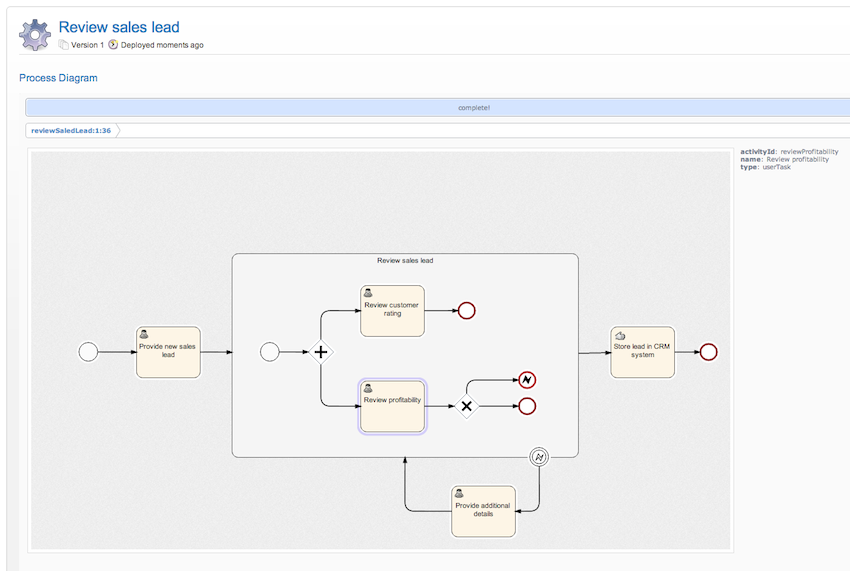
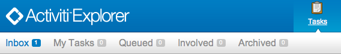
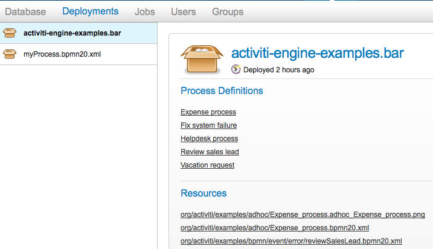
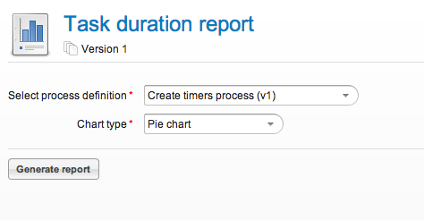

# Chapter 13. Activiti Explorer


Activiti Explorer，我习惯称之为Activiti控制台，后面也这么翻译。Activiti控制台是一个web应用程序，当我们从Activiti的官方网站下载Activiti的压缩zip文件时候，Activiti控制台在${Activiti_home}/wars文件夹下面。该控制台的目的并不是创建一个完善的web应用程序，仅仅是为客户端用户准备的应用程序，但是却能够练习和展示Activiti的功能。正如这样，控制台仅仅只是一个Demo， 可能有人会使用该控制台集成到他们自己的系统之中。另外，对于该控制台，我们使用了一个内存数据库，也很容易换成你自己的数据库（查看WEB-INF文件夹下面的applicationContext.xml文件）。

随后，登录进该控制台，你将会看见四个比较大的图标按钮用于显示主要功能。


- **Tasks**: 任务管理功能。 这里，如果你是办理人，你可以看见运行中流程实例的自己的待办任务，或者你可以拾取组任务。 控制台涉及的功能，子任务的工作，不同角色的人，等等...控制台也可以允许创建一个独立的任务，该任务并没有关联任何流程实例。
- **Process**: 显示部署的流程定义列表，并且可以启动一个新的流程实例。
- **Reporting**: 生成报表和显示之前保存历史的结果数据。查看[报表这一节](http://www.mossle.com/docs/activiti/index.html#explorer.reporting)可以获取更多的信息。
- **Manage**: 当登录的用户具有超级管理员权限才能够看见。用于管理Activiti的流程引擎：管理用于和组，执行和查看停止的jobs，查看数据库和部署新的流程定义。


## 流程图

控制台包含的功能，使用[Raphaël](http://raphaeljs.com/)Javascript框架自动生成一张流程图。 当流程定义XML包含的BPMN注入信息时。该流程图才能够生成。当流程定义XML中并没有BPMN注入信息但是部署的时候包含一张流程图，那么该图片也将会被显示。




当你并不想使用Javascript生成流程图，你可以在ui.properties文件中禁用它。

```
activiti.ui.jsdiagram = false
```


除了在控制台上面显示流程图，控制台也会很容易的包含你想要查看的流程图。 下面的URL将会显示流程定义图片，根据留存定义的ID：

```
http://localhost:8080/activiti-explorer/diagram-viewer/index.html?processDefinitionId=reviewSaledLead:1:36
```

它也可以显示当前流程实例的状态，通过添加一个processInstanceId的请求参数，如下:

```
http://localhost:8080/activiti-explorer/diagram-viewer/index.html?processDefinitionId=reviewSaledLead:1:36&processInstanceId=41
```


## 任务





- **Inbox:** 显示登录用户需要办理的所有任务列表。
- **My tasks:** 显示登录用户任务拥有者的任务列表。当你创建一个独立的任务，你可以自动化操作该任务。
- **Queued:** 显示不用的组任务列表，并且登录用户在该组中。这里的所有任务都必须先拾取然后才能够完成。
- **Involved:** 显示登录用户被参与的任务（即不是办理人和任务拥有者）。
- **归档**包含已经完成的（历史的）任务。


## 启动流程实例

在**流程定义**选项卡，允许你查看Activiti流程引擎部署的所有流程定义。你可以使用页面顶部右边的按钮启动一个新的流程实例。如果该流程定义有一个启动[表单](http://www.mossle.com/docs/activiti/index.html#forms)， 那么在启动流程实例之前就先显示表单。


## 我的流程实例

在**我的流程** 选项卡，显示当前登录用户未完成的用户任务的所有流程实例。这也很直观的显示了流程实例的当前活动和存储的流程变量。


## 管理

在管理功能中，只有当登录用户只权限组*admin*中的成员时，该功能才会显示。当点击 *Manage* 图标按钮，提供以下选项列表

- **数据库:** 在数据库中显示Activiti有关内容.当开发流程或者排除故障等问题的时候是非常有用的。

  

  

- **部署：** 显示当前流程引擎的部署，并且可以看见部署的内容（流程定义，流程图，业务规则，等等...）

  

  当你点击 *部署* 按钮时，你也可以上传新的部署。从自己的计算机中选择一个业务文档或者一个BPMN20.XML文件，或者简单的拖拽到指定的区域就可以部署一个新的业务流程。

  

  

- **Jobs（作业）:** 在左边显示当前的作业（定时器，等等）并且运行手动执行他们（例如在截止时间之前触发定时器）。如果作业执行失败（例如邮件服务器不能正常工作），那么就会显示所有的异常。

  

  

- **用户和组** 管理用户和组：创建，修改和删除用户和组。关联用户和组，这样他们就会有更多的权限或者他们能够看见在任务分配给特地的组。

  

  


## 报表

控制台附带了一些报表例子并且有能力很轻松的在系统中添加新的报表。 报表功能是位于主功能中的*'报表'*按钮。


**重要**: 如果要让报表工作，控制台需要配置历史的级别不能够没有。这默认的配置是满足这一要求的。

目前，该报表选项卡会显示2个子选项卡：

- **生成报表**: 显示系统中已知的报表列表。允许运行生成的报表。
- **保存报表**: 显示之前保存的所有报表列表。注意，这里仅仅显示的是个人保存的报表，并且不能看见其他人保存的报表。


流程的数据被用于生成报表中的列表和图标。第一次看上去可能会很奇怪，使用流程生成报表数据有几个优势。

- 该流程能够直接访问Activiti流程引擎的内部。他直接可以使用流程引擎访问数据库.
- 作业执行器能够用于任何其他的流程。这意味着你能够异步生存流程或者仅仅异步执行某些步骤。这也意味着你可以使用定时器，例如在某些时间点上面生成报表数据。
- 可以用已知的工具和已知的概念创建一个新的报表。同时，没有新的概念，服务或者应用被需要。部署或者上传一个新的报表与部署一个新的流程是一样的。
- 它可以使用BPMN2.0结构。这意味着所有的东西，比如并行网关， 可以实现基于数据或用户请求输入生成分支。

生成报表数据的流程定义需要**把'activiti-report'设置为分类**， 这样就能在Explorer的报表列表中显示出来。报表流程可繁可简。 能够看到报表的唯一要求是，流程会创建一个名为**reportData**的流程变量。 这个变量必须是json对象的二进制数组。 这个变量必须保存到Activiti的历史表中 （所以要求引擎必须启用历史功能） 所以可以在后面报表保存时获取。


### 报告数据JSON

报表流程必须生成一个变量*reportData*，这是一个要展现给用户的JSON数据。 这个json看起来像这样：

```
{
  "title": "My Report",
  "datasets": [
    {
      "type" : "lineChart",
      "description" : "My first chart",
      "xaxis" : "Year"
      "yaxis" : "Total sales"
      "data" :
      {
        "2010" : 50,
        "2011" : 33,
        "2012" : 17,
        "2013" : 87,
      }
    }
  ]
}
          
```

json数据会在Explorer中获取，并用来生成图表或列表。 json的元素为：

- **title**：这个报表的标题
- **datasets**：是数据集的数组，对应报表中不同的图表和列表。
- **type**每个数据集都有一个类型。 这个类型会用来决定如何渲染数据。当前支持的值有： **pieChart, lineChart, barChart 和 list.**
- **description**：每个图表可以 在报表中显示一个可选的描述。
- **x- 和 yaxis**：只对 *lineChart*类型起作用。 这个可选参数可以修改图表坐标系的名称。
- **data**：这是实际的数据。 数据是一个key-value格式的json对象。


### 实例流程

下面的例子演示了一个“流程实例总览”报表。流程本身非常简单，只包含一个脚本任务（除了开始和结束） 使用javascript生成json数据集。 虽然所有Explorer中的例子都使用javascript，它们也可以使用java服务任务。 执行流程最后的结果就是*reportData*变量，保存着数据。

**重要提示：**下面的例子只能运行在JDK 7+环境中。 因为使用了javascript引擎（*Rhino*），如果运行在老JDK版本中 会无法实现一些结果，来像下面一样编写脚本。 参考下面的一个JDk 6+兼容的例子。


```
<?xml version="1.0" encoding="UTF-8"?>
<definitions xmlns="http://www.omg.org/spec/BPMN/20100524/MODEL"
    xmlns:xsi="http://www.w3.org/2001/XMLSchema-instance" xmlns:activiti="http://activiti.org/bpmn"
    xmlns:bpmndi="http://www.omg.org/spec/BPMN/20100524/DI" xmlns:omgdc="http://www.omg.org/spec/DD/20100524/DC"
    xmlns:omgdi="http://www.omg.org/spec/DD/20100524/DI" typeLanguage="http://www.w3.org/2001/XMLSchema"
    expressionLanguage="http://www.w3.org/1999/XPath"
    targetNamespace="activiti-report">

    <process id="process-instance-overview-report" name="Process Instance Overview" isExecutable="true">

        <startEvent id="startevent1" name="Start" />
        <sequenceFlow id="flow1" sourceRef="startevent1" targetRef="generateDataset" />

        <scriptTask id="generateDataset" name="Execute script" scriptFormat="JavaScript" activiti:autoStoreVariables="false">
          <script><![CDATA[

               importPackage(java.sql);
               importPackage(java.lang);
               importPackage(org.activiti.explorer.reporting);

               var result = ReportingUtil.executeSelectSqlQuery("SELECT PD.NAME_, PD.VERSION_ , count(*) FROM ACT_HI_PROCINST PI inner join ACT_RE_PROCDEF PD on PI.PROC_DEF_ID_ = PD.ID_ group by PROC_DEF_ID_");

               var reportData = {};
               reportData.datasets = [];

               var dataset = {};
               dataset.type = "pieChart";
               dataset.description = "Process instance overview (" + new java.util.Date() + ")";
               dataset.data = {};

               while (result.next()) { // process results one row at a time
                 var name = result.getString(1);
                 var version = result.getLong(2)
                 var count = result.getLong(3);
                 dataset.data[name + " (v" + version + ")"] = count;
               }
               reportData.datasets.push(dataset);

               execution.setVariable("reportData", new java.lang.String(JSON.stringify(reportData)).getBytes("UTF-8"));
          ]]></script>
        </scriptTask>
        <sequenceFlow id="flow3" sourceRef="generateDataset" targetRef="theEnd" />

        <endEvent id="theEnd" />

    </process>

</definitions>
            
```


除了流程xml顶部的标准xml，主要区别是*targetNamespace*设置为 **activiti-report**， 把分类设置为与部署的流程定义一样的名称。

脚本的第一行只是进行一些导入，避免每次使用时，都要写包名。 第一个有意义的代码是使用*ReportingUtil*读取activiti数据库。 返回结果是一个*JDBC 结果集*。 查询语句下面，javascript创建了使用的json。 json是符合[上面描述的需求](http://www.mossle.com/docs/activiti/index.html#explorer.reporting.json)的。

最后一行脚本有一点儿奇怪。首先我们需要吧json对象转换成字符串， 使用javascript函数*JSON.stringify()*。 字符串需要保存为二进制数组类型的变量。这是一个技术问题： 二进制数组的大小是无限的，但是字符串的长度有限制。这就是为什么javascript字符串 必须转换成一个java字符串，以获得转换成二进制的功能。

兼容JDK 6（以及更高版本）的同一个流程有一些区别。 原生json功能无法使用，因此提供了一些帮助类（*ReportData* 和 *Dataset*）：

```
<?xml version="1.0" encoding="UTF-8"?>
<definitions xmlns="http://www.omg.org/spec/BPMN/20100524/MODEL"
    xmlns:xsi="http://www.w3.org/2001/XMLSchema-instance" xmlns:activiti="http://activiti.org/bpmn"
    xmlns:bpmndi="http://www.omg.org/spec/BPMN/20100524/DI" xmlns:omgdc="http://www.omg.org/spec/DD/20100524/DC"
    xmlns:omgdi="http://www.omg.org/spec/DD/20100524/DI" typeLanguage="http://www.w3.org/2001/XMLSchema"
    expressionLanguage="http://www.w3.org/1999/XPath"
    targetNamespace="activiti-report">

    <process id="process-instance-overview-report" name="Process Instance Overview" isExecutable="true">

        <startEvent id="startevent1" name="Start" />
        <sequenceFlow id="flow1" sourceRef="startevent1" targetRef="generateDataset" />

        <scriptTask id="generateDataset" name="Execute script" scriptFormat="js" activiti:autoStoreVariables="false">
          <script><![CDATA[

               importPackage(java.sql);
               importPackage(java.lang);
               importPackage(org.activiti.explorer.reporting);

               var result = ReportingUtil.executeSelectSqlQuery("SELECT PD.NAME_, PD.VERSION_ , count(*) FROM ACT_HI_PROCINST PI inner join ACT_RE_PROCDEF PD on PI.PROC_DEF_ID_ = PD.ID_ group by PROC_DEF_ID_");


               var reportData = new ReportData;
               var dataset = reportData.newDataset();
               dataset.type = "pieChart";
               dataset.description = "Process instance overview (" + new java.util.Date() + ")"


               while (result.next()) { // process results one row at a time
                 var name = result.getString(1);
                 var version = result.getLong(2);
                 var count = result.getLong(3);
                 dataset.add(name + " (v" + version + ")", count);
               }

               execution.setVariable("reportData", reportData.toBytes());

          ]]></script>
        </scriptTask>
        <sequenceFlow id="flow3" sourceRef="generateDataset" targetRef="theEnd" />

        <endEvent id="theEnd" />

    </process>

</definitions>
            
```


### 报告开始表单

因为报表是使用普通流程来生成的，所以表单功能也可以使用。 直接在开始事件里加一个开始表单，Explorer就会在生成报表之前 把它展示给用户。

```
<startEvent id="startevent1" name="Start">
  <extensionElements>
    <activiti:formProperty id="processDefinition" name="Select process definition" type="processDefinition" required="true" />
      <activiti:formProperty id="chartType" name="Chart type" type="enum" required="true">
        <activiti:value id="pieChart" name="Pie chart" />
        <activiti:value id="barChart" name="Bar chart" />
      </activiti:formProperty>
  </extensionElements>
</startEvent>
            
```

这会为用户渲染一个普通的表单：



表单属性会在启动流程时提交，然后它们就可以像普通的流程变量一样使用， 脚本中可以使用它们来生成数据：

```
 var processDefinition = execution.getVariable("processDefinition");
```


### 流程例子

对于默认的，控制台包含4个报表例子：

- **Employee productivity(员工的工作效率)**： 报表演示使用折线图和开始表单。 报表的脚本也比其他例子要复杂， 因为数据会在脚本中先进行解释，再保存到报表数据中。
- **Helpdesk（一线与升级）**：使用饼图进行展示， 结合两个不同的数据库查询结果。
- **Process instance overview（流程实例总览）**：使用多个数据集的报表实例。 报表包含使用相同数据的饼图和列表视图，展示多种数据集可以用来在一个页面中生成不同图表。
- **Task duration（任务持续时间）**：另一个使用开始表单的例子， 会使用对应的变量来动态生成SQL查询语句。


## 修改数据库

如果修改控制台例子所用的数据库，改变属性文件`apps/apache-tomcat-6.x/webapps/activiti-explorer/WEB-INF/classes/db.properties`。 同样，在类路径下放上合适的数据库驱动（Tomcat 共享类库或者在 `apps/apache-tomcat-6.x/webapps/activiti-explorer/WEB-INF/lib/`中）
