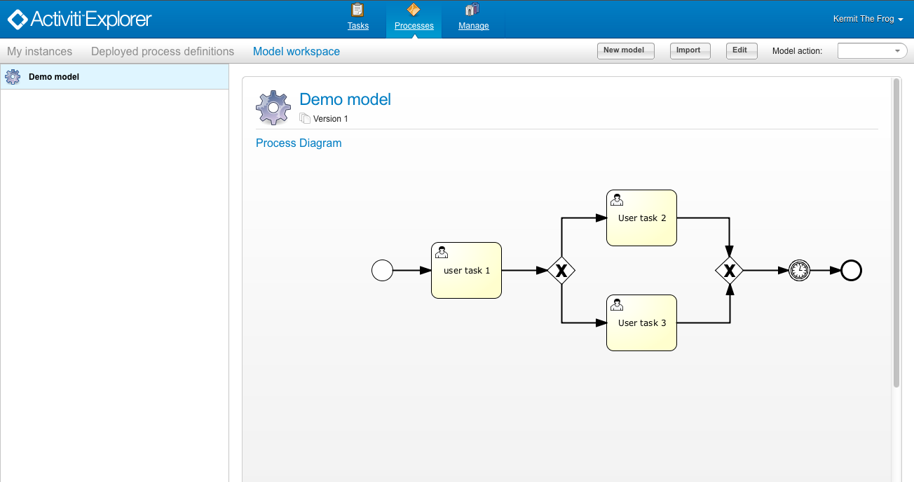
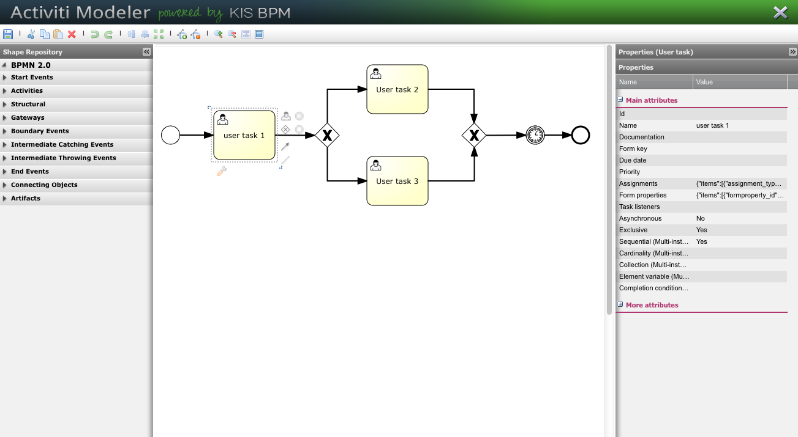
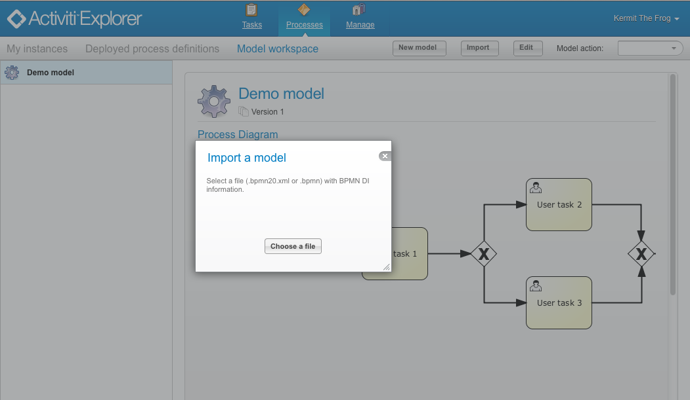
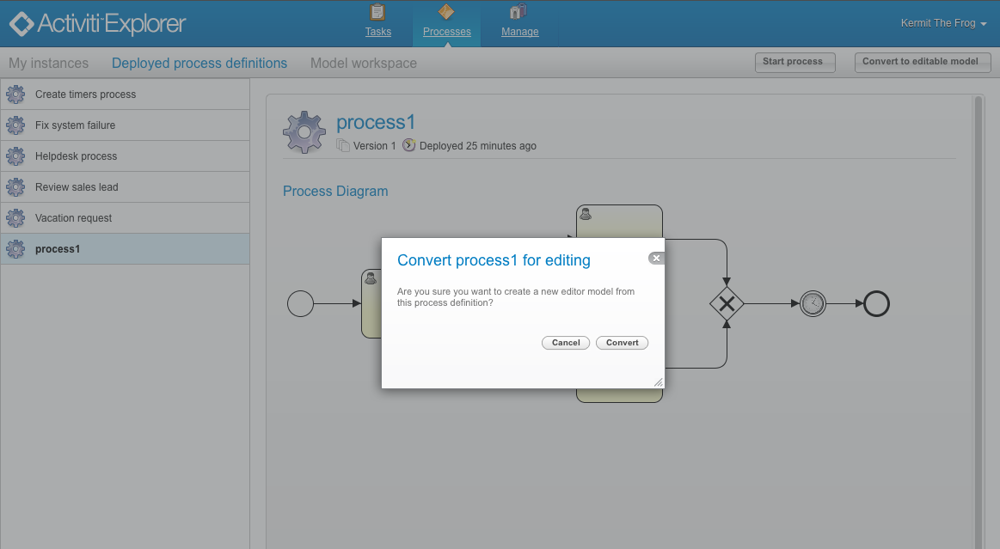
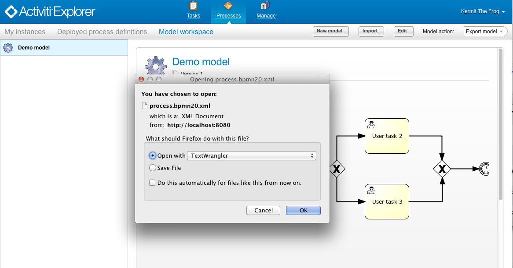
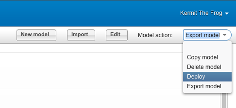

# Chapter 14. Activiti Modeler

Activiti Modeler是一个BPMN web建模组件，它是[Activiti Explorer](http://www.mossle.com/docs/activiti/index.html#activitiExplorer) web应用的一部分。 Modeler是[Signavio核心组件](http://code.google.com/p/signavio-core-components/)项目的一个分支。 新版Activiti Modeler的初始开发是由[KIS BPM](http://kisbpm.com/)捐献给Activiti项目的。 和之前Activiti Modeler（Signavio核心组件）主要的区别是新Modeler是作为Activiti项目的一部分来维护和开发的。 Activiti Modeler的目标是支持所有BPMN元素和Activiti引擎支持的扩展。

当你运行Activiti Explorer使用默认配置时，模型工作台中会有一个示例流程。

## 编辑模型

点击模型工作区的编辑按钮，会打开Modeler。 屏幕左侧是BPMN元素工具面板，也可以使用Activiti的扩展组件。 你可以在需要时把新元素拖拽到画布中。屏幕右侧是选中额元素的和苏醒。 例子截屏中选中了一个用户任务，你可以填写用户任务的属性，比如分配，表单属性和持续时间。 点击屏幕右上方的关闭按钮就可以返回Activiti Exporer。

## 导入模型

你也可以把模型导入到模型工作台中，然后就可以在Activiti Modeler中进行编辑。 点击导入按钮，选择.bpmn或.bpmn20.xml文件。注意BPMN XML文件必须包含BPMN DI（坐标）信息。

## 把发布的流程定义转换成可编辑的模型

发布的流程定义可以转换成模型，然后就可以在Activiti Modeler中编辑了。 注意流程定义必须包含BPMN DI（坐标）信息。

## 把模型导出成BPMN XML

模型工作区中的模型可以导出成BPMN XML文件。选择模型操作选项中的导出选项。

## 把模型部署到Activiti引擎中

在模型设置好所有运行所需的属性之后，它就可以发布到Activiti引擎里。 选择模型操作选项中的发布选项。

2014/7/23
