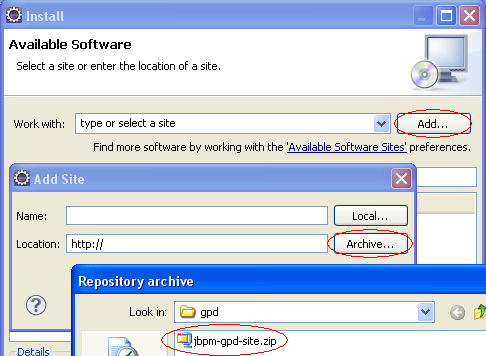
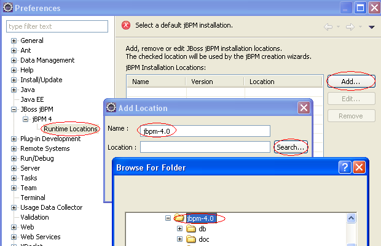
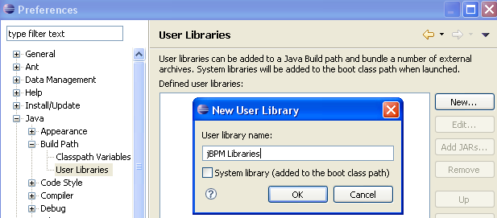
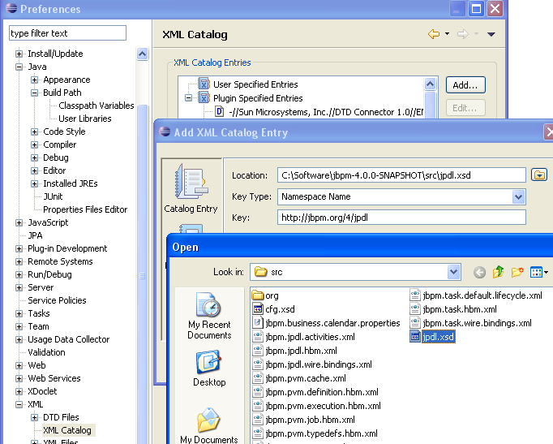

# 第 2 章 安装配置

## 2.1. 发布

只需要把jBPM (`jbpm-4.X.zip`) 下载下来，然后解压到你的硬盘上的什么地方。 你将看到下面的子目录：

- `doc`: 用户手册，javadoc和开发指南
- `examples`: 用户手册中用到的示例流程
- `install`: 用于不同环境的安装脚本
- `lib`: 第三方库和一些特定的jBPM依赖库
- `src`: 源代码文件
- `jbpm.jar`: jBPM主库归档
- `migration`: 参考开发指南

## 2.2. 必须安装的软件

jBPM需要JDK （标准java）5或更高版本。

http://java.sun.com/javase/downloads/index.jsp

为了执行ant脚本，你需要**1.7.0**或更高版本的apache ant：

http://ant.apache.org/bindownload.cgi

## 2.3. 快速上手

这个**范例安装**是最简单的方式开始使用jBPM。 这一章介绍了完成范例安装的步骤。

如果你之前下载过`jboss-5.0.0.GA.zip`，你可以把它放到 `${jbpm.home}/install/downloads`目录下。 否则脚本会为你下载它，但是它会消耗一些时间（与你的网络情况有关）。 eclipse-jee-galileo-win32.zip也一样（或者eclipse-jee-galileo-linux-gtk(-x86_64).tar.gz在linux平台下 和eclipse-jee-galileo-macosx-carbon.tar.gz在Mac OSX平台下）。

打开命令控制台，进入目录`${jbpm.home}/install`。 然后运行

```bash
ant demo.setup.jboss
```

或者

```bash
ant demo.setup.tomcat
```

这将

- 把JBoss安装到`${jbpm.home}/jboss-5.0.0.GA`目录
- 把jBPM安装到JBoss中。
- 安装hsqldb，并在后台启动。
- 创建数据库结构
- 在后台启动JBoss
- 根据示例创建一个examples.bar业务归档，把它发布到jBPM数据库中
- 从`${jbpm.home}/install/src/demo/example.identities.sql`，读取用户和组。
- 安装eclipse到`${jbpm.home}/eclipse`
- 启动eclipse
- 安装jBPM web控制台
- 安装Signavio web建模器

当这些都完成后，JBoss（或Tomcat，根据demo.setup脚本中的选择）会在后台启动。 一旦eclipse完成启动，你可以继续执行下面的教程 [第 3 章 *流程设计器（GPD）*](http://www.mossle.com/docs/jbpm4userguide/html/graphicalprocessdesigner.html)来开始编码你的jBPM业务流程。

或者你可以启动建模流程，通过 [Signavio web设计器](http://localhost:8080/jbpmeditor/p/explorer)。

或者使用[jBPM控制台](http://localhost:8080/jbpm-console)。 你可以使用下面用户之一进行登陆：


**表 2.1. 示例控制台用户：**

| 用户名 | 密码     |
| ------ | -------- |
| alex   | password |
| mike   | password |
| peter  | password |
| mary   | password |

**目前存在的问题**： 现在，对于一些比较慢的机器，在初始化报表时， 控制台的失效时间太短了，所以当你第一次请求报表时， 会出现超时，控制台会崩溃。 注销，然后再次登录，就可以避过这个问题。 这个问题已经提交到JIRA中了 [JBPM-2508](https://jira.jboss.org/jira/browse/JBPM-2508)

## 2.4. 安装脚本

jBPM下载包中包含了一个`install`目录， 目录中有一个ant的build.xml文件，你可以使用它来 把jBPM安装到你的应用环境中。

最好严格按照这些安装脚本， 进行安装和发布jBPM配置文件。我们可以自定义jBPM配置文件， 但这是不被支持的。

要想调用安装脚本，打开命令行，进入`${jbpm.home}/install`目录。 使用`ant -p`你可以看到 这里可以使用的所有脚本。脚本的参数都设置了默认值， 可以快速执行，下面列表给出了可用脚本的概况：


- `demo.setup.jboss`：安装jboss，把jbpm安装到jboss中， 启动jboss，创建jbpm数据库表结构，部署实例，加载实例身份认证信息， 安装并启动eclipse
- `demo.setup.tomcat`：安装tomcat，把jboss安装到tomcat中， 启动tomcat，创建jbpm数据库表结构，部署实例，加载实例身份认证信息， 安装并启动eclipse
- `clean.cfg.dir`：删除`${jbpm.home}/install/generated/cfg` 文件夹。
- `create.cfg`：创建一个配置在 `${jbpm.home}/install/generated/cfg`下，基于当前的参数。
- `create.jbpm.schema`：在数据库中创建jbpm表
- `create.user.webapp`创建一个基本的webapp在 `${jbpm.home}/install/generated/user-webapp`中
- `delete.jboss`：删除安装的jboss
- `delete.tomcat`：删除安装的Tomcat
- `demo.teardown.jboss`：删除jbpm数据库的表并停止jboss
- `demo.teardown.tomcat`：停止tomcat和hsqldb服务器（如果需要）
- `drop.jbpm.schema`：从数据库中删除jbpm的表
- `get.eclipse`：下载eclipse如果它不存在
- `get.jboss`：下载一个JBoss AS，已经测试过当前的jBPM版本，如果它不存在
- `get.tomcat`：下载一个Tomcat，已经测试过当前的jBPM版本，如果它不存在
- `hsqldb.databasemanager`：启动hsqldb数据库管理器
- `install.eclipse`：解压eclipse，下载eclipse如果它不存在
- `install.jboss`：下载JBoss如果它不存在，并解压
- `install.jbpm.into.jboss`：把jBPM安装到JBoss中
- `install.tomcat`：把tomcat下载到${tomcat.distro.dir}如果tomcat不存在，并解压tomcat
- `install.jbpm.into.tomcat`：把jBPM安装到tomcat中
- `install.examples.into.tomcat`：部署所有的实例流程
- `install.signavio.into.jboss`：把signavio安装到jboss中
- `install.signavio.into.tomcat`把signavio安装到tomcat中
- `load.example.identities`：读取实例用户和用户组数据到数据库
- `reinstall.jboss`：删除之前的jboss安装，并重新安装jboss
- `reinstall.jboss.and.jbpm`：删除之前的jboss安装，并重新安装jboss并把jbpm安装到它里面
- `reinstall.tomcat`：删除之前的tomcat安装，并重新安装tomcat
- `reinstall.tomcat.and.jbpm`：删除之前的tomcat安装，并重新安装tomcat并把jbpm安装到它里面
- `start.eclipse`：启动eclipse
- `start.jboss`：启动jboss，等待到jboss启动完，然后让jboss在后台运行
- `start.tomcat`：启动Tomcat，等待到Tomcat启动完，然后让Tomcat在后台运行
- `stop.jboss`：通知jboss停止，但是不等到它完成
- `stop.tomcat`通知Tomcat停止，但是不等到它完成
- `upgrade.jbpm.schema`：更新数据库中的jBPM表到当前版本


要想指定你的配置文件，使用上面的脚本（比如DB表结构生成）， 最简单的方法是修改对应的配置文件，在目录`${jbpm.home}/install/jdbc`。 对应的配置文件会被脚本加载，根据对应的DB。

下面的参数也可以自定义。

- `database` : 默认值是`hsqldb`。 可选值为`mysql`, `oracle`和`postgresql`
- `jboss.version` : 默认值是`5.0.0.GA`。 可选值是`5.1.0.GA`

如果想要自定义这些值，只需要像这样使用`-D`

```bash
ant -Ddatabase=postgresql demo.setup.jboss
```

作为可选方案，你可以在`${user.home}/.jbpm4/build.properties` 中设置自定义的参数值

## 2.5. 依赖库和配置文件

我们提供了自动安装jBPM的ant脚本。 这些脚本会将正确的依赖库和正确的配置文件 为你安装到正确的位置。如果你想在你的应用中创建自己的jBPM， 可以参考开发指南获得更多信息。

## 2.6. JBoss

`install.jbpm.into.jboss`任务会把jBPM安装到你的JBoss 5中。 进入安装目录下，执行`ant -p`可以获得更多信息。 这个安装脚本会把jBPM安装为一个JBoss的服务， 因此所有应用都可以使用同一个jBPM的流程引擎。

可以指定`-Djboss.home=PathToYourJBossInstallation` 来修改你的JBoss的安装路径。

在JBoss中，`ProcessEngine`可以通过JNDI获得， `new InitialContext().lookup("java:/ProcessEngine")`， 相同的流程引擎可以通过`Configuration.getProcessEngine()`获得。

## 2.7. Tomcat

`install.jbpm.into.tomcat`任务会把jBPM安装到 你的Tomcat中。

## 2.8. Signavio基于web的流程编辑器

使用`install.signavio.into.jboss`和 `install.signavio.into.tomcat`任务可以将Signavio基于web 的流程编辑器安装到JBoss或Tomcat中。

## 2.9. 用户web应用

如果你希望把jBPM部署为你的web应用的一部分，可以使用 `create.user.webapp`这个安装任务。 这会创建一个包含jBPM的web应用，在`${jbpm.home}/install/generated/user-webapp`目录下。

如果你在JBoss上或其他包含jta.jar的应用服务器上部署了你的应用， 你需要把`${jbpm.home}/install/generated/user-webapp/WEB-INF/lib/jta.jar`删除。

## 2.10. 数据库

安装脚本也包含了执行数据库的操作 比如创建表，如果你是第一次安装jBPM， 或者更新数据库使用之前版本的表结构。 删除表也是可选的。

使用任何数据库操作的前提条件是 在`${jbpm.home}/install/jdbc`中指定你的连接参数。

### 2.10.1. 创建或删除表结构

要想创建表结构，执行`create.jbpm.schema`任务 在`${jbpm.home}/install`目录下。 作为创建表、约束的一部分，涉及的任务会初始化 `JBPM4_PROPERTY`表， 使用当前的引擎版本（key `db.version`）和ID生成器版本 （key `next.dbid`）。

要想删除表结构，只要执行`drop.jbpm.schema`任务。 注意这个操作会删除jBPM表中的 所有数据。

### 2.10.2. 更新已存在的数据库

要想更新，执行`upgrade.jbpm.schema`任务 在`${jbpm.home}/install`目录下。

更新是一个两步操作。前一步是添加额外的表，列或者约束 这些是在新版本中的。 下一步，插入种子数据。

从4.0到4.1，表`JBPM4_VARIABLE`添加了一个新列 `CLASSNAME_`用来支持设置 流程变量的值的自定义类型，hibernate的类型映射。 这个列是可为null的，因为这个功能在4.0中没有支持， 所以没有初始值。

从4.1到4.2，更新过程更有趣一些。

- 一个新表 `JBPM4_PROPERTY` 被用来保存引擎范围的数据。
- jBPM版本保存在`JBPM4_PROPERTY`表中 使用key `db.version`用来在未来发布中 精确指定标示符。
- ID生成策略是完全跨数据库的。 下一个有效的ID是通过搜索所有包含主键列的表计算出的， 保存在key `next.dbid`中 在`JBPM4_PROPERTY`表中。
- 流程语言设置为`jpdl-4.0` 用于所有已经存在的流程定义，对应key `langid` 在表`JBPM4_DEPLOYPROP`中。jPDL解析器对应 `langid`属性来读取流程文档 以此支持向后的兼容。

## 2.11. 流程设计器（GPD）

图形化流程设计器（GPD）使用Eclipse作为其平台， 这一节的内容将介绍如何获得和安装Eclipse， 并把GPD插件安装到eclipse上。

### 2.11.1. 获得eclipse

你需要Eclipse3.5.0

使用[实例安装](http://www.mossle.com/docs/jbpm4userguide/html/installation.html#gettingstartedquickly) 或手工下载eclipse： [Eclipse IDE for Java EE Developers (163 MB)](http://www.eclipse.org/downloads/download.php?file=/technology/epp/downloads/release/galileo)

eclipse的传统版本无法满足要求， 因为它没有XML编辑器。 Eclipse的Java开发者版也可以工作。

### 2.11.2. 在eclipse中安装GPD插件

使用Eclipse软件升级（Software Update）机制安装设计器是非常简单的。 在gpd目录下有一个install/src/gpd/jbpm-gpd-site.zip文件， 这就是更新站点（archived update site）的 压缩包。

在Eclipse里添加更新站点的方法：

- `帮助` --> `安装新软件...`
- 点击 `添加...`
- 在 `添加站点` 对话框中，单击 `压缩包...`
- 找到 `install/src/gpd/jbpm-gpd-site.zip` 并点击 '打开'
- 点击 `确定` 在 `添加站点` 对话框中，会返回到 '安装'对话框
- 选择出现的 `jPDL 4 GPD 更新站点`
- 点击 `下一步..` 然后点击 `完成`
- 接受协议
- 当它询问的时候重启eclipse




**图 2.1. 添加设计器的更新站点**

### 2.11.3. 配置jBPM运行时

- 点击 `Window` --> `Preferences`
- 选择 `JBoss jBPM` --> `jBPM 4` --> `Runtime Locations`
- 点击 `Add...`
- 在 `Add Location` 对话框中，输入一个名字，比如 `jbpm-4.0` 然后点击 `Search...`
- 在 `Browse For Folder` 对话框中，选择你的jbpm根目录，然后点击 `OK`
- 点击 `OK` 在 `Add Location` 对话框中




**图 2.2. 定义jBPM依赖库**

### 2.11.4. 定义jBPM用户库

这一节演示如何在你的工作空间定义一个用户库， 用来放置jBPM的库文件。 如果你创建一个新工程， 只需要将用户库全部添加到build path下

- 点击窗口 --> 属性（Windows --> Preferences）
- 选择Java --> 创建路径 --> 用户类库（Java --> Build Path --> User Libraries）
- 点击新建（New）
- 类型名字jBPM Libraries
- 点击添加JARs（Add JARs...）
- 找到jBPM安装程序下的lib目录
- 选择lib下的所有jar文件并点击打开（Open）
- 选择jBPM Libraries作为入口
- 重新点击添加JARs（Add JARs）
- 在jBPM的安装程序的根目录下选择jbpm.jar文件
- 点击打开（Open）
- 在jbpm.jar下选择源码附件（Source attachment）作为入口
- 点击编辑（Edit）
- 在源码附件的配置（Source Attachment Configuration）对话框中，点击目录（External Folder...）
- 找到jBPM安装程序下的src目录
- 点击选择（Choose）
- 点击两次'确定'（Ok）会关闭所有对话框




**图 2.3. 定义jBPM类库**

### 2.11.5. 在目录中添加jPDL4模式

如果你想直接编辑XML源码， 最好是在你的XML目录中指定一下模式（schema）， 这样当你在编辑流程源码的时候，可以更好的帮助你编写代码。

- 点击窗口 --> 属性（Windows --> Preferences）
- 选择XML --> 目录（XML --> CataLog）
- 点击添加（Add）
- 添加XML目录（Add XML Catalog Entry）的窗口打开
- 点击map-icon的图标下面的按钮并选择文件系统（File System）
- 在打开的对话框中， 选择jBPM安装目录下src文件夹中jpdl.xsd文件
- 点击打开（Open）并且关闭所有的对话框




**图 2.4. 在目录中添加jPDL4模式**

### 2.11.6. 导入示例

这一节我们会在Eclipse的安装程序下 导入示例工程

- 选择文件 --> 导入（File --> Import）
- 选择正常 --> 工作区中已有的工程（General --> Existing Projects into Workspace）
- 点击下一步（Next）
- 点击浏览去选择一个根目录（Browse）
- 通向jBPM安装程序的根目录
- 点击好（Ok）
- 示例工程会自动找到并且选中
- 点击完成（Finish）

在配置了[jBPM用户依赖库](http://www.mossle.com/docs/jbpm4userguide/html/installation.html#definejbpmuserlibraries)也导入了实例后， 所以的例子可以作为JUnit测试运行了。在一个测试上右击， 选择'Run As' --> 'JUnit Test'。

设置完成，现在你可以开始享受这个最酷的Java流程技术。

### 2.11.7. 使用ant添加部分文件

你可以使用eclipse和ant整合来处理流程的发布。 我们会告诉你它是如何在例子里工作地。然后你可以把这些复制到你的项目中。 首先，打开ant视图。

- 选择`Window` --> `Show View` --> `Other...` --> `Ant` --> `Ant`
- 例子项目中的构建文件`build.xml`，从包视图拖拽到ant视图。
