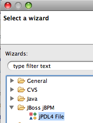
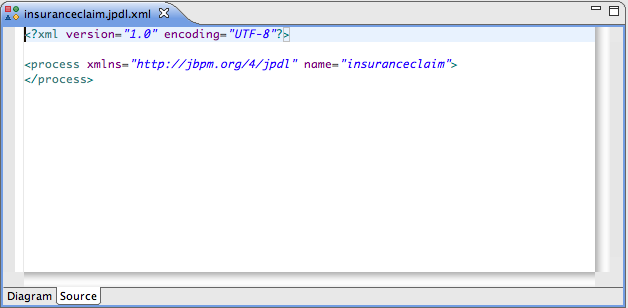

# 第 3 章 流程设计器（GPD）

这一章我们讲述了怎样使用流程设计器， 在安装流程设计器和配置好例子之后， 你会看到jPDL流程文件都有一个对应的特殊图标， 在包视图的下面双击某一个这种图标文件，就会在流程设计器中打开一个jPDL流程文件。

**图 3.1. 流程设计器**

## 3.1. 创建一个新的流程文件

Ctrl+N将打开向导选择器。

**图 3.2. 选择向导对话框**

选择 jBPM --> jPDL 4 文件（File）. 点击下一步（ Next >）. 然后新的jPDL 4文件（New jPDL 4 File），就会打开向导。

**图 3.3. 创建一个新的流程对话框**

选择上一级目录，输入一个文件名字并点击'完成'（Finish）， 你便创建了第一个jPDL流程文件。

## 3.2. 编辑流程文件的源码

GPD里有一个可以修改XML内容的'Source'标签。 可以在标签里直接进行编辑，当你切换到图形时，图形视图会反映出刚才进行的修改。

**图 3.4. 使用source视图编辑jPDL**

------
