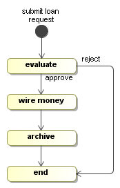
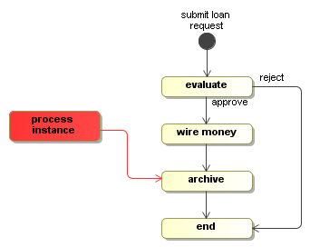

# 第 5 章 服务

## 5.1. 流程定义，流程实例和执行

一个流程定义式对过程的步骤的描述。 比如，一个保险公司可以有一个`贷款`流程定义 描述公司如何处理贷款请求 的步骤的描述。




**图 5.1. 贷款流程定义示例**

流程实例代表着流程定义的特殊执行例子， 例如：上周五John Doe提出贷款买船， 代表着一个贷款流程定义的流程实例。

一个流程实例包括了所有运行阶段， 其中最典型的属性就是跟踪当前节点的指针。




**图 5.2. 贷款流程实例的例子**

假设汇款和存档可以同时执行， 那么主流程实例就包含了2个 用来跟踪状态的子节点：


**图 5.3. 贷款执行例子**

一般情况下，一个流程实例是一个执行树的根节点， 当一个新的流程实例启动时，实际上流程实例就处于根节点的位置， 这时只有它的"子节点"才可以被激活。

使用树状结构的原因在于， 这一概念只有一条执行路径， 使用起来更简单。 业务API不需要了解流程实例和执行之间功能的区别。 因此， API里只有一个执行类型来引用流程实例和执行。

## 5.2. ProcessEngine流程引擎

在jBPM内部通过各种服务相互作用。 服务接口可以从`ProcessEngine`中获得， 它是从`Configuration`构建的。

流程引擎是线程安全的，它可以保存在静态变量中， 甚至JNDI中或者其他重要位置。 在应用中，所有线程和请求都可以使用同一个流程引擎对象， 现在就告诉你怎么获得流程引擎。

这章中涉及到的代码和下一章中关于流程部署的代码， 都来自`org.jbpm.examples.services.ServicesTest` 例子。

```java
ProcessEngine processEngine = new Configuration()
      .buildProcessEngine();
```

上面的代码演示了如何通过classpath根目录下 默认的配置文件jbpm.cfg.xml创建一个ProcessService。 如果你要指定其他位置的配置文件， 请使用setResource()方法：

```java
ProcessEngine processEngine = new Configuration()
      .setResource("my-own-configuration-file.xml")
      .buildProcessEngine();
```

还有其他setXxxx()方法可以获得配置内容， 例如：从InputStream中、 从xml字符串中、从InputSource中、 从URL中或者从文件（File）中。

我们可以根据流程引擎得到 下面的服务：

```java
RepositoryService repositoryService = processEngine.getRepositoryService();
ExecutionService executionService = processEngine.getExecutionService();
TaskService taskService = processEngine.getTaskService();
HistoryService historyService = processEngine.getHistoryService();
ManagementService managementService = processEngine.getManagementService();
```

在配置中定义的这些流程引擎（ProcessEngine）对象， 也可以根据类型`processEngine.get(Class<T>)` 或者根据名字`processEngine.get(String)`来获得。

## 5.3. Deploying a process部署流程

`RepositoryService`包含了用来管理发布资源的所有方法。 在第一个例子中，我们会使用`RepositoryService` 从classpath中部署一个流程资源。

```java
String deploymentid = repositoryService.createDeployment()
    .addResourceFromClasspath("org/jbpm/examples/services/Order.jpdl.xml")
    .deploy();
```

通过上面的`addResourceFromClass`方法， 流程定义XML的内容可以从文件， 网址，字符串，输入流或zip输入流中获得。

每次部署都包含了一系列资源。每个资源的内容都是一个字节数组。 jPDL流程文件都是以`.jpdl.xml`作为扩展名的。 其他资源是任务表单和java类。

部署时要用到一系列资源， 默认会获得多种流程定义和其他的归档类型。 jPDL发布器会自动识别后缀名是`.jpdl.xml` 的流程文件。

在部署过程中，会把一个`id`分配给流程定义。 这个`id`的格式为`{key}-{version}`， key和version之间使用连字符连接。

如果没有提供key， 会在名字的基础自动生成。 生成的key会把所有不是字母和数字的字符替换成下划线。

同一个名称只能关联到一个key， 反之亦然。

如果没有为流程文件提供版本号， jBPM会自动为它分配一个版本号。 请特别注意那些已经部署了的名字 相同的流程文件的版本号。 它会比已经部署的同一个key的流程定义 里最大的版本号还大。 没有部署相同key的流程定义的版本号会分配为1。

在下面第1个例子里，我们只提供了流程的名字，没有提供其他信息：

```xml
<process name="Insurance claim">
...
</process>
```

假设这个流程是第一次部署， 下面就是它的属性：


**表 5.1. 没有key值的属性流程**

| Property | Value             | Source      |
| -------- | ----------------- | ----------- |
| name     | Insurance claim   | process xml |
| key      | Insurance_claim   | generated   |
| version  | 1                 | generated   |
| id       | Insurance_claim-1 | generated   |

第2个例子我们将演示如何通过设置流程的key 来获得更短的id。

```xml
<process name="Insurance claim" key="ICL">
...
</process>
```

这个流程定义的属性就会像下面这样：


**表 5.2. 有key值属性的流程**

| Property | Value           | Source      |
| -------- | --------------- | ----------- |
| name     | Insurance claim | process xml |
| key      | ICL             | process xml |
| version  | 1               | generated   |
| id       | ICL-1           | generated   |

## 5.4. 删除流程定义

删除一个流程定义会把它从数据库中删除。

```java
repositoryService.deleteDeployment(deploymentId);
```

如果在发布中的流程定义还存在活动的流程实例， 这个方法就会抛出异常。

如果希望级联删除一个发布中流程定义的 所有流程实例， 可以使用`deleteDeploymentCascade`。

## 5.5. 启动一个新的流程实例

### 5.5.1. 最新的流程实例

下面是为流程定义启动一个新的流程实例的最简单也是 最常用的方法：

```java
ProcessInstance processInstance = executionService.startProcessInstanceByKey("ICL");
```

上面service的方法会去查找 key为ICL的最新版本的流程定义， 然后在最新的流程定义里启动流程实例。

当insurance claim流程部署了一个新版本， startProcessInstanceByKey方法会自动切换到 最新部署的版本。

### 5.5.2. 指定流程版本

换句话说，你如果想根据特定的版本启动流程实例， 便可以使用流程定义的id启动流程实例。如下所示：

```java
ProcessInstance processInstance =
    executionService.startProcessInstanceById("ICL-1");
```

### 5.5.3. 使用key

我们可以为新启动的流程实例分配一个key， 这个key是用户执行的时候定义的，有时它会作为“业务key”引用。 一个业务key必须在流程定义的 所有版本范围内是唯一的。通常很容易 在业务流程领域找到这种key。 比如，一个订单id或者一个保险单号。

```java
ProcessInstance processInstance =
    executionService.startProcessInstanceByKey("ICL", "CL92837");
```

key可以用来创建流程实例的id， 格式为{process-key}.{execution-id}。 所以上面的代码会创建一个id为 ICL.CL92837的流向 （execution）。

如果没有提供用户定义的key，数据库就会把主键作为key。 这样可以使用如下方式获得id：

```java
ProcessInstance processInstance =
    executionService.startProcessInstanceByKey("ICL");
String pid = processInstance.getId();
```


最好使用一个用户定义的key。 特别在你的应用代码中，找到这样的key并不困难。提供给一个用户定义的key， 你可以组合流向的id，而不是执行一个基于流程变量的搜索 - 那种方式太消耗资源了。

### 5.5.4. 使用变量

当一个新的流程实例启动时就会提供一组对象参数。 将这些参数放在variables变量里， 然后可以在流程实例创建和启动时使用。

```java
Map<String,Object> variables = new HashMap<String,Object>();
variables.put("customer", "John Doe");
variables.put("type", "Accident");
variables.put("amount", new Float(763.74));

ProcessInstance processInstance =
    executionService.startProcessInstanceByKey("ICL", variables);
```

## 5.6. 执行等待的流向

当使用一个`state`活动时，执行（或流程实例） 会在到达state的时候进行等待，直到一个signal（也叫外部触发器）出现。 `signalExecution`方法可以被用作这种情况。 执行通过一个执行id（字符串）来引用。

在一些情况下，到达state的执行会是流程实例本身。 但是这不是一直会出现的情况。在定时器和同步的情况， 流程是执行树形的根节点。所以我们必须确认你的signal 作用在正确的流程路径上。

获得正确的执行的比较好的方法是给state活动分配一个事件监听器， 像这样：

```xml
<state name="wait">
  <on event="start">
    <event-listener class="org.jbpm.examples.StartExternalWork" />
  </on>
  ...
</state>
```

在事件监听器`StartExternalWork`中，你可以执行那些需要额外完成的部分。 在这个时间监听器里，你也可以通过`execution.getId()`获得确切的流程id。 那个流程id，在额外的工作完成后， 你会需要它来提供给signal操作的：

```java
executionService.signalExecutionById(executionId);
```

这里有一个可选的（不是太推荐的）方式，来获得流程id， 当流程到达`state`活动的时候。 只可能通过这种方式获得执行id，如果你知道哪个jBPM API调用了之后， 流程会进入`state`活动：

```java
// assume that we know that after the next call
// the process instance will arrive in state external work

ProcessInstance processInstance =
  executionService.startProcessInstanceById(processDefinitionId);
// or ProcessInstance processInstance =
//  executionService.signalProcessInstanceById(executionId);

Execution execution = processInstance.findActiveExecutionIn("external work");
String executionId = execution.getId();
```

要注意上面的解决方式和应用逻辑联系（太）紧密 通过使用真实业务结构的知识。

## 5.7. TaskService任务服务

TaskService的主要目的是提供对任务列表的访问途径。 例子代码会展示出如何为id为`johndoe` 的用户获得任务列表

```java
List<Task> taskList = taskService.findPersonalTasks("johndoe");
```

一般来说，任务会对应一个表单，然后显示在一些用户接口中。 表单需要可以读写与任务相关的数据。

```java
// read task variables
Set<String> variableNames = taskService.getVariableNames(taskId);
variables = taskService.getVariables(taskId, variableNames);
// write task variables
variables = new HashMap<String, Object>();
variables.put("category", "small");
variables.put("lires", 923874893);
taskService.setVariables(taskId, variables);
```

taskSerice也用来完成任务。

```java
taskService.completeTask(taskId);
taskService.completeTask(taskId, variables);
taskService.completeTask(taskId, outcome);
taskService.completeTask(taskId, outcome, variables);
```

这些API允许提供一个变量map，它在任务完成之前作为流程变量添加到流程里。 它也可能提供一个“外出outcome”，这会用来决定哪个外出转移会被选中。 逻辑如下所示：

**如果一个任务拥有一个没用名称的外向转移：**

- taskService.getOutcomes() 返回包含一个null值集合，。
- taskService.completeTask(taskId) 会使用这个外向转移。
- taskService.completeTask(taskId, null) 会使用这个外向转移。
- taskService.completeTask(taskId, "anyvalue") 会抛出一个异常。


**如果一个任务拥有一个有名字的外向转移：**

- gtaskService.getOutcomes() 返回包含这个转移名称的集合。
- taskService.completeTask(taskId) 会使用这个单独的外向转移。
- taskService.completeTask(taskId, null) 会抛出一个异常（因为这里没有无名称的转移）。
- taskService.completeTask(taskId, "anyvalue") 会抛出一个异常。
- taskService.completeTask(taskId, "myName") 会根据给定的名称使用转移。


**如果一个任务拥有多个外向转移，其中一个转移没有名称，其他转移都有名称：**

- taskService.getOutcomes() 返回包含一个null值和其他转移名称的集合。
- taskService.completeTask(taskId) 会使用没有名字的转移。
- taskService.completeTask(taskId, null) 会使用没有名字的转移。
- taskService.completeTask(taskId, "anyvalue") 会抛出异常。
- taskService.completeTask(taskId, "myName") 会使用名字为'myName'的转移。


**如果一个任务拥有多个外向转移，每个转移都拥有唯一的名字：**

- taskService.getOutcomes() 返回包含所有转移名称的集合。
- taskService.completeTask(taskId) 会抛出异常，因为这里没有无名称的转移。
- taskService.completeTask(taskId, null) 会抛出异常，因为这里没有无名称的转移。
- taskService.completeTask(taskId, "anyvalue") 会抛出异常。
- taskService.completeTask(taskId, "myName") 会使用名字为'myName'的转移。


任务可以拥有一批候选人。候选人可以是用户也可以是用户组。 用户可以接收自己是候选人的任务。 接收任务的意思是用户会被设置为被分配给任务的人。 在那之后，其他用户就不能接收这个任务了。

人们不应该在任务做工作， 除非他们被分配到这个任务上。 用户界面应该显示表单，并允许用户完成任务， 如果他们被分配到这个任务上。对于有了候选人，但是还没有分配的任务， 唯一应该暴露的操作就是“接收任务”。

更多的任务见[第 6.2.6 节 “`task`”](./chapter6_jpdl.md#626-task) 。

## 5.8. HistoryService历史服务

在流程实例执行的过程中，会不断触发事件。 从那些事件中，运行和完成流程的历史信息会被收集到历史表中。 `HistoryService`提供了 对那些信息的访问功能。

如果想查找某一特定流程定义的所有流程实例， 可以像这样操作：

```java
List<HistoryProcessInstance> historyProcessInstances = historyService
  .createHistoryProcessInstanceQuery()
  .processDefinitionId("ICL-1")
  .orderAsc(HistoryProcessInstanceQuery.PROPERTY_STARTTIME)
  .list();
```

单独的活动流程也可以作为`HistoryActivityInstance` 保存到历史信息中。

```java
List<HistoryActivityInstance> histActInsts = historyService
    .createHistoryActivityInstanceQuery()
    .processDefinitionId("ICL-1")
    .activityName("a")
    .list();
```

也可以使用简易方法`avgDurationPerActivity`和 `choiceDistribution`。 可以通过javadocs获得这些方法的更多信息。

有时，我们需要获得指定流程实例已经过的节点的完整列表。 下面的查询语句可以用来获得所有已经执行的节点列表：

```java
List<HistoryActivityInstance> histActInsts = historyService
    .createHistoryActivityInstanceQuery()
    .processInstanceId("ICL.12345")
    .list();
```

上面的查询与通过execution id查询有一些不同。有时execution id和流程实例id是不同的， 当一个节点中使用了定时器，execution id中就会使用额外的后缀， 这就会导致当我们通过execution id查询时， 这个节点不会出现在结果列表中。

## 5.9. ManagementService管理服务

管理服务通常用来管理job。可以通过javadocs获得这些方法的更多信息。 这个功能也是通过控制台暴露出来。

## 5.10. 查询 API

从jBPM 4.0开始，一个新的API被介绍使用查询系统， 可以覆盖大多数你可以想到的查询。开发者需要编写企业特定查询时 当然也可以使用Hibenrate。但是对大多数用例来说， 查询API是不足够的。 查询可以写成同ideas方式，用于主要的jBPM概念： 流程实例，任务，发布，历史流程，等等。

比如：

```java
List<ProcessInstance> results = executionService.createProcessInstanceQuery()
                                       .processDefinitionId("my_process_definition")
                                       .notSuspended()
                                       .page(0, 50)
                                       .list();
    
```

这个例子返回指定流程定义的所有流程实例， 流程定义不是暂停的。结果支持分页，第一页的前50条数据 会被我们获得。

查询任务也可以使用相同的方式完成：

```java
List<Task> myTasks = taskService.createTaskQuery()
    .processInstanceId(piId)
    .assignee("John")
    .page(100, 120)
    .orderDesc(TaskQuery.PROPERTY_DUEDATE)
    .list();
```

这个查询会获得指定流程实例，分配给John的所有任务， 也使用分页，对duedate进行逆序查询。

每个服务拥有操作这些统一查询的功能（比如，查询job通过 `ManagementService`，查询完成的 流程实例通过`HistoryService`。 可以参考服务的javadoc了解这些查询API的所有细节。）

------
