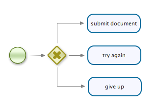
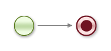
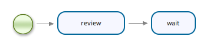
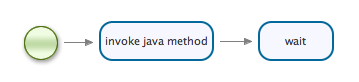

# 第 6 章 jPDL

这章将会解释用来描述流程定义的 jPDL文件格式。jDPL是jBPM的突出的流程语言。jPDL的目标 是尽量精简和尽可能的开发者友好，在提供所有你期望 从BPM流程语言中获得功能的同时。

jPDL的schema文件包含了比这个文档中更多的属性和元素。 这个文档解释了jPDL中稳定的被支持的部分。 试验性的、不支持的jPDL特性可以在开发者指南中找到。

下面是一个jPDL流程文件的例子：

```xml
<?xml version="1.0" encoding="UTF-8"?>

<process name="Purchase order" xmlns="http://jbpm.org/4.4/jpdl">

  <start>
    <transition to="Verify supplier" />
  </start>

  <state name="Verify supplier">
    <transition name="Supplier ok" to="Check supplier data" />
    <transition name="Supplier not ok" to="Error" />
  </state>

  <decision name="Check supplier data">
    <transition name="nok" to="Error" />
    <transition name="ok" to="Completed" />
  </decision>

  <end name="Completed" />

  <end name="Error" />

</process>
```

## 6.1. process流程处理

顶级元素（element）是流程处理定义。


**表 6.1. process流程处理的属性**

| 属性        | 类型               | 默认值                                                       | 是否必须         | 描述                                                         |
| ----------- | ------------------ | ------------------------------------------------------------ | ---------------- | ------------------------------------------------------------ |
| name名称    | 文本               |                                                              | 必须             | 在与用户交互时， 作为流程名字显示的一个名字或是标签。        |
| key键       | 字母或数字，下划线 | 如果省略，key中的非字母和非数字的字符会被替换为 下划线。     | 可选（optional） | 用来辨别不同的流程定义。 拥有同一个key的流程会有多个版本。 对于所有已发布的流程版本，key-name这种组合都必须是 完全一样的。 |
| version版本 | 整型               | 比已部署的key相同的流程版本号高1， 如果还没有与之相同的key的流程被部署，那么版本就从1开始。 | 可选             | 流程的版本号                                                 |


**表 6.2. process流程的元素**

| 元素                                                         | 个数     | 描述                                           |
| ------------------------------------------------------------ | -------- | ---------------------------------------------- |
| description描述                                              | 0个或1个 | 描述文本                                       |
| [activities活动](http://www.mossle.com/docs/jbpm4userguide/html/jpdl.html) | 至少1个  | 流程中会有很多活动， 至少要有1个是启动的活动。 |

## 6.2. 控制流程Activities活动

### 6.2.1. start启动

说明一个流程的实例从哪里开始。 在一个流程里必须有一个开始节点。 一个流程必须至少拥有一个开始节点。 开始节点必须有一个向外的流向，这个流向会在流程启动的时候执行。

已知的限制：直到现在， 一个流程处理只能有一个启动节点（start）。


**表 6.3. start启动的属性**

| 属性     | 类型 | 默认值 | 是否必须 | 描述                                                         |
| -------- | ---- | ------ | -------- | ------------------------------------------------------------ |
| name名称 | 文本 |        | 可选     | 活动的名字，在启动活动没有内部的转移（transition）时， name名称是可选的。 |


**表 6.4. start启动的元素**

| 元素           | 个数 | 描述       |
| -------------- | ---- | ---------- |
| transition转移 | 1    | 向外的转移 |

### 6.2.2. State状态节点

一个等待状态节点。 流程处理的流向会在外部触发器调用提供的API之前一直等待。 状态节点和[其他的活动](http://www.mossle.com/docs/jbpm4userguide/html/jpdl.html#commonactivitycontents)不一样， 它没有其他任何属性或元素。

#### 6.2.2.1. 序列状态节点

让我们看一个用序列连接状态 和转移的例子。


**图 6.1. 序列状态节点**

```xml
<process name="StateSequence" xmlns="http://jbpm.org/4.4/jpdl">

  <start>
    <transition to="a" />
  </start>

  <state name="a">
    <transition to="b" />
  </state>

  <state name="b">
    <transition to="c" />
  </state>

  <state name="c" />

</process>
```

下列代码将启动一个流向：

```java
ProcessInstance processInstance =
    executionService.startProcessInstanceByKey("StateSequence");
```

创建的流程处理实例会停留在状态节点a的位置， 使用signalExecution方法就会触发 一个外部触发器。

```java
Execution executionInA = processInstance.findActiveExecutionIn("a");
assertNotNull(executionInA);

processInstance = executionService.signalExecutionById(executionInA.getId());
Execution executionInB = processInstance.findActiveExecutionIn("b");
assertNotNull(executionInB);

processInstance = executionService.signalExecutionById(executionInB.getId());
Execution executionInC = processInstance.findActiveExecutionIn("c");
assertNotNull(executionInC);
```

#### 6.2.2.2. 可选择的状态节点

在第2个状态节点的例子里， 我们将演示如何使用状态节点实现 路径的选择。


**图 6.2. 状态节点中的选择**

```xml
<process name="StateChoice" xmlns="http://jbpm.org/4.4/jpdl">

  <start>
    <transition to="wait for response" />
  </start>

  <state name="wait for response">
    <transition name="accept" to="submit document" />
    <transition name="reject" to="try again" />
  </state>

  <state name="submit document" />

  <state name="try again" />

</process>
```

让我们在这个流程处理定义里启动一个新的流程实例。

```java
ProcessInstance processInstance = executionService
    .startProcessInstanceByKey("StateChoice");
```

现在，流向到达wait for response状态节点了。 流向会一直等待到外部触发器的出现。 这里的状态节点拥有多个向外的转移， 外部触发器将为向外的转移提供不同的信号名（signalName）， 下面我们将提供accept信号名（signalName）：

```java
String executionId = processInstance
    .findActiveExecutionIn("wait for response")
    .getId();

processInstance = executionService.signalExecutionById(executionId, "accept");

assertTrue(processInstance.isActive("submit document"));
```

流向会沿着名字是accept的向外的转移继续进行。 同样，当使用reject作为参数触发signalExecutionXxx方法时。流 向会沿着名字是reject的向外的转移 继续进行。

### 6.2.3. decision决定节点

在多个选择中选择一条路径。也可以当做是一个决定。 一个决定活动拥有很多个向外的转移。当一个流向到达一个决定活动时， 会自动执行并决定交给哪个向外的转移。

一个决定节点应该配置成下面三个方式之一。

#### 6.2.3.1. decision决定条件

decision中会运行并判断每一个transition里的判断条件。 当遇到一个嵌套条件是true或者没有设置判断条件的转移， 那么转移就会被运行。


**表 6.5. exclusive.transition.condition 属性**

| 属性 | 类型                | 默认值                                                       | 是否必须?    | 描述                            |
| ---- | ------------------- | ------------------------------------------------------------ | ------------ | ------------------------------- |
| expr | expression          |                                                              | required必须 | 将被运行的 指定脚本             |
| lang | expression language | 从[脚本引擎](http://www.mossle.com/docs/jbpm4userguide/html/scripting.html)配置里得到的默认代表性语言（default-expression-language） | 可选         | 指定expr中执行的 脚本语言的种类 |

例子：




**图 6.3. 流程处理的决定条件例子**

```xml
<process name="DecisionConditions" >

  <start>
    <transition to="evaluate document" />
  </start>

  <decision name="evaluate document">
    <transition to="submit document">
      <condition expr="#{content=="good"}" />
    </transition>
    <transition to="try again">
      <condition expr="#{content=="not so good"}" />
    </transition>
    <transition to="give up" />
  </decision>

  <state name="submit document" />

  <state name="try again" />

  <state name="give up" />

</process>
```

在使用`good content`启动一个流程之后

```java
Map<String, Object> variables = new HashMap<String, Object>();
variables.put("content", "good");
ProcessInstance processInstance =
    executionService.startProcessInstanceByKey("DecisionConditions", variables);
```

`submit document`活动会变成活动的

```java
assertTrue(processInstance.isActive("submit document"));
```

参考实例中的单元测试，了解更多的场景。

#### 6.2.3.2. decision expression唯一性表达式

decision表达式返回类型为字符串的 向外转移的名字。


**表 6.6. 决定属性**

| 属性 | 类型                | 默认值                                                       | 是否必须?    | 描述                              |
| ---- | ------------------- | ------------------------------------------------------------ | ------------ | --------------------------------- |
| expr | expression          |                                                              | required必须 | 将被运行的指定 脚本               |
| lang | expression language | 从[脚本引擎](http://www.mossle.com/docs/jbpm4userguide/html/scripting.html)配置里得到的默认指定的脚本语言（default-expression-language） | 可选         | 指定expr中执行的脚本语言的 种类。 |

例子：


**图 6.4. 流程处理的决定表达式例子**

```xml
<process name="DecisionExpression" xmlns="http://jbpm.org/4.4/jpdl">

  <start >
    <transition to="evaluate document"/>
  </start>

  <decision name="evaluate document" expr="#{content}" >
    <transition name="good" to="submit document"  />
    <transition name="bad"  to="try again"  />
    <transition name="ugly" to="give up"  />
  </decision>

  <state name="submit document"  />
  <state name="try again"  />
  <state name="give up"  />

</process>
```

当你使用good content启动一个新的流程实例，代码如下：

```java
Map<String, Object> variables = new HashMap<String, Object>();
variables.put("content", "good");
ProcessInstance processInstance =
    executionService.startProcessInstanceByKey("DecisionExpression", variables);
```

然后新流程会到达`submit document`活动。

参考实例中的单元测试，获得其他场景。

#### 6.2.3.3. Decision handler决定处理器

唯一性管理是继承了DecisionHandler接口的java类。 决定处理器负责选择 向外转移。

```java
public interface DecisionHandler {
   String decide(OpenExecution execution);
}
```

这个handler被列为decision的子元素。 配置属性和decision的`handler`的内容元素 可以在[第 6.7 节 “用户代码”](http://www.mossle.com/docs/jbpm4userguide/html/jpdl.html#usercode)中找到。

下面是一个决定使用DecisionHandler的流程处理例子：


**图 6.5. 流程处理的exclusive管理例子**

```xml
<process name="DecisionHandler">

  <start>
    <transition to="evaluate document" />
  </start>

  <decision name="evaluate document">
    <handler class="org.jbpm.examples.decision.handler.ContentEvaluation" />
    <transition name="good" to="submit document" />
    <transition name="bad" to="try again" />
    <transition name="ugly" to="give up" />
  </decision>

  <state name="submit document" />

  <state name="try again" />

  <state name="give up" />

</process>
```

下面是ContentEvalation类：

```java
public class ContentEvaluation implements DecisionHandler {

  public String decide(OpenExecution execution) {
    String content = (String) execution.getVariable("content");
    if (content.equals("you're great")) {
      return "good";
    }
    if (content.equals("you gotta improve")) {
      return "bad";
    }
    return "ugly";
  }
}
```

当你启动流程处理实例， 并为变量content提供值you're great时， ContentEvalation就会返回字符串good， 流程处理实例便会到达Submit document活动。

### 6.2.4. concurrency并发

流程的并发路径可以使用 `fork` 和 `join` 活动来建模。下面的表格描述了 `join` 的属性；`fork`没有特别的属性。


**表 6.7. join属性：**

| 属性           | 类型                                         | 默认值         | 是否必须? | 描述                                                         |
| -------------- | -------------------------------------------- | -------------- | --------- | ------------------------------------------------------------ |
| `multiplicity` | 整数或表达式                                 | 传入转移的数目 | 可选      | 在这个join活动之前需要到达的执行的数目， 然后一个执行 会沿着join的单独的外向转移向外执行。 |
| `lockmode`     | {none, read, upgrade, upgrade_nowait, write} | upgrade        | 可选      | hibernate的锁定模式，应用在上级执行， 来防止两个还没到达join的同步事务看到对方, 这会导致死锁。 |

#### 6.2.4.1. 使用 `fork`实现并行分支

`fork` 活动允许将一个单独的流程路径分成 两个或多个分支，这些流程分支可以同步执行。


**图 6.6. 流程处理的并发例子**

```xml
<process name="ConcurrencyGraphBased" xmlns="http://jbpm.org/4.4/jpdl">

   <start>
      <transition to="fork"/>
   </start>

   <fork name="fork">
      <transition to="send invoice" />
      <transition to="load truck"/>
      <transition to="print shipping documents" />
   </fork>

   <state name="send invoice" >
      <transition to="final join" />
   </state>

   <state name="load truck" >
      <transition to="shipping join" />
   </state>

   <state name="print shipping documents">
      <transition to="shipping join" />
   </state>

   <join name="shipping join" >
      <transition to="drive truck to destination" />
   </join>

   <state name="drive truck to destination" >
      <transition to="final join" />
   </state>

   <join name="final join" >
      <transition to="end"/>
   </join>

   <end name="end" />

</process>
```

### 6.2.5. end结束

结束流向

#### 6.2.5.1. end process instance结束流程处理实例

默认情况下，结束活动会终结已完成流程处理实例。 因此在流程处理实例中， 仍然在活动的多个并发（concurrent）流向（concurrent） 也会结束。




**图 6.7. 结束活动**

```xml
<process name="EndProcessInstance" xmlns="http://jbpm.org/4.4/jpdl">

  <start>
    <transition to="end" />
  </start>

  <end name="end" />

</process>
```

新的流程处理实例一创建便会直接结束。

#### 6.2.5.2. end execution结束流向

只有流向到达结束（end）活动时会结束流程处理实例， 并且其他并发流向会放弃活动。 我们可以设置属性ends="execution" 来达到这种状况。


**表 6.8. end execution属性**

| 属性 | 类型                         | 默认值          | 是否必须     | 描述                                           |
| ---- | ---------------------------- | --------------- | ------------ | ---------------------------------------------- |
| ends | {processinstance\|execution} | processinstance | optional可选 | 流向路径到达end活动 整个流程处理实例就会结束。 |

#### 6.2.5.3. end multiple多个结束

一个流程处理可以有多个end events， 这样就很容易显示出流程处理实例的不同结果。示例：


**图 6.8. 多个end events**

```xml
<process name="EndMultiple" xmlns="http://;jbpm.org/4/jpdl">

  <start>
    <transition to="get return code" />
  </start>

  <state name="get return code">
    <transition name="200" to="ok"/>
    <transition name="400" to="bad request"/>
    <transition name="500" to="internal server error"/>
  </state>

  <end name="ok"/>
  <end name="bad request"/>
  <end name="internal server error"/>

</process>
        
```

如果你启动一个流向并使用下面的代码将它执行到get return code等待状态， 流向便会以bad request的end 活动（event）结束

```java
ProcessInstance processInstance = executionService.startProcessInstanceByKey("EndMultiple");
String pid = processInstance.getId();
processInstance = executionService.signalExecutionById(pid, "400");
```

同样地，使用值为200或者500就会让流向（execution） 分别以ok或者internal server error的end events结束。

#### 6.2.5.4. end State结束状态

流向（execution）可以以不同的状态结束。可以用其他的方式列出流程处理实例的结果。 可以用end event的状态属性或者end-cancel 和end-error表示。


**表 6.9. end execution 属性**

| 属性  | 类型   | 默认值 | 是否必须 | 描述           |
| ----- | ------ | ------ | -------- | -------------- |
| state | String |        | 可选     | 状态分配给流向 |

参考下面流程的例子。


**图 6.9. 不同的结束状态**

```xml
<process name="EndState" xmlns="http://jbpm.org/4.4/jpdl">

  <start>
     <transition to="get return code"/>
  </start>

  <state name="get return code">
    <transition name="200" to="ok"/>
    <transition name="400" to="bad request" />
    <transition name="500" to="internal server error"/>
  </state>

  <end name="ok" state="completed"/>
  <end-cancel name="bad request"/>
  <end-error name="internal server error"/>

</process>
        
```

这时，如果我们启动一个流向并使用下面的代码将流向执行到get return code等待状态， 流向会以取消状态（cancel state）结束。

和上面一样，使用值为200或500会让流向 分别以comleted或者error states结束。

### 6.2.6. `task`

在任务组件中，为一个人创建一个任务。

#### 6.2.6.1. `任务`分配者

一个简单的任务会被分配给一个指定的用户


**表 6.10. 任务属性：**

| 属性       | 类型   | 默认值 | 是否必填 | 描述                            |
| ---------- | ------ | ------ | -------- | ------------------------------- |
| `assignee` | 表达式 |        | 可选     | 用户id引用的用户 负责完成任务。 |




**图 6.10. 任务分配者示例流程**

```xml
<process name="TaskAssignee">

  <start>
    <transition to="review" />
  </start>

  <task name="review"
        assignee="#{order.owner}">

     <transition to="wait" />
  </task>

  <state name="wait" />

</process>
```

这个流程演示了任务分配的两个方面。第一， `assignee`用来指示用户， 负责完成任务的人。分配人是一个任务中的字符串属性 引用一个用户。

第二，这个属性默认会当做表达式来执行。 在这里任务被分配给`#{order.owner}`。 这意味着首先使用order这个名字查找一个对象。 其中一个查找对象的地方是这个任务对应的流程变量。 然后`getOwner()`方法会用来 获得用户id， 引用的用户负责完成这个任务。

这就是我们例子中使用到得Order类：

```java
public class Order implements Serializable {

  String owner;

  public Order(String owner) {
    this.owner = owner;
  }

  public String getOwner() {
    return owner;
  }

  public void setOwner(String owner) {
    this.owner = owner;
  }
}
```

当一个新流程实例会被创建， 把order作为一个流程变量分配给它。

```java
Map<String, Object> variables = new HashMap<String, Object>();
variables.put("order", new Order("johndoe"));
ProcessInstance processInstance = executionService
    .startProcessInstanceByKey("TaskAssignee", variables);
```

然后`johndoe`的任务列表可以像下面这样获得。

```java
List<Task> taskList = taskService.findPersonalTasks("johndoe");
```

注意也可以使用纯文本， `assignee="johndoe"`。 在这里，任务会被分配给johndoe。

#### 6.2.6.2. `task`候选人

任务可能被分配给一组用户。 其中的一个用户应该接受这个任务并完成它。


**表 6.11. 任务属性：**

| 属性               | 类型   | 默认值 | 是否必填 | 描述                                                         |
| ------------------ | ------ | ------ | -------- | ------------------------------------------------------------ |
| `candidate-groups` | 表达式 |        | 可选     | 一个使用逗号分隔的组id列表。 所有组内的用户将会成为这个任务的 候选人。 |
| `candidate-users`  | 表达式 |        | 可选     | 一个使用逗号分隔的用户id列表。 所有的用户将会成为这个任务的候选人。 |


**图 6.11. 任务候选人示例流程**

这是一个使用任务候选人的示例流程：

```xml
<process name="TaskCandidates">

  <start>
    <transition to="review" />
  </start>

  <task name="review"
        candidate-groups="sales-dept">

     <transition to="wait" />
  </task>

  <state name="wait"/>

</process>
        
```

在启动之后，一个任务会被创建。这个任务不显示在任何人的个人任务列表中。 下面的任务列表会是空的。

```java
taskService.findPersonalTasks("johndoe");
taskService.findPersonalTasks("joesmoe");
```

但是任务会显示在所有`sales-dept`组成员的 分组任务列表中。

在我们的例子中，`sales-dept`有两个成员：johndoe和joesmoe

```java
identityService.createGroup("sales-dept");

identityService.createUser("johndoe", "johndoe", "John", "Doe");
identityService.createMembership("johndoe", "sales-dept");

identityService.createUser("joesmoe", "joesmoe", "Joe", "Smoe");
identityService.createMembership("joesmoe", "sales-dept"); 
```

所以在流程创建后， 任务会出现在johndoe和joesmoe用户的分组任务列表中。

```java
taskService.findGroupTasks("johndoe");
taskService.findGroupTasks("joesmoe");
```

候选人必须接受一个任务，在他们处理它之前。 这会表现为两个候选人在同一个任务上开始工作。 分组任务列表中，用户接口必须只接受对这些任务的“接受”操作。

```java
taskService.takeTask(task.getDbid(), "johndoe");
```

当一个用户接受了一个任务，这个任务的分配人就会变成当前用户。 任务会从所有候选人的分组任务列表中消失， 它会出现在用户的已分配列表中。

用户只允许工作在他们的个人任务列表上。 这应该由用户接口控制。

简单的，`candidate-users`属性 可以用来处理用逗号分隔的一系列用户id。 `candidate-users`属性可以和其他分配选项结合使用。

#### 6.2.6.3. `任务`分配处理器

一个`AssignmentHandler`可以通过编程方式来计算 一个任务的分配人和候选人。

```java
public interface AssignmentHandler extends Serializable {

  /** sets the actorId and candidates for the given assignable. */
  void assign(Assignable assignable, OpenExecution execution) throws Exception;
}
```

`Assignable`是任务和泳道的通用接口。 所以任务分配处理器可以使用在任务， 也可以用在泳道中（参考后面的内容）。

`assignment-handler`是任务元素的一个子元素。 它指定用户代码对象。所以`assignment-handler`的属性和元素 都来自[第 6.7 节 “用户代码”](http://www.mossle.com/docs/jbpm4userguide/html/jpdl.html#usercode)

让我们看一下任务分配的例子流程。


**图 6.12. 任务分配处理器的示例流程**

```xml
<process name="TaskAssignmentHandler" xmlns="http://jbpm.org/4.4/jpdl">

  <start g="20,20,48,48">
    <transition to="review" />
  </start>

  <task name="review" g="96,16,127,52">
    <assignment-handler class="org.jbpm.examples.task.assignmenthandler.AssignTask">
      <field name="assignee">
        <string value="johndoe" />
      </field>
    </assignment-handler>
    <transition to="wait" />
  </task>

  <state name="wait" g="255,16,88,52" />

</process>
```

引用的类`AssignTask`看起来像这样：

```java
public class AssignTask implements AssignmentHandler {

  String assignee;

  public void assign(Assignable assignable, OpenExecution execution) {
    assignable.setAssignee(assignee);
  }
}
```

请注意，默认AssignmentHandler实现可以使用使用流程变量 任何其他Java API可以访问资源，像你的应用数据库来计算 分配人和候选人用户和组。

启动一个`TaskAssignmentHandler`的新流程实例 会立即让新流程实例运行到任务节点。 一个新`review`任务被创建，在这个时候 `AssignTask`的分配处理器被调用。这将设置`johndoe`为分配人。 所以John Doe将在他自己的任务列表中找到这个任务。

#### 6.2.6.4. `任务`泳道

一个流程中的多任务应该被分配给同一个用户或换选人。 一个流程中的多任务可以分配给一个单独的泳道。 流程实例将记得换选人和用户，在泳道中执行的第一个任务。 任务序列在同一个泳道中将被分配给 这些用户和候选人。

一个泳道也可以当做一个流程规则。 在一些情况下， 这可能与身份组件中的权限角色相同。 但是实际上它们并不是同一个东西。


**表 6.12. 任务属性：**

| 属性       | 类型         | 默认值 | 是否必填 | 描述                       |
| ---------- | ------------ | ------ | -------- | -------------------------- |
| `swimlane` | 泳道(字符串) |        | 可选     | 引用一个定义在流程中的泳道 |

泳道可以被声明在流程元素中：


**表 6.13. 泳道属性：**

| 属性               | 类型         | 默认值 | 是否必填 | 描述                                                         |
| ------------------ | ------------ | ------ | -------- | ------------------------------------------------------------ |
| `name`             | 泳道(字符串) |        | **必填** | 泳道名称。 这个名称将被任务泳道属性中引用。                  |
| `assignee`         | 表达式       |        | 可选     | 用户id引用的用户 负责完成这个任务。                          |
| `candidate-groups` | 表达式       |        | 可选     | 一个使用逗号分隔的组id列表。 所有组中的人将作为这个任务的这个泳道中的 候选人。 |
| `candidate-users`  | 表达式       |        | 可选     | 一个使用逗号分隔的用户id列表。 所有的用户将作为这个任务的这个泳道中的 候选人。 |


**图 6.13. 任务泳道示例流程**

任务泳道示例是下面这个流程文件：

```xml
<process name="TaskSwimlane" xmlns="http://jbpm.org/4.4/jpdl">

  <swimlane name="sales representative"
            candidate-groups="sales-dept" />

  <start>
    <transition to="enter order data" />
  </start>

  <task name="enter order data"
        swimlane="sales representative">

    <transition to="calculate quote"/>
  </task>

  <task
      name="calculate quote"
      swimlane="sales representative">
  </task>

</process>
```

在这个例子中，我们在身份组件中 创建了下面的信息：

```java
identityService.createGroup("sales-dept");

identityService.createUser("johndoe", "johndoe", "John", "Doe");
identityService.createMembership("johndoe", "sales-dept");
```

在启动一个新流程实例后，用户`johndoe`将成为 `enter order data`的一个候选人。还是像上一个流程候选人例子一样， John Doe可以像这样接收任务：

```java
taskService.takeTask(taskDbid, "johndoe");
```

接收这个任务将让`johndoe`成为任务的分配人。 直到任务与泳道`sales representative`关联， 分配人`johndoe`也会关联到泳道中 作为分配人。

接下来，John Doe可以像下面这样完成任务：

```java
taskService.completeTask(taskDbid);
```

完成任务会将流程执行到下一个任务， 下一个任务是`calculate quote`。 这个任务也关联着泳道。因此， 任务会分配给`johndoe`。 初始化分配的候选人用户和候选人组也会从泳道复制给任务。 这里所指的用户`johndoe` 会释放任务，返回它给其他候选人。

#### 6.2.6.5. `任务`变量

任务可以读取，更新流程变量。 稍后任务可以选择定义任务本地流程变量。 任务变量是任务表单的一个很重要的部分。 任务表单显示来自任务和流程实例的数据。 然后从用户一侧录入的数据会转换成设置的任务变量。

获得任务变量就像这样：

```java
List<Task> taskList = taskService.findPersonalTasks("johndoe");

Task task = taskList.get(0);
long taskDbid = task.getDbid();

Set<String> variableNames = taskService.getVariableNames(taskDbid);

Map<String, Object> variables = taskService.getVariables(taskDbid, variableNames);
```

设置任务变量就像这样：

```java
variables = new HashMap<String, Object>();
variables.put("category", "small");
variables.put("lires", 923874893);

taskService.setVariables(taskDbid, variables);
```

#### 6.2.6.6. 在任务中支持e-mail

可以为分配人提供一个提醒， 当一个任务添加到他们的列表时，以及在特定的时间间隔进行提醒。 每个email信息都是根据一个模板生成出来的。模板可以在内部指定， 或者在配置文件中的 `process-engine-context`部分指定。


**表 6.14. task元素**

| 元素         | 数目 | 描述                                                         |
| ------------ | ---- | ------------------------------------------------------------ |
| notification | 0..1 | 让一个任务被分配的时候发送一个提醒消息。 如果没有引用模板，也没有提供内部的模板， mail会使用*task-notification*名字的模板。 |
| reminder     | 0..1 | 根据指定的时间间隔发送提醒信息。 如果没有引用模板，也没有提供内部模板， mail会使用*task-reminder*名字的模板。 |


**表 6.15. notification属性**

| 属性       | 类型                         | 默认值 | 是否必填 | 描述                                            |
| ---------- | ---------------------------- | ------ | -------- | ----------------------------------------------- |
| `continue` | {sync \| async \| exclusive} | sync   | 可选     | 指定在发送提醒邮件后， 是不是产生一个异步执行。 |


**表 6.16. reminder属性：**

| 属性       | 类型                             | 默认值 | 是否必填 | 描述                                            |
| ---------- | -------------------------------- | ------ | -------- | ----------------------------------------------- |
| `duedate`  | 持续时间（纯字符串或包含表达式） |        | **必填** | 在reminder email发送前的延迟时间。              |
| `repeat`   | 持续时间（纯字符串或包含表达式） |        | 可选     | 在一个序列reminder email发送后延迟的时间        |
| `continue` | {sync \| async \| exclusive}     | sync   | 可选     | 指定在发送提醒邮件后， 是不是产生一个异步执行。 |

这里有一个基本的例子，可以获得默认的模板。

```xml
<task name="review"
      assignee="#{order.owner}"
     <notification/>
     <reminder duedate="2 days" repeat="1 day"/>
</task>
```

### 6.2.7. `sub-process子流程`

创建一个子流程实例然后等待直到它完成。 当子流程实例完成，子流程中的流向就会 继续。


**表 6.17. 子流程属性：**

| 属性              | 类型           | 默认值 | 是否必填                      | 描述                                                         |
| ----------------- | -------------- | ------ | ----------------------------- | ------------------------------------------------------------ |
| `sub-process-id`  | 字符串或表达式 |        | 这个或sub-process-key是必填的 | 根据id获得子流程。 这意味着引用了一个流程定义的指定版本。 子流程id可以设置为字符串或表达式。 |
| `sub-process-key` | 字符串或表达式 |        | 这个或sub-process-id是必须的  | 根据key获得子流程。 这意味着引用了一个指定了key的流程定义的最新版本。 流程定义的最新版本会在每次活动执行的时候进行查找。 子流程key可以设置为字符串或表达式。 |
| `outcome`         | 表达式         |        | 当指定`outcome-value`时必填   | 当子流程结束的时候执行表达式。 值用来映射向外的流向。 添加`outcome-value`元素到`sub-process` 活动的外出流向中。 |


**表 6.18. sub-process元素：**

| 元素            | 多重 | 描述                                            |
| --------------- | ---- | ----------------------------------------------- |
| `parameter-in`  | 0..* | 声明一个变量，传递给子流程实例， 在创建它时。   |
| `parameter-out` | 0..* | 定义一个变量，在子流程结束时 设置到上级执行中。 |


**表 6.19. parameter-in属性：**

| 属性     | 类型   | 默认值 | 是否必填                        | 描述                                                         |
| -------- | ------ | ------ | ------------------------------- | ------------------------------------------------------------ |
| `subvar` | 字符串 |        | **必填**                        | 已经赋值的子流程变量的名称。                                 |
| `var`    | 字符串 |        | 'var'或'expr'其中之一必须指定值 | 上级流程环境中的变量名。                                     |
| `expr`   | 字符串 |        | 'var'或'expr'其中之一必须指定值 | 这个表达式将会在**super**流程环境中被解析。 结果值会被设置到子流程变量中。 |
| `lang`   | 字符串 | juel   | 可选                            | 表达式解析时使用的脚本语言。                                 |


**表 6.20. parameter-out属性：**

| 属性     | 类型   | 默认值 | 是否必填                           | 描述                                                         |
| -------- | ------ | ------ | ---------------------------------- | ------------------------------------------------------------ |
| `var`    | 字符串 |        | **必填**                           | 上级流程环境中需要设置的 变量名。                            |
| `subvar` | 字符串 |        | 'subvar'或'expr'其中之一必须指定值 | 子流程中需要获取的 变量名。                                  |
| `expr`   | 字符串 |        | 'subvar'或'expr'其中之一必须指定值 | 这个表达式将会在**sub**流程环境下被解析。 结果值会被设置到上级流程变量中。 |
| `lang`   | 字符串 | juel   | 可选                               | 表达式解析时使用的脚本语言。                                 |


**表 6.21. 对外变量映射的额外transition元素：**

| 元素            | 多重 | 描述                                                         |
| --------------- | ---- | ------------------------------------------------------------ |
| `outcome-value` | 0..1 | 如果`outcome`与值匹配， 就会在子流程结束时进入这个流向。 这个值是由一个子元素指定的。 |

#### 6.2.7.1. `sub-process`变量

这个SubProcessVariables示例场景将展示子流程获得基本工作方式， 如何向子流程中反馈信息，当它启动时， 如果从子流程中导出信息，当它结束时。

上级流程调用一个需要重审的文档。


**图 6.14. 子流程文档示例流程**

```xml
<process name="SubProcessDocument" xmlns="http://jbpm.org/4.4/jpdl">

  <start>
    <transition to="review" />
  </start>

  <sub-process name="review"
               sub-process-key="SubProcessReview">

    <variable name="document" init="#{document}" />
    <out-variable name="reviewResult" init="#{result}" />

    <transition to="wait" />
  </sub-process>

  <state name="wait"/>

</process>
```

重审流程是一个可以对所有类型的重审工作重用的流程。


**图 6.15. 子流程重审示例流程**

```xml
<process name="SubProcessReview" xmlns="http://jbpm.org/4.4/jpdl">

  <start>
    <transition to="get approval"/>
  </start>

  <task name="get approval"
        assignee="johndoe">

    <transition to="end"/>
  </task>

  <end name="end" />

</process>
```

文档流程被启动，并授予一个文档变量：

```java
Map<String, Object> variables = new HashMap<String, Object>();
variables.put("document", "This document describes how we can make more money...");

ProcessInstance processInstance = executionService
    .startProcessInstanceByKey("SubProcessDocument", variables);
```

然后上级流程会到达子流程节点。 一个子流程会被创建并关联到上级流程中。 当`SubProcessReview`流程实例启动时， 它到达了`task`。 一个任务会为`johndoe`创建。

```java
List<Task> taskList = taskService.findPersonalTasks("johndoe");
Task task = taskList.get(0);
```

我们可以看到文档已经被通过， 从上级流程实例到子流程实例：

```java
String document = (String) taskService.getVariable(task.getDbid(), "document");
assertEquals("This document describes how we can make more money...", document);
```

然后我们在任务上设置一个变量。这一般都是通过一个表单来完成。 但是这是我们将演示如何使用编程方式完成。

```java
Map<String, Object> variables = new HashMap<String, Object>();
variables.put("result", "accept");
taskService.setVariables(task.getDbid(), variables);
```

完成这个任务，会导致子流程实例结束。

```java
taskService.completeTask(task.getDbid());
```

当子流程结束时，上级流程会被signal标记（不是notify提醒）。 首先`result`变量会从子流程复制到 父流程的`reviewResult`变量中。 然后上级流程会继续， 并离开review活动。

#### 6.2.7.2. `sub-process`外出值

在`SubProcessOutcomeValueTest`示例中， 子流程实例变量的值被用来选择`sub-process`活动 的外出流向。


**图 6.16. 子流程文档示例流程**

```xml
<process name="SubProcessDocument">

  <start>
    <transition to="review" />
  </start>

  <sub-process name="review"
               sub-process-key="SubProcessReview"
               outcome="#{result}">

    <transition name="ok" to="next step" />
    <transition name="nok" to="update" />
    <transition name="reject" to="close" />
  </sub-process>

  <state name="next step" />
  <state name="update" />
  <state name="close" />

</process>
```

这个`SubProcessReview`和上面的 [子流程变量示例](http://www.mossle.com/docs/jbpm4userguide/html/jpdl.html#subprocessvariables)相同：


**图 6.17. 子流程复审示例流程，为外向变量**

```xml
<process name="SubProcessReview" xmlns="http://jbpm.org/4.4/jpdl">

  <start>
    <transition to="get approval"/>
  </start>

  <task name="get approval"
        assignee="johndoe">

    <transition to="end"/>
  </task>

  <end name="end" />

</process>
```

一个新文档实例会像通常一样启动：

```java
ProcessInstance processInstance = executionService
    .startProcessInstanceByKey("SubProcessDocument");
```

任务被获得到`johndoe`的任务列表中

```java
List<Task> taskList = taskService.findPersonalTasks("johndoe");
Task task = taskList.get(0);
        
```

然后`result`变量被设置， 任务完成。

```java
Map<String, Object> variables = new HashMap<String, Object>();
variables.put("result", "ok");
taskService.setVariables(task.getId(), variables);
taskService.completeTask(task.getDbid());
```

在这个场景中，`ok`流向被获取在上级流程中 在子流程复审活动外。 这个例子测试用例也展示了其他场景。

#### 6.2.7.3. `sub-process`外向活动

一个流程可以有多个结束节点。在`SubProcessOutcomeActivityTest`示例中， 结果的结束节点被用来选择`sub-process`活动的 外出流向。


**图 6.18. 子流程文档实例流程，对于外出活动**

```xml
<process name="SubProcessDocument">

  <start>
    <transition to="review" />
  </start>

  <sub-process name="review"
               sub-process-key="SubProcessReview">

    <transition name="ok" to="next step" />
    <transition name="nok" to="update" />
    <transition name="reject" to="close" />
  </sub-process>

  <state name="next step" />
  <state name="update" />
  <state name="close" />

</process>
```

这个`SubProcessReview`现在拥有多个结束活动：


**图 6.19. 子流程重审示例流程，为外出活动**

```xml
<process name="SubProcessReview" xmlns="http://jbpm.org/4.4/jpdl">

  <start>
    <transition to="get approval"/>
  </start>

  <task name="get approval"
        assignee="johndoe">

    <transition name="ok" to="ok"/>
    <transition name="nok" to="nok"/>
    <transition name="reject" to="reject"/>
  </task>

  <end name="ok" />
  <end name="nok" />
  <end name="reject" />

</process>
```

一个新文档流程实例像通常一样被启动：

```java
ProcessInstance processInstance = executionService
    .startProcessInstanceByKey("SubProcessDocument");
```

任务被获取到`johndoe`的任务列表中

```java
List<Task> taskList = taskService.findPersonalTasks("johndoe");
Task task = taskList.get(0);
        
```

任务会在`ok`结束。

```java
taskService.completeTask(task.getDbid(), "ok");
        
```

这将导致子流程结束在`ok`结束活动。 上级节点会通过`ok`流向 进入`next step`。

这个示例测试用例也展示了其他场景。

### 6.2.8. `custom`

调用用户代码，实现一个自定义的活动行为。

一个自定义活动引用了用户代码。参考[第 6.7 节 “用户代码”](http://www.mossle.com/docs/jbpm4userguide/html/jpdl.html#usercode) 获得特定属性和元素的更多信息。 让我们看这个例子：

```xml
<process name="Custom" xmlns="http://jbpm.org/4.4/jpdl">

  <start >
    <transition to="print dots" />
  </start>

  <custom name="print dots"
        class="org.jbpm.examples.custom.PrintDots">

    <transition to="end" />
  </custom>

  <end name="end" />

</process>
```

这个自定义活动行为类`PrintDots` 演示了它有可能去控制流向，当实现了自定义活动行为时。 在这种情况下`PrintDots` 活动实现将在打印点后在活动中暂停 直到出现一个signal。

```java
public class PrintDots implements ExternalActivityBehaviour {

  private static final long serialVersionUID = 1L;

  public void execute(ActivityExecution execution) {
    String executionId = execution.getId();

    String dots = ...;

    System.out.println(dots);

    execution.waitForSignal();
  }

  public void signal(ActivityExecution execution,
                     String signalName,
                     Map<String, ?> parameters) {
    execution.take(signalName);
  }
}
```

## 6.3. 自动活动

### 6.3.1. java

java任务。流程处理的流向会执行 这个活动配置的方法。


**表 6.22. java 属性**

| 属性   | 类型         | 默认值 | 是否必须                    | 描述                                                         |
| ------ | ------------ | ------ | --------------------------- | ------------------------------------------------------------ |
| class  | classname    |        | 'class'或'expr'之一必须指定 | 完全类名。参考[第 6.7.2 节 “用户代码类加载器”](http://www.mossle.com/docs/jbpm4userguide/html/jpdl.html#usercodeclassloading) 来获得类加载的信息。用户代码对象会被延迟加载， 并作为流程定义的一部分进行缓存。 |
| `expr` | 表达式       |        | 'class'或'expr'之一必须指定 | 这个表达式返回方法被调用 产生的目标对象。                    |
| method | methodname   |        | 必须                        | 调用的方法名                                                 |
| var    | variablename |        | 可选                        | 返回值存储的 变量名                                          |


**表 6.23. java 元素**

| 元素  | 个数 | 描述                                |
| ----- | ---- | ----------------------------------- |
| field | 0..* | 在方法调用之前给成员变量注入 配置值 |
| arg   | 0..* | 方法参数                            |

思考下面的例子：




**图 6.20. java 任务（task）**

```xml
<process name="Java" xmlns="http://jbpm.org/4.4/jpdl">

  <start >
    <transition to="greet" />
  </start>

  <java name="greet"
        class="org.jbpm.examples.java.JohnDoe"
        method="hello"
        var="answer"
        >

    <field name="state"><string value="fine"/></field>
    <arg><string value="Hi, how are you?"/></arg>

    <transition to="shake hand" />
  </java>

  <java name="shake hand"
        expr="#{hand}"
        method="shake"
        var="hand"
        >

    <arg><object expr="#{joesmoe.handshakes.force}"/></arg>
    <arg><object expr="#{joesmoe.handshakes.duration}"/></arg>

    <transition to="wait" />
  </java>

  <state name="wait" />

</process>
      
```

调用的类：

```java
public class JohnDoe {

  String state;
  Session session;

  public String hello(String msg) {
    if ( (msg.indexOf("how are you?")!=-1)
         && (session.isOpen())
       ) {
      return "I'm "+state+", thank you.";
    }
    return null;
  }
}
public class JoeSmoe implements Serializable {

  static Map<String, Integer> handshakes = new HashMap<String, Integer>();
  {
    handshakes.put("force", 5);
    handshakes.put("duration", 12);
  }

  public Map<String, Integer> getHandshakes() {
    return handshakes;
  }
}
public class Hand implements Serializable {

  private boolean isShaken;

  public Hand shake(Integer force, Integer duration) {
    if (force>3 && duration>7) {
      isShaken = true;
    }

    return this;
  }

  public boolean isShaken() {
    return isShaken;
  }
}
```

第一个java活动`greet`指定了，在它执行期间，一个 `org.jbpm.examples.java.JohnDoe`类的实例会被初始化 这个类的`hello`方法会被调用，并获得调用的返回对象。 名为`answer`的变量会获得调用的结果。

上面的类展示了它包含名字为state和session的两个fields， 在整个流向中field指定的values和arg 这两个配置元素会被调用。 流程处理实例预期的结果是流程处理的变量answer的值为 字符串I'm fine,thank you.。

第二个java活动叫做`shake hand`。 它会处理`#{hand}`表达式， 把调用的结果对象作为目标对象。在这个对象上， `shake`方法会被调用。这两个参数会各自被 表达式`#{joesmoe.handshakes.force}`和 `#{joesmoe.handshakes.duration}`计算。结果对象 是一个hand的修改版本，而`var="hand"`回导致修改hand， 通过覆盖老`hand`的变量值。

### 6.3.2. script脚本

script脚本活动会解析一个script脚本。任何一种符合[JSR-223](https://scripting.dev.java.net/)规范 的脚本引擎语言都可以在这里运行。 脚本引擎的配置会在[下面解释](http://www.mossle.com/docs/jbpm4userguide/html/scripting.html)：

下面有2种方式详细说明如何使用脚本：

#### 6.3.2.1. script expression脚本表达式

script脚本提供expr属性。 这个短小的符号在属性里比在文本元素里表达更简单。 如果没有指定语言（lang）会使用 默认的表达式语言（default-expression-language）。


**表 6.24. script脚本表达式属性**

| 属性 | 类型                                                         | 默认值                                                       | 是否必须 | 描述                  |
| ---- | ------------------------------------------------------------ | ------------------------------------------------------------ | -------- | --------------------- |
| expr | text                                                         |                                                              | 必须     | 执行表达式的文本      |
| lang | 脚本语言名字定义在[第 8 章 *Scripting脚本*](http://www.mossle.com/docs/jbpm4userguide/html/scripting.html) | 默认的表达式语言定义在[第 8 章 *Scripting脚本*](http://www.mossle.com/docs/jbpm4userguide/html/scripting.html) | 可选     | 表达式指定的语言      |
| var  | variablename                                                 |                                                              | 可选     | 返回值存储的 变量名。 |

在下一个例子中，我们会看到script脚本如何 使用表达式活动和返回结果怎样存储在variable变量里。


**图 6.21. 流程处理的script.expression示例**

```xml
<process name="ScriptExpression" xmlns="http://jbpm.org/4.4/jpdl">

  <start>
    <transition to="invoke script" />
  </start>

  <script name="invoke script"
          expr="Send packet to #{person.address}"
          var="text">

    <transition to="wait" />
  </script>

  <state name="wait"/>

</process>
```

这个例子使用了person类，代码如下：

```java
public class Person implements Serializable {

  String address;

  public Person(String address) {
    this.address = address;
  }

  public String getAddress() {
    return address;
  }

  public void setAddress(String address) {
    this.address = address;
  }
}
```

当为这个流程处理启动一个流程处理实例时， 我们提供一个的person的地址属性的变量。

```java
Map<String, Object> variables = new HashMap<String, Object>();
variables.put("person", new Person("Honolulu"));

executionService.startProcessInstanceByKey("ScriptText", variables);
```

然后script脚本活动中的整个流向， 变量中将包含'Send packet to Honolulu'

#### 6.3.2.2. script 文本

第2种方式是用text元素指定script脚本。 当script text有多行的时候这种方式更方便。


**表 6.25. script text属性**

| 属性 | 类型                                                         | 默认值                                                       | 是否必须 | 描述                  |
| ---- | ------------------------------------------------------------ | ------------------------------------------------------------ | -------- | --------------------- |
| lang | 脚本语言名字定义在[第 8 章 *Scripting脚本*](http://www.mossle.com/docs/jbpm4userguide/html/scripting.html) | 默认的表达式语言定义在[第 8 章 *Scripting脚本*](http://www.mossle.com/docs/jbpm4userguide/html/scripting.html) | 可选     | 表达式指定的语言      |
| var  | variablename                                                 |                                                              | 可选     | 返回值存储的 变量名。 |


**表 6.26. script text元素**

| 元素 | 个数 | 描述                 |
| ---- | ---- | -------------------- |
| text | 1    | 包含script脚本的文本 |

例如：


**图 6.22. 流程处理的script text示例**

```xml
<process name="ScriptText" xmlns="http://jbpm.org/4.4/jpdl">

  <start>
    <transition to="invoke script" />
  </start>

  <script name="invoke script"
          var="text">
    <text>
      Send packet to #{person.address}
    </text>
    <transition to="wait" />
  </script>

  <state name="wait"/>

</process>
```

这个流程处理的整个流向要求和上面的script脚本表达式一样。

### 6.3.3. hql

使用hql活动，我们可以在database中执行HQL query， 并将返回的结果保存到流程处理的变量中。


**表 6.27. hql属性**

| 属性   | 类型         | 默认值 | 是否必须 | 描述                                                         |
| ------ | ------------ | ------ | -------- | ------------------------------------------------------------ |
| var    | variablename |        | 可选     | 存储结果的变量名                                             |
| unique | {true,false} | false  | 可选     | 值为true是指从uniqueResult()方法中 获得hibernate query的结果。 默认值是false。 值为false的话会使用list()方法得到结果。 |


**表 6.28. hql元素**

| 元素      | 个数 | 描述        |
| --------- | ---- | ----------- |
| query     | 1    | HQL query   |
| parameter | 0..* | query的参数 |

例如：


**图 6.23. 流程处理的hql例子**

```xml
<process name="Hql" xmlns="http://jbpm.org/4.4/jpdl">

  <start>
    <transition to="get process names" />
  </start>

  <hql name="get process names"
       var="activities with o">
    <query>
      select activity.name
      from org.jbpm.pvm.internal.model.ActivityImpl as activity
      where activity.name like :activityName
    </query>
    <parameters>
      <string name="activityName" value="%o%" />
    </parameters>
    <transition to="count activities" />
  </hql>

  <hql name="count activities"
       var="activities"
       unique="true">
    <query>
      select count(*)
      from org.jbpm.pvm.internal.model.ActivityImpl
    </query>
    <transition to="wait" />
  </hql>

  <state name="wait"/>

</process>
```

### 6.3.4. sql

sql活动和[hql](http://www.mossle.com/docs/jbpm4userguide/html/jpdl.html#hql)活动十分相似， 唯一不同的地方就是 使用session.createSQLQuery(...)。

### 6.3.5. `mail`

通过使用`mail`活动，流程作者 可以指定一个邮件信息的内容，一次发送给多个收件人。 每个email信息都是从一个模板生成的。 模板可能指定在元素内部，或者在配置文件的 `process-engine-context`部分指定。


**表 6.29. mail属性**

| 属性     | 类型   | 默认值 | 是否必须 | 描述                                                         |
| -------- | ------ | ------ | -------- | ------------------------------------------------------------ |
| template | 字符串 |        | 否       | 引用配置文件中的一个`mail-template`元素。 如果没找到， 必须使用子元素在内部指定。 |


**表 6.30. mail元素**

| 元素        | 个数 | 描述                                   |
| ----------- | ---- | -------------------------------------- |
| from        | 0..1 | 发件者列表                             |
| to          | 1    | 主要收件人列表                         |
| cc          | 0..1 | 抄送收件人列表                         |
| bcc         | 0..1 | 密送收件人列表                         |
| subject     | 1    | 这个元素的文字内容会成为消息的主题     |
| text        | 0..1 | 这个元素的文字内容会成为消息的文字内容 |
| html        | 0..1 | 这个元素的文字内容会成为消息的HTML内容 |
| attachments | 0..1 | 每个附件都会配置在单独的子元素中       |


**表 6.31. attachment元素**

| 属性        | 类型   | 默认值 | 是否必须                                                     | 描述                                                         |
| ----------- | ------ | ------ | ------------------------------------------------------------ | ------------------------------------------------------------ |
| name        | 字符串 |        | 不必填，除非使用了`expression`                               | 与这个附件对应的*文件* 名。 如果没有设置这个值，会通过封装的数据源，比如`resource`， `file`和`url`来提供一个 反馈值。 |
| description | 字符串 |        | 不必填                                                       | 与这个附件对应的描述信息。                                   |
| expression  | string |        | 必须指定 `expression`, `file`, `url` 或 `resource` 其中之一  | 解析表达式后的结果会作为附件的值，它是一个java对象。 这个功能可以把流程变量转化成邮件附件。 |
| file        | 字符串 |        | 文件系统中的附件路径。 对应的文件必须是存在的。              |                                                              |
| url         | 字符串 |        | 附件在网上的URL地址。 指向的资源必须是存在的。               |                                                              |
| resource    | 字符串 |        | 在classpath下放置包含附件内容的资源名称。 对应的资源必须存在。 |                                                              |
| mime-type   | 字符串 |        | 不必填，除非使用了`expression`                               | 指定表达式返回的对象的MIME type。                            |

示例使用方法：

```xml
<process name="InlineMail" xmlns="http://jbpm.org/4.4/jpdl">
  <start>
    <transition to="send birthday reminder note" />
  </start>
  <mail name="send birthday reminder note">
    <to addresses="johnDoe@some-company.com" />
    <subject>Reminder: ${person} celebrates his birthday!</subject>
    <text>Do not forget: ${date} is the birthday of ${person} </text>
    <attachments>
      <attachment resource="org/example/birthday_card.png"/>
      <attachment name="picture.jpg" expression="${picture}" mime-type="image/jpeg"/>
    </attachments>
    <transition to="end" />
  </mail>
  <state name="end"/>
</process>
```

## 6.4. Common activity contents通用活动内容

除非在上面指定其他的元素，否则所有的活动都会包含 这些内容模板：


**表 6.32. common activity属性**

| 属性 | 类型     | 默认值 | 是否必须 | 描述               |
| ---- | -------- | ------ | -------- | ------------------ |
| name | any text |        | 必须     | activity活动的名字 |


**表 6.33. common activity元素**

| 元素       | 个数 | 描述       |
| ---------- | ---- | ---------- |
| transition | 0..* | 向外的转移 |

## 6.5. Events事件

事件指定流程中的特定点，那里注册了一系列的时间监听器。 当一个流程通过这一点时，事件监听器就会被提醒。 事件和监听器不会显示在流程的图形视图中， 这是因为它们对实现技术细节更感兴趣。 一个事件会被流程定义中的一个元素触发，比如流程定义， 一个活动或一个流向。

事件监听器接口看起来就像这样：

```java
public interface EventListener extends Serializable {

  void notify(EventListenerExecution execution) throws Exception;

}
```

所有的[自动活动](http://www.mossle.com/docs/jbpm4userguide/html/jpdl.html#automaticactivities)可以作为 事件监听器来使用。

为了给一个流程或一个活动分配一系列的事件监听器， 使用`on`元素来为事件监听器分组并指定事件。 `on`可以内嵌到`process` 或任何活动的子节点。

为了分配一系列的事件监听器给流向的`take`事件， 只需要包含事件监听器，直接在`transition` 元素中。


**表 6.34. on属性：**

| 属性    | 类型           | 默认值 | 是否必填 | 描述     |
| ------- | -------------- | ------ | -------- | -------- |
| `event` | {start \| end} |        | **必填** | 事件名称 |


**表 6.35. on元素：**

| 元素             | 个数 | 描述                     |
| ---------------- | ---- | ------------------------ |
| `event-listener` | 0..* | 一个事件监听器实现对象。 |
| 任何自动活动     | 0..* |                          |


**表 6.36. 事件监听器属性：**

`event-listener` 是用户代码所以它可以 像[第 6.7 节 “用户代码”](http://www.mossle.com/docs/jbpm4userguide/html/jpdl.html#usercode)中一样进行配置。

任何自动活动（包括event-listener）在事件中， 可以指定下面的额外属性：

| 属性          | 类型                                                | 默认值   | 是否必填 | 描述                                                         |
| ------------- | --------------------------------------------------- | -------- | -------- | ------------------------------------------------------------ |
| `propagation` | {enabled \| disabled \| true \| false \| on \| off} | disabled | 可选     | 指定事件监听器应该也被 传播的事件调用。                      |
| `continue`    | {sync \| async \| exclusive}                        | sync     | 可选     | 指定execution是否应该被异步执行， 在事件监听器执行之前，可以参考 [第 6.6 节 “异步调用”](http://www.mossle.com/docs/jbpm4userguide/html/jpdl.html#asynchronouscontinuations) |

### 6.5.1. 事件监听器示例

让我们看一个使用了事件监听器的示例流程：


**图 6.24. 事件监听器示例流程**

```xml
<process name="EventListener" xmlns="http://jbpm.org/4.4/jpdl">

  <on event="start">
    <event-listener class="org.jbpm.examples.eventlistener.LogListener">
      <field name="msg"><string value="start on process definition"/></field>
    </event-listener>
  </on>

  <start>
    <transition to="wait"/>
  </start>

  <state name="wait">
    <on event="start">
      <event-listener class="org.jbpm.examples.eventlistener.LogListener">
        <field name="msg"><string value="start on activity wait"/></field>
      </event-listener>
    </on>
    <on event="end">
      <event-listener class="org.jbpm.examples.eventlistener.LogListener">
        <field name="msg"><string value="end on activity wait"/></field>
      </event-listener>
    </on>
    <transition to="park">
      <event-listener class="org.jbpm.examples.eventlistener.LogListener">
        <field name="msg"><string value="take transition"/></field>
      </event-listener>
    </transition>
  </state>

  <state name="park"/>

</process>
```

`LogListener`将维护一系列日志，作为流程变量：

```java
public class LogListener implements EventListener {

  // value gets injected from process definition
  String msg;

  public void notify(EventListenerExecution execution) {
    List<String> logs = (List<String>) execution.getVariable("logs");
    if (logs==null) {
      logs = new ArrayList<String>();
      execution.setVariable("logs", logs);
    }

    logs.add(msg);

    execution.setVariable("logs", logs);
  }
}
```

下一步，我们启动一个新流程实例。

```java
ProcessInstance processInstance = executionService.startProcessInstanceByKey("EventListener");
```

然后流程实例执行到等待活动。 所以我们提供了一个singal，那将导致它执行到结束。

```java
Execution execution = processInstance.findActiveExecutionIn("wait");
executionService.signalExecutionById(execution.getId());
```

这个日志消息队列会像这样：

```
[start on process definition,
 start on activity wait,
 end on activity wait,
 take transition]
```

### 6.5.2. 事件传播

事件是从活动和转移传播到外部的活动， 最终传播到流程定义。

默认情况下，事件监听器只对当前的事件监听器订阅的元素 所触发的事件起作用。 但是，通过指定`propagation="enabled"`， 事件监听器也可以对所有在这个元素包含中的事件起作用。

## 6.6. 异步调用

每次对于`ExecutionService.startProcessInstanceById(...)` 或`ExecutionService.signalProcessInstanceById(...)`的调用 会让流程执行在发起的线程中（客户端）。换句话说， 那些方法将只会流程执行到达一个等待状态后才能返回。

这种默认的行为有很多优点：用户系统的事务可以很容易的就传递给jBPM， 这样jBPM的数据库更新操作就可以在用户的事务环境中完成了。 其次，当流程执行过程中某些操作出错的时候， 客户也可以获得一个异常。通常来说， 这些在流程的两个等待状态之间需要完成的工作量都是比较小的。 即便在两个等待状态之间有很多个自动的活动节点需要执行。 所以在大多数情况下， 最好是在一个单独的事务中执行所有这些工作。这也就解释了jPDL的默认行为， 它会在客户端的线程中同步执行流程的所有工作。

在一些情况下，你不想等待所有的自动活动都完成后再返回响应， jPDL允许在事务边界上进行良好的控制。 在流程中的不同环境中，可以使用异步调用这种方式。 异步调用一般用在以下环节，异步调用会提交事务， jBPM方法调用会立即返回。jBPM会启动一个新事务， 以异步方式继续执行其他的自动流程工作。 jBPM在内部使用异步消息来完成这些工作。

当使用异步调用时，一个异步消息会被作为当前事务的一部分发送出去。 然后原始调用方法，像是 `startProcessInstanceById(...)` 或`signalProcessInstanceById(...)`会直接返回。 当异步消息被提交执行时，它会启动一个新事务， 在流程离开的地方重新开始执行。


**表 6.37. 任意活动属性：**

| 属性       | 类型                         | 默认值 | 是否必填 | 描述                                        |
| ---------- | ---------------------------- | ------ | -------- | ------------------------------------------- |
| `continue` | {sync \| async \| exclusive} | sync   | 可选     | 用来表明在活动被执行前， 是否使用异步调用。 |

- **sync** (默认值) 作为当前事务的一部分，继续执行元素。
- **async** 使用一个异步调用（又名安全点）。 当前事务被提交，元素在一个新事务中执行。 事务性的异步消息被jBPM用来 实现这个功能。
- **exclusive** 使用一个异步调用（又名安全点）。 当前事务被提交，元素在一个新事务中执行。 事务性的异步消息被jBPM用来 实现这个功能。唯一性消息不会被同步执行。 jBPM会确认对同一个流程实例，具有唯一性的定时计划 不会同时执行，即使你的jBPM配置了 多个异步消息执行器（比如jobExecutor）在不同的系统中运行。 这可以用来防止乐观锁失败， 如果多个，有潜在冲突可能的job被安排在同一个事务中。

让我们来看一些例子。

### 6.6.1. 异步活动


**图 6.25. 异步活动实例流程**

```java
<process name="AsyncActivity" xmlns="http://jbpm.org/4.4/jpdl">

  <start>
    <transition to="generate pdf"/>
  </start>

  <java name="generate pdf"
        continue="async"
        class="org.jbpm.examples.async.activity.Application"
        method="generatePdf" >
    <transition to="calculate primes"/>
  </java>

  <java name="calculate primes"
        continue="async"
        class="org.jbpm.examples.async.activity.Application"
        method="calculatePrimes">
    <transition to="end"/>
  </java>

  <end name="end"/>

</process>
public class Application {

  public void generatePdf() {
    // assume long automatic calculations here
  }

  public void calculatePrimes() {
    // assume long automatic calculations here
  }
}
ProcessInstance processInstance =
     executionService.startProcessInstanceByKey("AsyncActivity");
String processInstanceId = processInstance.getId();
```

如果不使用异步调用，这将是一个完全自动的流程， 流程会在在`startProcessInstanceByKey`方法中 从头执行到尾。

可使用了`continue="async"`后 执行只会执行到`generate pdf`活动。 然后一个异步调用消息会被发送， `startProcessInstanceByKey`方法就会返回。

在一个通常的配置中，job执行器会自动获得消息并执行它。 当时在测试环境下，对于这些例子我们希望控制这些消息什么时候被执行， 所以就没有配置job执行器。 因此我们必须像下面这样手工执行job：

```java
Job job = managementService.createJobQuery()
  .processInstanceId(processInstanceId)
  .uniqueResult();
managementService.executeJob(job.getDbid());
```

这会获得流程，直到它执行`calculate primes`活动， 然后另一个异步消息又会 被发送。

然后这个消息又会被获得，然后当消息被执行时， 那个事务就会将流程执行到结束为止。

### 6.6.2. 异步分支


**图 6.26. 异步分支实例流程**

```xml
<process name="AsyncFork" xmlns="http://jbpm.org/4.4/jpdl">

  <start >
    <transition to="fork"/>
  </start>

  <fork >
    <on event="end" continue="exclusive" />
    <transition />
    <transition />
  </fork>

  <java class="org.jbpm.examples.async.fork.Application" >
    <transition />
  </java>

  <java class="org.jbpm.examples.async.fork.Application" >
    <transition />
  </java>

  <join >
    <transition to="end"/>
  </join>

  <end />

</process>
```
```java
public class Application {

  public void shipGoods() {
    // assume automatic calculations here
  }

  public void sendBill() {
    // assume automatic calculations here
  }
}
```

通过在fork的`end`事件上使用异步调用 （`<on event="end" continue="exclusive" />`）， 每个沿着分支转移生成的执行都会 使用异步方式继续执行。

`exclusive`这个值被用来 将两个来自分支的异步调用的job结果进行持久化。 各自的事务会分别执行`ship goods`和`send bill`， 然后这两个执行都会达到join节点。 在join节点中，两个事务会同步到一个相同的执行上（在数据库总更新同一个执行）， 这可能导致一个潜在的乐观锁失败。

```java
ProcessInstance processInstance = executionService.startProcessInstanceByKey("AsyncFork");
String processInstanceId = processInstance.getId();

List<Job> jobs = managementService.createJobQuery()
  .processInstanceId(processInstanceId)
  .list();

assertEquals(2, jobs.size());

Job job = jobs.get(0);

// here we simulate execution of the job,
// which is normally done by the job executor
managementService.executeJob(job.getDbid());

job = jobs.get(1);

// here we simulate execution of the job,
// which is normally done by the job executor
managementService.executeJob(job.getDbid());

Date endTime = historyService
  .createHistoryProcessInstanceQuery()
  .processInstanceId(processInstance.getId())
  .uniqueResult()
  .getEndTime();

assertNotNull(endTime);
```

## 6.7. 用户代码

jPDL流程语言中的大量元素都引用一个对象， 它的一个接口方法将被调用。这一章介绍了通用属性和元素， 对这些用户编码对象 进行初始化和配置。

- `custom`
- `event-listener`
- task中的`assignment-handler`
- decision中的`handler`
- transition中的`condition`

### 6.7.1. 用户代码配置


**表 6.38. 属性：**

| 属性    | 类型   | 默认值 | 是否必填？                    | 描述                                                         |
| ------- | ------ | ------ | ----------------------------- | ------------------------------------------------------------ |
| `class` | 类名   |        | {class\|expr}其中之一是必须的 | 全类名。初始化只会进行一次， 用户对象会被作为流程定义的一部分进行缓存。 |
| `expr`  | 表达式 |        | {class\|expr}其中之一是必须的 | 表达式的值会当做目标对象被获得。 表达式会在每次使用时被执行。换句话说， 执行的结果值不会被缓存。 |


**表 6.39. 用户代码配置元素：**

| 元素       | 数目 | 描述                                                         |
| ---------- | ---- | ------------------------------------------------------------ |
| `field`    | 0..* | 描述一个配置值，在用户类使用之前 注入到成员变量中。          |
| `property` | 0..* | 描述一个配置值，在用户类使用之前 通过一个setter方法进行注入。 |


**表 6.40. field 和 property 的属性：**

| 属性   | 类型   | 默认值 | 是否必填？ | 描述                    |
| ------ | ------ | ------ | ---------- | ----------------------- |
| `name` | string |        | **必填**   | field或property的名称。 |


**表 6.41. field 和 property 包含的元素：**

`field` 和 `property` 元素 都拥有一个子元素， 表示将被注入的值。

| 元素     | 数目 | 描述                   |
| -------- | ---- | ---------------------- |
| `string` | 0..1 | a java.lang.String     |
| `int`    | 0..1 | a java.lang.Integer    |
| `long`   | 0..1 | a java.lang.Long       |
| `float`  | 0..1 | a java.lang.Float      |
| `double` | 0..1 | a java.lang.Double     |
| `true`   | 0..1 | Boolean.TRUE           |
| `false`  | 0..1 | Boolean.FALSE          |
| `object` | 0..1 | 会通过反射初始化的对象 |


**表 6.42. 基本类型 string, int, long, floatand double的属性：**

| 属性    | 类型 | 默认值 | 是否必填？ | 描述                       |
| ------- | ---- | ------ | ---------- | -------------------------- |
| `value` | text |        | **必填**   | text值会被解析成期望的类型 |

### 6.7.2. 用户代码类加载器

流程定义被缓存了。默认情况，所有用户代码对象 都会作为流程定义的一部分被缓存。 对于所有通过类名引用的对象， 都会在解析期间被初始化。这就意味着，这些对象 不允许保存非无状态化的数据（比如可以改变）。 实际上因为这些对象实际都常常是不会改变的。 如果你需要使用“动态”数据在你的用户代码中，你通常可以 使用流程变量（或调用Environment.get(xxx)）。

表达式中引用的对象 是动态计算的。

开发只能拿也解释了未支持的属性， 来预防用户对象的缓存。

------
