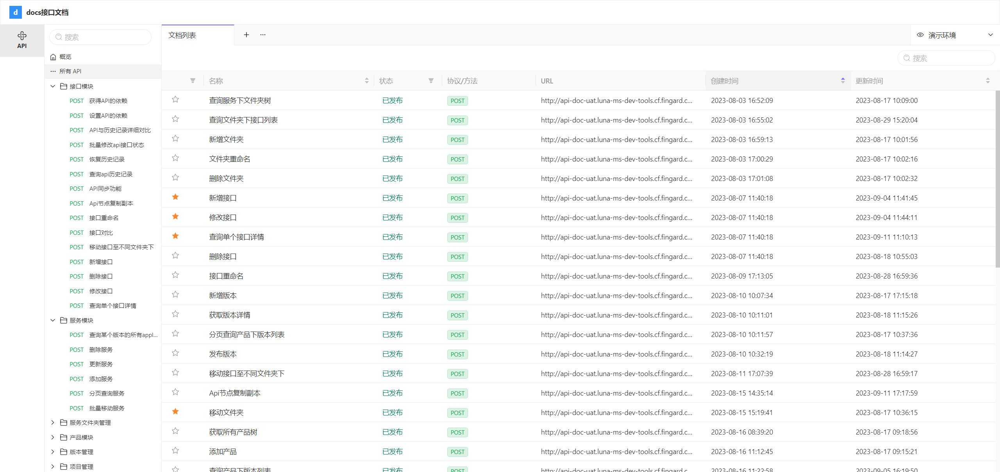
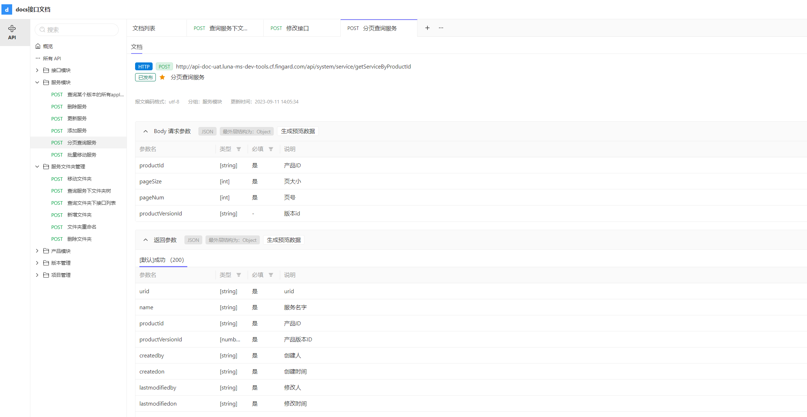

## 常有的接口管理平台
## swagger

## eolink


## yapi
TypeScript写的完全开源，基于nodejs栈的api文档系统，接口管理平台
```shell
docker pull jayfong/yapi:1.10.2
 
docker rm -f yapi-prod
docker run -d --name yapi-prod \ 
    -e TZ=Asia/Shanghai \
    --restart=always \
    -p 3000:3000 \
    -e YAPI_ADMIN_ACCOUNT=pc@xyyweb.com \
    -e YAPI_ADMIN_PASSWORD=* \
    -e YAPI_CLOSE_REGISTER=true \
    -e YAPI_NPM_REGISTRY=https://registry.npm.taobao.org \
    -e YAPI_DB_SERVERNAME=10.60.44.114 \
    -e YAPI_DB_PORT=27017 \
    -e YAPI_DB_DATABASE=yapi_prod \
    -e YAPI_MAIL_ENABLE=false \
    -e YAPI_LDAP_LOGIN_ENABLE=true \
    -e YAPI_LDAP_LOGIN_SERVER=ldap://10.60.44.114:1389 \
    -e YAPI_LDAP_LOGIN_SEARCH_DN=ou=user,dc=xyyweb,dc=com \
    -e YAPI_LDAP_LOGIN_SEARCH_STANDARD=cn \
    -e YAPI_LDAP_LOGIN_EMAIL_POSTFIX=@xyyweb.com \
    -e YAPI_LDAP_LOGIN_EMAIL_KEY=mail \
    -e YAPI_LDAP_LOGIN_USERNAME_KEY=sn \
    jayfong/yapi:1.10.2
 
docker logs -f yapi-prod
```
