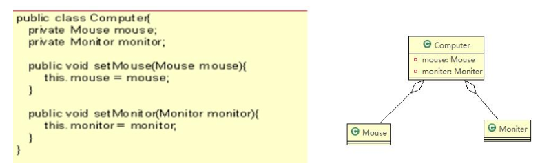
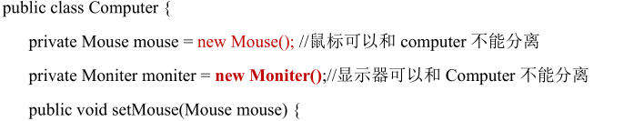

## 设计模式  
### 设计模式目的
1. 代码重用性（相同功能的代码，不用多次编写）  
2. 可读性 （编程规范性，便于其他程序员的阅读和理解）
3. 可扩展性（当需要增加新的功能时，非常的方便，可维护性）
4. 可靠性（当我们增加新的功能后，对原来的功能没有影响）

### 设计模式常用七大原则（即：设计模式为什么这样设计的依据）
1. 单一职责原则   
   - 对类来说，即一个类应该只负责一项职责，各行其责  
   - **作用：1.降低类的复杂度，一个类只负责一项职责，2.提高类的可读性，可维护性，3.降低变更引起的风险**  


2. 接口隔离原则  
   - 客户端不应该依赖它不需要的接口，即一个类对另一个类的依赖应该建立在最小接口上。


3. 依赖倒置原则  
   - 1. 高层模块不应该依赖底层模块，二者都应该依赖其抽象
     2. 抽象不应该依赖细节，细节应该依赖抽象
     3. 依赖倒置的中心思想是面向接口编程  
     4. 依赖倒置的原则是基于这样的设计理念：相当于细节的多变性，抽象的东西要稳定的多，以抽象为基础搭建的架构比以细节为基础的架构要稳定的多。在Java中，抽象指的是接口或抽象类，细节就是具体的实现类
     5. 使用接口或抽象类的目的是制定好规范，而不涉及任何具体的操作，把展现细节的任务交给他们的实现类去完成。
   - **依赖关系传递的三种方法 1.接口传递 2.构造方法传递 3.setget方法传递**
   - **注意事项：**
     - 1. **底层模块尽量都要有抽象类或接口，或者两者都有，程序稳定性更好**
       2. **变量的声明类型尽量是抽象类或接口，这样我们的变量引用和实际对象之间就存在一个缓存层利于程序扩展和优化**
       3. **继承时遵循里氏替换原则**


4. 里氏替换原则（如何正确使用继承？）
    - 1. 所有引用基类的地方必须能透明地使用其子类的对象  
      2. 在使用继承时，遵循里氏替换原则，在子类中尽量不要重写父类的方法  
      3. 里氏替换原则告诉我们，继承实际上让两个类耦合性增强了，在适当情况下，可以通过聚合，组合，依赖来解决问题。
    - 解决方法：原来的父类和子类都继承一个更通俗的基类，原有的继承关系去掉，采用依赖，聚合，组合等关系替代。


5. **开闭原则（ocp）**
   - 1. 开闭原则：是编程中基础，最重要的设计原则
   - 2. 一个软件实体如类、模块和函数应该**对扩展开放（对提供方），对修改关闭（对使用方） 用抽象构建框架，用实现扩展细节。**
   - 3. 当软件需要变化时，尽量通过扩展软件实体的行为来实现变化，而不是通过修改已有代码来实现变化
   - 4. 使用设计模式目的：就是遵循开闭原则


6. 迪米特法则  
    - 1. 核心是降低类之间的耦合
    - 2. 迪米特法则又叫最少知道原则，即一个类对自己依赖的类知道的越少越好，也就是说，对于被依赖的类不管多么复杂，都尽量将逻辑封装在类的内部。对外出了提供public方法，不对外泄露任何信息
    - 3. 迪米特法则：只与直接朋友通信
      - **直接朋友：我们称出现成员变量，方法参数，方法返回值中的类为直接朋友，而出现在局部变量的类不是直接的朋友，也就是说陌生的类最好不要以局部变量形式出现在类的内部。**
    - 4. 不要在其他类中，做自己类应该实现的方法 


7. 合成复用原则  
   - 尽量使用合成/聚合方法，而不是使用继承  

### 设计原则核心思想  
1. 找出应用中可能需要变化之处，把它们独立出来，不要和那些不需要变化的代码混在一起   
2. 针对接口编程，而不是针对实现编程   
3. 为了交互对象之间的松耦合而努力   

### 设计模式类型   
聚合关系：整体与部分可以分开。**如果整体与部分不分开则升级为组合关系(同生共死)**  
#### 聚合关系

#### 组合关系

**设计模式：某类问题的通用解决方案。本质提高：软件的维护性，通用性和扩展性，并降低软件的复杂度**  

1. 创建型模式： 单例模式、抽象工厂模式、原型模式、建造者模式、工厂模式   
2. 结构型模式： 适配器模式、桥接模式、装饰模式、组合模式、外观模式、享元模式、代理模式  
3. 行为形模式： 模版方法模式、命令模式、访问者模式、迭代器模式、观察者模式、中介者模式、备忘录模式、解释器模式、状态模式、策略模式、责任链模式  


###  单例模式
采用一定的方法保证在整个的软件系统中，对某个类只能存在一个对象实例，并且该类只提供一个取得其对象实例的方法(静态方法)。
1. 饿汉式（静态常量）  
   1. 构造器私有化(防止new)
   2. 类的内部创建对象
   3. 对外暴露一个静态的公共方法。getInstance
```java
public class SingletonTest01 {
	public static void main(String[] args) {
		//测试
		Singleton instance = Singleton.getInstance();
		Singleton instance2 = Singleton.getInstance();
		System.out.println(instance == instance2); // true
		System.out.println("instance.hashCode=" + instance.hashCode());
		System.out.println("instance2.hashCode=" + instance2.hashCode());
	}
}

//饿汉式(静态变量)

class Singleton {
	
	//1. 构造器私有化, 外部能new
	private Singleton() {
		
	}
	
	//2.本类内部创建对象实例
	private final static Singleton instance = new Singleton();
	
	//3. 提供一个公有的静态方法，返回实例对象
	public static Singleton getInstance() {
		return instance;
	}
}
```
```shell
优缺点说明：  
优点：这种写法比较简单，就是在类装载的时候就完成实例化。避免了线程同步问题    
缺点：在类装载的时候完成实例化，没有达到延迟加载的效果。如果从始至终从未使用过这个实例，这造成内存的浪费     
类装载时就实例化，可能没用它，造成内存浪费  
```

2. 饿汉式（静态代码块）
   - 和上种一样，只是将new Singleton() 放在一个静态代码块中。
```java
//饿汉式(静态变量)
class Singleton {
	//1. 构造器私有化, 外部能new
	private Singleton() {
		
	}
    
	//2.本类内部创建对象实例
	private  static Singleton instance;
	
	static { // 在静态代码块中，创建单例对象
		instance = new Singleton();
	}
	
	//3. 提供一个公有的静态方法，返回实例对象
	public static Singleton getInstance() {
		return instance;
	}
}
```


3. 懒汉式（线程不安全）
```java
class Singleton {
	private static Singleton instance;
	
	private Singleton() {}
	
	//提供一个静态的公有方法，当使用到该方法时，才去创建 instance
	//即懒汉式
	public static Singleton getInstance() {
		if(instance == null) {
			instance = new Singleton();
		}
		return instance;
	}
}
```

4. 懒汉式（线程安全）
    - 解决了线程安全问题
    - 效率太低了，每个线程在想获得类实例时候，执行getInstance()方法都要进行同步。而其实这个方法只执行一次实例化代码就够了，后面的想获得该类实例，直接return就行了。方法进行同步效率太低
```shell
   加了synchronizd、但效率太低了
	public static synchronized Singleton getInstance() {
		if(instance == null) {
			instance = new Singleton();
		}
		return instance;
	}
```


5. 双重检查（线程安全，项目使用它）  
```java
// 懒汉式(线程安全，同步方法)
class Singleton {
    
    private static volatile Singleton instance;

    private Singleton() {}

    //提供一个静态的公有方法，加入双重检查代码，解决线程安全问题, 同时解决懒加载问题
    //同时保证了效率, 推荐使用
    public static  Singleton getInstance() {
        if(instance == null) {
            synchronized (Singleton.class) {
                if(instance == null) {
                    instance = new Singleton();
                }
            }
        }
        return instance;
    }
}
``` 

6. 静态内部类（线程安全，使用它）
```java
class Singleton{
    private static volatile Singleton instance;
    private Singleton(){}
    //写一个静态内部类,该类中有一个静态属性 Singleton
    private static class SingletonInstance{
        private static final Singleton INSTANCE = new Singleton();
    }
    //提供一个静态的公有方法，直接返回 SingletonInstance.INSTANCE
    public static synchronized Singleton getInstance(){
        return SingletonInstance.INSTANCE;
    }
}
```

```shell
1. 这种方式采用了类装载的机制来保证初始化实例时只有一个线程
2. 静态内部类方式在Singleton类被装载时并不会立即实例化，而是在需要实例化时，调用getInstance方法，才会装载SingletonInstance类，从而完成Singleton的实例化。
3. 类的静态属性只会在第一次加载类的时候初始化，所以在这里，JVM帮助我们保证了线程的安全性，在类进行初始化时，别的线程是无法进入的。
```

7. 枚举 (非常推荐)
```shell
public class SingletonTest08 {
	public static void main(String[] args) {
		Singleton instance = Singleton.INSTANCE;
		Singleton instance2 = Singleton.INSTANCE;
		System.out.println(instance == instance2);
		
		System.out.println(instance.hashCode());
		System.out.println(instance2.hashCode());
		
		instance.sayOK();
	}
}

//使用枚举，可以实现单例, 推荐
enum Singleton {
	INSTANCE; //属性
	public void sayOK() {
		System.out.println("ok~");
	}
}

我们 JDK 中，java.lang.Runtime 就是经典的单例模式(饿汉式)

```
> 单例模式保证了系统内存中该类只存在一个对象，节省了系统资源，对于一些需要频繁创建销毁的对象，使用单例模式可以提供系统性能
> 单例模式 使用的场景：需要 频繁的进行创建和销毁的对象、创建对象时耗时过多或耗费资源过多(即：重量级对象)，
> 但又经常用到的对象、 工具类对象、频繁访问数据库或文件的对象(比如 数据源、session 工厂等)


