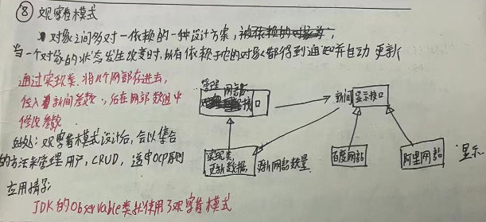
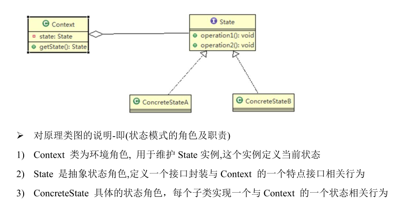

### 模版方法模式  
```shell
1. 又叫模版方法，在一个抽象类公开定义了执行它的方法的模版，它的子类可以按需要重写方法实现，但调用将以抽象类中定义的方式进行
2. 模版方法模式的钩子方法：在模版方法模式的父类中，我们可以定义一个方法，它默认不做任何事，子类可以视情况要不要覆盖它，该方法称为钩子
应用场景：springIoc容器初始化时运用到模版方法模式
注意事项：
    - 1. 算法只存于一个地方，也就是父类中，容易修改，需要修改算法时，只要修改父类的模版方法或已经实现的某些步骤，子类会继承这些修改
    - 2. 实现最大代码复用
    - 3. 模版方法都加上final关键字，防止子类重写模版方法【模板方法是父类几个方法的集合,类似avatar的一键升级包含 安装|配置|启动方法等等 钩子方法指的是子类重写的安装方法】
3. 使用场景：当要完成某个过程，该过程要执行一系列步骤，这一系列步骤基本项目，但其个别步骤实现时可能不同，通常考虑有模版方法模式处理。  
```

### 命令模式
>我们买了一套智能家电，有照明灯、风扇、冰箱、洗衣机，每一种家电都安装一个 App，分别控制， 我们希望只要一个 app 就可以控制全部智能家电。  
要实现一个 app 控制所有智能家电的需要，则每个智能家电厂家都要提供一个统一的接口给 app 调用，这时就可以考虑使用命令模式。  
0. 命令模式,在软件设计中，我们经常需要向某些对象发送请求，但是并不知道请求的接收者是谁，也不知道被请求的操作是哪个，
   我们只需在程序运行时指定具体的请求接收者即可，此时，可以使用命令模式来进行设计
  说白了，先通过Command接口的形式搭建骨架，具体接受者实现Command接口，在运行时候传入调用。底层用接口搭建好框架，上层用接口的实现类传入现实此类方法。
1. **命令模式使用请求发送者与请求接收者消除彼此之间的耦合**，让对象之间的调用关系更加灵活，实现解构。 
2. 在命令模式中，会将一个请求封装为一个对象，以便使用不同参数来表示不同的请求，同时**命令模式也支持可测销的操作**。
3. 通俗易懂的理解：将军发布命令，士兵去执行。其中有几个角色：将军（命令发布者）、士兵（命令的具体执行者），命令（连接将军和士兵）
   Invoker是调用者（将军），Receiver是被调用者（士兵），MyCommand是命令，实现了Command接口，持有接收对象。

优点： 1、降低了系统耦合度。 2、新的命令可以很容易添加到系统中去。  
缺点：使用命令模式可能会导致某些系统有过多的具体命令类。  


### 访问者模式  
访问者模式的基本工作原理是：在被访问的类里面加一个对外提供接待访问者的接口    
访问者模式主要应用场景是：需要对一个对象结构中的对象进行很多不同操作(这些操作彼此没有关联)，同时需要避免让这些操作"污染"这些对象的类，可以选用访问者模式解决  
访问者模式优点: 可以对功能进行统一，可以做报表、UI、拦截器与过滤器、适用于数据结构相对稳定的系统      
如果一个系统有比较稳定的数据结构，又有经常变化的功能需求，那么 访问者模式就是比较合适的  
访问者模式，底层骨架是接口调用接口。 接口A,接口B,在定义各个接口的实现类，这样底层骨架是不用改了。  
```java
A {
    show(B b){
        b.show(this)
    }
}

B ｛
   show(A a)｛
        a.show(this)
     System.out.println("1");
  ｝
｝
```
访问者 与命令模式区别是：   
访问者是 底层骨架搭建好了 接口调用接口.在定义各个接口的实现类，通过骨架完成不同的实现，侧重点在 可以定义多种实现类，可扩展性很强。  
命令模式是。底层骨架搭建好了，但我不知道具体要实现什么，只有在运行的时候最上层最后定义要实现的实现类。侧重点在: 当前具体实现不确定，无法搭建访问者已经确定好的骨架，访问者是业务已经知道了，只为了可扩展，命令模式是业务不知道。搭建个通用的骨架最后进行传入。  


### 迭代器模式   
迭代器模式， 提供一种遍历集合元素的统一接口，用一致的方法遍历集合元素，不需要知道集合对象的底层表示，即：不暴露其内部的结构  
迭代器模式解决了 不同集合(ArrayList ,LinkedList) 统一遍历问题  
```shell
    @Override
    public Iterator<T> iterator() {
        return new SIterator();
    }
    private class SIterator implements Iterator {
        private int cur;
        public SIterator() {
            this.cur = 0;
        }
        @Override
        public boolean hasNext() {
            return cur < N;
        }
        @Override
        public Object next() {
            return nodes[cur++];
        }
    }
```

### 观察者模式  
1. 气象站可以将每天测量到的温度，湿度，气压等等以公告的形式发布出去(比如发布到自己的网站或第三方)  
2. 需要 设计开放型 API，便于 其他第三方也能接入气象站获取数据  
3. 提供温度、气压和湿度的接口,测量数据更新时，要能实时的通知给第三方  

气象局：Subject    多个第三方网站：Observer1 Observer2 Observer3  
观察者模式：对象之间多对一依赖的一种设计方案，被依赖的对象为Subject, 依赖的对象为Observer, 
Subject通知Observer变化,比如这里的奶站是 Subject，是 1 的一方。用户时 Observer，是多的一方。

观察者模式的好处:  
1. 观察者模式设计后，会以集合的方式来管理用户(Observer)，包括注册，移除和通知。
2. 这样，我们增加观察者(这里可以理解成一个新的公告板)，就不需要去修改核心类 WeatherData 不会修改代码， 遵守了 ocp 原则。
说白了，因为第三方网站是动态的，改用list方式存储，不用修改核心类 WeatherData了  

   
### 中介者模式  
1. 中介者模式，用一个中介对象来封装一系列的对象交互。中介者使各个对象不需要显式地相互引用，从而使其耦合松散，而且可以独立地改变它们之间的交互
2. 中介者模式属于行为型模式，使代码易于维护
3. 比如MVC模式，C（Controller 控制器）是 M（Model 模型）和 V（View 视图）的中介者，在前后端交互时起到了中间人的作用  
中介者模式的注意事项和细节:  
   1. 多个类相互耦合，会形成网状结构, 使用中介者模式将网状结构分离为星型结构，进行解耦
   2. 中介者 承担了较多的责任，一旦中介者出现了问题，整个系统就会受到影响  
   3. 如果设计不当，中介者对象本身变得过于复杂，这点在实际使用时，要特别注意  
说白了，定义了一个中介者对象，里面通过list或者map来存储各个类。后这些类的执行顺序通过中介者类里定义的方法执行。相对于中介者梳理了各个类  


### 备忘录模式  
游戏角色有攻击力和防御力，在大战Boss前保存自身的状态(攻击力和防御力)，当大战Boss后攻击力和防御力下降，从备忘录对象恢复到大战前的状态      
1) 一个对象，就对应一个保存对象状态的对象，这样当我们游戏的对象很多时，不利于管理，开销也很大   
2) 传统的方式是简单地做备份，new 出另外一个对象出来，再把需要备份的数据放到这个新对象，但这就暴露了对象内部的细节      
3) 解决方案： => 备忘录模式     
   可以这里理解备忘录模式：现实生活中的备忘录是用来记录某些要去做的事情，或者是记录已经达成的共同意  
   见的事情，以防忘记了。而在软件层面，备忘录模式有着相同的含义，备忘录对象主要用来记录一个对象的某  
   种状态，或者某些数据，当要做回退时，可以从备忘录对象里获取原来的数据进行恢复操作  
说白了，增加一个列表类，存储相同类的不同状态的对象。有了列表可以回滚到容易一个状态。  
适用的应用场景：1、后悔药。 2、打游戏时的存档。 3、Windows 里的 ctri + z。 4、IE 中的后退。 4、数据库的事务管理     
为了节约内存，备忘录模式可以和原型模式配合使用      

### 解释器模式  
解释器模式（Interpreter Pattern）：是指给定一个语言( 表达式)， 定义它的文法的一种表示，并定义一个解释器，    
使用该解释器来解释语言中的句子(表达式)  

应用场景：    
应用可以将一个需要解释执行的语言中的句子表示为一个抽象语法树，一些重复出现的问题可以用一种简单的语言来表达      
这样的例子还有，比如编译器、运算表达式计算、正则表达式、机器人等  


### 状态模式  
状态模式：它主要用来解决对象在多种状态转换时，需要对外输出不同的行为问题。状态和行为是一一对应的，状态之间可以相互转换。  

context类里 含有state对象，这个state对象可以有不同的状态。那么可以定义state为接口，不同状态的子类实现这个接口。      
if-else模式换成 接口 继承模式，每个状态都要一个对应的类  

### 策略模式   
编写鸭子项目，具体要求如下:    
1) 有各种鸭子(比如 野鸭、北京鸭、水鸭等， 鸭子有各种行为，比如 叫、飞行等)    
2) 显示鸭子的信息   
抽象类定义通用鸭子类型，里面包含各种方法，子类继承通用抽象类。但部分子类只有一个方法符合，     
其他方法都要重写。那么可以用策略模式。减少大片的方法重写。     
策略模式介绍：   
1. 把变化的代码从不变的代码中分离出来   
2. 多用组合/聚合，少用继承（客户通过组合方法使用策略）    
#### 策略模式注意事项和细节   
1. 策略模式的关键是：分析项目中变化部门与不变部分   
2. 策略模式的核心思想： 多用组合/聚合 少用继承；用行为类组合，而不是行为的继承。更有弹性  
3. 体现了“对修改关闭，对扩展开发”原则，客户端增加行为不用修改原有代码，只要添加一种策略（或者行为）即可，避免了使用多重转移语句（if..else if..else）  
4. 需要注意的是：每添加一个策略就要增加一个类，当策略过多是会导致类数目庞大。    
   JDK 的 Arrays 的 Comparator 就使用了策略模式  
说白了，把变化的代码抽出来改成一个接口。变化的代码。实现此接口，生成不同的实现类，后采用组合方式调用。    

工厂模式主要目的是封装好创建逻辑，策略模式接收工厂创建 好的对象，从而实现不同的行为  

状态模式和策略模式很像    
我认为的区别：  
状态模式是各个子类执行后改变其状态，大部分就一个状态。
策略模式是 1.可以多个接口 2.对调用方来说 我知道每个策略类[子类]，并进行组合调用
[状态模式和策略模式区别](https://www.cnblogs.com/pokid/p/10474340.html)


### 责任链模式  
  
客户端这里会使用到 分支判断(比如 switch) 来对不同的采购请求处理， 这样就存在如下问题：       
1. 如果各个级别的人员审批金额发生变化，在客户端的也需要变化    
2. 客户端必须明确的知道有多少个审批级别和访问    
3. 对一个采购请求进行处理 和 Approver (审批人) 就存在强耦合关系，不利于代码的扩展和维护    

源码总结：  
1. springmvc请求的流程图中，执行了拦截器相关方法 interceptor.preHandler
2. 在处理springmvc请求时，使用到责任链模式还使用到适配器模式
3. HandlerExecutionChain 维护了 HandlerInterceptor的集合，可以向其中注册相应的拦截器

职责链模式的注意事项和细节：
1. 将请求和处理分开，实现解耦，提高系统灵活性
2. 性能会收到影响，特别是在链比较长的时候，因此需控制链中最大节点数量，一般通过在Handler中设置一个最大节点数量，
   在setNext()方法中判断是否已经超过阀值，超过则不允许该链建立，避免出来超长链无意识地破坏系统性能。
3. 调试不方便。采用了类似递归的方法，调试时逻辑可能比较复杂
4. 最佳应用场景：有多个对象可以处理同一个请求时，比如：多级请求、请假/加薪等审批流程、Java Web 中 Tomcat
   对 Encoding 的处理、拦截器


